##  案例-员工管理系统      
###  环境搭建    
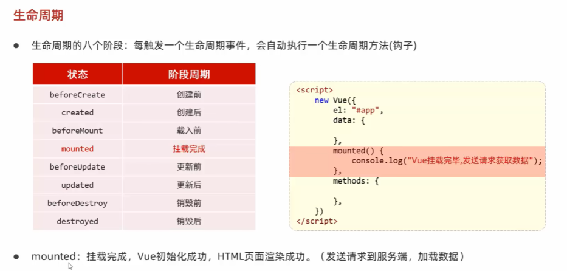  
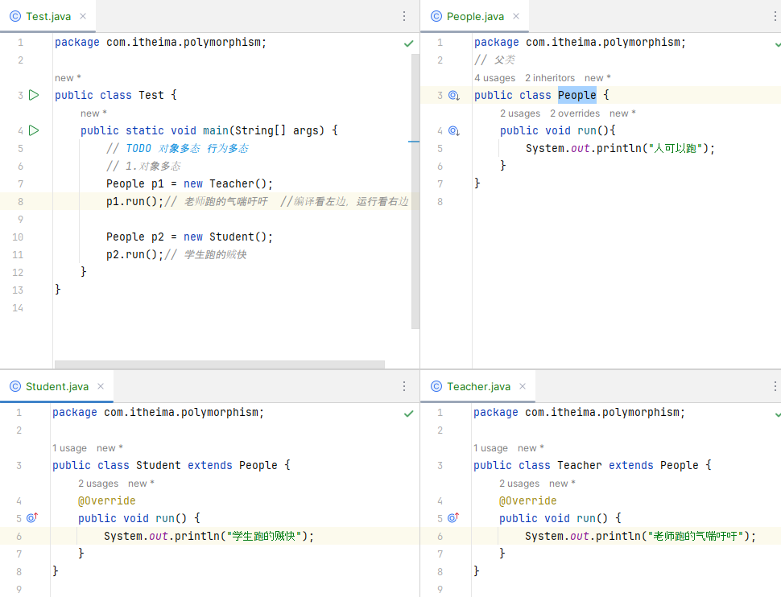  
步骤一：  
在DBeaver中创建数据库，然后建立连接    
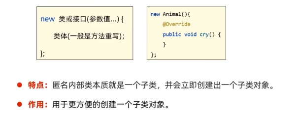  
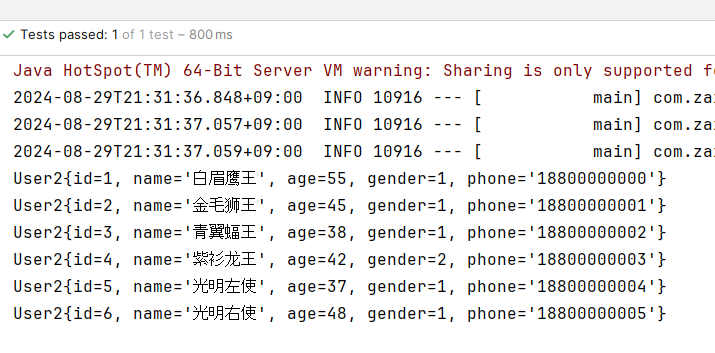  
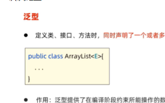  
步骤二：  
创建springboot工程  
解压文件并放到一个没有中文没有空格的路径下，用IDEA打开  
https://start.spring.io/    
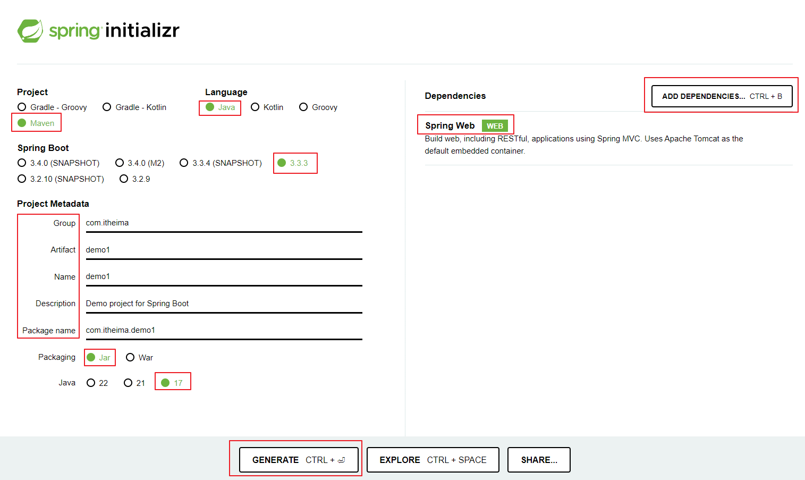   
在pom.xml中引入依赖  
引入依赖：https://mvnrepository.com/  
步骤三：  
配置application.properties文件  
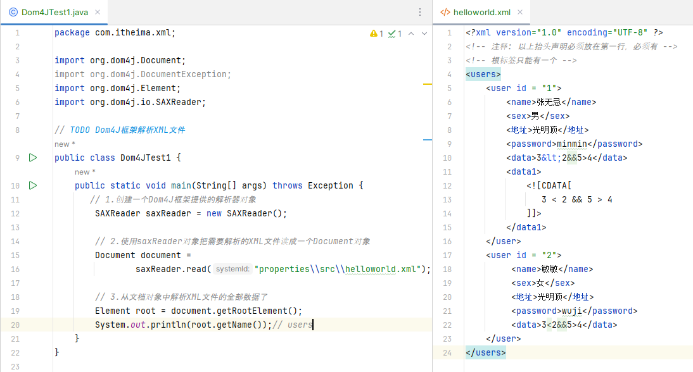  
创建与表对应的实体类  
实体类中的属性与表结构的字段是一一对应的，实体类当中属性名采用驼峰命名，
表结构中的字段采用下划线分割  
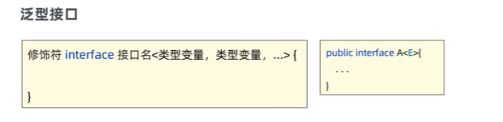  
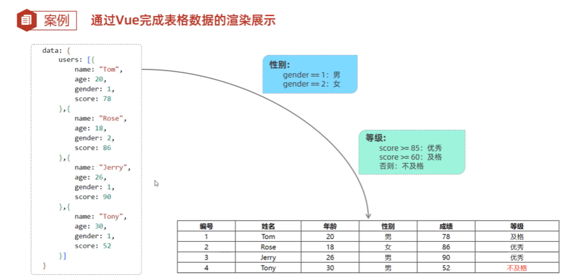  
步骤四：  
创建三层架构并添加相应注解    
①controller：接收请求 处理响应
②service：具体的逻辑处理（接口 和 实现类）
③mapper（dao层）：数据访问操作 （mapper本身就是接口）  
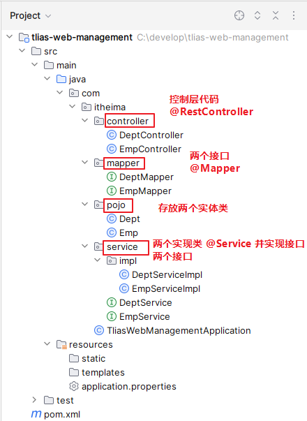    
启动类所在包下创建了四个子包：  
①controller控制层代码  加@RestController注解  
②service 实现类加注解@Service 实现接口  
③mapper 两个接口 加注解@Mapper  
④pojo存放两个实体类  

###  开发规范  
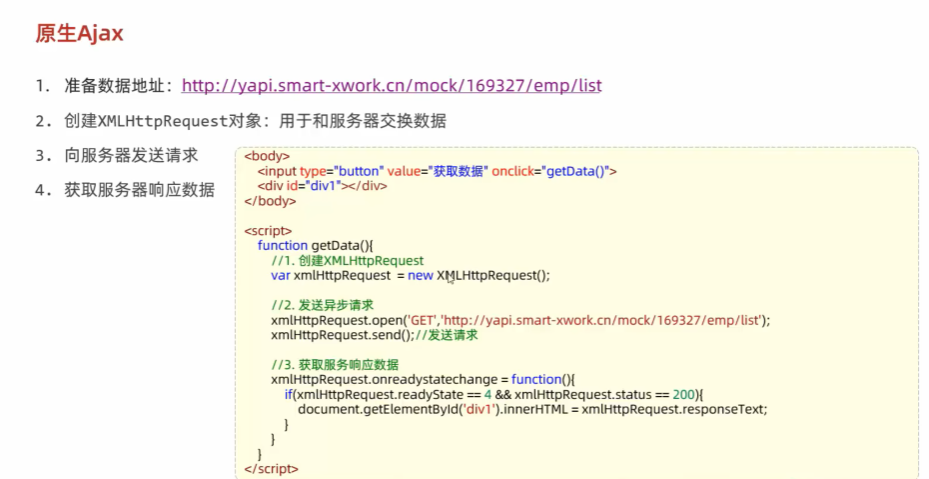  
  
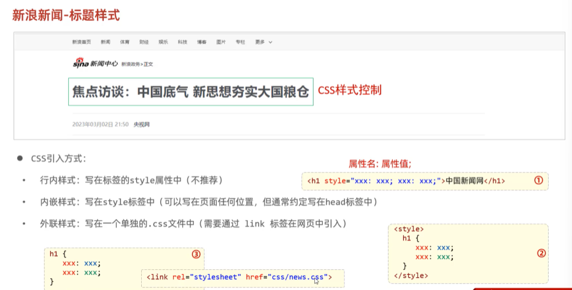  
步骤五：  
统一结果的封装类放到pojo包中  
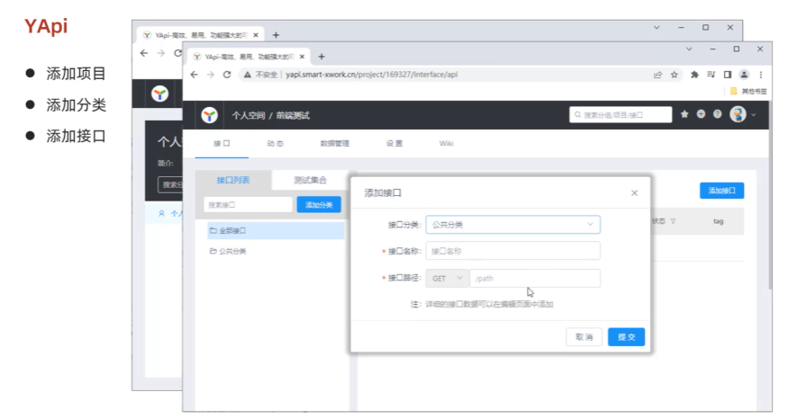  

###  开发流程  
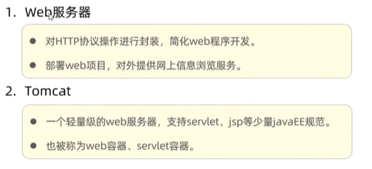  

###  功能开发-部门管理  
1.  查询部门  
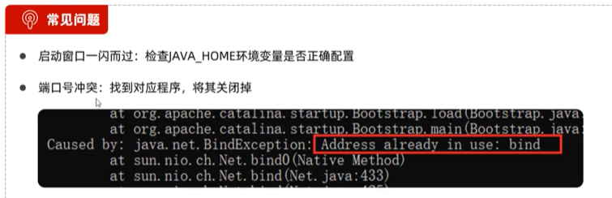   
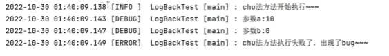  
测试：用postman访问路径，看是否可以调通（先运行启动类）  
2.  前后端联调  
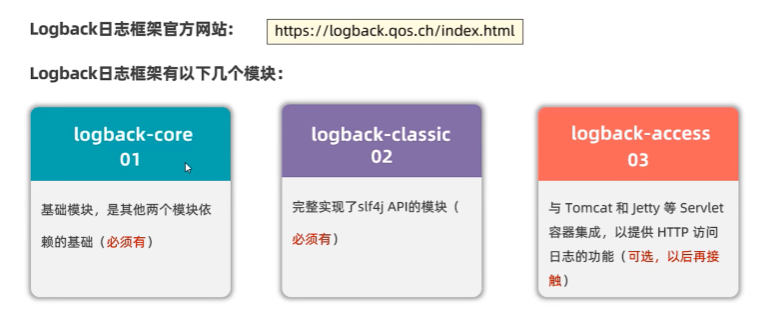  
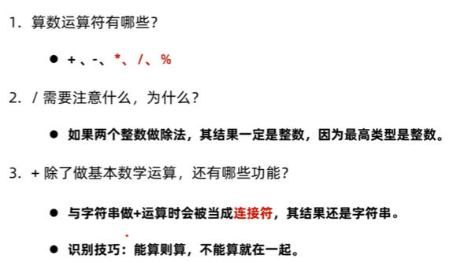  
前端启动：nginx   后端启动：springboot启动类  --->  联调  
3.  删除部门  
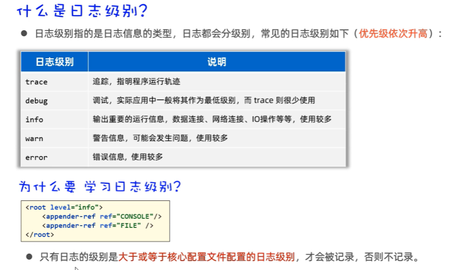  
4.  新增部门  
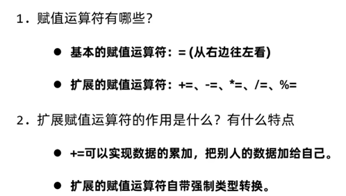  
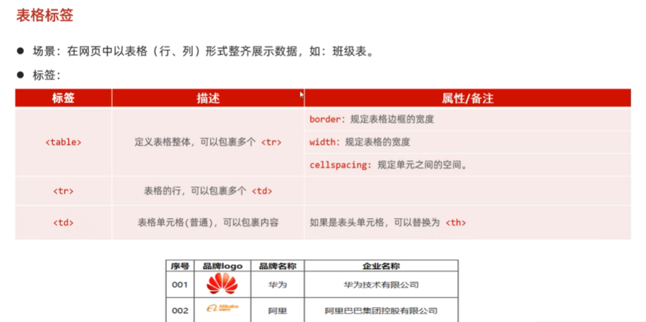  
简化controller层代码：  
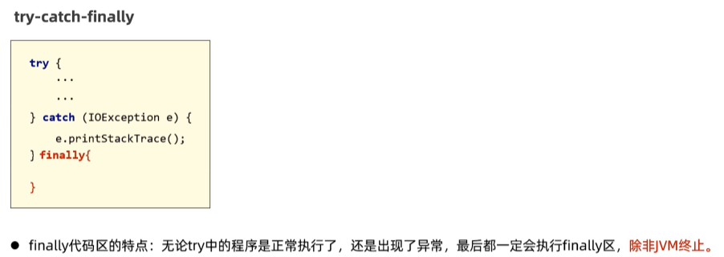  

###  功能开发-员工管理  
1.  分页查询  
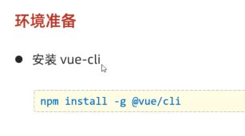  
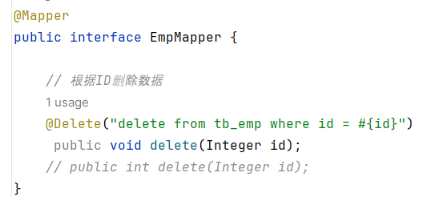  
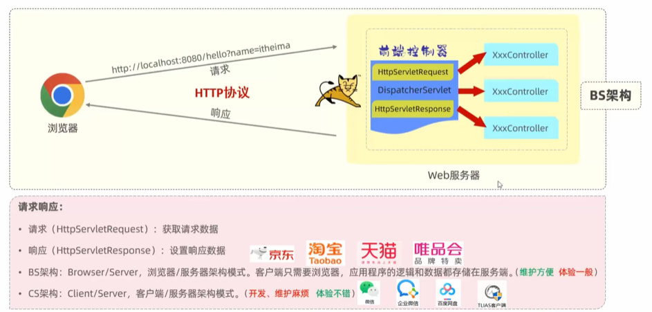  
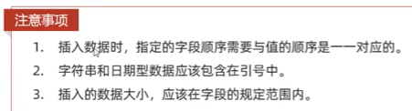  
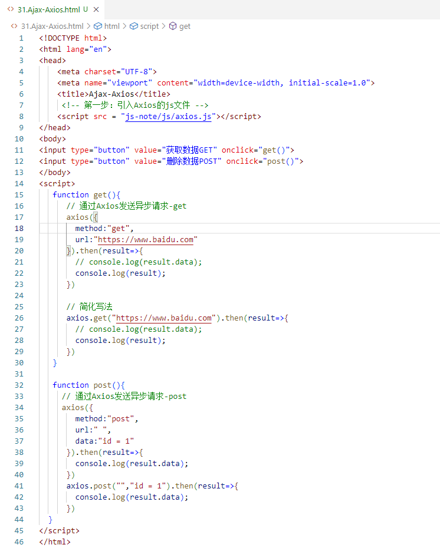  
pojo包中定义PageBean实体类:分页查询结果的封装类  
2.  分页查询-带条件  
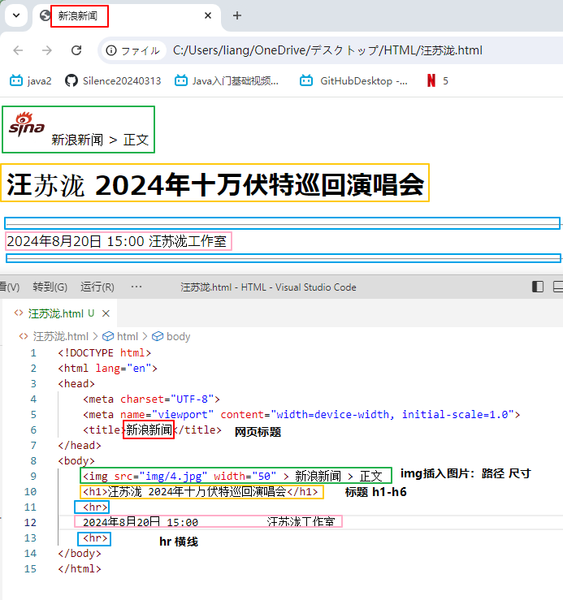  
pom文件中引入依赖：  
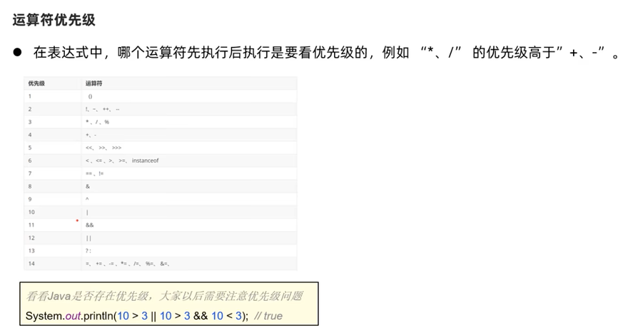  
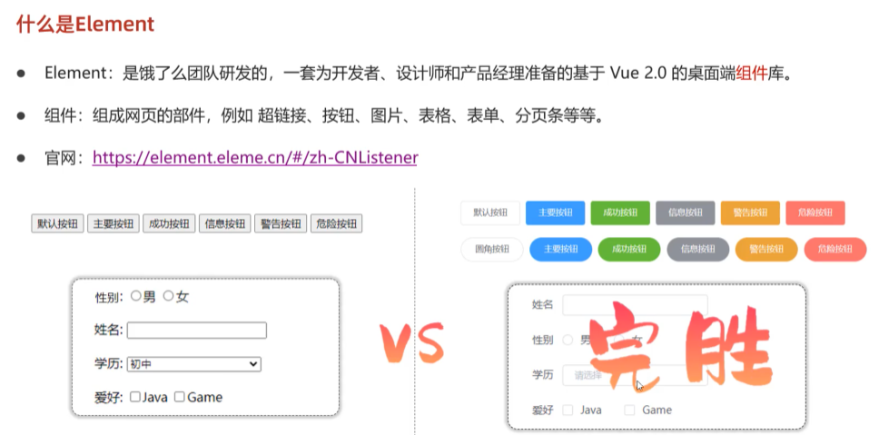  
3. 条件分页查询  
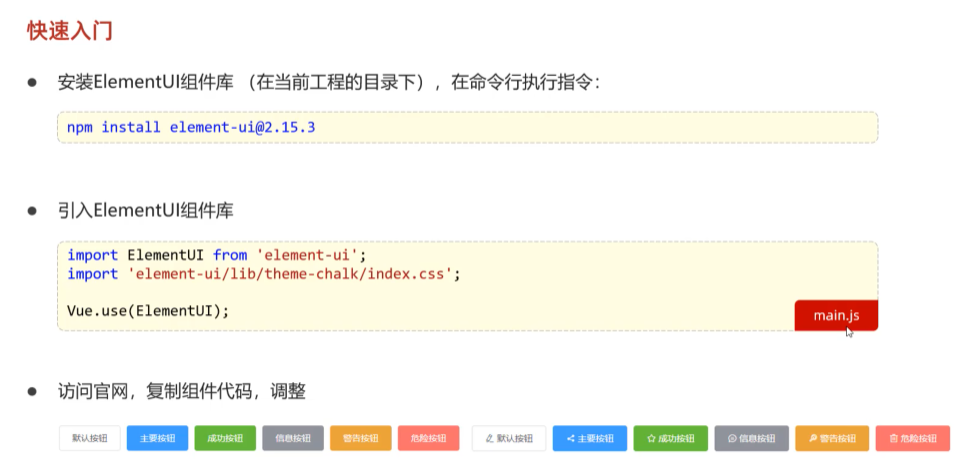  
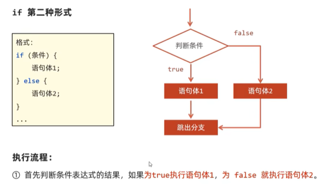  
4. 删除员工  

p142