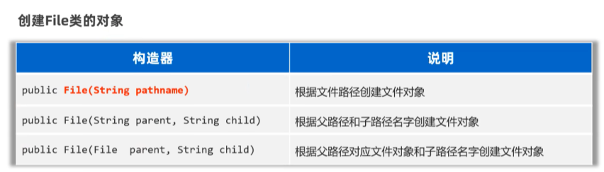
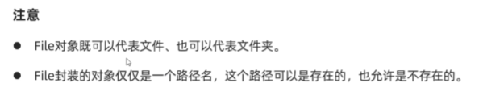
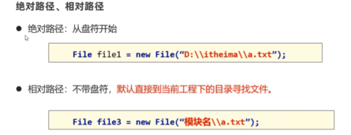
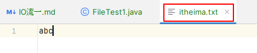
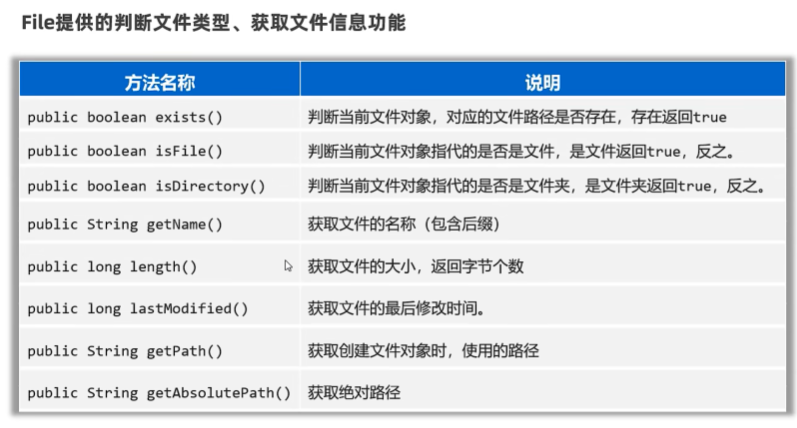

## IO流        

###  File  
1.  创建对象  
  
  
  
```java
package com.itheima.file;

// TODO   File创建对象，代表具体文件的方案

import java.io.File;

public class FileTest1 {
    public static void main(String[] args) {
        // 1.创建一个File对象，指代某个具体的文件
        File f1 = new File("C:\\Users\\liang\\OneDrive\\デスクトップ\\新建 文本文档.txt");
        System.out.println(f1.length());// 文件大小  540

        File f2 = new File("C:\\Users\\liang\\OneDrive\\デスクトップ\\test");
        System.out.println(f2.length());

        // File对象，可以指代一个不存在的文件路径
        File f3 = new File("C:\\Users\\liang\\OneDrive\\デスクトップ\\aaa");
        System.out.println(f3.length());
        System.out.println(f3.exists());// false

        // 要定位的文件是在模块中，如何定位
        // 绝对路径 带盘符的
        // File f4 = new File("C:\\java-learning\\java-note\\file-io-app\\src\\itheima.txt");
        // 相对路径 不带盘符 默认直接去工程下寻找文件
        File f4 = new File("file-io-app\\src\\itheima.txt");
        System.out.println(f4.length());// 3
    }
}

```
  
2.  方法1：判断文件类型，获取文件信息  
  
```java
package com.itheima.file;
// TODO   File提供的判断文件类型，获取信息文件功能
import java.io.File;
public class FileTest2 {
    public static void main(String[] args) throws Exception {
        // 1.创建文件对象，指代某个文件
        File f1 = new File("C:\\Users\\liang\\OneDrive\\デスクトップ\\新建 文本文档.txt");

        // 2.判断当前文件对象，对应的文件路径是否存在，存在返回true
        System.out.println(f1.exists());// true

        // 3.判断当前文件对象指代的是否是文件，是文件返回true,反之
        System.out.println(f1.isFile()); // true

        // 4.判断当前文件对象指代的是否是文件夹，是文件夹返回true,反之
        System.out.println(f1.isDirectory());// false

        // 5.获取文件的名称 包含后缀
        System.out.println(f1.getName());// 新建 文本文档.txt

        // 6.获取文件的大小，返回字节个数
        System.out.println(f1.length());// 540

        // 7.获取文件的最后修改时间
        System.out.println(f1.lastModified());// 1722664222184

        // 8.获取创建文件对象时，使用的路径
        File f2 = new File("file-io-app\\src\\itheima.txt");
        System.out.println(f2.getPath());// file-io-app\src\itheima.txt

        // 9.获取绝对路径
        File f3 = new File("file-io-app\\src\\itheima.txt");
        System.out.println(f3.getAbsolutePath());// C:\java-learning\java-note\file-io-app\src\itheima.txt

    }
}

```  
3.  方法2：创建文件，删除文件  
  
```java
package com.itheima.file;
// TODO   File创建和删除文件相关的方法

import java.io.File;

public class FileTest3 {
    public static void main(String[] args) throws Exception {
        // 1.创建一个新文件（文件内容为空），创建成功返回true,反之
        File f1 = new File("C:/resource/itheima2.txt");
        System.out.println(f1.createNewFile());

        // 2.用于创建文件夹，注意，只能创建一级文件夹
        File f2 = new File("C:/resource/aaa");
        System.out.println(f2.mkdir());

        // 3.用于创建文件夹，注意，可以创建多级文件夹
        File f3 = new File("C:/resource/bbb/ccc/ddd");
        System.out.println(f3.mkdirs());

        // 4.删除文件或者空文件，注意，不能删除非空文件
        System.out.println(f1.delete());
        System.out.println(f2.delete());
    }
}

```
4.  方法3：遍历文件夹  
  
```java
package com.itheima.file;
// TODO   File提供的遍历文件夹的方法
import java.io.File;

public class FileTest4 {
    public static void main(String[] args) throws Exception {
        // 1.获取当前目录下所有的“一级文件名称”到一个字符串数组中去返回
        File f1 = new File("C:\\code");
        String[] names = f1.list();
        for (String name : names) {
            System.out.println(name);
            // javasepro
            //得奖的是
            //汪苏泷
            //雨天
        }

        // 2.重点：获取当前目录下所有的“一级文件对象”到一个文件对象数组中去返回
        File[] files = f1.listFiles();
        for (File file : files) {
            System.out.println(file.getAbsolutePath());
            // C:\code\javasepro
            //C:\code\得奖的是
            //C:\code\汪苏泷
            //C:\code\雨天
        }
    }
}

```
###  方法递归  
1.  递归的形式  

2.  应用，执行流程，算法思想  

3.  文件搜索  


