## IO流        

###  IO流-字符流   
1.  文件字符输入流-读字符数据进来    
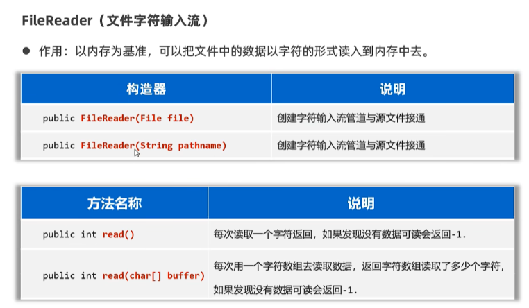  
```java
package com.itheima.char_stream;

// TODO 文件字符输入流每次读取一个字符

import java.io.FileNotFoundException;
import java.io.FileReader;
import java.io.Reader;

public class FileReaderTest1 {
    public static void main(String[] args) {
        try(
                // 1.创建一个文件字符输入流管道与源文件接通
             Reader fr = new FileReader("io-app2\\src\\itheima01.txt");
                ) {
             // 2.读取文本文件的内容
            /*int c;// 记住每次读取的字符编号
            while ((c = fr.read()) != -1){
                System.out.print((char)c);
            }*/
           // 每次读取一个字符的形式，性能肯定是比较差的

            // 3.每次读取多个字符
            char[] buffer = new char[3];
            int len;// 记住每次读取了多少个字符
            while ((len = fr.read(buffer)) != -1){
                // 读取多少 倒出多少
                System.out.print(new String(buffer, 0, len));
            }
            // 性能比较不错
        } catch (Exception e) {
            e.printStackTrace();
        }
    }
}

```  
2.  文件字符输出流-写字符数据出去  
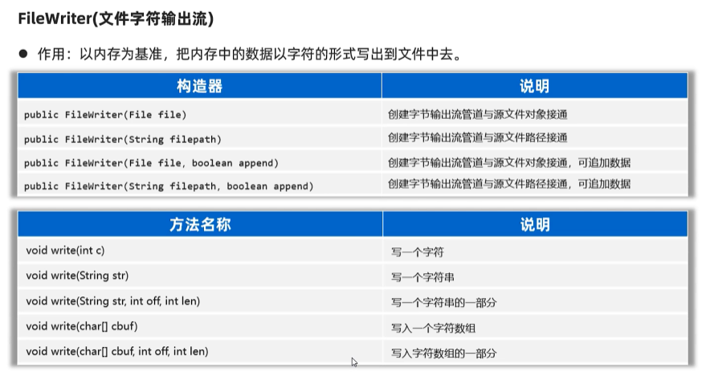  
```java
package com.itheima.char_stream;

// TODO 文件字节输出流：写字符数据出去

import java.io.FileWriter;
import java.io.IOException;
import java.io.Writer;

public class FileWriterTest2 {
    public static void main(String[] args) {
        try(
                //0.创建一个文件字符输出流管道与源文件接通
                // 覆盖管道
                // Writer fw = new FileWriter("io-app2\\src\\itheima02out.txt");
                // 追加数据管道
                Writer fw = new FileWriter("io-app2\\src\\itheima02out.txt",true);
                ) {
            // 1.写一个字符出去
            fw.write('a');
            fw.write(97);
            fw.write('磊');// 写一个字符出去
            fw.write("\r\n");// 换行

            // 2.写一个字符串出去
            fw.write("我爱你中国abc");

            // 3.写字符串的一部分出去
            fw.write("我爱你中国abc",0,5);

            // 4.写一个字符数组出去
            char[] buffer = {'黑','马','a','b','c'};
            fw.write(buffer);

            // 5.写字符数组的一部分出去
            fw.write(buffer,0,2);

        } catch (Exception e) {
            e.printStackTrace();
        }
    }
}

```
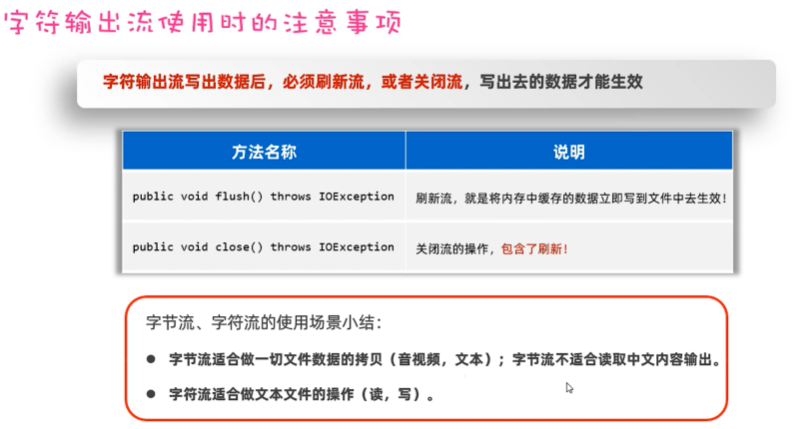  
```java
package com.itheima.char_stream;

// TODO 字符输出流使用时的注意事项

import java.io.FileWriter;
import java.io.IOException;
import java.io.Writer;

public class FileWriterTest3 {
    public static void main(String[] args) throws Exception {
                Writer fw = new FileWriter("io-app2\\src\\itheima03out.txt");

            // 写字符数据出去
            fw.write('a');
            fw.write('b');
            fw.write('c');
            fw.write('d');
            fw.write("\r\n");// 换行

            fw.write("我爱你中国");
            fw.write("\r\n");// 换行
            fw.write("我爱你中国");
            
            fw.close();//关闭流，包含刷新操作
    }
}
```

###  IO流-缓冲流  
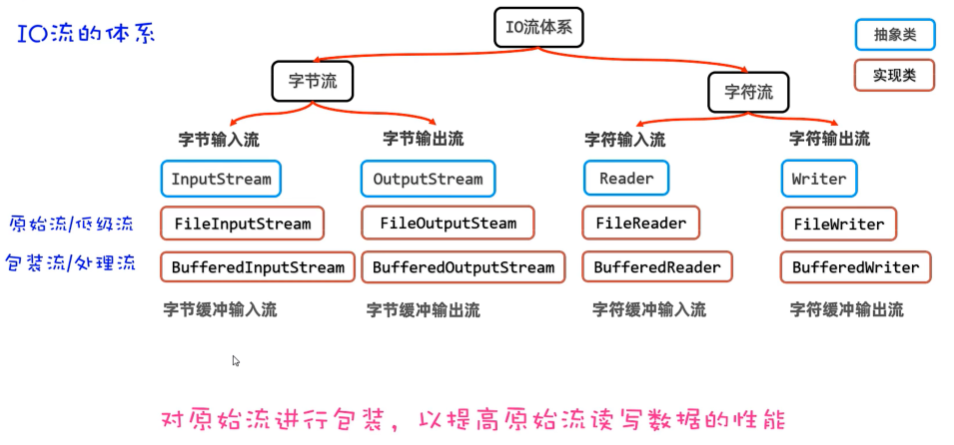  
1.  字节缓冲流  
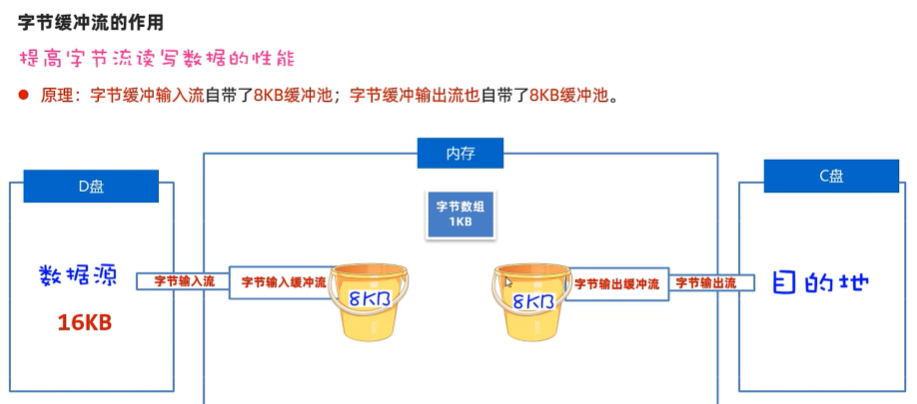  
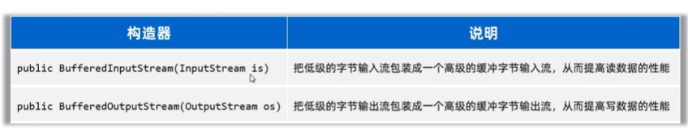  
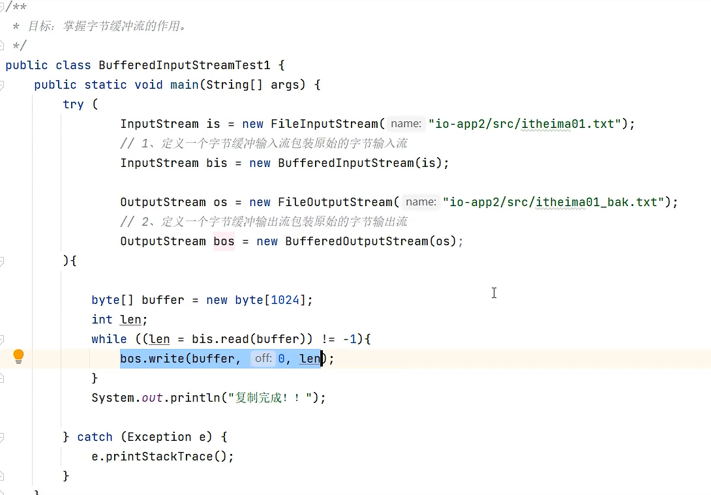  
2.  字符缓冲流  
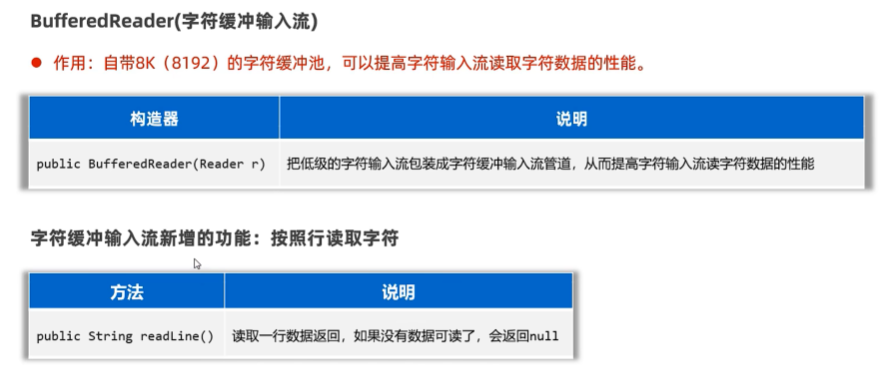  
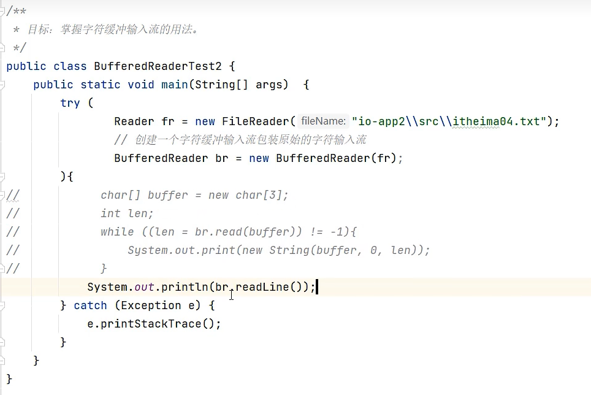  
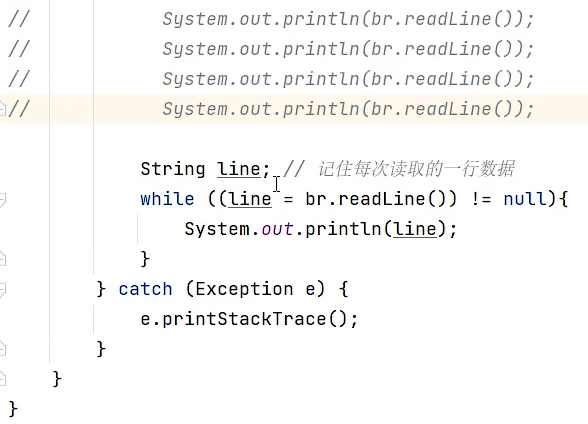  
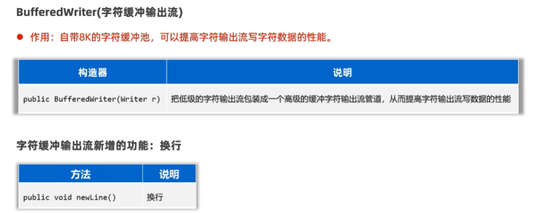  
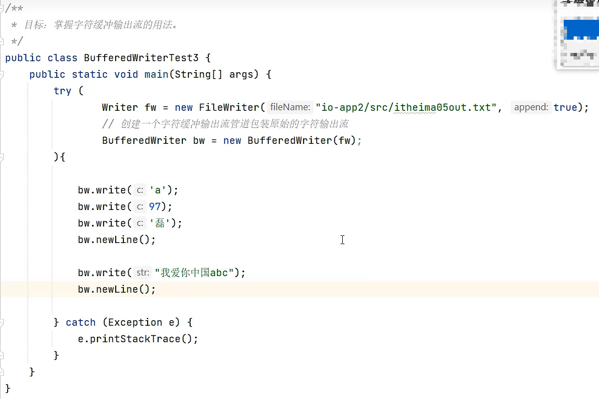  

###  IO流-转换流  
1.  字符输入转换流  
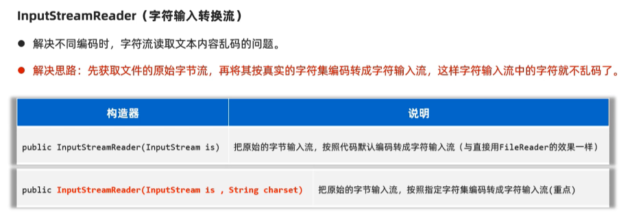  
```java
package com.itheima.transform_strea;
// TODO 字符输入转换流的作用

import java.io.*;

public class InputStreamReaderTest2 {
    public static void main(String[] args) {

        try (
                // 1.得到文件的原始字节流（GBK的字节流形式）
                InputStream is = new FileInputStream("io-app2\\src\\itheima06.txt");
                // 2.把原始的字节输入流按照指定的字符集编码转换成字符输入流
                Reader isr = new InputStreamReader(is,"GBK");
                // 3.把字符输入流包装成缓冲字符输入流
                BufferedReader br = new BufferedReader(isr);
                ){
            String line;
            while ((line = br.readLine()) != null){
                System.out.println(line);
            }
        } catch (Exception e) {
            e.printStackTrace();
        }
    }
}
```  
2.  字符输出转换流  
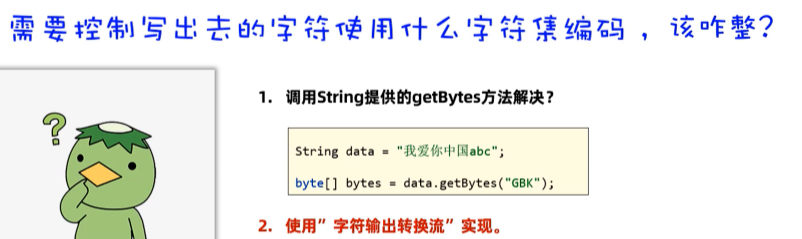  
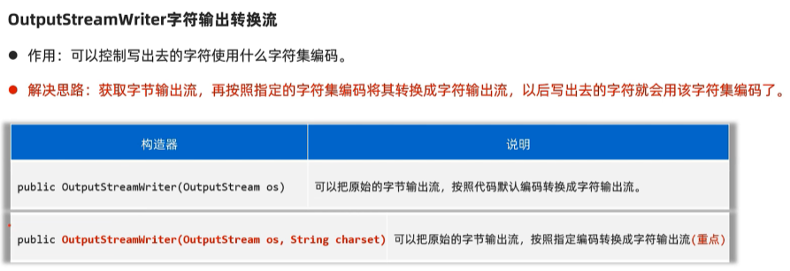  
```java
package com.itheima.transform_strea;
// TODO 字符输出转换流的作用


import java.io.*;

public class OutputStreamWriterTest3 {
    public static void main(String[] args) {
         // 指定写出去的字符编码
        try(
                //  1.创建一个文件字节输出流
                OutputStream os = new FileOutputStream("io-app2\\src\\itheima07out.txt");
                // 2.把原始的字节输出流按照指定的字符集编码转换成字符输出转换流
                Writer osw = new OutputStreamWriter(os,"GBK");
                // 3.把字符输出流包装成缓冲字符输出流
                BufferedWriter bw = new BufferedWriter(osw);
                ) {
               bw.write("我是中国人abc");
               bw.write("我爱你中国123");
        } catch (Exception e) {
            e.printStackTrace();
        }
    }
}
```  
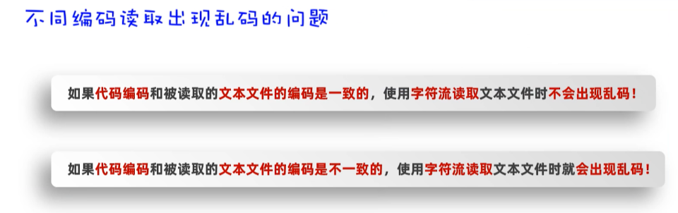   
```java
package com.itheima.transform_stream;

import java.io.BufferedReader;
import java.io.FileNotFoundException;
import java.io.FileReader;
import java.io.Reader;

// TODO 不同编码读取乱码的问题
public class Test1 {
    public static void main(String[] args) {
        try(     // 1.创建一个文件字符输入流与源文件接通
                Reader fr = new FileReader("io-app2\\src\\itheima04.txt");
                // 2.把文件字符输入流包装成缓冲字符输入流
                 BufferedReader br = new BufferedReader(fr);
                ) {
                String line;
                while ((line= br.readLine()) != null){
                    System.out.println(line);
                }
        } catch (Exception e) {
            e.printStackTrace();
        }
    }
}
```

###  IO流-打印流  
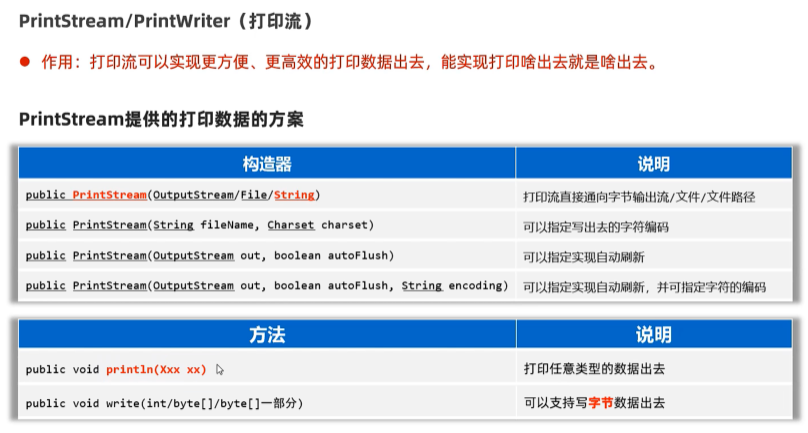  
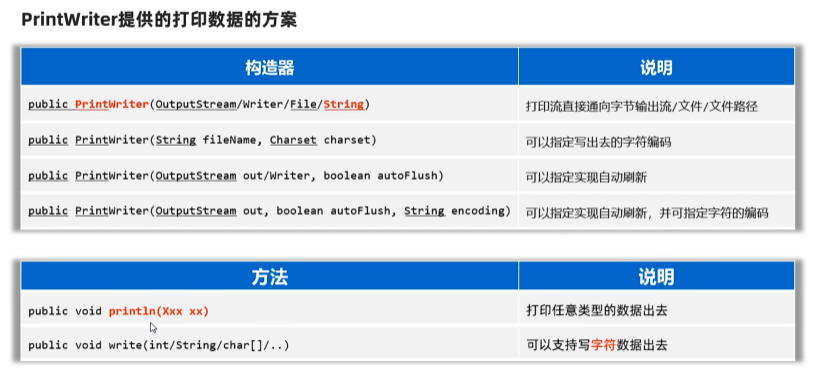  
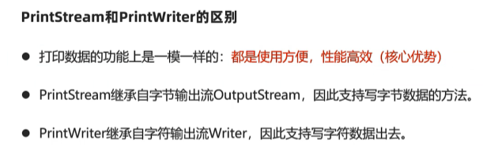  
```java
package com.itheima.printstream;

import java.io.FileNotFoundException;
import java.io.PrintStream;
import java.io.PrintWriter;
import java.nio.charset.Charset;

// TODO 打印流
public class PrintTest1 {
    public static void main(String[] args) {

        try (
                // 1.创建一个打印流管道
                // PrintStream ps =
                // new PrintStream("io-app2\\src\\itheima08.txt", Charset.forName("GBK"));
                // PrintStream ps =
                        // new PrintStream("io-app2\\src\\itheima08.txt");
                PrintWriter ps =
                        new PrintWriter("io-app2\\src\\itheima08.txt");
        ) {
            ps.println(97);
            ps.println('a');
            ps.println("我爱你中国abc");
            ps.println(true);
            ps.println(99.5);

            // ps.write(97);//'a'
            
        } catch (Exception e) {
            e.printStackTrace();
        }
    }
}
```
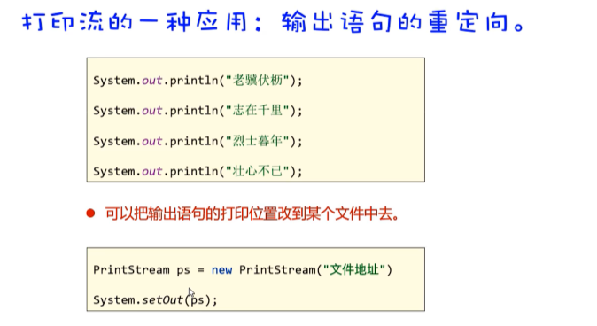  
```java
package com.itheima.printstream;

import java.io.FileNotFoundException;
import java.io.PrintStream;
import java.io.PrintWriter;

// TODO 输出语句的重定向
public class PrintTest2 {
    public static void main(String[] args) {
        System.out.println("十万伏特");
        System.out.println("想到我们");


        try(
                PrintStream ps = new PrintStream("io-app2\\src\\itheima09.txt");
                ) {
            // 把系统默认的打印流对象改成自己设置的打印流
            System.setOut(ps);

            System.out.println("放逐");
            System.out.println("眼泪落下之前");
        } catch (Exception e) {
           e.printStackTrace();
        }
    }
}

```

###  IO流-数据流  
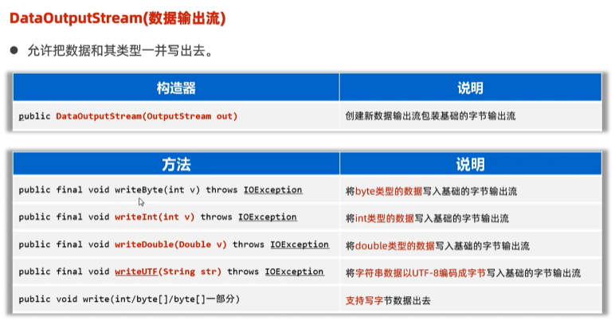  
```java
package com.itheima.data_stream;

import java.io.DataOutputStream;
import java.io.FileNotFoundException;
import java.io.FileOutputStream;

// TODO 数据输出流
public class DataOutputStreamTest1 {
    public static void main(String[] args) {
        try(
                // 1.创建一个字节输出流包装低级的字节输出流
                DataOutputStream dos =
                        new DataOutputStream(new FileOutputStream("io-app2\\src\\itheima10out.txt"));
                ) {
            dos.writeInt(97);
            dos.writeDouble(99.5);
            dos.writeBoolean(true);
            dos.writeUTF("黑马程序员666");
        } catch (Exception e) {
            e.printStackTrace();
        }
    }
}
```
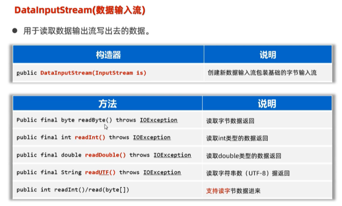  
```java
package com.itheima.data_stream;

import java.io.DataInputStream;
import java.io.DataOutputStream;
import java.io.FileInputStream;
import java.io.FileOutputStream;

// TODO 使用数据输入流读取特定类型的数据
public class DataInputStreamTest2 {
    public static void main(String[] args) {
        try(
                DataInputStream dis =
                        new DataInputStream(new FileInputStream("io-app2\\src\\itheima10out.txt"));
                ) {
            int i = dis.readInt();
            System.out.println(i);

            double d = dis.readDouble();
            System.out.println(d);

            boolean b = dis.readBoolean();
            System.out.println(b);

            String rs = dis.readUTF();
            System.out.println(rs);

        } catch (Exception e) {
            e.printStackTrace();
        }
    }
}

```

###  IO流-序列化流  
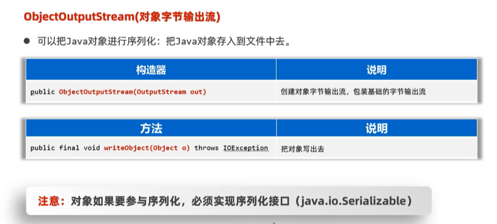  
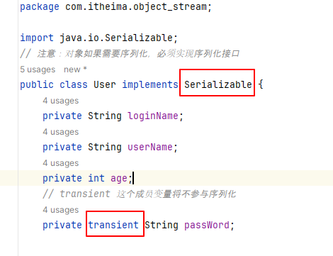  
```java
package com.itheima.object_stream;

import java.io.FileOutputStream;
import java.io.FilterOutputStream;
import java.io.IOException;
import java.io.ObjectOutputStream;
import java.sql.SQLOutput;

// TODO 对象字节输出流的使用：序列化对象
public class Test1ObjectOutputStream {
    public static void main(String[] args) {
        try(
                // 2.创建一个对象字节输出流包装原始的字节输出流
                ObjectOutputStream oos =
                        new ObjectOutputStream(new FileOutputStream("io-app2\\src\\itheima11out.txt"));
                ) {
            // 1.创建一个java对象
            User u = new User("admin","张三",32,"666888xyz");
            // 3.序列化对象到文件中去
            oos.writeObject(u);
            System.out.println("序列化对象成功");
        } catch (Exception e) {
            e.printStackTrace();
        }
    }
}
```
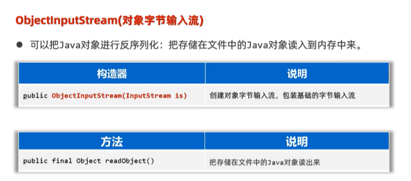  
```java
package com.itheima.object_stream;

// TODO 对象字节输入流的使用:反序列化对象

import java.io.FileInputStream;
import java.io.IOException;
import java.io.ObjectInputStream;

public class Test2ObjectInputStream {
    public static void main(String[] args) {
        try(
                // 1.创建一个对象字节输入流管道，包装 低级的字节输入流与源文件接通
                ObjectInputStream ois = new ObjectInputStream(new FileInputStream("io-app2\\src\\itheima11out.txt"));
                ) {
               User u = (User)ois.readObject();
               System.out.println(u);

        } catch (Exception e) {
            e.printStackTrace();
        }
    }
}

```
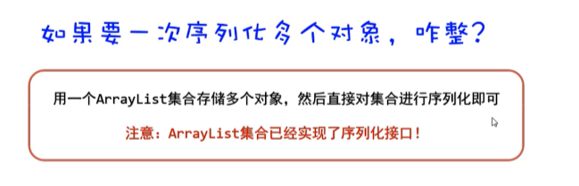  

###  IO框架  
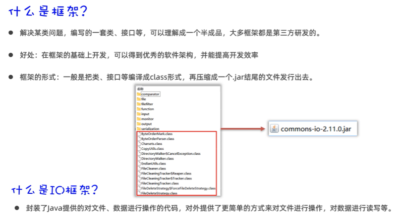  
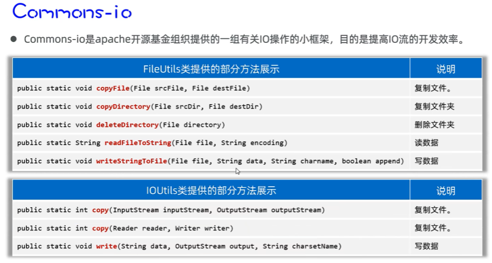  
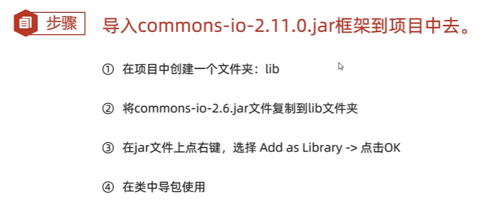  
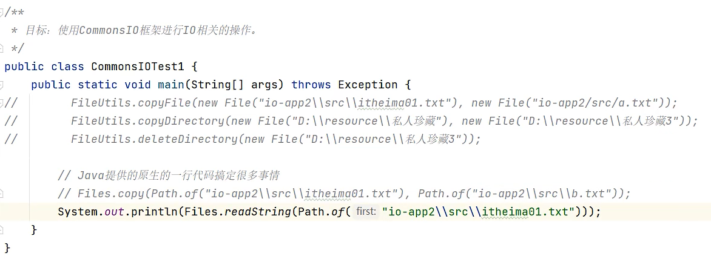  


