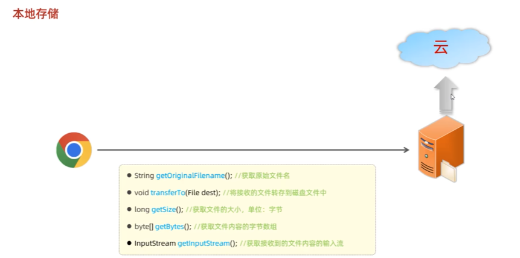
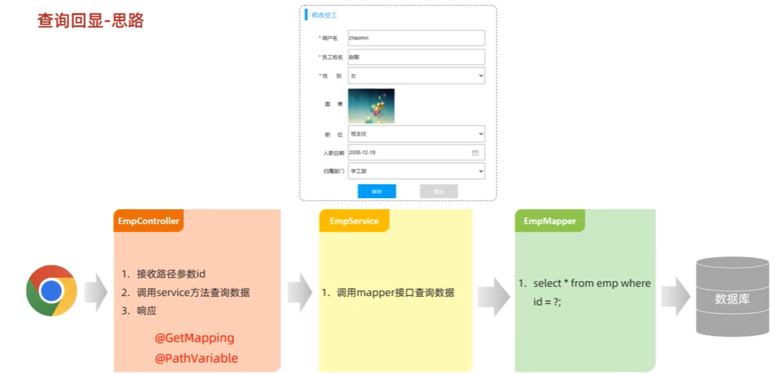

## IO流        

###  IO流-字符流   
1.  文件字符输入流-读字符数据进来    
  
```java
package com.itheima.char_stream;

// TODO 文件字符输入流每次读取一个字符

import java.io.FileNotFoundException;
import java.io.FileReader;
import java.io.Reader;

public class FileReaderTest1 {
    public static void main(String[] args) {
        try(
                // 1.创建一个文件字符输入流管道与源文件接通
             Reader fr = new FileReader("io-app2\\src\\itheima01.txt");
                ) {
             // 2.读取文本文件的内容
            /*int c;// 记住每次读取的字符编号
            while ((c = fr.read()) != -1){
                System.out.print((char)c);
            }*/
           // 每次读取一个字符的形式，性能肯定是比较差的

            // 3.每次读取多个字符
            char[] buffer = new char[3];
            int len;// 记住每次读取了多少个字符
            while ((len = fr.read(buffer)) != -1){
                // 读取多少 倒出多少
                System.out.print(new String(buffer, 0, len));
            }
            // 性能比较不错
        } catch (Exception e) {
            e.printStackTrace();
        }
    }
}

```  
2.  文件字符输出流-写字符数据出去  
  
```java
package com.itheima.char_stream;

// TODO 文件字节输出流：写字符数据出去

import java.io.FileWriter;
import java.io.IOException;
import java.io.Writer;

public class FileWriterTest2 {
    public static void main(String[] args) {
        try(
                //0.创建一个文件字符输出流管道与源文件接通
                // 覆盖管道
                // Writer fw = new FileWriter("io-app2\\src\\itheima02out.txt");
                // 追加数据管道
                Writer fw = new FileWriter("io-app2\\src\\itheima02out.txt",true);
                ) {
            // 1.写一个字符出去
            fw.write('a');
            fw.write(97);
            fw.write('磊');// 写一个字符出去
            fw.write("\r\n");// 换行

            // 2.写一个字符串出去
            fw.write("我爱你中国abc");

            // 3.写字符串的一部分出去
            fw.write("我爱你中国abc",0,5);

            // 4.写一个字符数组出去
            char[] buffer = {'黑','马','a','b','c'};
            fw.write(buffer);

            // 5.写字符数组的一部分出去
            fw.write(buffer,0,2);

        } catch (Exception e) {
            e.printStackTrace();
        }
    }
}

```
  
```java
package com.itheima.char_stream;

// TODO 字符输出流使用时的注意事项

import java.io.FileWriter;
import java.io.IOException;
import java.io.Writer;

public class FileWriterTest3 {
    public static void main(String[] args) throws Exception {
                Writer fw = new FileWriter("io-app2\\src\\itheima03out.txt");

            // 写字符数据出去
            fw.write('a');
            fw.write('b');
            fw.write('c');
            fw.write('d');
            fw.write("\r\n");// 换行

            fw.write("我爱你中国");
            fw.write("\r\n");// 换行
            fw.write("我爱你中国");
            
            fw.close();//关闭流，包含刷新操作
    }
}
```

###  IO流-缓冲流  
  
1.  字节缓冲流  
  
  
  
2.  字符缓冲流  
  
  
  
  
  

###  IO流-转换流  
1.  字符输入转换流  
  
```java
package com.itheima.transform_strea;
// TODO 字符输入转换流的作用

import java.io.*;

public class InputStreamReaderTest2 {
    public static void main(String[] args) {

        try (
                // 1.得到文件的原始字节流（GBK的字节流形式）
                InputStream is = new FileInputStream("io-app2\\src\\itheima06.txt");
                // 2.把原始的字节输入流按照指定的字符集编码转换成字符输入流
                Reader isr = new InputStreamReader(is,"GBK");
                // 3.把字符输入流包装成缓冲字符输入流
                BufferedReader br = new BufferedReader(isr);
                ){
            String line;
            while ((line = br.readLine()) != null){
                System.out.println(line);
            }
        } catch (Exception e) {
            e.printStackTrace();
        }
    }
}
```  
2.  字符输出转换流  
  
  
```java
package com.itheima.transform_strea;
// TODO 字符输出转换流的作用


import java.io.*;

public class OutputStreamWriterTest3 {
    public static void main(String[] args) {
         // 指定写出去的字符编码
        try(
                //  1.创建一个文件字节输出流
                OutputStream os = new FileOutputStream("io-app2\\src\\itheima07out.txt");
                // 2.把原始的字节输出流按照指定的字符集编码转换成字符输出转换流
                Writer osw = new OutputStreamWriter(os,"GBK");
                // 3.把字符输出流包装成缓冲字符输出流
                BufferedWriter bw = new BufferedWriter(osw);
                ) {
               bw.write("我是中国人abc");
               bw.write("我爱你中国123");
        } catch (Exception e) {
            e.printStackTrace();
        }
    }
}
```  
   
```java
package com.itheima.transform_stream;

import java.io.BufferedReader;
import java.io.FileNotFoundException;
import java.io.FileReader;
import java.io.Reader;

// TODO 不同编码读取乱码的问题
public class Test1 {
    public static void main(String[] args) {
        try(     // 1.创建一个文件字符输入流与源文件接通
                Reader fr = new FileReader("io-app2\\src\\itheima04.txt");
                // 2.把文件字符输入流包装成缓冲字符输入流
                 BufferedReader br = new BufferedReader(fr);
                ) {
                String line;
                while ((line= br.readLine()) != null){
                    System.out.println(line);
                }
        } catch (Exception e) {
            e.printStackTrace();
        }
    }
}
```

###  IO流-打印流  


###  IO流-数据流  


###  IO流-序列化流  


###  IO框架  
  
  
  
  


