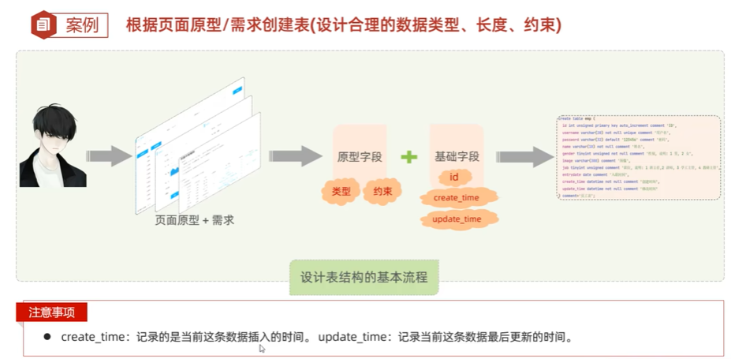
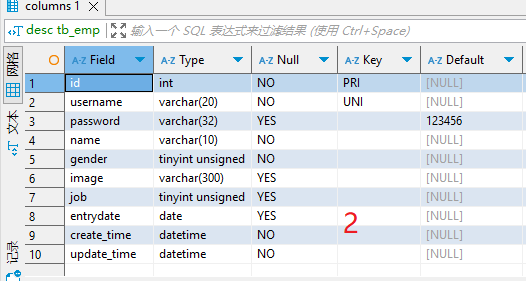
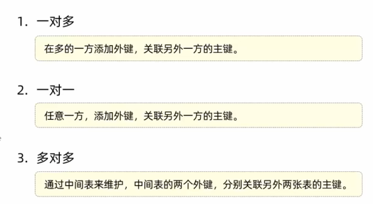

##  MySQL  

1.  MySQL课程介绍  
  
  
2.  MySQL-概述-安装配置  
  
3.  MySQL-概述-数据模型&SQL简介  
  
  
  
  
  
SQL分为四大类：  
①DDL:定义语言，定义数据库对象（数据库 表 字段）  
②DML:操作语言，对数据进行增删改  
③DQL:查询语言，查询数据库表中的记录  
④DCL:控制语言，创建数据库用户，控制访问权限  
4.  MySQL-DDL-数据库操作  
  
  
  
  
5.  MySQL-DDL-图形化工具  
DBeaver工具  
6.  MySQL-DDL-表结构操作-创建  
  
  
  
  
在DBeaver中创建表并在表中添加数据  
①创建表的格式+约束②表中添加数据  
7.  MySQL-DDL-表结构操作-数据类型  
三类：数值类型，字符串类型，日期时间类型  
  
  
  
  
8.  MySQL-DDL-表结构操作-创建案例  
  
9.  MySQL-DDL-表结构操作-查询&修改&删除  
修改 查询 删除(对表的操作)   
  
  
  
  
  
  
  
  
  
  
10. MySQL-DML-添加数据：insert  
DML-添加 修改 删除数据  
  
  
  
11. MySQL-DML-修改数据：update  
  
  
  
12. MySQL-DML-删除数据：delete   
  
  
  
  
13. MySQL-DQL-基本查询  
DQL:①基本查询②条件查询where③分组查询group by④排序查询order by⑤分页查询limit    
  
  
  
  
14. MySQL-DQL-条件查询  
  
  
  
15. MySQL-DQL-聚合函数  
聚合函数：count max min avg sum  
  
  
  
16. MySQL-DQL-分组查询  
  
  
17. MySQL-DQL-排序查询  
  
  
18. MySQL-DQL-分页查询  
  
起始索引= （页码-1）*每页展示的记录数  
  
19. MySQL-DQL-案例  
  
  
  
  
  
20. MySQL-多表设计-一对多  
  
  
21. MySQL-多表设计-一对多-外键  
  
  
  
22. MySQL-多表设计-一对一&多对多  
  
  
  
  
  
23. MySQL-多表设计-案例-关系分析  
  
24. MySQL-多表设计-案例-表结构  
  
   
  
25. MySQL-多表查询-概述  
  
  
26. MySQL-多表查询-内连接  
  
  
  
27. MySQL-多表查询-外连接  
  
  
28. MySQL-多表查询-子查询（标量 列）  
  
  
  
29. MySQL-多表查询-子查询（行 表）  
  
  
30. MySQL-多表查询-案例1  
  
31. MySQL-多表查询-案例2  
  
  
32. MySQL-事务-介绍与操作  
要么全部成功，要么全部失败  
  
  
  
  
33. MySQL-事务-四大特性  
  
  
34. MySQL-索引-介绍  
相当于书的目录，高效获取数据    
  
   
  
35. MySQL-索引-结构  
  
36. MySQL-索引-操作语法  
  
  
  
  

 