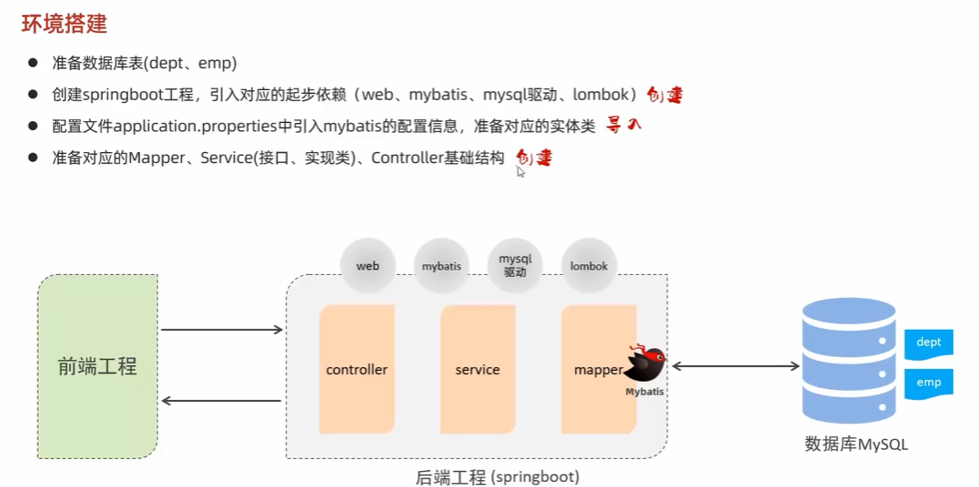

##  MySQL  

1.  MySQL课程介绍  
  
  
2.  MySQL-概述-安装配置  
  
3.  MySQL-概述-数据模型&SQL简介  
  
  
  
  
  
4.  MySQL-DDL-数据库操作  
  
  
  
5.  MySQL-DDL-图形化工具  
DBeaver工具  
p85!!!   
6.  MySQL-DDL-表结构操作-创建  

7.  MySQL-DDL-表结构操作-数据类型  

8.  MySQL-DDL-表结构操作-创建案例  

9.  MySQL-DDL-表结构操作-查询&修改&删除  

10. MySQL-DML-添加数据insert  

11. MySQL-DML-修改数据update  

12. MySQL-DML-删除数据delete   

 