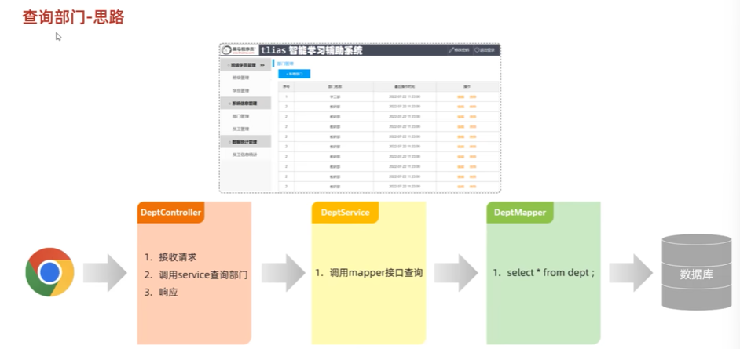
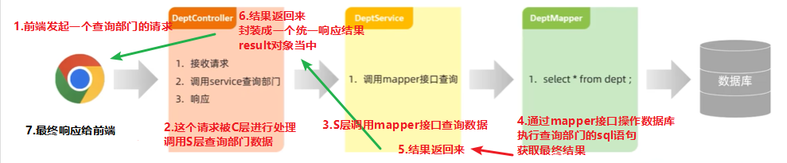
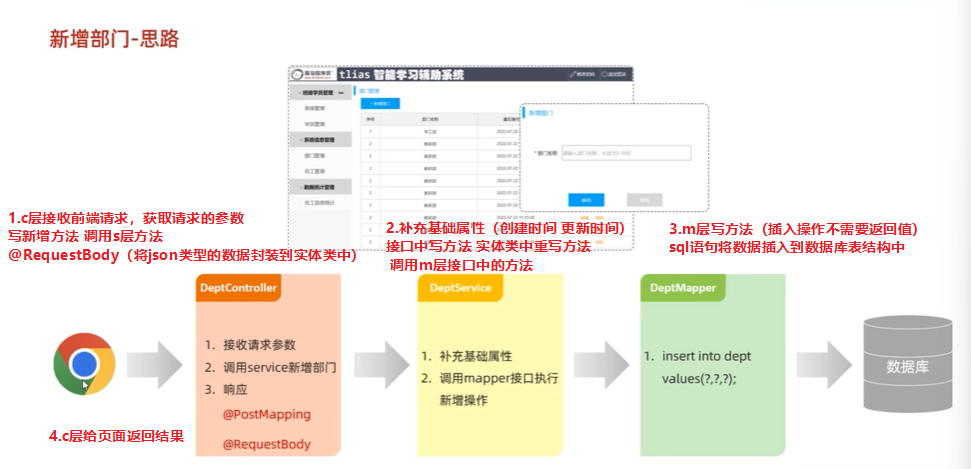
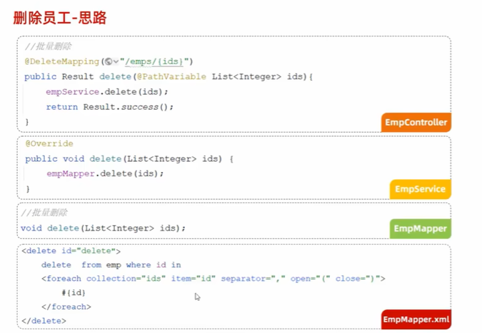
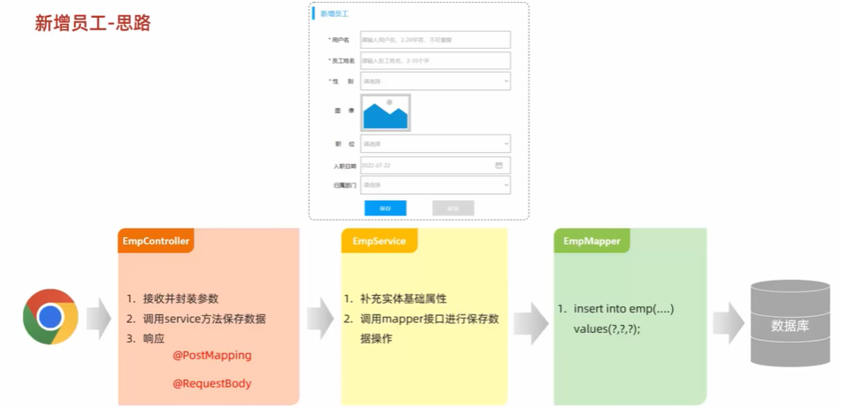

##  MySQL  

1.  MySQL课程介绍  
  
  
2.  MySQL-概述-安装配置  
  
3.  MySQL-概述-数据模型&SQL简介  
  
  
  
  
  
4.  MySQL-DDL-数据库操作  
  
  
  
5.  MySQL-DDL-图形化工具  
DBeaver工具  
6.  MySQL-DDL-表结构操作-创建  
  
  
  
  
7.  MySQL-DDL-表结构操作-数据类型  
  
  
  
  
8.  MySQL-DDL-表结构操作-创建案例  
  
9.  MySQL-DDL-表结构操作-查询&修改&删除  
  
  
  
  
  
  
  
  
  
  
10. MySQL-DML-添加数据insert  
  
  
  
11. MySQL-DML-修改数据update  
  
  
  
12. MySQL-DML-删除数据delete   
  
  
  
  
13. MySQL-DQL-基本查询  
  
  
  
  
14. MySQL-DQL-条件查询  
  
  
  
15. MySQL-DQL-聚合函数  
P94 !!!

16. MySQL-DQL-分组查询  

17. MySQL-DQL-排序查询  

18. MySQL-DQL-分页查询  

19. MySQL-DQL-案例  

20. MySQL-多表设计-一对多  

21. MySQL-多表设计-一对多-外键  

22. MySQL-多表设计-一对多&多对多  

23. MySQL-多表设计-案例-关系分析  

24. MySQL-多表设计-案例-表结构  

25. MySQL-多表查询-概述  

26. MySQL-多表查询-内连接  

27. MySQL-多表查询-外连接  

28. MySQL-多表查询-子查询（标量 列）  

29. MySQL-多表查询-子查询（行 表）  

30. MySQL-多表查询-案例1  

31. MySQL-多表查询-案例2  

32. MySQL-事务-介绍与操作  

33. MySQL-事务-四大特性  

34. MySQL-索引-介绍  

35. MySQL-索引-结构  

36. MySQL-索引-操作语法  

 