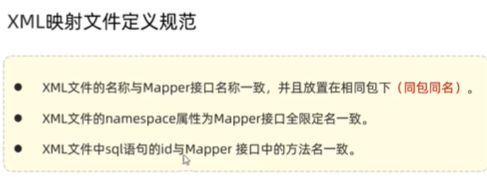

##  MyBatis    
### Mybatis入门  
1.  Mybatis-入门-课程介绍  
把java和mysql连接起来  
  
2.  Mybatis-入门-快速入门程序  
在springboot工程中使用  
@Mapper 注解： 在运行时，会自动生成该接口的实现类对象（代理对象），并且将该对象交给IOC容器管理  
@Autowired 注解：从IOC容器中取出来对象来 注入类中    
  
  
  
  
  
  
  
  
3.  Mybatis-入门-配置SQL提示  
  
  
4.  Mybatis-入门-JDBC  
  
  
  
  
5.  Mybatis-入门-数据库连接池  
  
  
  
  
6.  Mybatis-入门-lombok工具包介绍  
  
  

### Mybatis基础增删改查    
1.  Mybatis-基础操作-环境准备    
修改properties文件编码：https://blog.csdn.net/startyangu/article/details/130621161  
  
  
  
2.  Mybatis-基础操作-删除      
  
  
  
  
3.  Mybatis-基础操作-删除（预编译SQL）   
  
  
  
  
4.  Mybatis-基础操作-新增    
  
  
5.  Mybatis-基础操作-新增（主键返回）   
  
  
6.  Mybatis-基础操作-更新    
  
  
7.  Mybatis-基础操作-查询（根据ID查询）  
  
  
  
8.  Mybatis-基础操作-查询（条件查询） 
  
  
  
9.  Mybatis-XML映射文件  
  
  
  
  

### Mybatis动态SQL  
  
1.  Mybatis-动态SQL-if   
  
2.  Mybatis-动态SQL-if-案例    
  
  
3.  Mybatis-动态SQL-foreach   
  
4.  Mybatis-动态SQL-sql&include  
  
  

 