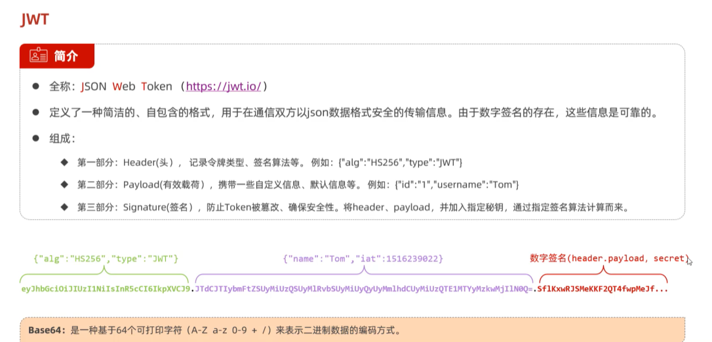
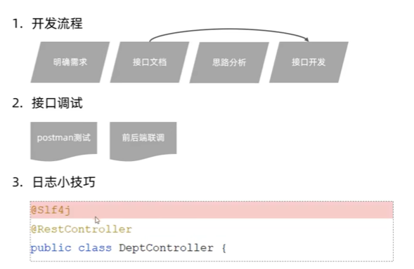
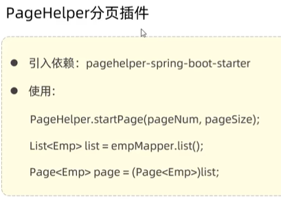
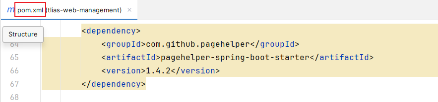
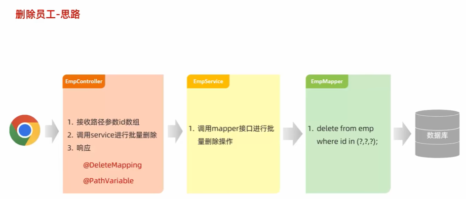
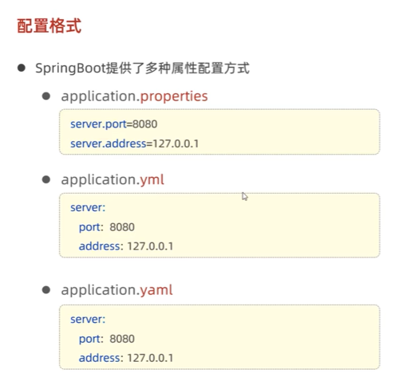
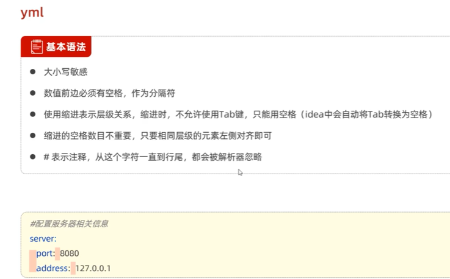
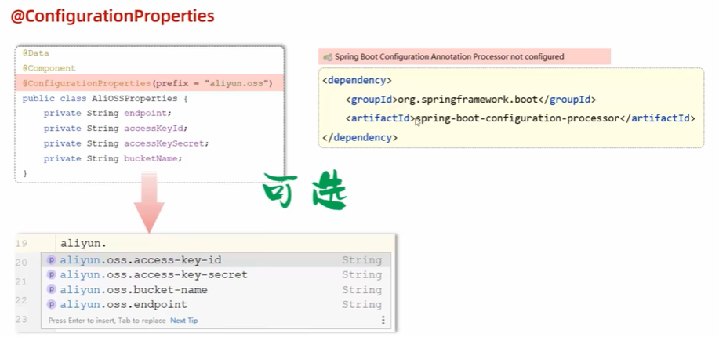
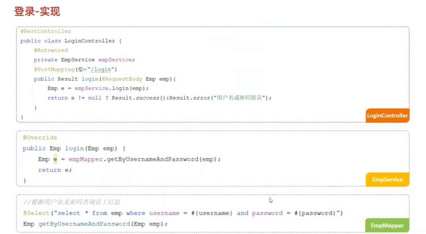

##  SpringBootWeb-快速入门  
    
https://start.spring.io/  
①  会自动生成启动类  
  
②解压文件并放到一个没有中文没有空格的路径下  
③用IDEA打开  
④  
  
⑤运行-启动类  
  
⑥打开浏览器测试  
  

###  HTTP协议  
1.  概述  
  
2.  请求协议  
  
  
3.  响应协议  
  
  
  
4.  协议解析  
  
###  Tomcat  
1.  介绍  
  
  
2.  基本使用  
  
  
  
  
  
  
3.  入门程序解析（内嵌tomcat） 
  
  
  
###  请求响应  
1.  概述  
  
2.  postman工具  
  
3.  简单参数&实体参数  
简单参数：  
繁琐：  
  
  
推荐：  
   
  
  
  
  
  
实体参数：  
   
  
  
  
  
4.  数组集合参数  
  
  
  
  
  
集合需要在形参前面加注解：@RequestParam  
5.  日期参数&json参数  
  
  
  
  
日期参数：需要在形参前面加注解：@DateTimeFormat(pattern = ""yyyy-MM-dd HH:mm:ss")   
json参数:需要在形参前面加注解：@RequestBody  
  
6.  路径参数  
  
  
  
路径参数：需要在形参前面加注解：@PathVariable  
  
总结：  
  
7.  @ResponseBody&统一响应效果  
  
  
  
  
  
  
  
  
  
  
把类型都改成Result  
###  分层解耦  
1.  三层架构  

2.  IOC-DI引入  

3.  IOC&DI入门  

4.  IOC&DI-IOC详解  

5.  IOC&DI-DI详解  

 