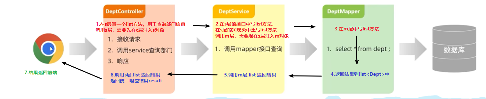
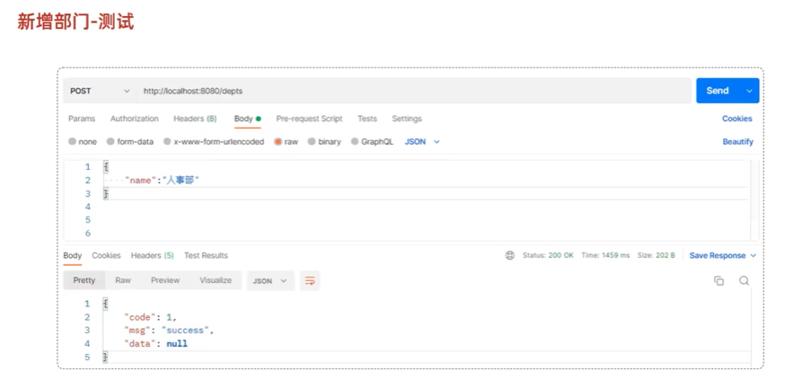
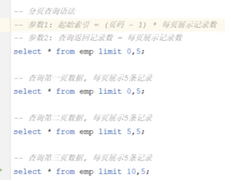
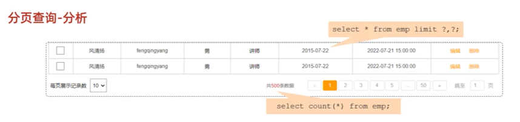
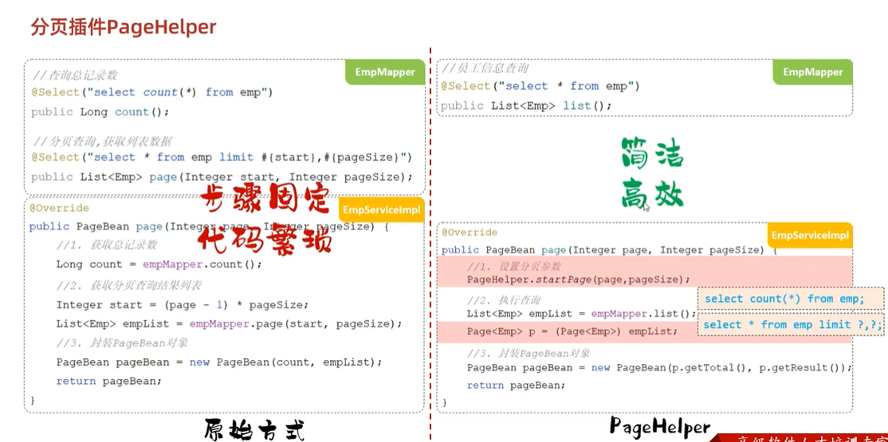
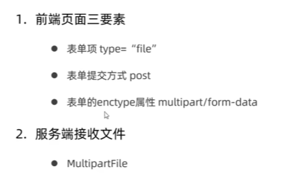
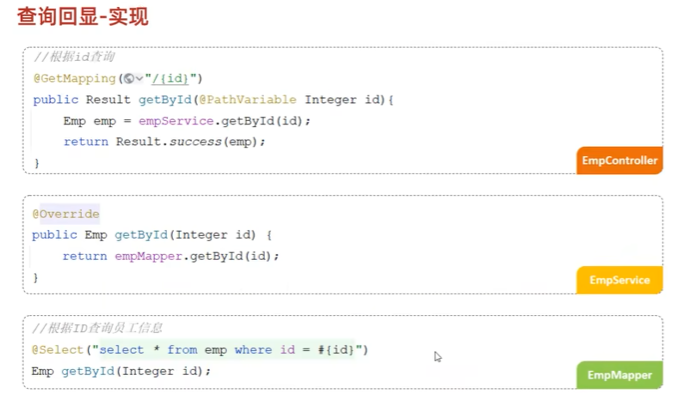
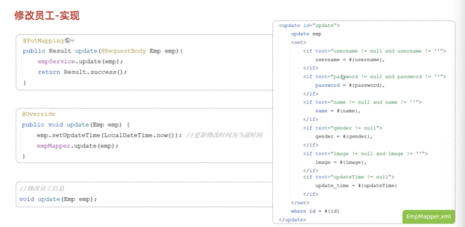
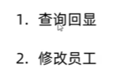

##  Vue  
###  Vue快速入门  
  
  
  
###  Vue常用指令   
  
  
  
  
  
  
  
  
  
  
  
  
  
###  Vue生命周期   
    
  
  
  
##  Ajax   
  
  
1.  Axios  
    
  
    
2.  案例  
  

##  前端工程化  
1.  环境准备  
下载：Nodejs     安装：vue-cli  
  
  
2.  Vue项目简介  
vue项目创建：命令行 vue create vue-project01  
命令行启动：npm run serve   终止：ctrl+c  
  
  
  
  
3.  Vue项目开发流程  
  
   

##  Vue组件库Element  
  
1.  快速入门  
  
2.  常见组件  
element ui 网址：https://element.eleme.io/#/zh-CN  
①Table表格  

②Pagination分页  

③Dialog对话框  

④From表单  

3.  案例  
①基本页面布局  

②页面组件实现  

③axios异步加载数据  

##  Vue路由      
##  打包部署       

##  maven  
1.  安装配置    
  
2.  IDEA集成Maven  
①配置Maven环境  
  
  
②创建Maven项目  
  
  
③导入Maven项目  
  
  
3.  依赖管理  
①依赖配置  

②依赖传递  

③依赖范围    

④生命周期  

##  Web入门  
###  SpringBootWeb入门  

###  HTTP协议  

###  Web服务器-Tomcat  

