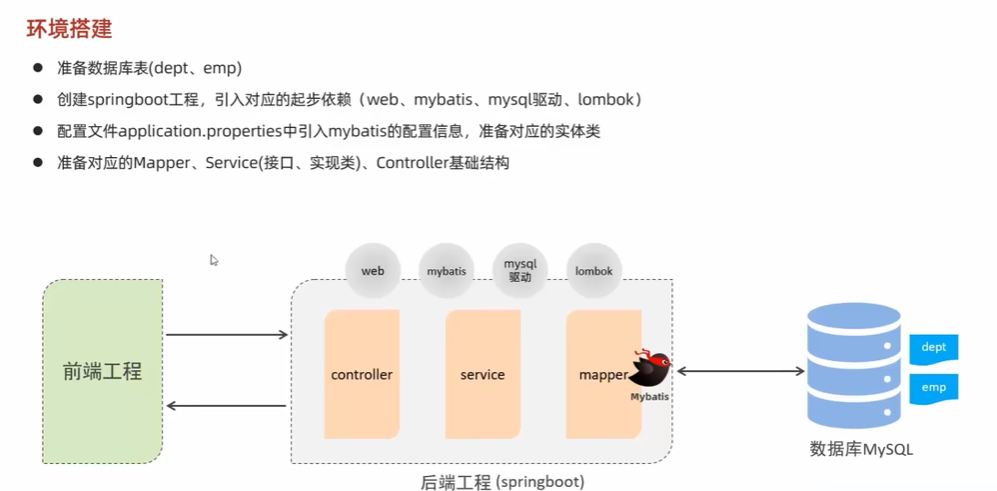
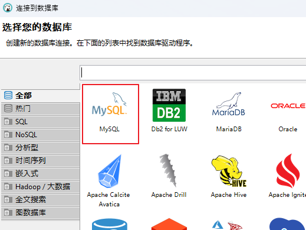
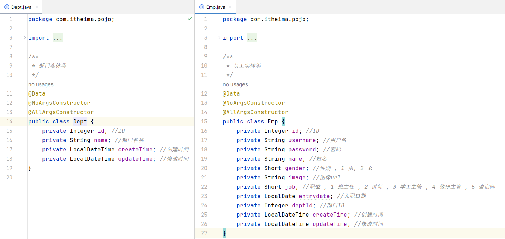
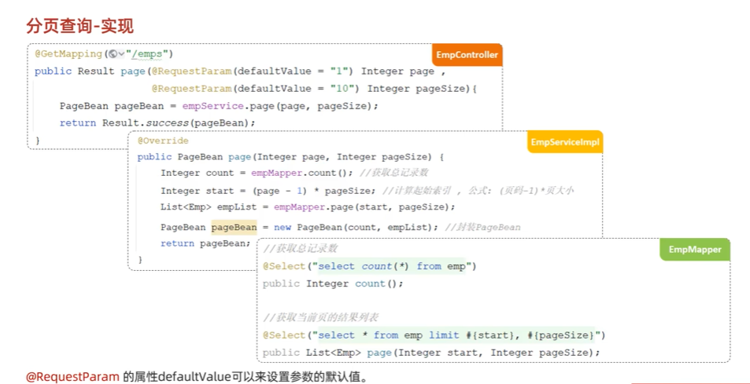

##  Vue  
###  Vue快速入门  
  
  
  
###  Vue常用指令   
  
  
  
  
  
  
  
  
  
  
  
  
  
###  Vue生命周期   
    
  
  
  
##  Ajax   
  
  
1.  Axios  
    
  
    
2.  案例  
  

##  前端工程化  
1.  环境准备  
  
  
2.  Vue项目简介  

3.  Vue项目开发流程  

  

  

##  Vue组件库Element  
##  Vue路由      
##  打包部署       