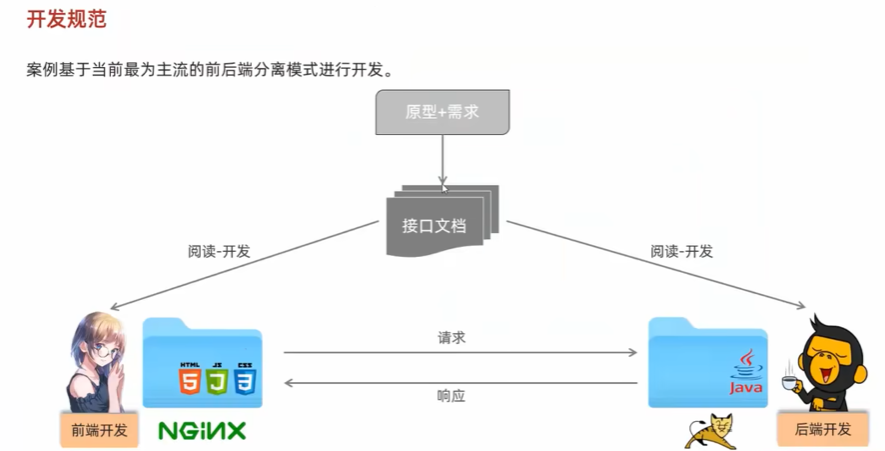
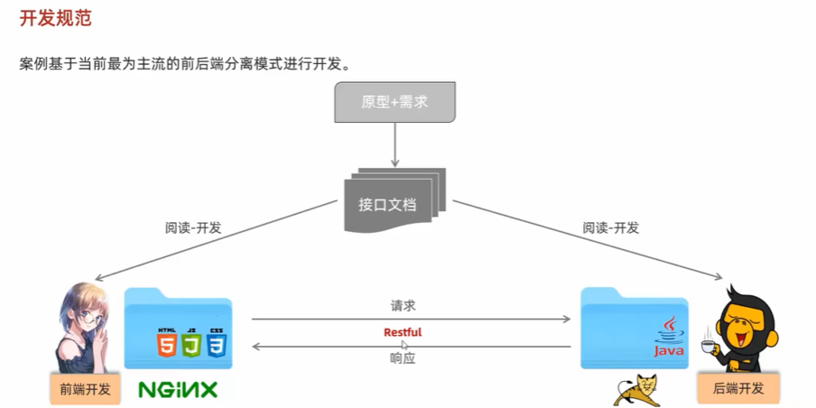
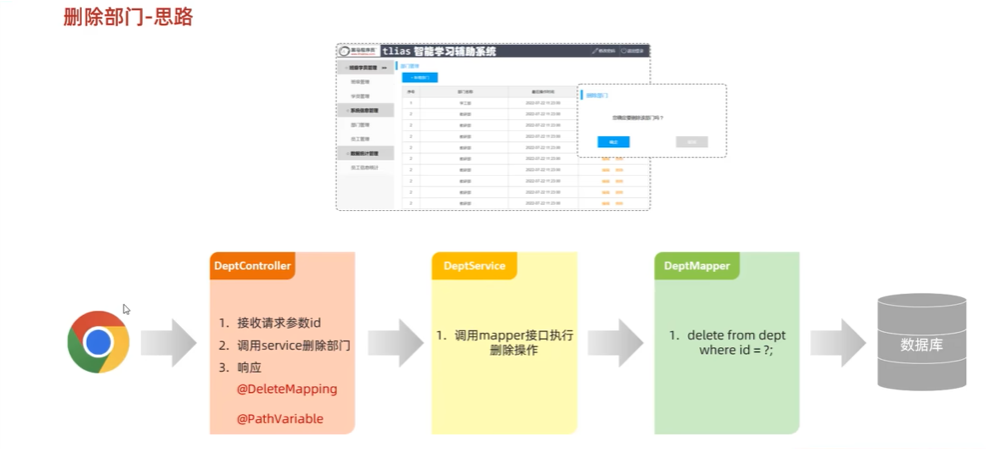
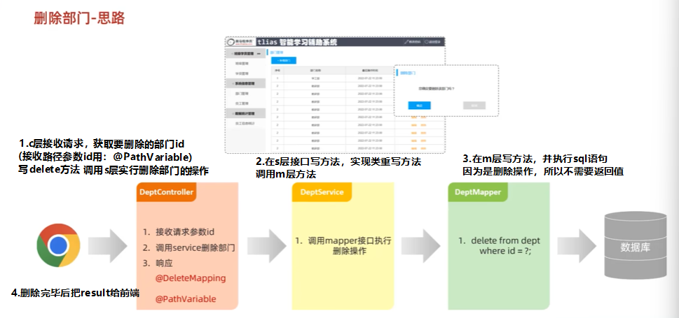
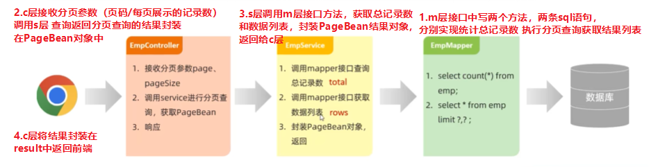

##  HTML  

###  标题  
1.  标题排版  
※快捷键：  
    ①快速打出框架：！+回车  
    ②注释：ctrl+shift+/  
    ③保存：ctrl s   
    ④打开浏览器：alt+b         
   
   
网页标题在title处写，其他在body中写  
  
  
2.  标题样式  
   
  
  
  
  
CSS选择器：用来选取需要设置样式的元素  
：比如设置字体颜色、大小、背景色等。  
  
  
  
id选择器：#id属性值{
             color；
             font-size:字体大小（xx px）
            }
3.  超链接  
  
  
  
self:在当前页面打开超链接  
blank:新页面打开超链接  
###  正文  
1.  正文排版  
   
  
  
2.  页面布局  
   
  
  
###  表格，表单标签  
1.  表格标签  
  
  
  
2.  表单标签  
  
  
  
3.  表单项标签  
  
  
  
  

##  JS  

###  JS引入方式  
  
  

###  JS基础语法   
1.  书写语法  
  
  
2.  变量  
   
  
3.  数据类型，运算符，流程控制语句  
  
  
  
  
  

###  JS函数   

###  JS对象   

###  JS事件监听   

  

 
  

  

  

