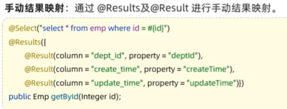

##  Web入门     

###  SpringBootWeb-快速入门  
  
  
  
  
  
  
###  HTTP协议  
1.  概述  
  
2.  请求协议  
  
  
3.  响应协议  
  
  
  
4.  协议解析  
  
###  Tomcat  
1.  介绍  
  
  
2.  基本使用  
  
  
  
  
  
  
3.  入门程序解析（内嵌tomcat） 
  
  
  
###  请求响应  
1.  概述  
2.  postman工具  
3.  简单参数&实体参数  
4.  数组集合参数  
5.  日期参数&json参数  
6.  路径参数  
7.  @ResponseBody&统一响应效果  
8.  案例  
 