## 集合框架二    

###  collection的其他相关知识  
1.  可变参数  
  
```java
package com.itheima.parameter;

import java.util.Arrays;

// TODO 可变参数及其作用
public class ParamTest1 {
    public static void main(String[] args) {
        // 特点
        test();// 不传数据  0   []
        test(10);//传一个数据  1  [10]
        test(12,20,30);//传多个数据  3  [12, 20, 30]
        test(new int[]{10,20,30,40});//传数组  4  [10, 20, 30, 40]
    }

    // 注意事项：一个形参列表中，只能有一个可变参数
    // 注意事项：可变参数必须放在形参列表的最后面
    public static void test(int...nums){
        // 可变参数在方法内部，本质就是一个数组
        System.out.println(nums.length);
        System.out.println(Arrays.toString(nums));
        System.out.println("=======================");
    }
}

```
2.  collections  
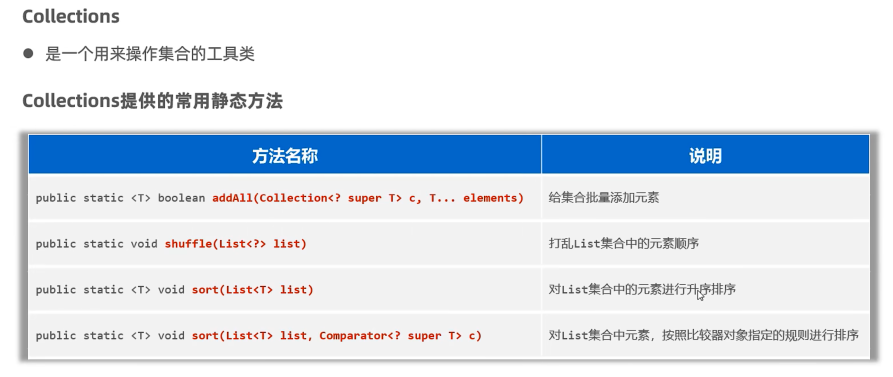  
  
```java
package com.itheima.collections;

import java.util.ArrayList;
import java.util.Collections;
import java.util.List;

// TODO Collections集合工具类的使用
public class CollectionsTest1 {
    public static void main(String[] args) {

        // 1.为集合批量添加数据
        List<String> names = new ArrayList<>();
        Collections.addAll(names,"张三","李四","王五","赵六");
        System.out.println(names);// [张三, 李四, 王五, 赵六]

        // 2.打乱LIST集合中的元素顺序
        Collections.shuffle(names);
        System.out.println(names);// 打乱顺序

        // 3.对LIST集合中的元素进行升序排序
        List<Integer> list = new ArrayList<>();
        list.add(3);
        list.add(5);
        list.add(2);
        Collections.sort(list);
        System.out.println(list);// [2, 3, 5]

        // 4.对LIST集合中元素，按照比较器对象指定的规则进行
    }
}

```
  

###  Map集合  
1.  概述  
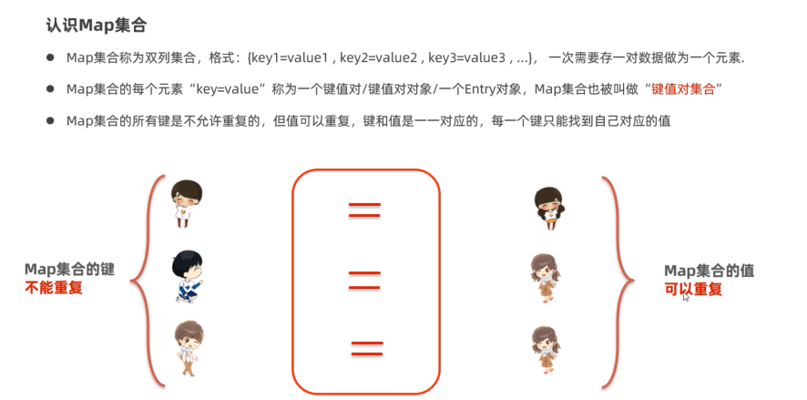  
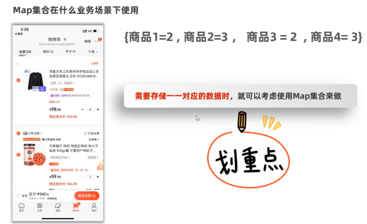  
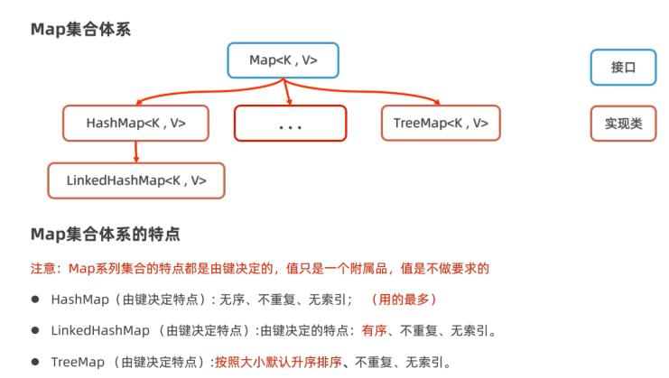  
```java
package com.itheima.map;

import java.util.HashMap;
import java.util.LinkedHashMap;
import java.util.Map;
import java.util.TreeMap;

// TODO Map集合的特点
public class MapTest1 {
    public static void main(String[] args) {
        // Map<String,Integer> map = new HashMap<>();// 经典代码 按照键 无序 不重复 无索引
        Map<String,Integer> map = new LinkedHashMap<>();// 有序 不重复 无索引
        map.put("手表",100);
        map.put("手表",220);// 后面重复的数据会覆盖前面的数据（键）
        map.put("手机",2);
        map.put("JAVA",2);
        map.put("JAVA",2);
        map.put(null,null);
        System.out.println(map);

        Map<Integer,String> map1 = new TreeMap<>();// 可排序 不重复 无索引
        map1.put(23,"JAV");
        map1.put(23,"MYSQL");
        map1.put(19,"李四");
        map1.put(20,"王五");
        System.out.println(map1);
    }
}

```  
2.  常用方法  
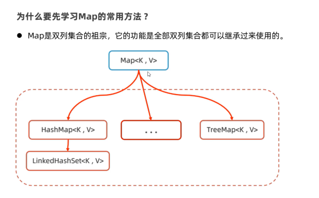  
```java
package com.itheima.map;

import java.util.*;

// TODO Map集合的特点
public class MapTest2 {
    public static void main(String[] args) {
        // 1.添加元素：无序 不重复 无索引
        Map<String,Integer> map = new HashMap<>();
        map.put("手表",100);
        map.put("手表",220);
        map.put("手机",2);
        map.put("JAVA",2);
        map.put(null,null);
        System.out.println(map);// {JAVA=2, null=null, 手表=220, 手机=2}

        // 2.获取集合的大小
        System.out.println(map.size());// 4

        // 3.清空集合
//        map.clear();
//        System.out.println(map);

        // 4.判断集合是否为空，为空返回true，反之
        System.out.println(map.isEmpty());

        // 5.根据键获取对应值
        int v1 = map.get("手表");
        System.out.println(v1);// 220

        // 6.根据键删除整个元素（删除键会返回键的值）
        System.out.println(map.remove("手表"));// 220
        System.out.println(map);// {JAVA=2, null=null, 手机=2}

        // 7.判断是否包含某个键，包含返回true，反之
        System.out.println(map.containsKey("手表"));// false
        System.out.println(map.containsKey("手机"));// true

        // 8.判断是否包含某个值
        System.out.println(map.containsValue(2));// true

        // 9.获取Map集合的全部键
        Set<String> keys = map.keySet();
        System.out.println(keys);// [JAVA, null, 手机]

        // 10.获取Map集合的全部值
        Collection<Integer> values = map.values();
        System.out.println(values);// [2, null, 2]

        // 11.把其他Map集合的数据倒入到自己集合中来（拓展）
        Map<String,Integer> map1 = new HashMap<>();
        map1.put("java1",10);
        map1.put("java2",20);
        Map<String,Integer> map2 = new HashMap<>();
        map2.put("java3",10);
        map2.put("java2",222);
        map1.putAll(map2);// putAll:把map2集合中的元素全部倒入一份到map1集合中去
        System.out.println(map1);// {java3=10, java2=222, java1=10}
        System.out.println(map2);// {java3=10, java2=222}
    }
}

```  
3.  遍历方式  
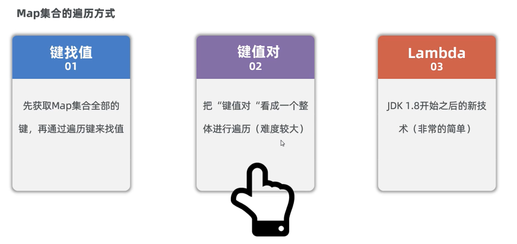  
  
```java
package com.itheima.map_traverse;

import java.util.HashMap;
import java.util.Map;
import java.util.Set;

// TODO Map集合的遍历方式1：键找值
public class MapTest1 {
    public static void main(String[] args) {
        // 准备一个Map集合
        Map<String,Double> map = new HashMap<>();
        map.put("蜘蛛精",162.5);
        map.put("蜘蛛精",169.8);
        map.put("紫霞",165.8);
        map.put("至尊宝",169.5);
        map.put("牛魔王",183.6);
        System.out.println(map);
        // {蜘蛛精=169.8, 牛魔王=183.6, 至尊宝=169.5, 紫霞=165.8}

        // 1.获取集合的全部键
        Set<String> keys = map.keySet();
        System.out.println(keys);// [蜘蛛精, 牛魔王, 至尊宝, 紫霞]
        // 2.遍历全部的键，根据键获取其对应的值
        for (String key : keys) {
            // 根据键获取其对应的值
           double value =  map.get(key);
            System.out.println(key + "------>" + value);
            // 蜘蛛精------>169.8
            //牛魔王------>183.6
            //至尊宝------>169.5
            //紫霞------>165.8
        }
    }
}

```
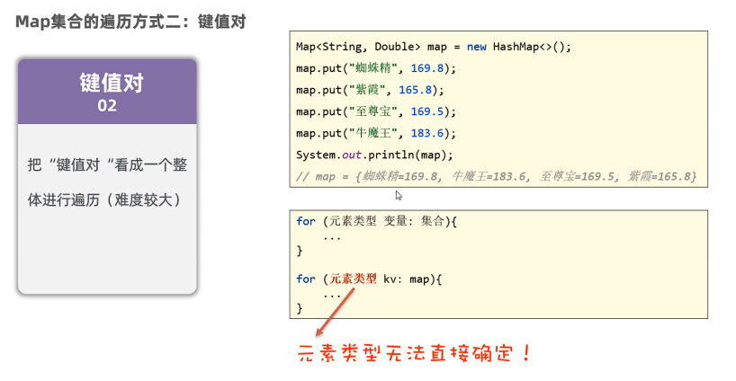   
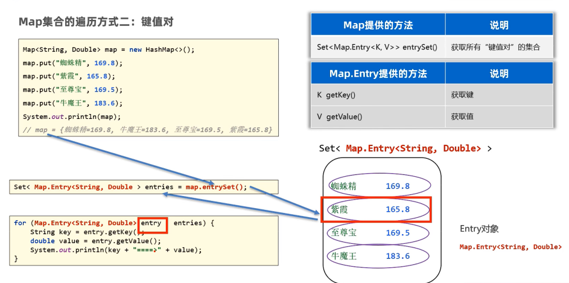  
```java
package com.itheima.map_traverse;

import java.util.HashMap;
import java.util.Map;
import java.util.Set;

// TODO Map集合的遍历方式1：键值对
public class MapTest2 {
    public static void main(String[] args) {
        Map<String,Double> map = new HashMap<>();
        map.put("蜘蛛精",169.8);
        map.put("紫霞",165.8);
        map.put("至尊宝",169.5);
        map.put("牛魔王",183.6);
        System.out.println(map);
        // {蜘蛛精=169.8, 牛魔王=183.6, 至尊宝=169.5, 紫霞=165.8}
        // entries = [{蜘蛛精=169.8},{牛魔王=183.6},{至尊宝=169.5},{紫霞=165.8}]

        // 1.调用Map集合提供的entrySet方法，把Map集合转换成键值对类型的Set集合
        Set<Map.Entry<String, Double>> entries = map.entrySet();
        for (Map.Entry<String, Double> entry : entries) {
            String key = entry.getKey();
            Double value = entry.getValue();
            System.out.println(key + "--->" + value);
            // 蜘蛛精--->169.8
            //牛魔王--->183.6
            //至尊宝--->169.5
            //紫霞--->165.8
        }
    }
}

```  
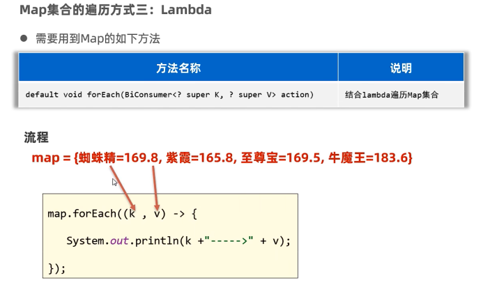  
```java
package com.itheima.map_traverse;

import java.util.HashMap;
import java.util.Map;
import java.util.Set;

// TODO Map集合的遍历方式3：Lambda
public class MapTest3 {
    public static void main(String[] args) {
        Map<String,Double> map = new HashMap<>();
        map.put("蜘蛛精",169.8);
        map.put("紫霞",165.8);
        map.put("至尊宝",169.5);
        map.put("牛魔王",183.6);
        System.out.println(map);
        // {蜘蛛精=169.8, 牛魔王=183.6, 至尊宝=169.5, 紫霞=165.8}
        map.forEach((k,v) -> {
            System.out.println(k + "--->" + v);
            // 蜘蛛精--->169.8
            //牛魔王--->183.6
            //至尊宝--->169.5
            //紫霞--->165.8
        });
    }
}

```
4.  HashMap  
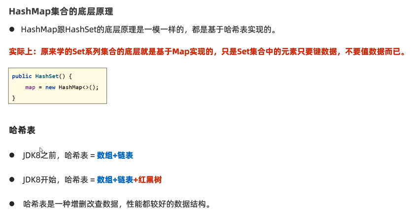  
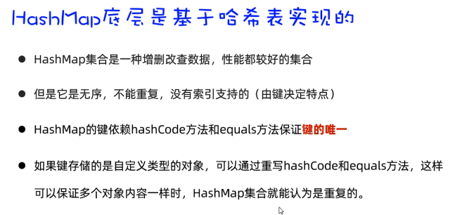  
5.  LinkedHashMap  
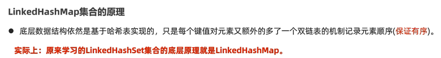  
6.  TreeMap  
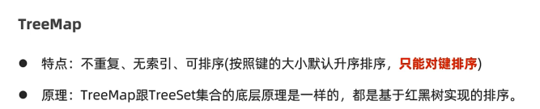  
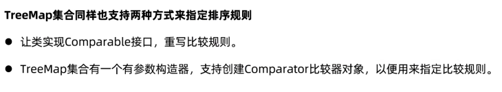  
7. 集合的嵌套  
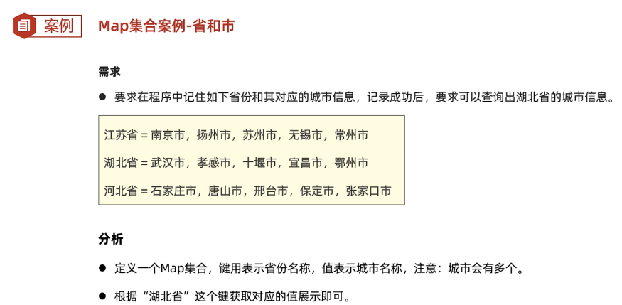  
```java
package com.itheima.collection_nesting;

import java.util.*;

// TODO 集合的嵌套
public class Test {
    public static void main(String[] args) {
        // 1.定义一个map集合存储全部的省份信息和其对应的城市信息
        Map<String, List<String>> map = new HashMap<>();
        List<String> cities1 = new ArrayList<>();
        Collections.addAll(cities1, "南京市","扬州市","苏州市","无锡市","常州市");
        map.put("江苏省",cities1);

        List<String> cities2 = new ArrayList<>();
        Collections.addAll(cities2, "武汉市","孝感市","十堰市","宜昌市","鄂州市");
        map.put("湖北省",cities2);

        List<String> cities3 = new ArrayList<>();
        Collections.addAll(cities3, "石家庄市","唐山市","邢台市","保定市","张家口市");
        map.put("河北省",cities3);
        System.out.println(map);
        //{江苏省=[南京市, 扬州市, 苏州市, 无锡市, 常州市],
        // 湖北省=[武汉市, 孝感市, 十堰市, 宜昌市, 鄂州市],
        // 河北省=[石家庄市, 唐山市, 邢台市, 保定市, 张家口市]}

        List<String> cities =map.get("湖北省");
        for (String city : cities) {
            System.out.println(city);
            // 武汉市
            // 孝感市
            // 十堰市
            // 宜昌市
            // 鄂州市
        }

        map.forEach((p,c) -> {
            System.out.println(p + "-------->" + c);
            // 江苏省-------->[南京市, 扬州市, 苏州市, 无锡市, 常州市]
            // 湖北省-------->[武汉市, 孝感市, 十堰市, 宜昌市, 鄂州市]
            // 河北省-------->[石家庄市, 唐山市, 邢台市, 保定市, 张家口市]
        });
    }
}

```

###  Stream流    
1.  认识Stream  
  
  
  
```JAVA
package com.itheima.stream;

import java.util.ArrayList;
import java.util.Collections;
import java.util.List;
import java.util.stream.Collectors;

// TODO Stream流的方便与快捷
public class StreamTest1 {
    public static void main(String[] args) {
        List<String> names = new ArrayList<>();
        Collections.addAll(names,"张三丰","张无忌","周芷若","赵敏","张强");
        System.out.println(names);// [张三丰, 张无忌, 周芷若, 赵敏, 张强]

        // 找出姓张且是3个字的名字，存入到一个新集合中去
        List<String> list = new ArrayList<>();
        for (String name : names) {
            if (name.startsWith("张") && name.length() == 3){
                list.add(name);
            }
        }
        System.out.println(list);// [张三丰, 张无忌]

        // 开始使用Stream流来解决这个需求
        List<String> list2 = names.stream().filter(s -> s.startsWith("张"))
                .filter(a -> a.length() == 3).collect(Collectors.toList());
        System.out.println(list2);// [张三丰, 张无忌]
    }
}

```  
2.  Stream的常用方法  
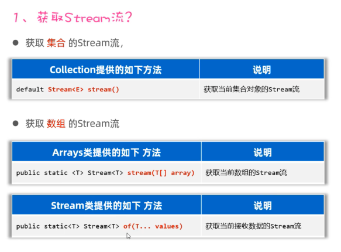  
```java
package com.itheima.stream;


import java.util.*;
import java.util.stream.Collectors;
import java.util.stream.Stream;

public class StreamTest2 {
    public static void main(String[] args) {
        // 1.如何获取List集合的Stream流？
        List<String> names = new ArrayList<>();
        Collections.addAll(names,"张三丰","张无忌","周芷若","赵敏","张强");
        Stream<String> stream = names.stream();

        // 2. 如何获取Set集合的Stream流？
        Set<String> set = new HashSet<>();
        Collections.addAll(set,"刘德华","张曼玉","蜘蛛精","马德","德玛西亚");
        Stream<String> stream1 = set.stream();
        stream1.filter(s -> s.contains("德")).forEach(s -> System.out.println(s));

        // 3.如何获取Map集合的Stream流？
        Map<String,Double> map = new HashMap<>();
        map.put("古力娜扎",172.3);
        map.put("迪丽热巴",168.3);
        map.put("马尔扎哈",166.3);
        map.put("卡尔扎巴",168.3);

        Set<String> keys = map.keySet();
        Stream<String> ks = keys.stream();

        Collection<Double> values = map.values();
        Stream<Double> vs = values.stream();

        Set<Map.Entry<String, Double>> entries = map.entrySet();
        Stream<Map.Entry<String, Double>> kvs = entries.stream();
        kvs.filter(e -> e.getKey().contains("巴"))
                .forEach(e -> System.out.println(e.getKey()+"-->"+e.getValue()) );

        // 4.如何获取数组的Stream流？
        String[]names2 = {"张翠山","东方不败","唐大山","孤独求败"};
        Stream<String> s1 = Arrays.stream(names2);
        Stream<String> s2 = Stream.of(names2);
    }
}

```
  
```java
package com.itheima.stream;

import java.util.ArrayList;
import java.util.Collections;
import java.util.List;
import java.util.stream.Stream;

public class StreamTest3 {
    public static void main(String[] args) {
        List<Double> scores = new ArrayList<>();
        Collections.addAll(scores,88.5,100.0,60.0,99.0,9.5,99.6,25.0);
        // 需求1：找出成绩大于等于60分的数据，升序再输出
        scores.stream().filter(s -> s >= 60).sorted().forEach(s-> System.out.println(s));

        List<Student> students = new ArrayList<>();
        Student s1 = new Student("蜘蛛精",26,172.5);
        Student s2 = new Student("蜘蛛精",26,172.5);
        Student s3 = new Student("紫霞",23,167.6);
        Student s4 = new Student("白晶晶",25,169.0);
        Student s5 = new Student("牛魔王",35,183.3);
        Student s6 = new Student("牛夫人",34,168.5);
        Collections.addAll(students,s1,s2,s3,s4,s5,s6);
        // 2.找出年龄大于等于23，且年龄小于等于30岁的学生，并按照年龄降序输出
        students.stream().filter(s -> s.getAge() >= 23 && s.getAge() <= 30)
                .sorted((o1,o2) -> o2.getAge() - o1.getAge())
                .forEach(s -> System.out.println(s));

        // 3.取出身高最高的前3名学生，并输出
        students.stream().sorted((o1,o2) -> Double.compare(o2.getHeight(),o1.getHeight()))
                .limit(3).forEach(System.out::println);

        // 4.取出身高倒数的2名学生，并输出
        students.stream().sorted((o1,o2) -> Double.compare(o2.getHeight(),o1.getHeight()))
                .skip(students.size() - 2).forEach(System.out::println);

        // 5.找出身高超过168的学生叫什么名字，要求去除重复的名字，再输出
        students.stream().filter(s -> s.getHeight() > 168).map(Student::getName)
                .distinct().forEach(s -> System.out.println(s));

        // distinct:去重复
        // concat：合并流
        Stream<String> st1 = Stream.of("张三","李四");
        Stream<String> st2 = Stream.of("张三2","李四2","王五");
        Stream<String> allSt = Stream.concat(st1, st2);
        allSt.forEach(System.out::println);
    }
}

```
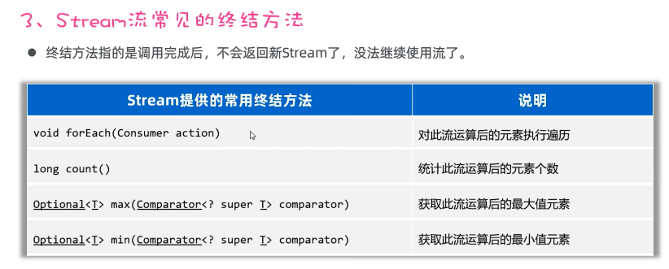  
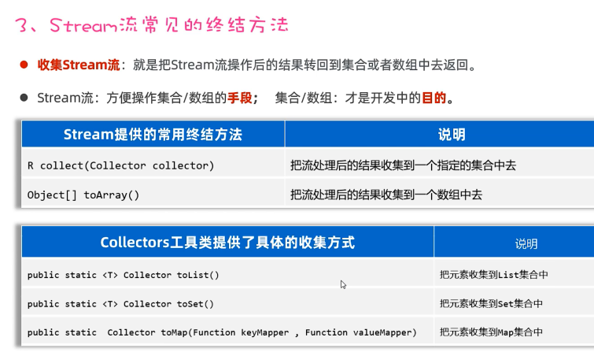  
```java
package com.itheima.stream;

import java.util.*;
import java.util.stream.Collectors;
import java.util.stream.Stream;

public class StreamTest4 {
    public static void main(String[] args) {
        List<Student> students = new ArrayList<>();
        Student s1 = new Student("蜘蛛精",26,172.5);
        Student s2 = new Student("蜘蛛精",26,172.5);
        Student s3 = new Student("紫霞",23,167.6);
        Student s4 = new Student("白晶晶",25,169.0);
        Student s5 = new Student("牛魔王",35,183.3);
        Student s6 = new Student("牛夫人",34,168.5);
        Collections.addAll(students,s1,s2,s3,s4,s5,s6);

        // 1.身高超过168的有几人
        long size = students.stream().filter(s -> s.getHeight() > 168 ).count();
        System.out.println(size);// 5

        // 2.找出身高最高的学生对象，并输出
        Student z = students.stream().max((o1,o2) -> Double.compare(o1.getHeight(),o2.getHeight())).get();
        System.out.println(z);// Student{name='牛魔王', age=35, height=183.3}

        // 3.找出身高最矮的学生对象，并输出
        Student x = students.stream().min((o1,o2) -> Double.compare(o1.getHeight(),o2.getHeight())).get();
        System.out.println(x);// Student{name='紫霞', age=23, height=167.6}

        // 4.找出身高超过170的学生对象，并放到一个新集合中去返回
        // 流只能收集一次
        List<Student> students1 = students.stream().filter(y -> y.getHeight() > 170).collect(Collectors.toList());
        System.out.println(students1);

        Set<Student> students2 = students.stream().filter(y -> y.getHeight() > 170).collect(Collectors.toSet());
        System.out.println(students2);

        // 5.找出身高超过170的学生对象，并把学生对象的名字和身高，存入到一个Map集合返回
        Map<String,Double>  map =
                students.stream().filter(y -> y.getHeight() > 170)
                        .distinct()
                        .collect(Collectors.toMap(y -> y.getName(), y -> y.getHeight()));
        System.out.println(map);

        // 数组
        // Object[] arr = students.stream().filter(y -> y.getHeight() > 170).toArray();
        Student[] arr = students.stream().filter(y -> y.getHeight() > 170).toArray(len -> new Student[len]);
        System.out.println(Arrays.toString(arr));
    }
}

```


  
 
