## Java高级        

###  单元测试    
1.  概述  
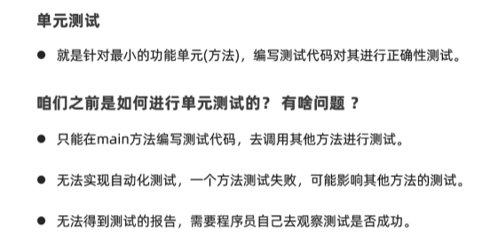  
2.  Junit框架快速入门  
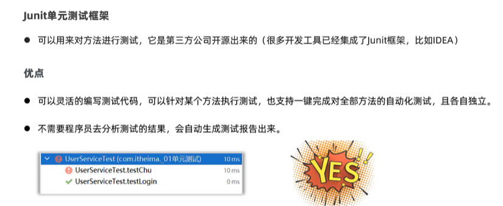  
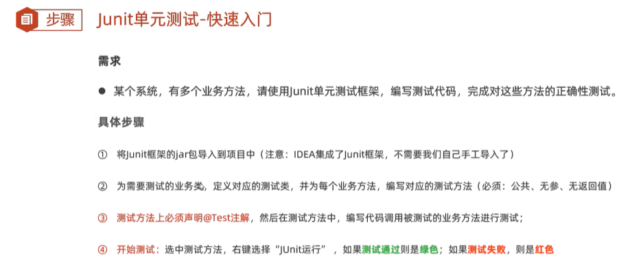  
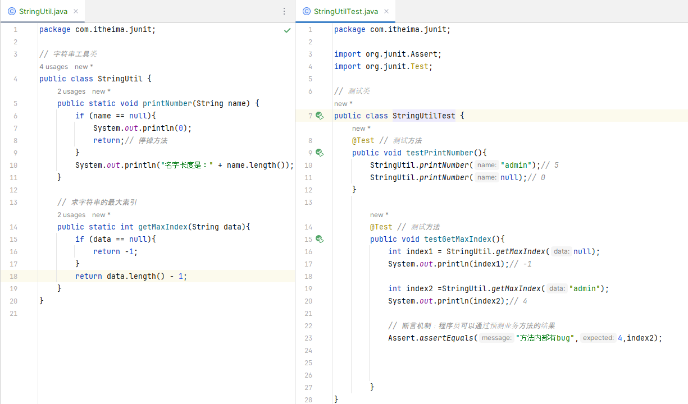  
3.  Junit框架的常见注解  
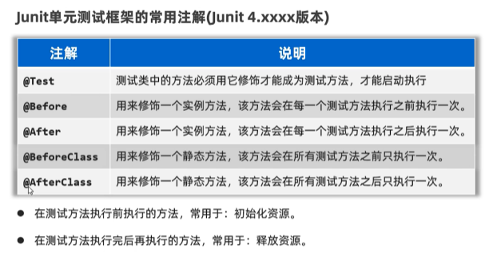  
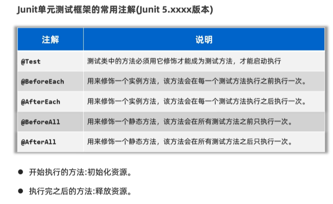  
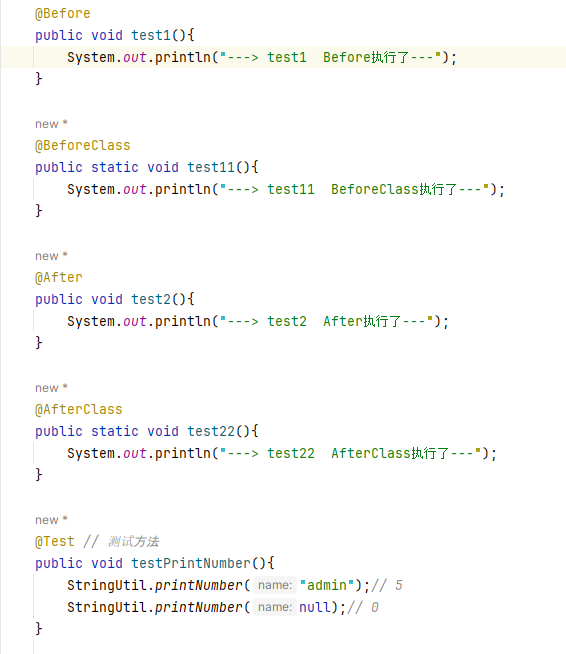  

###  反射   
1.  认识反射  
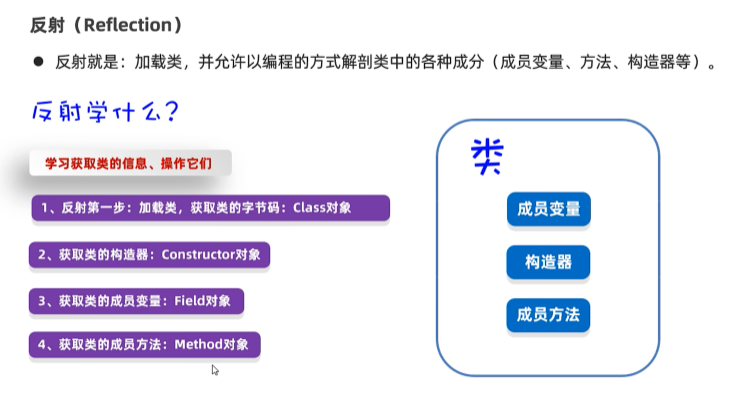  
2.  获取类  
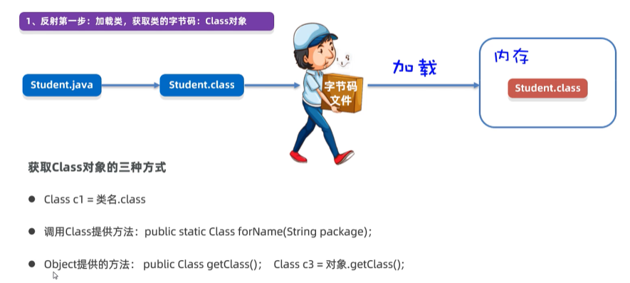  
```java
package com.itheima.reflect;
// TODO 获取class对象
public class Test1Class {
    public static void main(String[] args) throws Exception {
        Class c1 = Student.class;
        System.out.println(c1.getName());// 全类名 com.itheima.reflect.Student
        System.out.println(c1.getSimpleName());// 简名 Student

        Class c2 = Class.forName("com.itheima.reflect.Student");
        System.out.println(c1 == c2);// true

        Student s = new Student();
        Class c3 = s.getClass();
        System.out.println(c3 == c2);// true
    }
}

```  
3.  获取类的构造器  
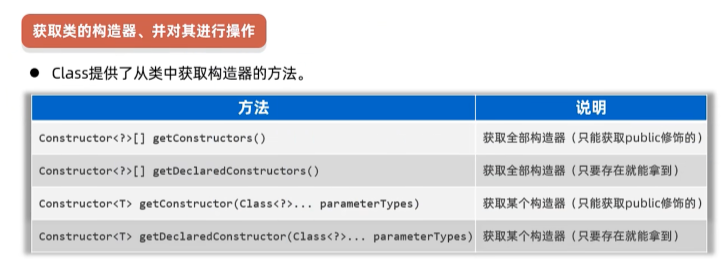  
```java
package com.itheima.reflect;

// TODO 获取类的构造器，并对其进行操作

import org.junit.Test;

import java.lang.reflect.Constructor;

public class Test2Constructor {
    @Test
    public void testGetConstructors(){
       // 1.反射第一步：必须先得到这个类的class对象
       Class c = Cat.class;
       // 2.获取类的全部构造器
      // Constructor[] constructors =c.getConstructors();
      Constructor[] constructors =c.getDeclaredConstructors();// 推荐
      // 3.遍历数组中的每个构造器对象
        for (Constructor constructor : constructors) {
            System.out.println(constructor.getName() + "--->"
            + constructor.getParameterCount());
        }
    }
    @Test
    public void testGetConstructor() throws Exception {
        // 1.反射第一步：必须先得到这个类的class对象
        Class c = Cat.class;
        // 2.获取某个构造器-无参构造器
        // Constructor constructor = c.getConstructor();
        Constructor constructor = c.getDeclaredConstructor();// 推荐
        System.out.println(constructor.getName() + "--->"
                + constructor.getParameterCount());

        // 3.获取有参构造器
        Constructor constructor2 = c.getDeclaredConstructor(String.class,int.class);
        System.out.println(constructor2.getName() + "--->"
                + constructor2.getParameterCount());
    }
}
```
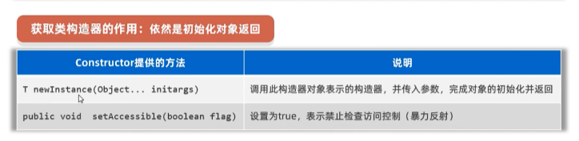  
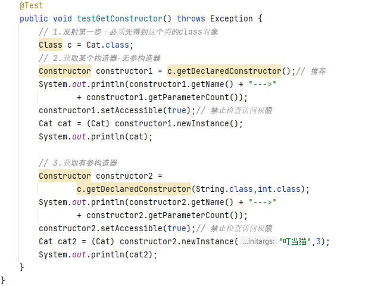  
4.  获取类的成员变量  
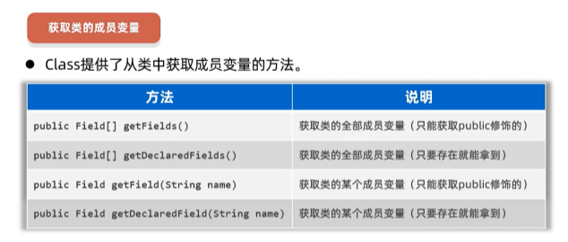  
```java
package com.itheima.reflect;

import org.junit.Test;

import java.lang.reflect.Field;

// TODO 获取类的成员变量，并对其进行操作
public class Test3Field {
    @Test
    public void testGetFields() throws Exception {
      // 1.反射第一步：必须是先得到类的class对象
        Class c = Cat.class;
        // 2.获取类的全部成员变量
        Field[] fields =c.getDeclaredFields();
        // 3.遍历这个成员变量数组
        for (Field field : fields) {
            System.out.println(field.getName() +"-->" + field.getType());
        }
        // 4.定位某个成员变量
        Field fName = c.getDeclaredField("name");
        System.out.println(fName.getName() + "-->" + fName.getType());

        Field fAge = c.getDeclaredField("age");
        System.out.println(fAge.getName() + "-->" + fAge.getType());
    }
}

```
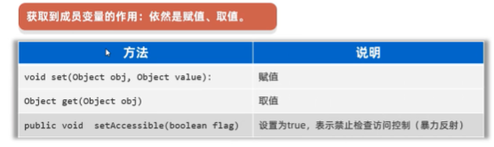  
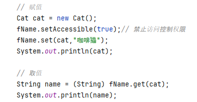  
5.  获取类的成员方法  
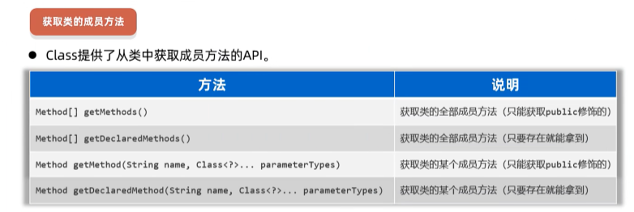  
```java
package com.itheima.reflect;
// TODO 获取类的成员方法并对其进行操作

import org.junit.Test;

import java.lang.reflect.Method;

public class Test3Method {
    @Test
    public void testGetMethods() throws Exception {
       // 1.反射第一步：先得到class对象
        Class c = Cat.class;
        // 2.获取类的全部成员方法
        Method[] methods =  c.getDeclaredMethods();
        // 3.遍历这个数组中的每个方法对象
        for (Method method : methods) {
            System.out.println(method.getName() + "--->"
                    + method.getParameterCount() + "--->"
                    +method.getReturnType());
        }
        // 4.获取某个方法对象
        Method run = c.getDeclaredMethod("run");// 拿run方法 无参的
        System.out.println(run.getName() + "--->"
                + run.getParameterCount() + "--->"
                +run.getReturnType());

        Method eat =c.getDeclaredMethod("eat",String.class);
        System.out.println(eat.getName() + "--->"
                + eat.getParameterCount() + "--->"
                +eat.getReturnType());
    }
}

```
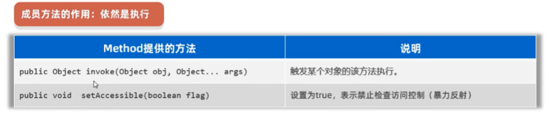  
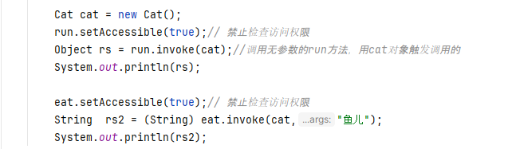  
6.  作用，应用场景
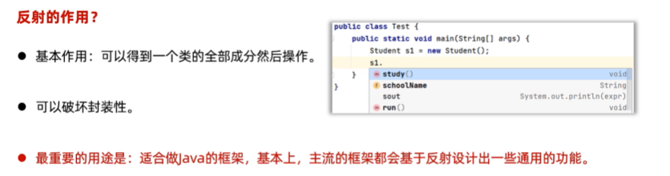  
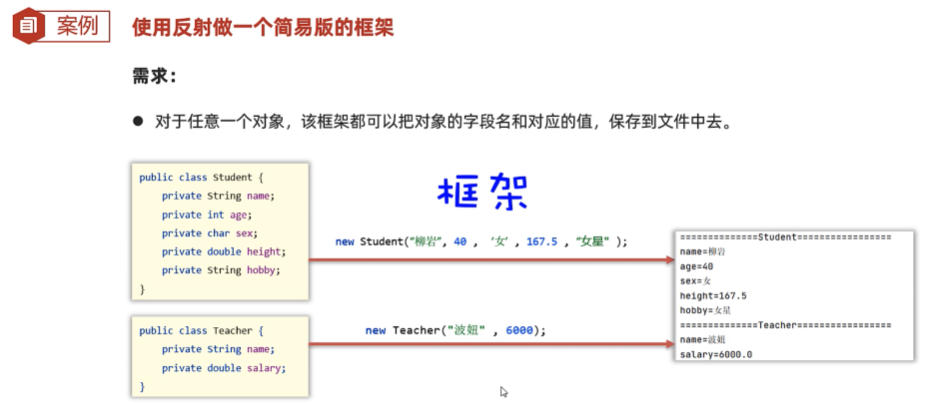  
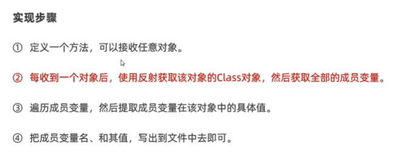  
  

###  注解    
1.  概述 自定义注解  
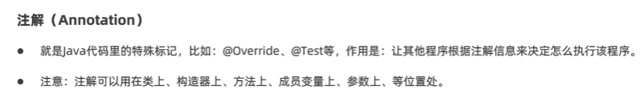  
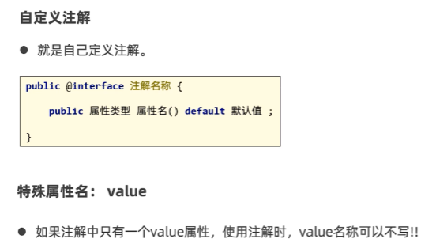  
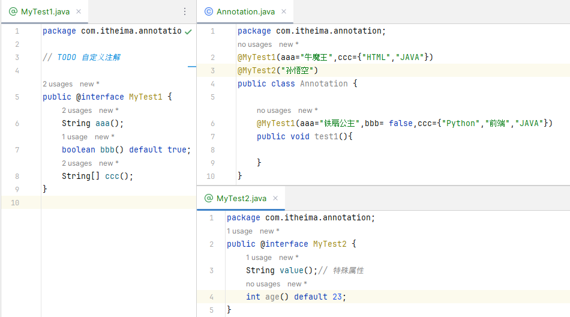  
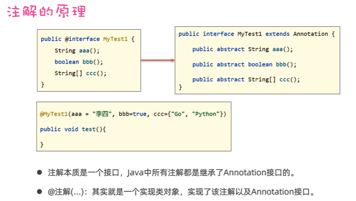  
2.  元注解  
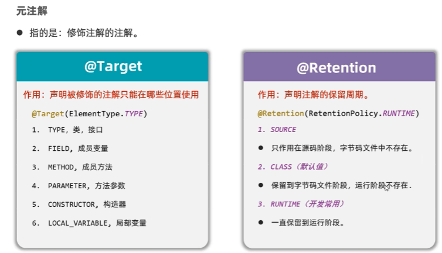  
  
3.  注解的解析  
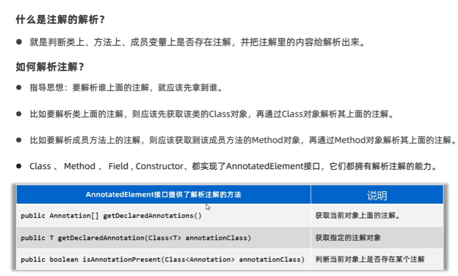  
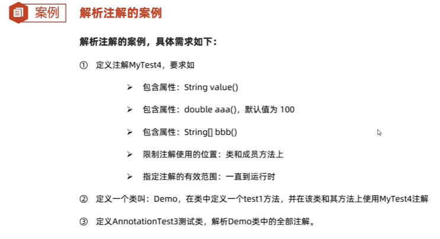  
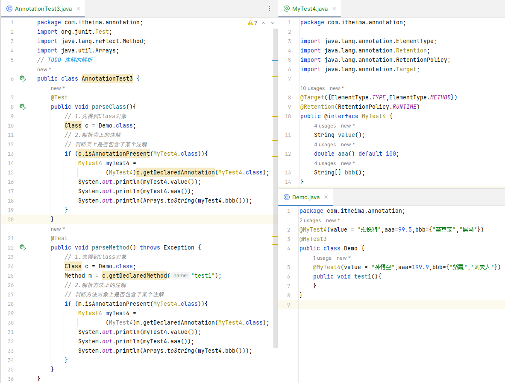  
4.  应用场景  
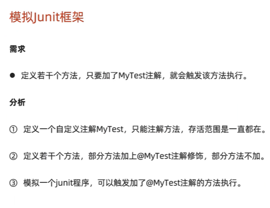  
```java
package com.itheima.annotation;

import java.lang.reflect.InvocationTargetException;
import java.lang.reflect.Method;

// TODO 模拟Junit框架的设计
public class AnnotationTest4 {
    public void test1(){
        System.out.println("---test1---");
    }

    @MyTest
    public void test2(){
        System.out.println("---test2---");
    }

    public void test3(){
        System.out.println("---test3---");
    }

    @MyTest
    public void test4(){
        System.out.println("---test4---");
    }

    public static void main(String[] args) throws Exception {
        AnnotationTest4 a = new AnnotationTest4();
        // 启动程序
        // 1.得到class对象
        Class c = AnnotationTest4.class;
        // 2.提取这个类中的全部成员方法
        Method[] methods =  c.getDeclaredMethods();
        // 3.遍历这个数组中的每个方法，看是否存在注解，存在触发该方法执行
        for (Method method : methods) {
            if (method.isAnnotationPresent(MyTest.class)){
                // 说明当前方法上是存在MyTest注解，触发当前方法执行
                method.invoke(a);
            }
        }
    }
}

```
```java
package com.itheima.annotation;

import java.lang.annotation.ElementType;
import java.lang.annotation.Retention;
import java.lang.annotation.RetentionPolicy;
import java.lang.annotation.Target;

@Target(ElementType.METHOD) // 只能注解方法
@Retention(RetentionPolicy.RUNTIME) // 让当前注解可以一直存活着
public @interface MyTest {

}

```
###  动态代理    
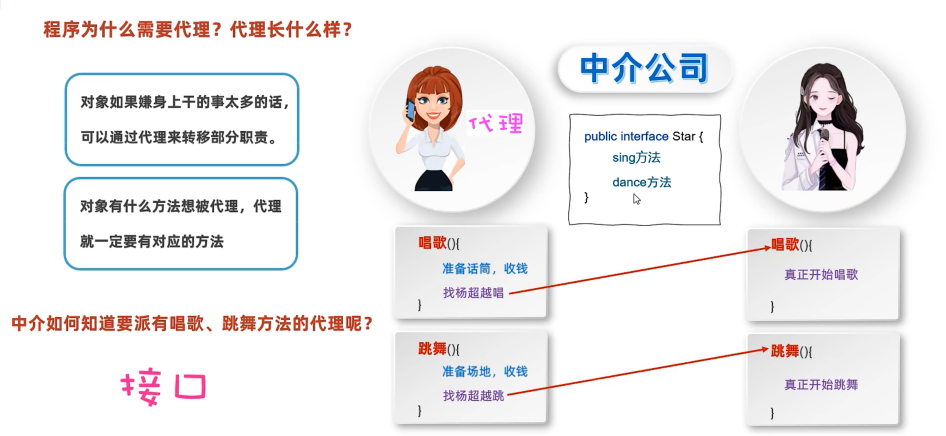  
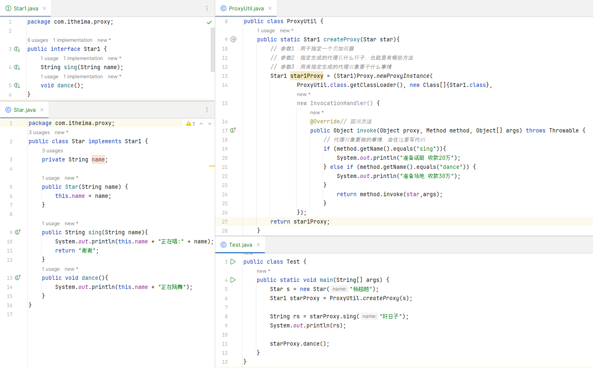  
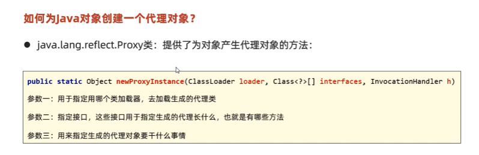  
