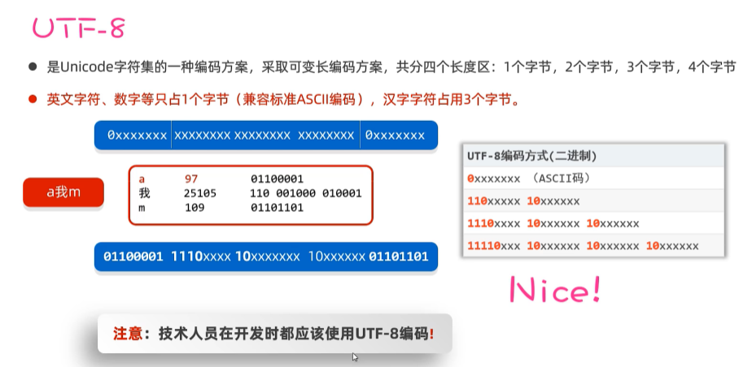

## IO流        

###  File  
1.  创建对象  
  
  
  
```java
package com.itheima.file;

// TODO   File创建对象，代表具体文件的方案

import java.io.File;

public class FileTest1 {
    public static void main(String[] args) {
        // 1.创建一个File对象，指代某个具体的文件
        File f1 = new File("C:\\Users\\liang\\OneDrive\\デスクトップ\\新建 文本文档.txt");
        System.out.println(f1.length());// 文件大小  540

        File f2 = new File("C:\\Users\\liang\\OneDrive\\デスクトップ\\test");
        System.out.println(f2.length());

        // File对象，可以指代一个不存在的文件路径
        File f3 = new File("C:\\Users\\liang\\OneDrive\\デスクトップ\\aaa");
        System.out.println(f3.length());
        System.out.println(f3.exists());// false

        // 要定位的文件是在模块中，如何定位
        // 绝对路径 带盘符的
        // File f4 = new File("C:\\java-learning\\java-note\\file-io-app\\src\\itheima.txt");
        // 相对路径 不带盘符 默认直接去工程下寻找文件
        File f4 = new File("file-io-app\\src\\itheima.txt");
        System.out.println(f4.length());// 3
    }
}

```
  
2.  方法1：判断文件类型，获取文件信息  
  
```java
package com.itheima.file;
// TODO   File提供的判断文件类型，获取信息文件功能
import java.io.File;
public class FileTest2 {
    public static void main(String[] args) throws Exception {
        // 1.创建文件对象，指代某个文件
        File f1 = new File("C:\\Users\\liang\\OneDrive\\デスクトップ\\新建 文本文档.txt");

        // 2.判断当前文件对象，对应的文件路径是否存在，存在返回true
        System.out.println(f1.exists());// true

        // 3.判断当前文件对象指代的是否是文件，是文件返回true,反之
        System.out.println(f1.isFile()); // true

        // 4.判断当前文件对象指代的是否是文件夹，是文件夹返回true,反之
        System.out.println(f1.isDirectory());// false

        // 5.获取文件的名称 包含后缀
        System.out.println(f1.getName());// 新建 文本文档.txt

        // 6.获取文件的大小，返回字节个数
        System.out.println(f1.length());// 540

        // 7.获取文件的最后修改时间
        System.out.println(f1.lastModified());// 1722664222184

        // 8.获取创建文件对象时，使用的路径
        File f2 = new File("file-io-app\\src\\itheima.txt");
        System.out.println(f2.getPath());// file-io-app\src\itheima.txt

        // 9.获取绝对路径
        File f3 = new File("file-io-app\\src\\itheima.txt");
        System.out.println(f3.getAbsolutePath());// C:\java-learning\java-note\file-io-app\src\itheima.txt

    }
}

```  
3.  方法2：创建文件，删除文件  
  
```java
package com.itheima.file;
// TODO   File创建和删除文件相关的方法

import java.io.File;

public class FileTest3 {
    public static void main(String[] args) throws Exception {
        // 1.创建一个新文件（文件内容为空），创建成功返回true,反之
        File f1 = new File("C:/resource/itheima2.txt");
        System.out.println(f1.createNewFile());

        // 2.用于创建文件夹，注意，只能创建一级文件夹
        File f2 = new File("C:/resource/aaa");
        System.out.println(f2.mkdir());

        // 3.用于创建文件夹，注意，可以创建多级文件夹
        File f3 = new File("C:/resource/bbb/ccc/ddd");
        System.out.println(f3.mkdirs());

        // 4.删除文件或者空文件，注意，不能删除非空文件
        System.out.println(f1.delete());
        System.out.println(f2.delete());
    }
}

```
4.  方法3：遍历文件夹  
  
```java
package com.itheima.file;
// TODO   File提供的遍历文件夹的方法
import java.io.File;

public class FileTest4 {
    public static void main(String[] args) throws Exception {
        // 1.获取当前目录下所有的“一级文件名称”到一个字符串数组中去返回
        File f1 = new File("C:\\code");
        String[] names = f1.list();
        for (String name : names) {
            System.out.println(name);
            // javasepro
            //得奖的是
            //汪苏泷
            //雨天
        }

        // 2.重点：获取当前目录下所有的“一级文件对象”到一个文件对象数组中去返回
        File[] files = f1.listFiles();
        for (File file : files) {
            System.out.println(file.getAbsolutePath());
            // C:\code\javasepro
            //C:\code\得奖的是
            //C:\code\汪苏泷
            //C:\code\雨天
        }
    }
}

```
###  方法递归  
1.  递归的形式  
  
  
```java
package com.itheima.recursion;

// TODO 递归的形式
public class RecursionTest1 {
    public static void main(String[] args) {
        test1();
    }

    // 直接方法递归
    public static void test1(){
        System.out.println("-----test1------");
        test1();// 直接方法递归
    }

    // 间接方法递归
    public static void test2(){
        System.out.println("-----test2------");
        test3();
    }

    public static void test3(){
        System.out.println("-----test3------");
        test2();// 间接递归
    }
}

```
2.  应用，执行流程，算法思想  
  
   
  
3.  文件搜索  
  
```java
package com.itheima.recursion;

import java.io.File;

// TODO 文件搜索的实现
public class RecursionTest2 {
    public static void main(String[] args) {
        searchFile(new File("C:/"),"LINE.lnk");
    }
    // 去目录下搜索某个文件 dir 目录     fileName 要搜索的文件名称
    public static void searchFile(File dir,String fileName){
        // 1.把非法的情况都拦截住
        if (dir == null || !dir.exists() || dir.isFile()){
            return;// 代表无法搜索
        }

        // 2.dir不是null ,存在，一定是目录对象
        // 获取当前目录下的全部一级文件对象
        File[] files = dir.listFiles();

        // 3.判断当前目录下是否存在一级文件对象，以及是否可以拿到一级文件对象
        if (files != null && files.length > 0){
            // 4.遍历全部一级文件对象
            for (File f : files) {
                // 5.判断文件是否是文件，还是文件夹
                if (f.isFile()){
                    // 是文件 判断文件名是否是我们要找的
                    if (f.getName().contains(fileName)){
                        System.out.println("找到了:" + f.getAbsolutePath());
                    }
                }else {
                    // 是文件夹 继续重复这个过程（递归）
                    searchFile(f,fileName);
                }
            }
        }
    }
}

```
```java
package com.itheima.demo;

import java.io.File;

public class Test1 {
    public static void main(String[] args) {
        // TODO 删除非空文件夹，独立功能独立成方法
        File dir = new File("\u202AC:\\Users\\liang\\OneDrive\\デスクトップ\\test");
        deleteDir(dir);
    }
    public static void deleteDir(File dir){
       if (dir == null || !dir.exists()){
          return;
       }

       if (dir.isFile()){
           dir.delete();
           return;
       }

       // 1. dir存在且是文件夹 拿里面的一级文件对象
        File[] files = dir.listFiles();
       if (files == null){
           return;
       }

       // 2.这是一个有内容的文件夹 删除里面的内容再删除文件夹
        for (File file : files) {
            if (file.isFile()){
                file.delete();
            }else {
                deleteDir(file);
            }
        }
        dir.delete();
    }
}

```
###  字符集  
1.  常见字符集  
  
  
  
  
  
2.  字符集的编码，解码  
  
  
```java
package com.itheima.charset;

import java.io.UnsupportedEncodingException;
import java.util.Arrays;

// TODO 使用java代码完成对字符的编码和解码
public class Test {
    public static void main(String[] args) throws Exception {
        // 1.编码
        String data = "a我b";
        byte[] bytes = data.getBytes();// 默认是按照平台字符集进行编码的  UTF-8
        System.out.println(Arrays.toString(bytes));

        // 按照指定字符集进行编码
        byte[] bytes1 = data.getBytes("GBK");
        System.out.println(Arrays.toString(bytes1));

        // 解码
        String s1 = new String(bytes);// 按照平台默认编码UTF-8解码
        System.out.println(s1);

        String s2 = new String(bytes1,"GBK");
        System.out.println(s2);
    }
}

```
###  IO流  
  
  
  
1.  IO流-字节流  
  
①文件字节输入流：每次读取一个字节  
  
```java
package com.itheima.byte_stream;
// TODO 文件字节输入流：每次读取一个字节

import java.io.File;
import java.io.FileInputStream;
import java.io.FileNotFoundException;
import java.io.InputStream;

public class FileInputStreamTest1 {
    public static void main(String[] args) throws Exception {
        // 1.创建文件字节输入流管道，与源文件接通
        InputStream is = new FileInputStream(("file-io-app\\src\\itheima01.txt"));

        // 2.开始读取文件的字节数据
        // 每次读取一个字节返回，如果没有数据了，返回-1
        // int b1 = is.read();
        // System.out.println((char)b1); // a

        // int b2 = is.read();
        // System.out.println((char)b2); // b

        // 3.使用循环改造上述代码
        int b;// 用于记住读取的字节
        while ((b = is.read())!= -1){
            System.out.print((char) b);
        }

        // 读取数据的性能很差
        // 读取汉字输出会乱码 无法避免
        // 流使用完毕之后必须关闭，要释放系统资源
        is.close();
    }
}

```  
②文件字节输入流：每次读取多个字节  
  
```java
package com.itheima.byte_stream;
// TODO 文件字节输入流：每次读取多个字节

import java.io.FileInputStream;
import java.io.InputStream;

public class FileInputStreamTest2 {
    public static void main(String[] args) throws Exception {
        // 1.创建文件字节输入流管道，与源文件接通
        InputStream is = new FileInputStream(("file-io-app\\src\\itheima02.txt"));

        // 2.开始读取文件中的字节数据，每次读取多个字节
        // 每次读取多个字节到字节数组中去，返回读取的字节数量，读取完毕会返回-1
        /* byte[] buffer = new byte[3];
        int len = is.read(buffer);
        String rs = new String(buffer);
        System.out.println(rs);// abc
        System.out.println(len);// 当次读取的字节数量  3

        int len2 = is.read(buffer);
        String rs2 = new String(buffer,0,len2);
        System.out.println(rs2);// 66
        System.out.println(len2);// 当次读取的字节数量  2

        int len3 = is.read(buffer);
        System.out.println(len3);// -1 */

        // 3.使用循环改造
        byte[] buffer = new byte[3];
        int len;// 记住每次读取了多少个字节
        while ((len = is.read(buffer)) != -1){
            // 注意：读取多少 倒出多少
            String rs = new String(buffer,0,len);
            System.out.print(rs);// abc66
        }

        // 性能得到了明显的提升
        // 这种方案也不能避免读取汉字输出乱码的问题

        is.close();// 关闭流
    }
}

```
③文件字节输入流：一次读取完全部字节  
  
  
```java
package com.itheima.byte_stream;
// TODO 文件字节输入流：一次性读取完文件的全部字节

import java.io.File;
import java.io.FileInputStream;
import java.io.InputStream;

public class FileInputStreamTest3 {
    public static void main(String[] args) throws Exception {
        // 1.一次性读取完文件的全部字节到一个字节数组中去
        // 创建文件字节输入流管道，与源文件接通
        InputStream is = new FileInputStream(("file-io-app\\src\\itheima03.txt"));

        // 2.准备一个字节数组，大小与文件的大小正好一样大
        /*  File f = new File("file-io-app\\src\\itheima03.txt");
        long size = f.length();
        byte[] buffer = new byte[(int)size];

        int len = is.read(buffer);
        System.out.println(new String(buffer));

        System.out.println(size);// 121
        System.out.println(len);// 121  */

        byte[] buffer = is.readAllBytes();
        System.out.println(new String(buffer));
    }
}

```  
④文件字节输出流：写字节出去  
  
```java
package com.itheima.byte_stream;
// TODO 文件字节输出流的使用

import java.io.FileInputStream;
import java.io.FileOutputStream;
import java.io.InputStream;
import java.io.OutputStream;

public class FileInputStreamTest4 {
    public static void main(String[] args) throws Exception {
        // 1.创建文件字节输入流管道，与源文件接通
        // 覆盖管道，覆盖之前的数据
        /* OutputStream os =
                new FileOutputStream(("file-io-app\\src\\itheima04out.txt"));*/
        // 追加数据的管道
        OutputStream os =
                new FileOutputStream("file-io-app\\src\\itheima04out.txt",true);
        // 2.开始写字节数据出去了
       os.write(97);// 97就是一个字节 代表a
       os.write('b');// 'b'也是一个字节

        byte[] bytes = "我爱你中国abc".getBytes();
        os.write(bytes);

        os.write(bytes,0,15);

        // 换行符
       os.write("\r\n".getBytes());

        os.close();// 关闭流
    }
}

```  
2.  文件复制  
  
  
```java
package com.itheima.byte_stream;

// TODO 使用字节流完成对文件的复制操作

import java.io.*;

public class CopyTest5 {
    public static void main(String[] args) throws Exception {
        // 需求：复制照片
        // 1.创建文件字节输入流管道，与源文件接通
        InputStream is = new FileInputStream(("C:\\Users\\liang\\OneDrive\\デスクトップ\\test\\1.jpg"));
        // 2.创建一个字节输出流管道与目标文件接通
        OutputStream os = new FileOutputStream("C:\\汪苏泷\\1.jpg");
        // 3.创建一个字节数组，负责转移字节数据
        byte[] buffer = new byte[1024];// 1kb
        // 4.从字节输入流中读取字节数据，写出去到字节输出流中，读多少写出去多少
        int len;// 记住每次读取了多少个字节
        while ((len = is.read(buffer))!= -1){
            os.write(buffer,0,len);
        }
        os.close();
        is.close();
        System.out.println("复制完成");
    }
}

```  
3.  释放资源的方式
①try-catch-finally
  
  
```java
package com.itheima.resource;

// TODO 认识 try-catch-finally
public class Test1 {
    public static void main(String[] args) {
        try{
            System.out.println(10/5);
        }catch (Exception e){
            e.printStackTrace();
        }finally {
            System.out.println("-----finally执行了一次-------");
        }

        System.out.println(chu(10,2));
    }

    public static int chu(int a,int b){
        try {
            return a/b;
        }catch (Exception e){
            e.printStackTrace();
            return -1;// 代表出现异常
        }finally {
            // 千万不要在finally中返回数据
        }
    }
}

```
②try-with-resource  
  
  


