# 数组  
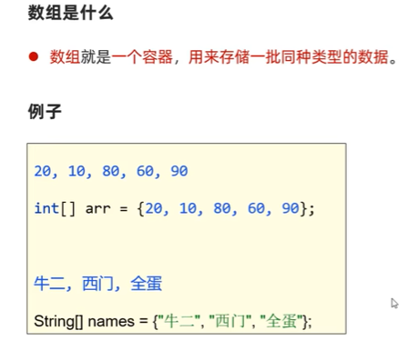  
  
## 静态初始化数组  
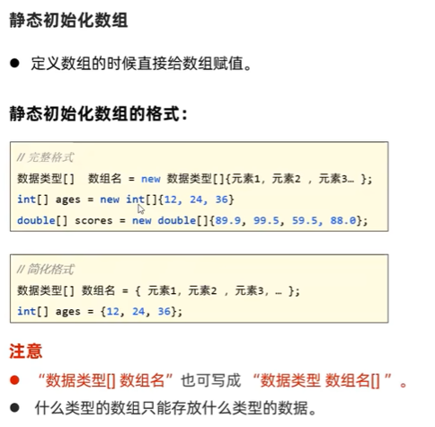  
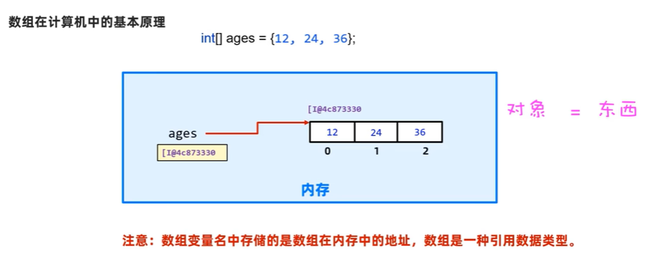  
```java
package com.itheima.define;

public class ArrayDemo1 {
    public static void main(String[] args) {
        // TODO 静态初始化数组
        // 1.数据类型[] 数组名 = new 数据类型[]{元素1,元素2,...}
        int[] ages = new int[]{12,24,36};
        double[] scores = new double[]{89.9,99.5,59.5,88};

        // 2.简化写法 数据类型[] 数组名 = {元素1,元素2,...}
        int[] ages1 = {12,24,36};
        double[] scores1 = {89.9,99.5,59.5,88};

        // 3.数据类型[] 数组名 也可以写成    数据类型 数组名[]
        int ages2[]  = {12,24,36};
        double scores2[]  = {89.9,99.5,59.5,88};
    }
}


```
### 数组的访问  
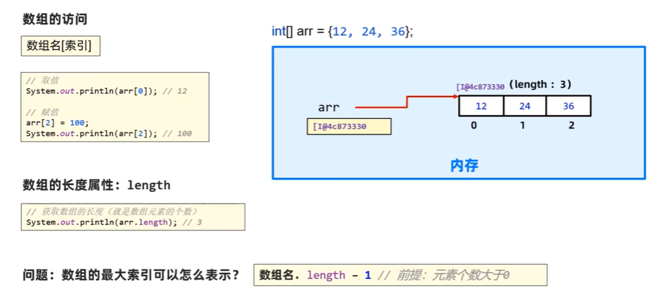  
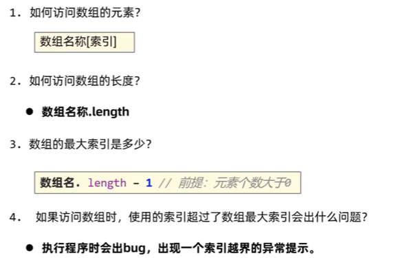  
```java
package com.itheima.define;

public class ArrayDemo2 {
    public static void main(String[] args) {
        // TODO 掌握数组的访问
        int[] arr = {12,24,36};
                   // 0  1  2
        // 1.访问数组的全部数据
        System.out.println(arr[0]);
        System.out.println(arr[1]);
        System.out.println(arr[2]);

        // 2.修改数组中的数据
        arr[0] = 66;
        arr[2] = 100;
        System.out.println(arr[0]);
        System.out.println(arr[2]);

        // 3.访问数组的元素个数  数组名.length
        System.out.println(arr.length);

        //技巧：获取数据的最大索引  arr.length - 1 (前提是数组中存在数据)
        System.out.println(arr.length - 1);
    }
}


```
### 数组的遍历  
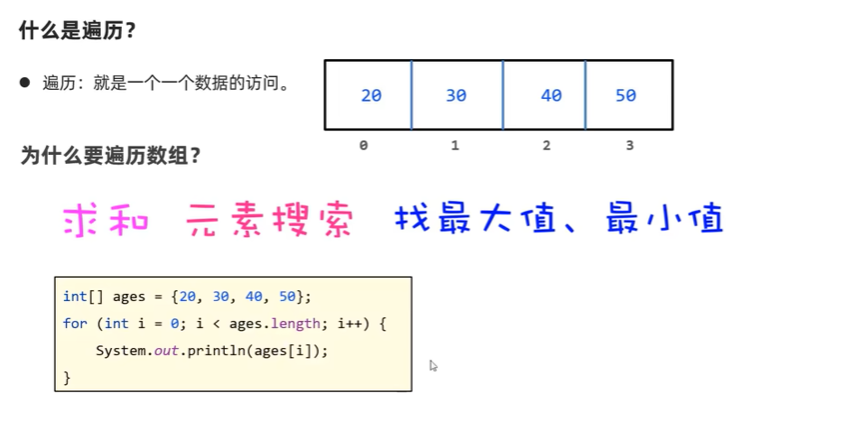  
  
```java
package com.itheima.define;

public class ArrayDemo3 {
    public static void main(String[] args) {
        // TODO 掌握数组的遍历
        int[] ages = {12,24,36};
        //            0   1  2

        //使用循环遍历   fori
        //快捷键 ages.length.fori 回车
        for (int i = 0; i < ages.length ; i++) {
            //  i = 0 1 2
            System.out.println(ages[i]);
        }
    }
}


```
### 案例训练  
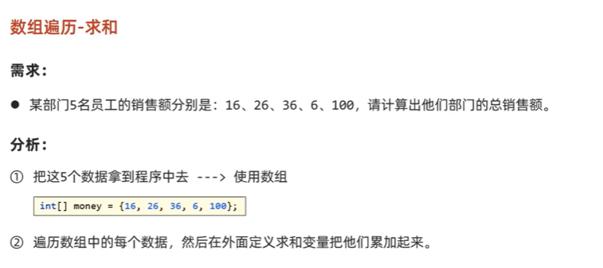  
```java
package com.itheima.define;

public class ArrayTest4 {
    public static void main(String[] args) {
        // TODO 对数组元素求和
        // 1.定义一个数组，存储五名员工的销售额
        int[] money = {16,26,36,6,100};
        //             0   1  2  3  4

        // 3.定义一个变量 用于累加求和
        int sum = 0;

        // 2.遍历这个数组中的每个数据
        for (int i = 0; i < money.length; i++) {
            // i = 0 1 2 3 4
            sum += money[i];
        }
        System.out.println(sum);
    }
}


```
## 动态初始化数组  
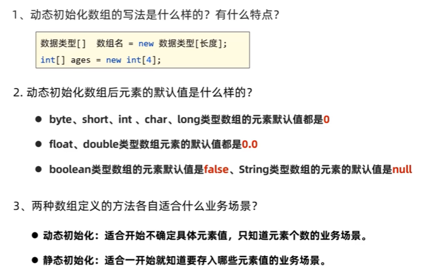  
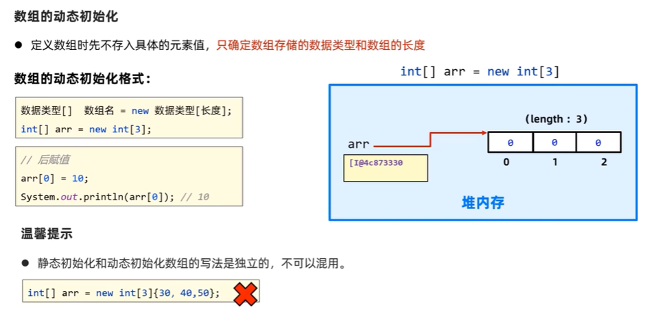  
```java
// TODO 动态初始化数组
        // 1.数据类型[] 数组名 = new 数据类型[长度]
        int[] ages = new int[3] ;//ages = [0,0,0]

        System.out.println(ages[0]);
        System.out.println(ages[1]);
        System.out.println(ages[2]);

        ages[0] = 12;
        ages[1] = 18;
        ages[2] = 32;

        System.out.println(ages[0]);
        System.out.println(ages[1]);
        System.out.println(ages[2]);
```
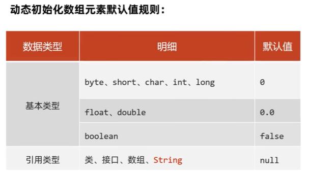  
```java
 char[] chars = new char[3]; // [0,0,0]
        System.out.println((int)chars[0]);
        System.out.println((int)chars[2]);

        double[] scores = new double[80];
        System.out.println(scores[0]);
        System.out.println(scores[79]);

        boolean[] flags = new boolean[100];
        System.out.println(flags[0]);
        System.out.println(flags[99]);

        String[] names = new String[80];
        System.out.println(names[0]);
        System.out.println(names[79]);
```
### 案例训练  
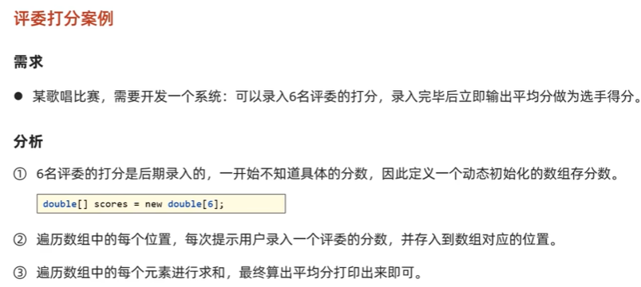  
```java
package com.itheima.define;

import java.util.Scanner;

public class ArrayTest6 {
    public static void main(String[] args) {
        // TODO 评委打分案例
        // 1.定义一个动态初始化的数组，负责后期存储6个评委的打分
        double[] scores = new double[6];

        Scanner sc = new Scanner(System.in);

        // 2.遍历数组中的每个位置，录入评委的分数，存入到数组中去
        for (int i = 0; i < scores.length; i++) {
            // i = 0 1 2 3 4 5
            System.out.println("请您输入当前第"+(i+1)+"个评委的分数:");
            double score = sc.nextDouble();
            scores[i] = score;
        }

        // 3.遍历数组中的每个元素进行求和
        double sum = 0;
        for (int i = 0; i < scores.length; i++) {
            sum += scores[i];
        }
        System.out.println(sum / scores.length);
    }
}


```
### 数组的执行原理    JAVA程序的执行原理
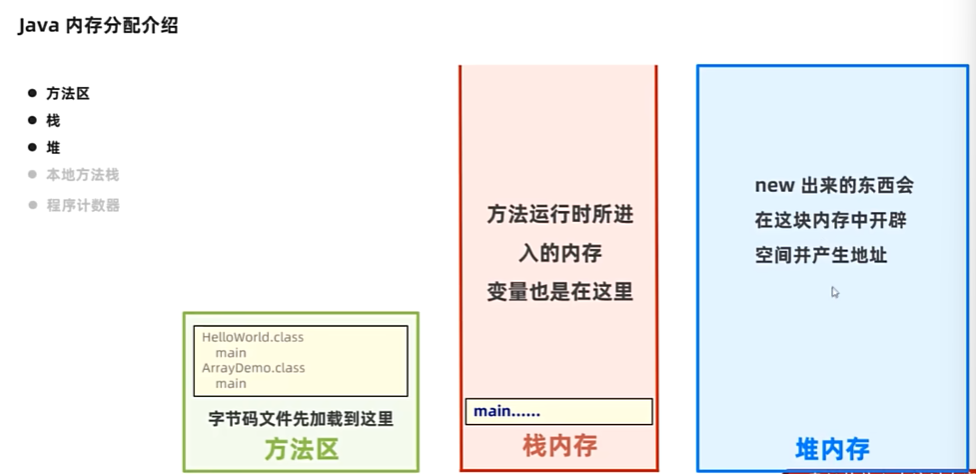  
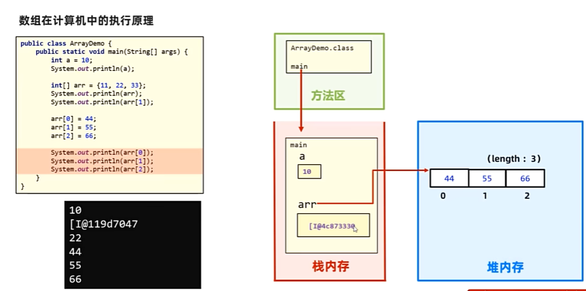  
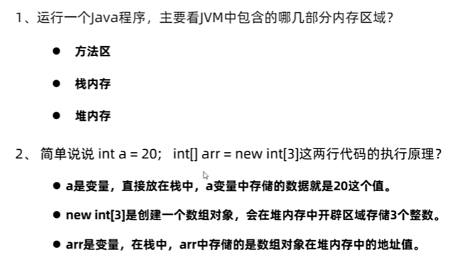  
```java
package com.itheima.memory;

public class ArrayDemo1 {
    public static void main(String[] args) {
        // TODO 普通变量，数组在计算机中的执行原理，JAVA程序在计算机中的执行过程
        int a = 20;
        System.out.println(a);

        int[] arr = new int[]{11,22,33};
        System.out.println(arr[1]);

        arr[0] = 44;
        arr[1] = 55;
        arr[2] = 66;

        System.out.println(arr[0]);
        System.out.println(arr[1]);
        System.out.println(arr[2]);
    }
}

```
### 多个变量指向同一个数组的问题  
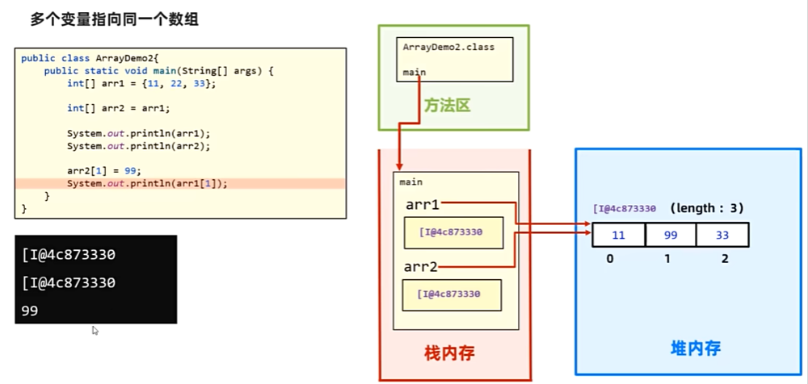  
```java
package com.itheima.memory;

public class ArrayDemo2 {
    public static void main(String[] args) {
        // TODO 认识多个变量指向同一个数组对象的方式，并掌握其注意事项
        int[] arr1 = {11,22,33};

        // 把int类型的数组变量arr1赋值给int类型的数组变量arr2
        int[] arr2 = arr1;
        System.out.println(arr1);
        System.out.println(arr2);

        arr2[1] = 99;
        System.out.println(arr2[1]);
    }
}

```
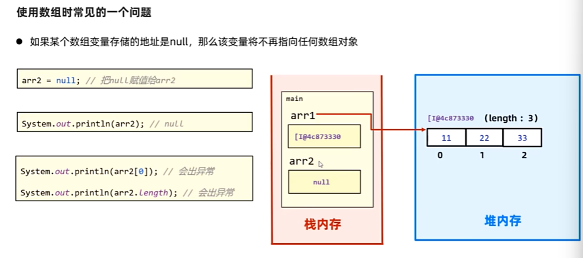  
```java
arr2 = null;// 拿到的数组变量中存储的值是null
        System.out.println(arr2);

        // System.out.println(arr2[0]);
        // System.out.println(arr2.length);
```
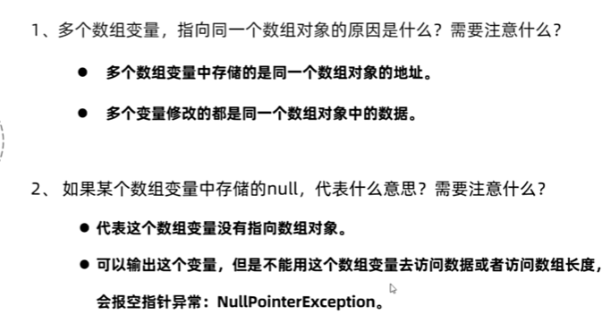  

### 案例   数组求最值   
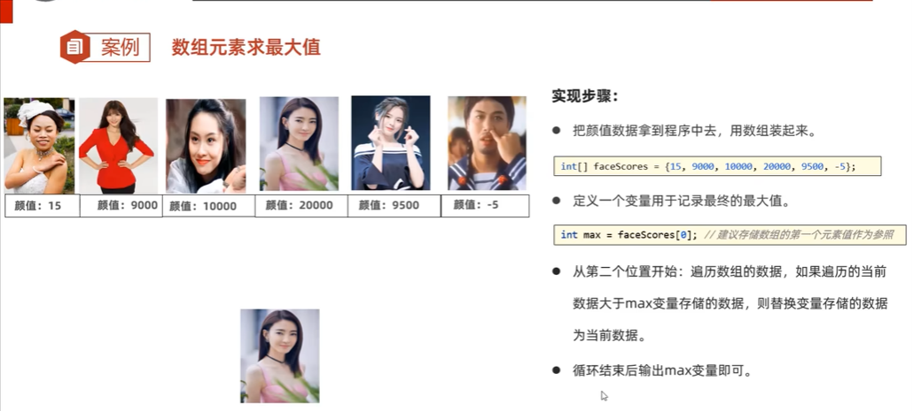  
```java
package com.itheima.demo;

public class Test1 {
    public static void main(String[] args) {
        // TODO 掌握数组元素求最值
        // 1.把颜值数据拿到程序中来，用数组装起来
        int[] faceScores = {15,9000,10000,20000,9500,-5};
        //                   0   1    2    3    4     5

        // 2.定义一个变量，用于最终记住最大值
        int max = faceScores[0];

        // 3.从数组的第二个位置开始遍历
        for (int i = 1; i <faceScores.length ; i++) {
            // i = 1 2 3 4 5
            /* 判断一下当前遍历的这个数据，是否大于最大值变量max存储的数据，如果大于
            当前遍历的数据需要赋值给max*/
            if (faceScores[i] > max){
                max = faceScores[i];
            }
        }
        System.out.println(max);
    }
}

```
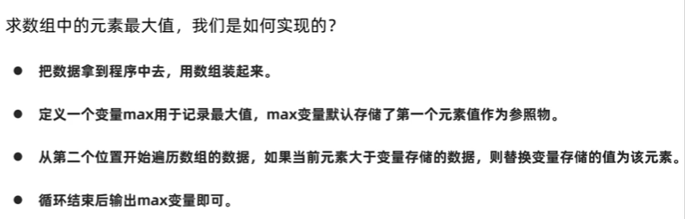  
### debug工具的使用  
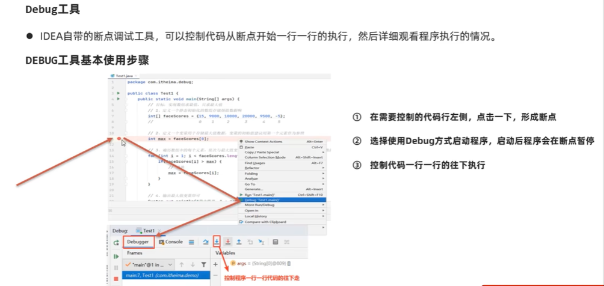  
