## 面向对象高级三  

###  内部类  
1.  内部类概述  
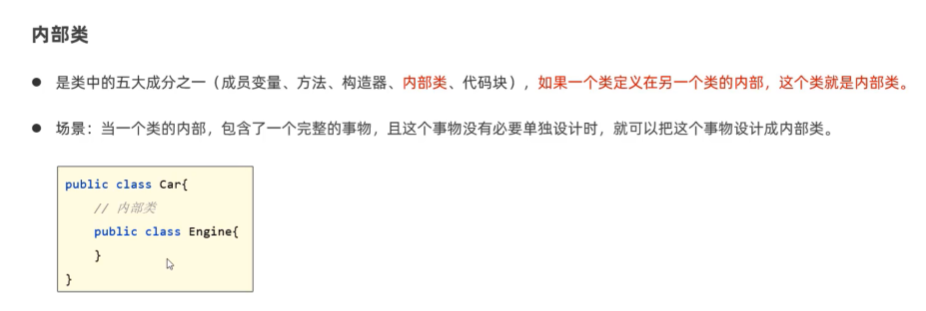  
① 成员内部类  
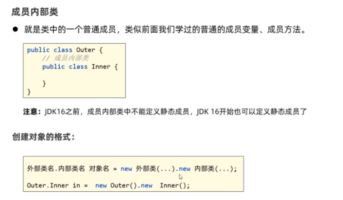  
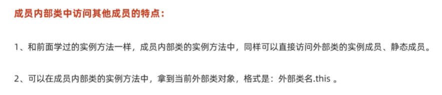  
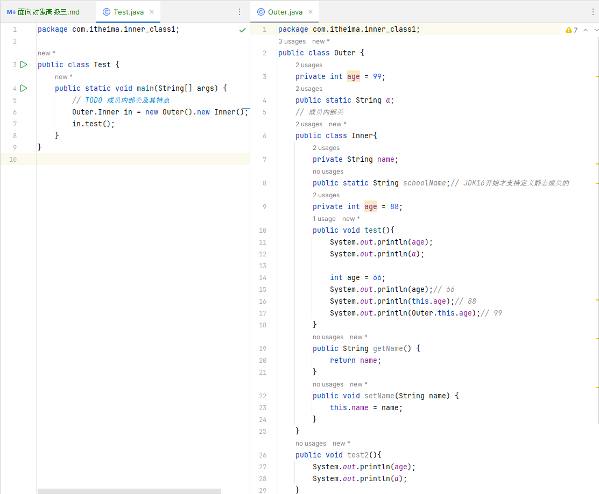  
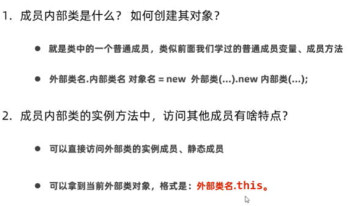   
② 静态内部类  
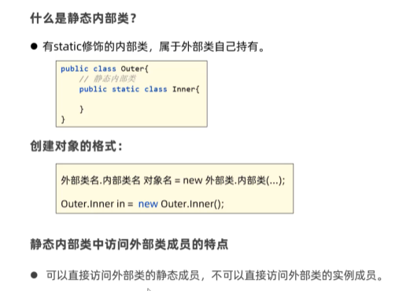  
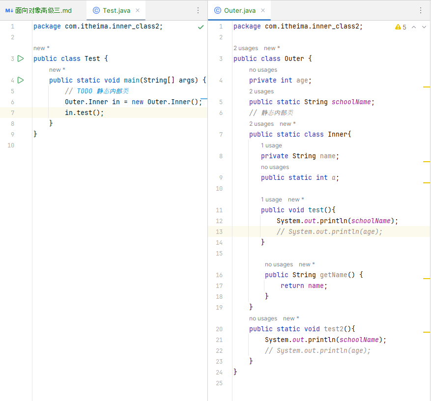  
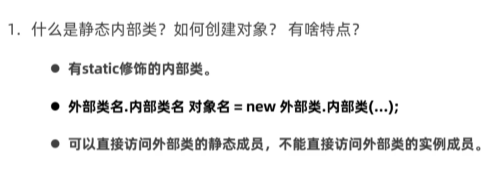  
③ 局部内部类  
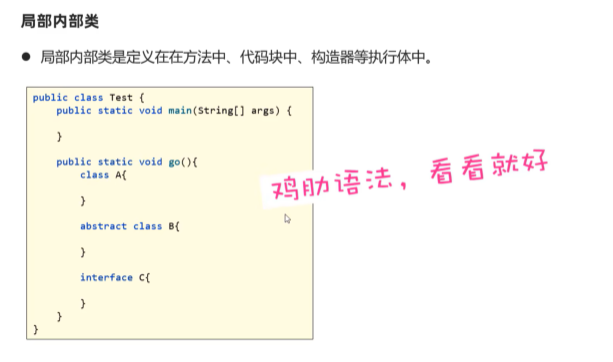  
④ 匿名内部类  
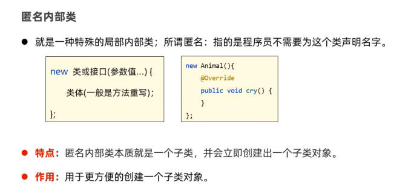  
```java
package com.itheima.inner_class3;

public class Test {
    public static void main(String[] args) {
        // TODO 匿名内部类及作用
//        Animal a =  new Cat();
//        a.cry();

        // 1.把这个匿名内部类编译为一个子类，然后会立即创建一个子类对象出来
        Animal a = new Animal(){

            @Override
            public void cry() {
                System.out.println("喵喵喵");
            }
        };
        a.cry();
    }
}

//class Cat extends Animal{
//    @Override
//    public void cry() {
//       System.out.println("喵喵喵");
//    }
//}

abstract class Animal{
    public abstract void cry();
}
```
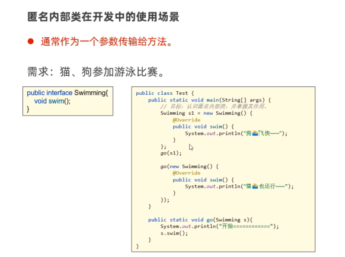  
```java
package com.itheima.inner_class3;

public class Test2 {
    public static void main(String[] args) {
        // TODO 匿名的常见使用场景
        //Swimming s1 = new Swimming(){
             // @Override
             // public void swim() {
                 // System.out.println("狗游泳");
             // }
          //};
        //go(s1);
        go(new Swimming() {
            @Override
            public void swim() {
                System.out.println("狗游泳");
            }
        });

    }
    // 设计一个方法：可以接收Swimming接口的一切实现类对象来参加有用比赛
    public static void go (Swimming s){
        System.out.println("--------------开始");
        s.swim();
    }
}


// 猫和狗都要参加游泳比赛
interface Swimming{
    void swim();
}
```
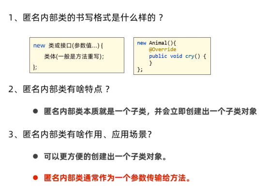  
```java
package com.itheima.inner_class4;

import javax.swing.*;
import java.awt.event.ActionEvent;

public class Test {
    public static void main(String[] args) {
        // TODO 匿名内部类在开发中的真实使用场景
        // GUI编程
        // 1.创建窗口
        JFrame win = new JFrame("登陆界面");
        JPanel panel = new JPanel();
        win.add(panel);
        JButton btn = new JButton("登录");
        panel.add(btn);

        // 给按钮绑定单击事件监听器
        btn.addActionListener(new AbstractAction() {
            @Override
            public void actionPerformed(ActionEvent e) {
                JOptionPane.showMessageDialog(win,"登陆一下");
            }
        });
        // 最终的核心目的是简化代码

        win.setSize(400,400);
        win.setLocationRelativeTo(null);
        win.setDefaultCloseOperation(WindowConstants.EXIT_ON_CLOSE);
        win.setVisible(true);

    }
}

```
###  枚举  
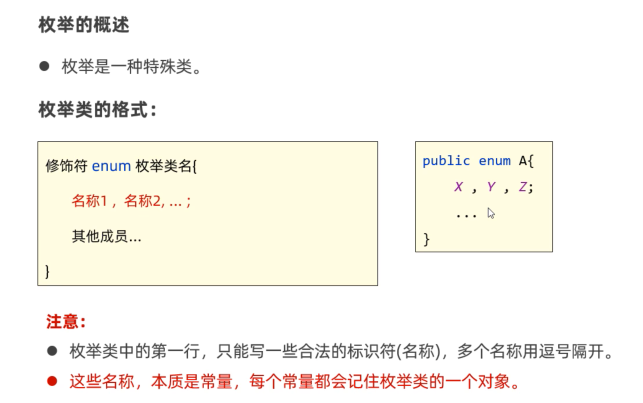    
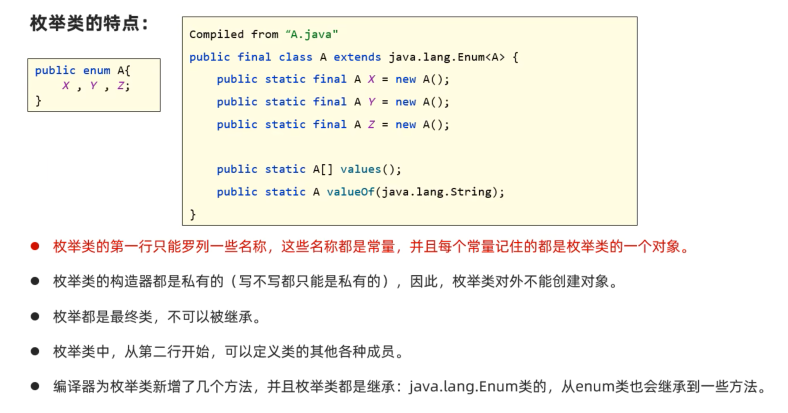  
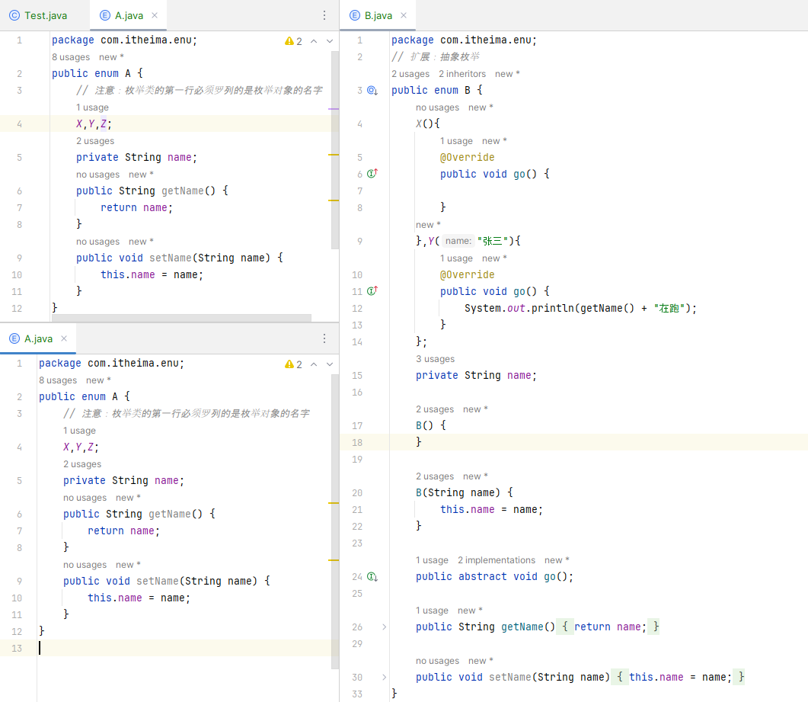  
```java
package com.itheima.enu;

public enum C {
    X;// 单例

}

```
枚举的应用场景  
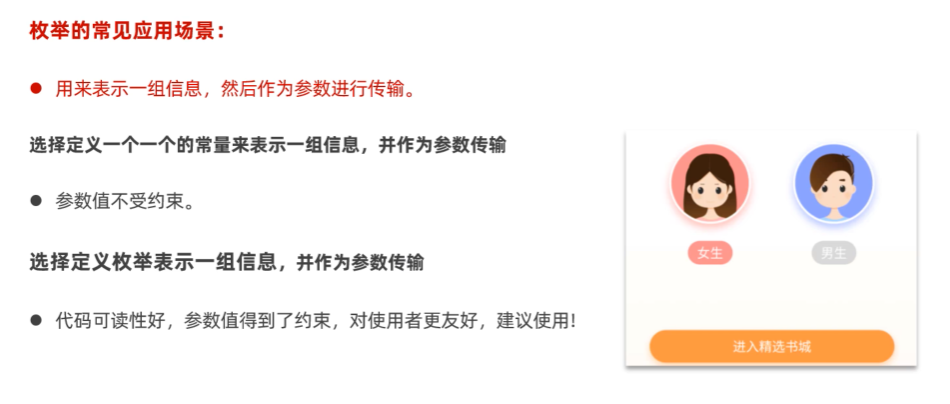  
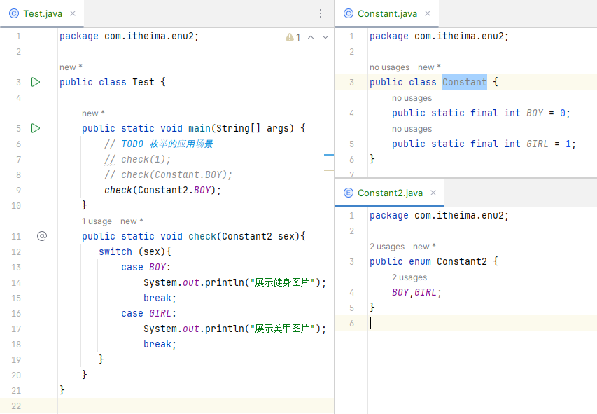  

###  泛型  
1.  认识泛型  
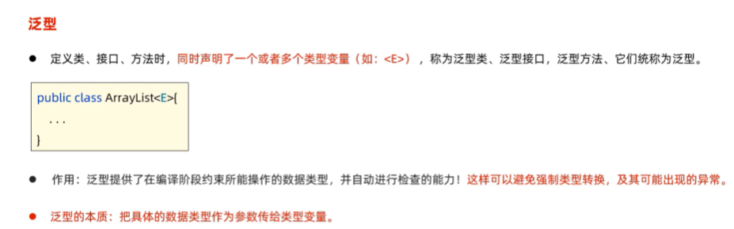  
```java
package com.itheima.generics;

import java.util.ArrayList;

public class Test1 {
    public static void main(String[] args) {
        // TODO 泛型
        ArrayList list = new ArrayList();
        list.add("java1");
        list.add("java2");
        list.add("java3");
        // list.add(new Cat());

        for (int i = 0; i < list.size(); i++) {
            String e = (String) list.get(i);
            System.out.println(e);
        }

        System.out.println("------------");
        // ArrayList<String> list1 = new ArrayList<String>();
        ArrayList<String> list1 = new ArrayList<>();// jdk1.7开始的，后面的数据类型可以不声明
        list1.add("java1");
        list1.add("java2");
        list1.add("java3");
        // list1.add(new Cat());
        for (int i = 0; i < list1.size(); i++) {
            String e = list1.get(i);
            System.out.println(e);
        }
    }
}

class Cat{}

```
2.  泛型类  
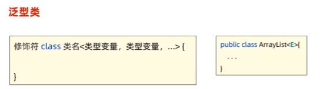  
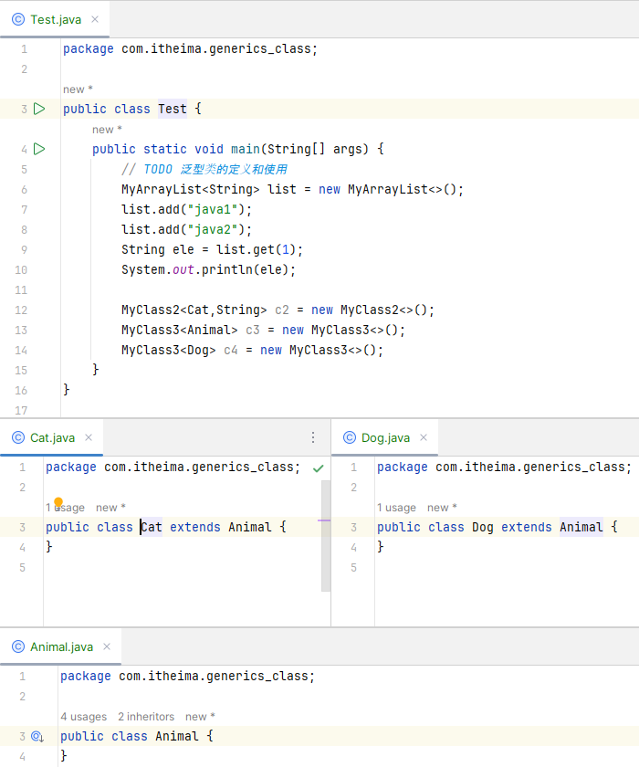  
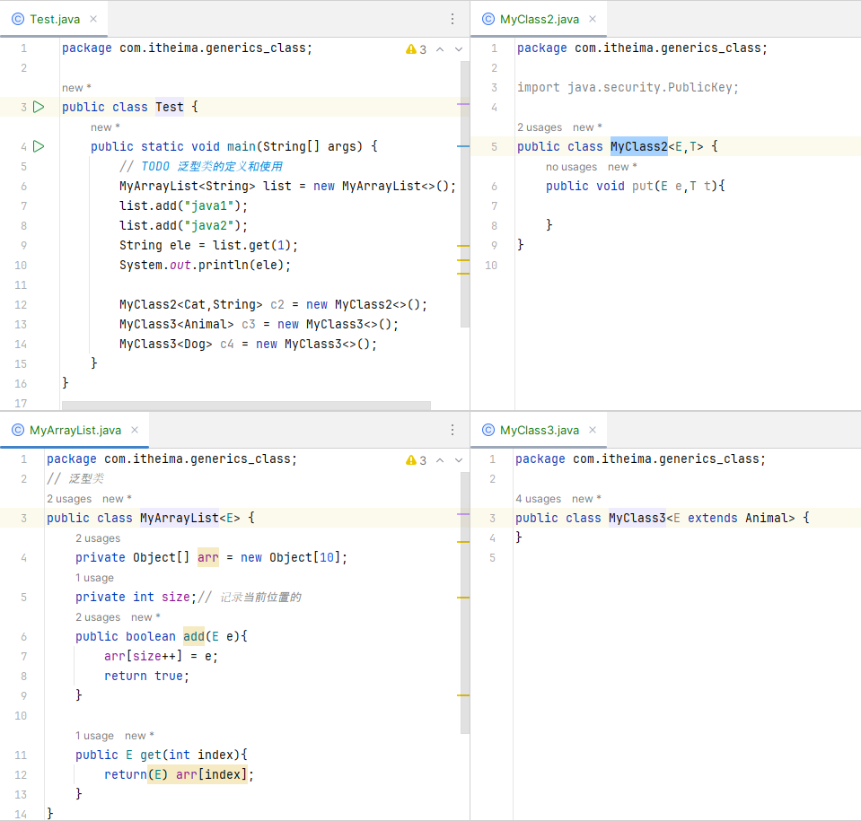  
3.  泛型接口  
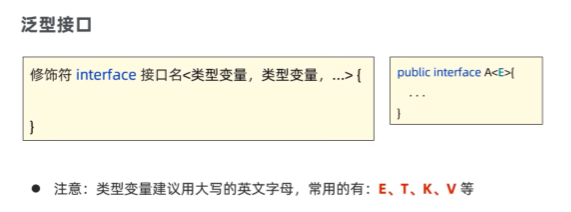  
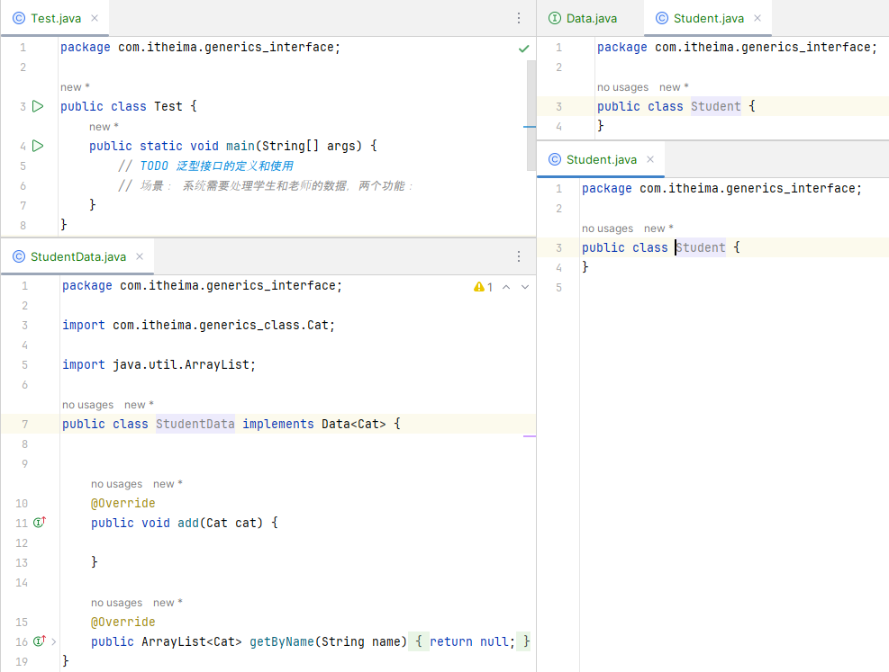  
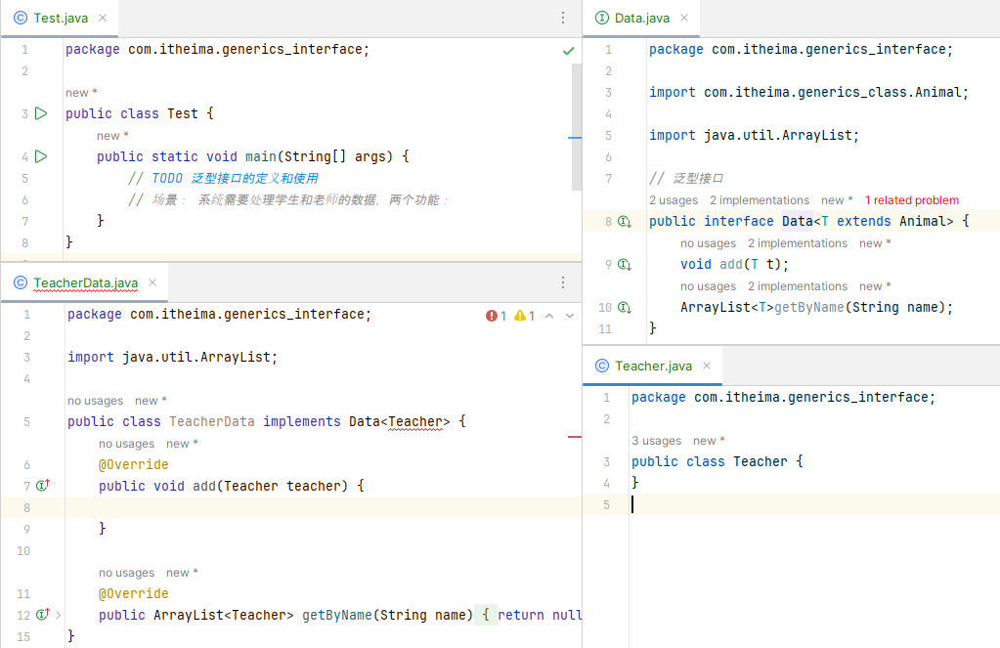  
4.  泛型方法，泛型通配符，上下限  
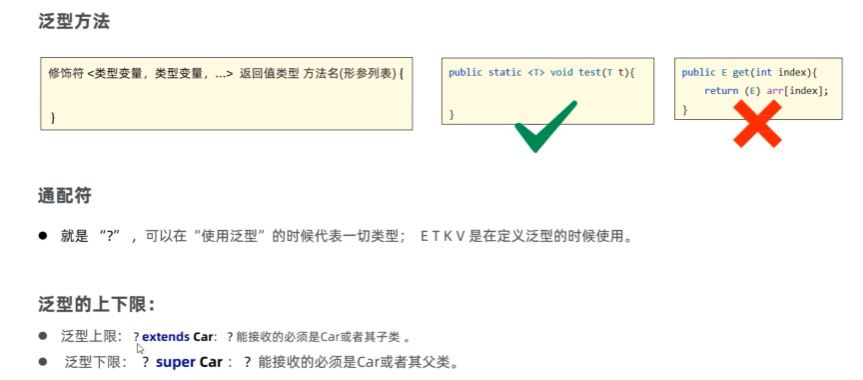  
```java 
package com.itheima.generics_method;
import java.util.ArrayList;
public class Test {
    public static void main(String[] args) {
        // TODO 泛型方法的定义和使用
        String rs = test("java");
        System.out.println(rs);

        Dog d = test(new Dog());
        System.out.println(d);

        // 需求：所有的汽车可以一起参加比赛
        ArrayList<Car> cars = new ArrayList<>();
        cars.add(new BMW());
        cars.add(new BENZ());
        go(cars);

        ArrayList<BMW> bmws = new ArrayList<>();
        bmws.add(new BMW());
        bmws.add(new BMW());
        go(bmws);

        ArrayList<BENZ> benzs = new ArrayList<>();
        benzs.add(new BENZ());
        benzs.add(new BENZ());
        go(benzs);

        //ArrayList<Dog> dogs = new ArrayList<>();
        //dogs.add(new Dog());
        //dogs.add(new Dog());
        //go(dogs);
    }
    // ?通配符 在使用泛型的时候可以代表一切类型   ?extends Car(上限)  ?super Car(下限)
    public static void go(ArrayList<? extends Car>cars){
    }

   // public static <T extends Car> void go(ArrayList<T>cars){
   //
   // }
    // 泛型方法
    public static <T> T test(T t){
        return t;
    }
}

```
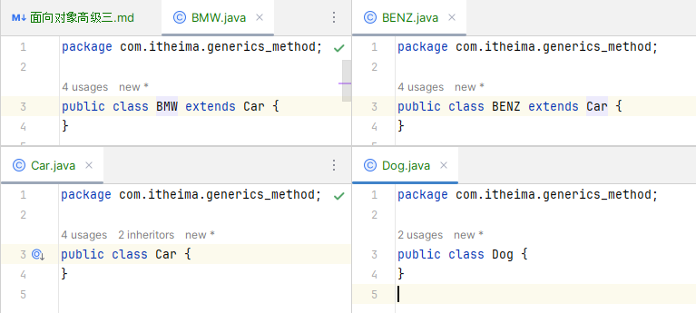  
5.  泛型的注意事项：擦除问题，基本数据类型问题  
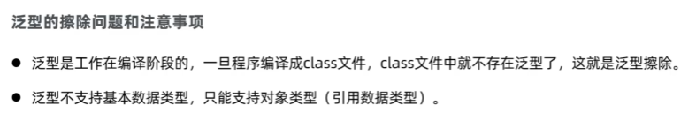  
```JAVA
package com.itheima.generics_attention;

import java.util.ArrayList;

public class Test {
    public static void main(String[] args) {
        // TODO 泛型的注意事项
        // 1.
        ArrayList<String> list = new ArrayList<>();
        list.add("java1");
        list.add("java2");
        list.add("java3");
        String rs = list.get(2);
        System.out.println(rs);

        // 2.
        // ArrayList<int> list1 = new ArrayList<>();
        // ArrayList<double> list2 = new ArrayList<>();
        ArrayList<Integer> list1 = new ArrayList<>();
        list1.add(12);

        ArrayList<Double> list2 = new ArrayList<>();
        list2.add(23.3);
    }
}

```
