## java方法   
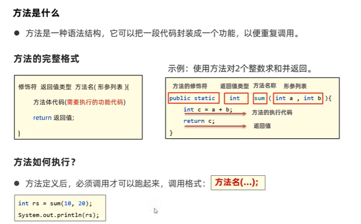  
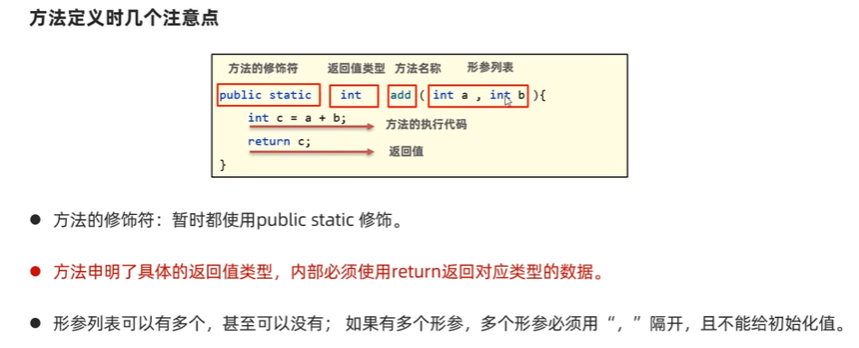  
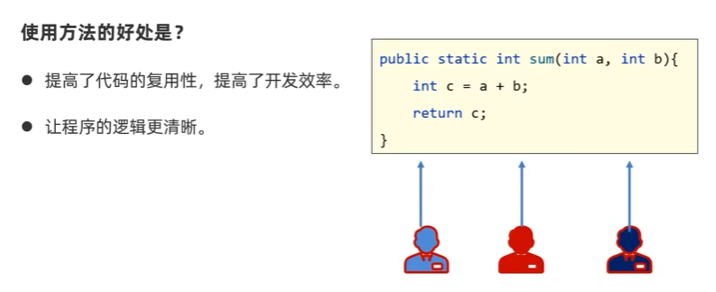  
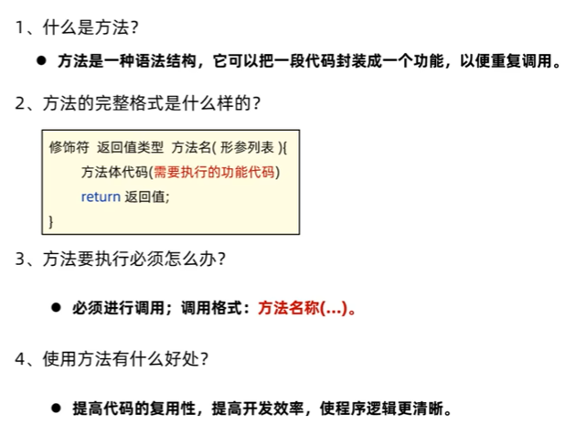  
```java
package com.itheima.define;

public class MethodDemo1 {
    public static void main(String[] args) {
        //  TODO 掌握定义方法的完整格式，搞清楚使用方法的好处
        //  需求：很多人都要进行两个整数求和的操作
        int rs = sum(10,20);
        System.out.println(rs);
    }
    public static int sum(int a,int b){
        int c = a + b;
        return c;
    }
}

```
### 方法的其他形式   
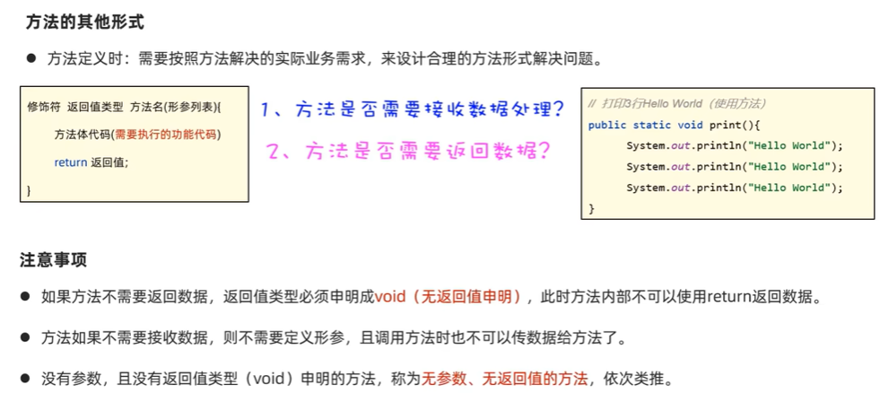  
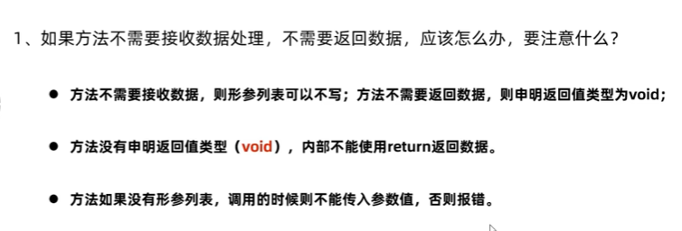  
```java
package com.itheima.define;

import java.sql.SQLOutput;

public class MethodDemo2 {
    public static void main(String[] args) {
        //  TODO 掌握按照方法解决的实际业务需求不同，设计出合理的方法形式来解决问题
        // 需求：很多人都要打印多行Hello World
        printHelloWorld(10);
    }
    // 有参数 无返回值的方法
    public static void  printHelloWorld(int n){
        for (int i = 1; i <= n ; i++) {
            System.out.println("Hello World");
        }
    }
}

```
### 方法使用时的常见问题  
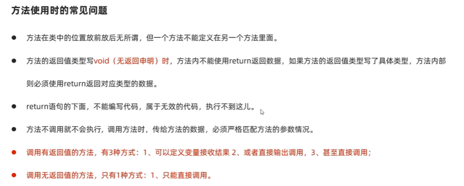  

### 案例  
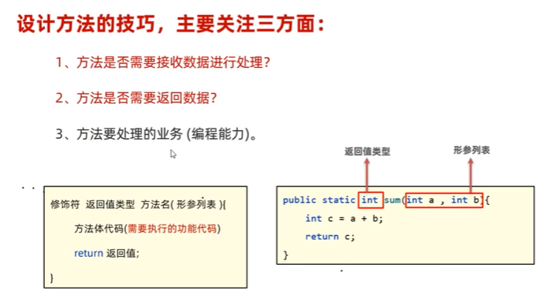  
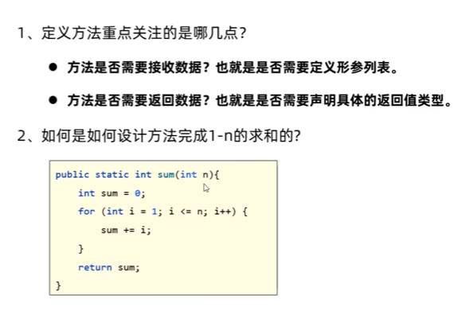  
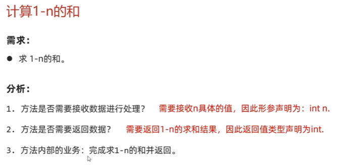  
```java
package com.itheima.define;

public class MethodTest3 {
    public static void main(String[] args) {
        //  TODO 掌握设计方法的技巧
        System.out.println(add(5));
    }

    public static int add(int n){
        int sum = 0;
        for (int i = 1; i <= n ; i++) {
            // i =  1 2 3 4 ...n
            sum += i;
        }
        return sum;
    }
}

```
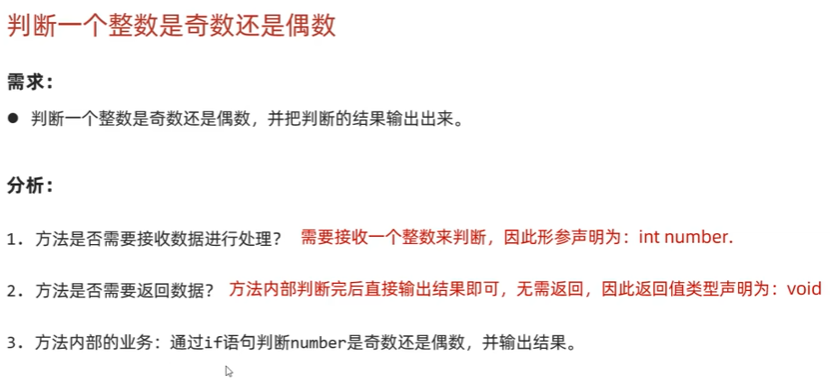  
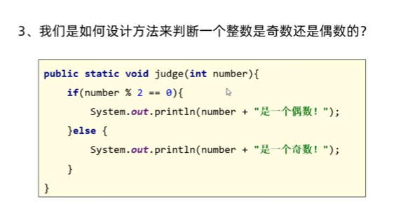  
```java
package com.itheima.define;

public class MethodTest4 {
    public static void main(String[] args) {
        //  TODO 掌握设计方法的技巧
        judge(10);
        judge(3);
    }

    public static void judge(int number){
       if (number % 2==0){
           System.out.println("偶数");
       }else{
           System.out.println("奇数");
       }
    }
}

```
### 方法参数传递  
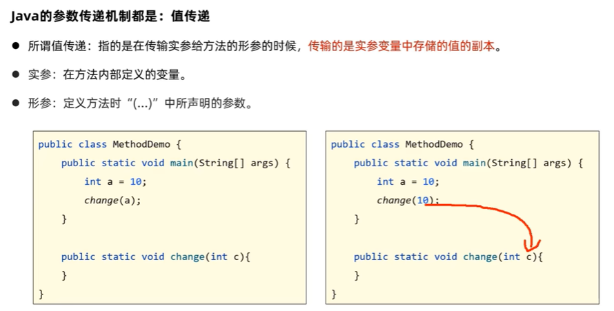  
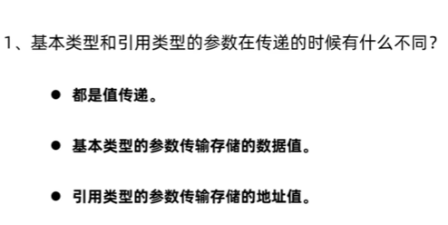  
1.  基本类型的参数传递  
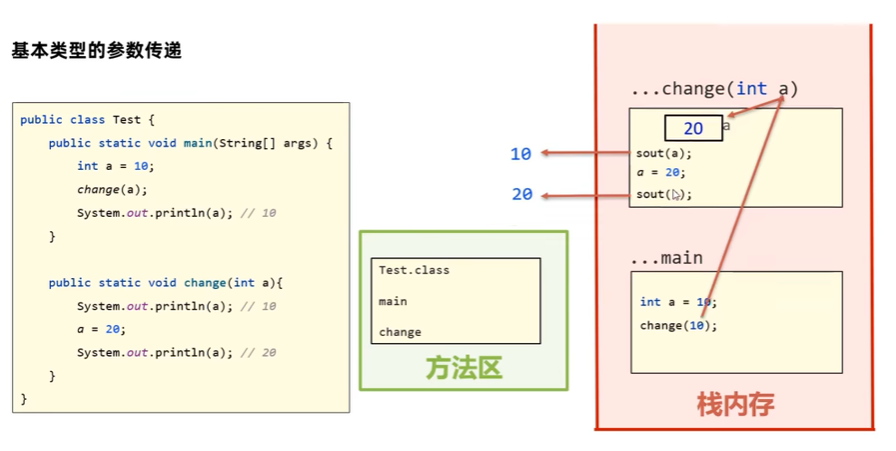  
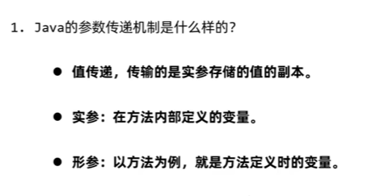  
```java
package com.itheima.parameter;

public class MethodDemo1 {
    public static void main(String[] args) {
        // TODO 理解方法的参数传递机制：值传递
        int a = 10;
        change(a);// 10
        System.out.println(a);// 10
    }

    public static void change(int a){
        System.out.println(a);// 10
        a = 20;
        System.out.println(a);//20
    }
}

 ```
2.  引用类型的参数传递   
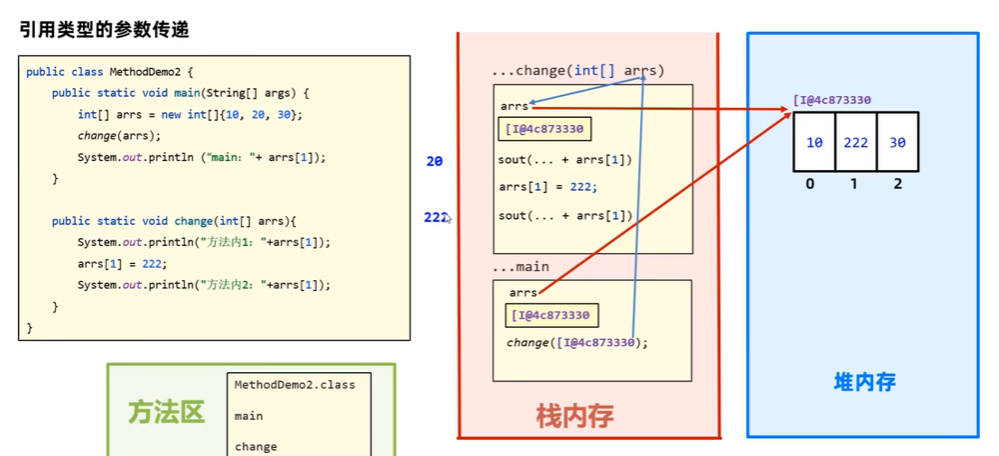  
```java
package com.itheima.parameter;

public class MethodDemo2 {
    public static void main(String[] args) {
        // TODO 理解引用类型的参数传递机制：值传递
        int[] arrs = new int[]{10,20,30} ;
        change(arrs);
        System.out.println(arrs[1]);//222
    }

    public static void change(int[] arrs){
        System.out.println(arrs[1]);//20
        arrs[1] = 222;
        System.out.println(arrs[1]);//222
    }
}

```
### 参数传递的案例  
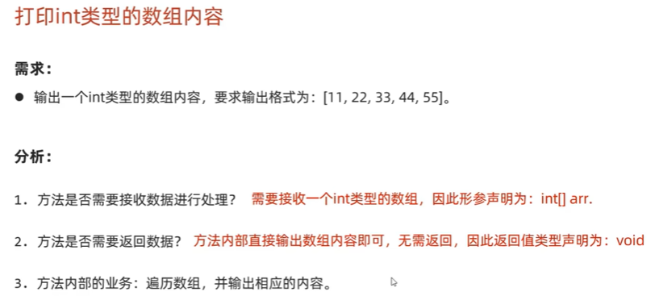  
```java
package com.itheima.parameter;

public class MethodTest2 {
    public static void main(String[] args) {
        // TODO 完成打印int类型的数组内容
        int[] arr = {10,30,50,70};
        printArray(arr);
    }

    public static void printArray(int[] arr){
        System.out.print("[");
        // 直接遍历接到的数组元素
        for (int i = 0; i < arr.length; i++) {
            System.out.print(i == arr.length-1?arr[i]:arr[i]+", ");
        }
        System.out.println("]");
    }
}

```
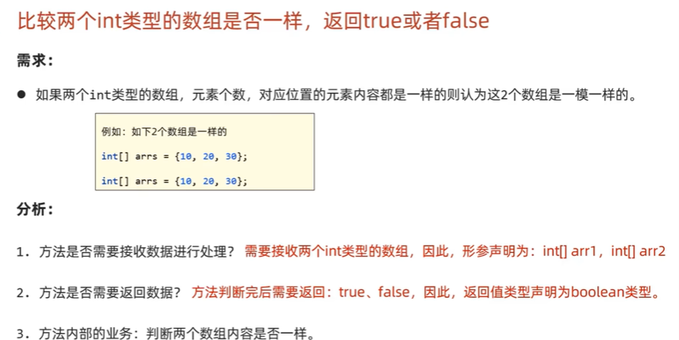  
```java
package com.itheima.parameter;

public class MethodTest3 {
    public static void main(String[] args) {
        // TODO 完成判断两个int类型的数组是否一样
        int[] arr1 = {10,20,30,40};
        int[] arr2 = {3,5,7,9,0,1};
        System.out.println(equals(arr1, arr2));
    }
    public static boolean equals(int[]arr1,int[]arr2){
        // 1.判断两个数组是否都是null
        if (arr1 == null && arr2 == null){
            return true;// 相等的
        }

        // 2.判断其中是否有一个是null
        if (arr1 == null || arr2 == null){
            return false;// 不相等
        }

        // 3.判断长度是否一样，如果不一样，返回false
        if (arr1.length != arr2.length){
            return false;// 不相等
        }

        // 4.长度一样，接着比较内容是否一样
        // arr1 = {10,20,30}
        // arr2 = {10,20,30}
        for (int i = 0; i < arr1.length; i++) {
            // 判断当前位置两个数组的元素是否不一样，不一样，直接返回false
            if (arr1[i] != arr2[i]){
                return false;// 不相等
            }
        }
        return true;// 相等的
    }
}

```

### 方法重载  

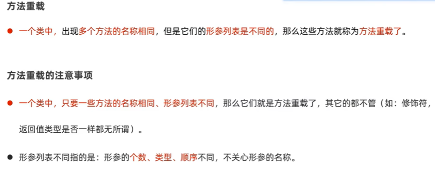  
```java 
package com.itheima.overload;

public class MethodOverLoadDemo1 {
    public static void main(String[] args) {
        // TODO 认识方法重载并掌握其应用场景
        test();
        test(100);
    }
    public static void test(){
        System.out.println("test1");
    }
    public static void test(int a){
        System.out.println("test2" + a);
    }
}

``` 
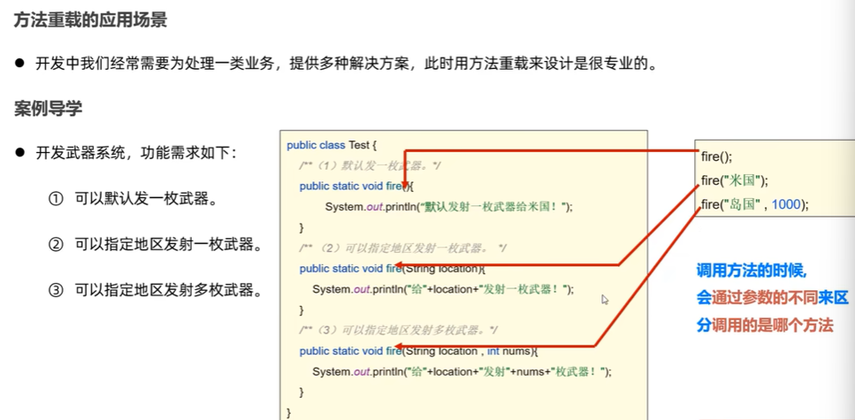  
```java
package com.itheima.overload;

public class MethodTest2 {
    public static void main(String[] args) {
        // TODO 掌握方法重载的应用场景
        fire();
        fire("米国");
        fire("米国",100);
    }

    public static void fire() {
        System.out.println("发射一枚武器");
    }

    public static void fire(String country) {
        System.out.println("发射一枚武器给"+country );
    }

    public static void fire(String country,int number) {
        System.out.println("发射"+number+"枚武器给"+country);
    }
}


```
### return关键字  
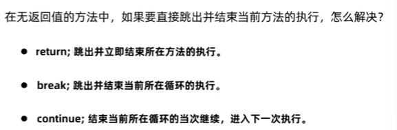  
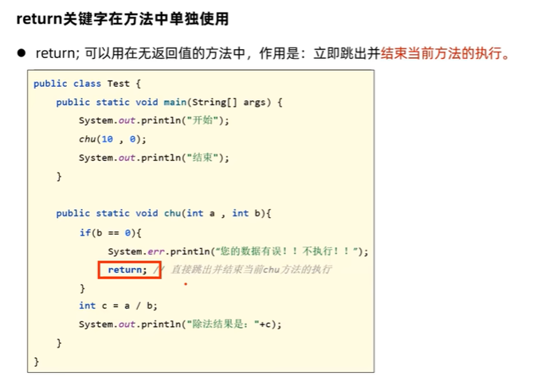  
```java
package com.itheima.returndemo;

public class ReturnDemo1 {
    public static void main(String[] args) {
        // TODO return单独使用在无返回值方法中的作用：跳出并立即结束当前方法的执行
        chu(10,0);
    }
    public static void chu(int a,int b){
        if (b==0){
            System.out.println("数据有问题，不能除0");
            return;// 跳出并立即结束当前方法的执行
        }
         int c = a/b;
         System.out.println(c);
    }
}

```
### java案例  
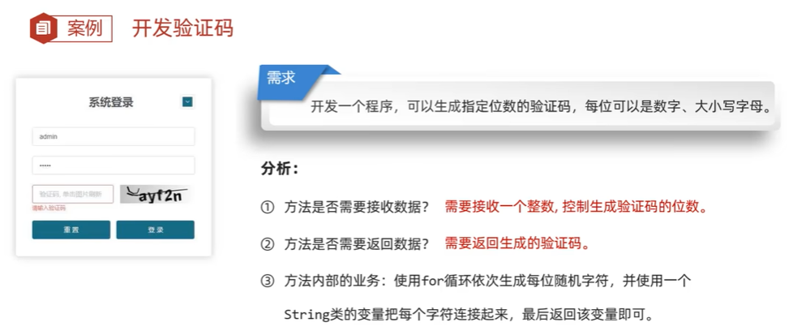  
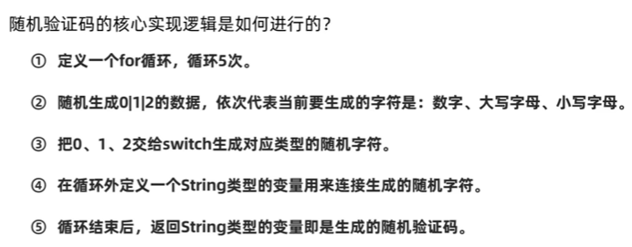  
```java
package com.itheima;

import java.util.Random;

public class Test2 {
    public static void main(String[] args) {
        // TODO 生成随机验证码
        System.out.println(createCode(4));
    }

    public static String createCode(int n){
        // 1.定义一个for循环 用于控制产生多少位随机字符
        Random r = new Random();
        // 3.定义一个String类型的变量用于记住产生的每位随机字符
        String code = "";
        for (int i = 1; i <= n; i++) {
            // i = 1 2 3 ...n
            // 2.为每个位置生成一个随机字符，数字大小写字母
            // 思路：随机一个0 1 2 之间的数字出来，0代表数字，1 2代表大小写字母
            int type = r.nextInt(3) ;// 0  1   2
            switch (type){
                case 0:
                    // 随机一个数字
                    code += r.nextInt(10);// 0-9
                    break;
                case 1:
                    // 随机一个大写字母  A 65  Z65+25   (0-25)+65
                    char ch1 = (char) (r.nextInt(26)+65);
                    code += ch1;
                    break;
                case 2:
                    // 随机一个小写字母   a 97  z97+25   (0-25)+97
                    char ch2 = (char) (r.nextInt(26)+97);
                    code += ch2;
                    break;
            }
        }
        return code;
    }
}

```