##  冒泡排序   
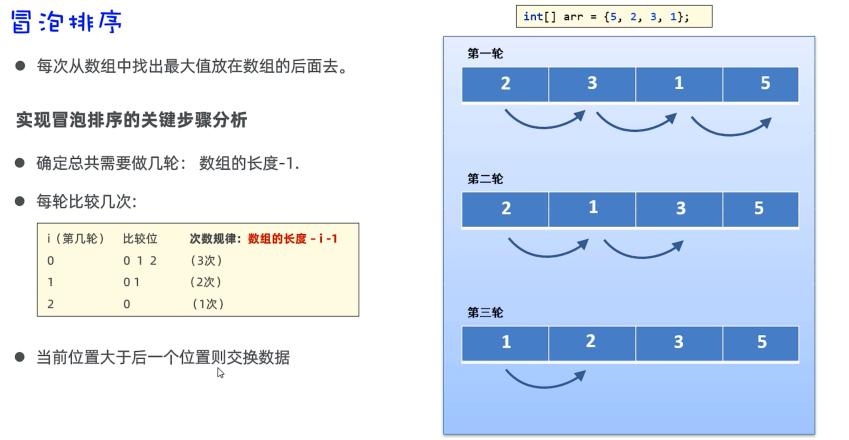  
```java
package com.itheima.algorithm;

import java.util.Arrays;

// TODO 冒泡排序的编写
public class Test1 {
    public static void main(String[] args) {
        // 1.准备一个数组
        int[] arr = {5,2,3,1};

        // 2.定义一个循环，控制排几轮
        for (int i = 0; i < arr.length-1; i++) {
            // i = 0 1 2         [5 2 3 1 ]  次数
            // i = 0  第一轮       0  1 2      3
            // i = 1  第二轮       0  1        2
            // i = 2  第三轮       0           1

            // 3.定义一个循环，控制每轮比较几次
            for (int j = 0; j < arr.length-i -1; j++) {
                // 判断当前位置的元素值，是否大于后一个位置处的元素值，如果大于，则交换
                if (arr[j]>arr[j+1]){
                    int temp = arr[j+1];
                    arr[j+1] = arr[j];
                    arr[j] = temp;
                }
            }
        }
        System.out.println(Arrays.toString(arr));// [1, 2, 3, 5]
    }
}

```
##  正则表达式  
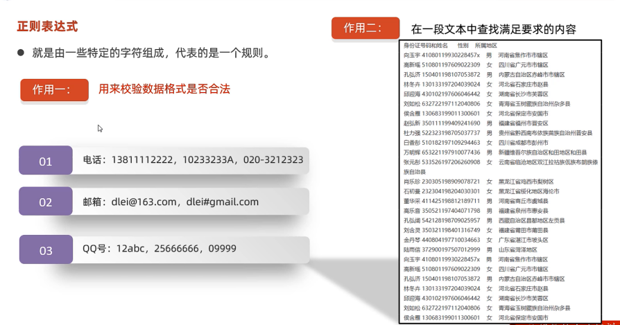  
```java
package com.itheima.regex;
// TODO 使用正则表达式来校验数据格式的合法性
// 需求：校验QQ号是否正确，要求全部是数字，长度是6-20之间，不能以0开头
public class RegexTest1 {
    public static void main(String[] args) {
        System.out.println(checkQQ("251425876"));// true
        System.out.println("--------------------------");
        System.out.println(checkQQ1("251425876"));// true
        System.out.println(checkQQ1("2sgf5876"));// false
    }

    public static boolean checkQQ1(String qq){
        return qq!=null && qq.matches("[1-9]\\d{5,19}");
    }

    public static boolean checkQQ(String qq){
        // 1.判断QQ号码是否为null
        if (qq == null || qq.startsWith("0") || qq.length()< 6 ||qq.length()> 20)  {
            return false;
        }

        // 2.qq至少不是null，不是以0开头，满足6-20之间的长度
        // 判断qq号码中是否都是数字
        // qq = 2514ghd234
        for (int i = 0; i < qq.length(); i++) {
            // 根据索引提取当前位置处的字符
            char ch = qq.charAt(i);
            // 判断ch记住的字符，如果不是数字，qq号码不合法
            if (ch < '0' || ch > '9'){
                return false;
            }
        }

        // 3.说明qq号码肯定是合法的
        return true;
    }
}

```
书写规则：  
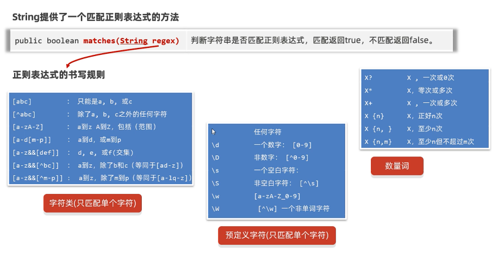  
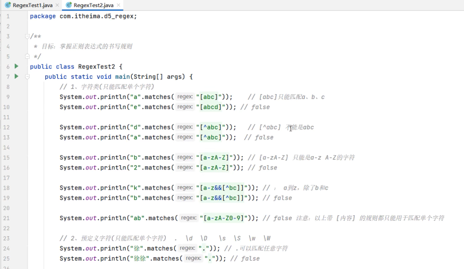  
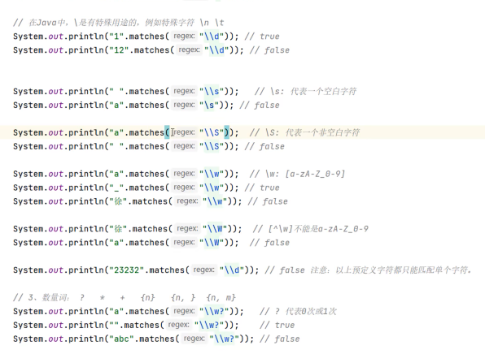  
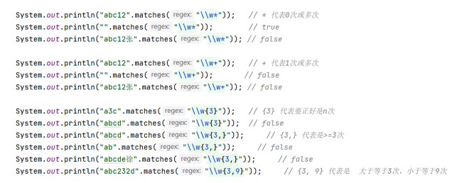  
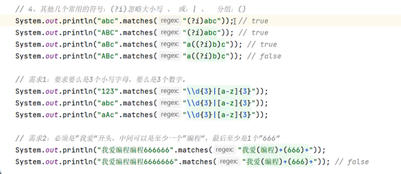  
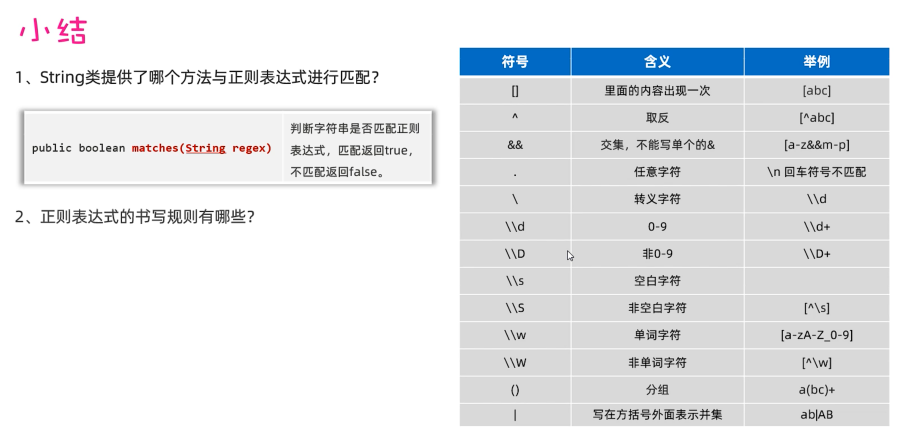  

##  异常  
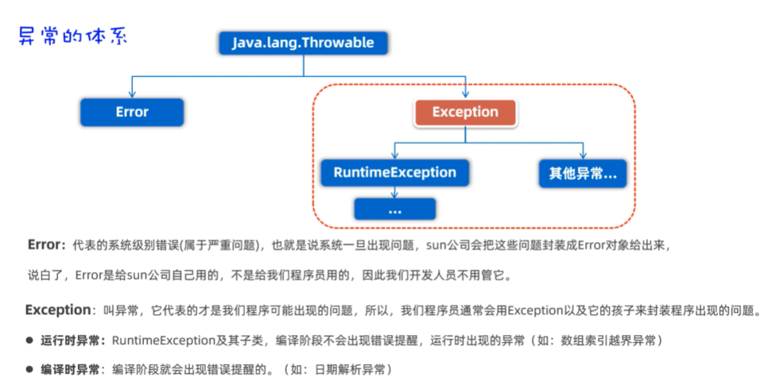  
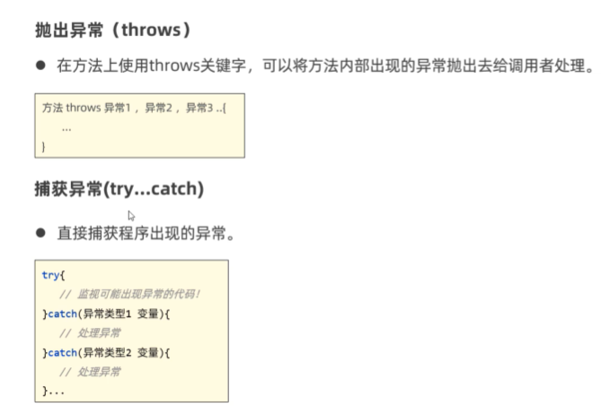  
自定义异常：  
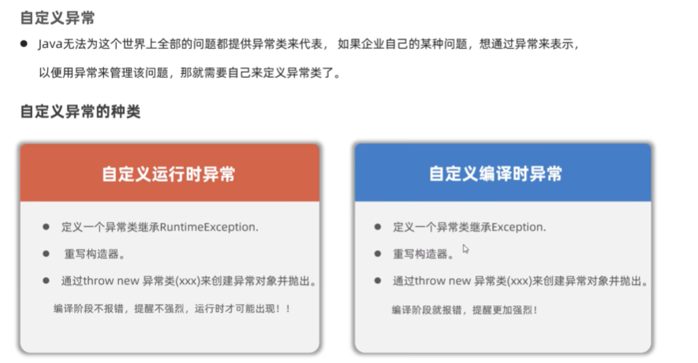  
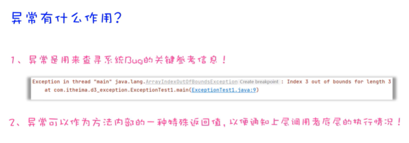  
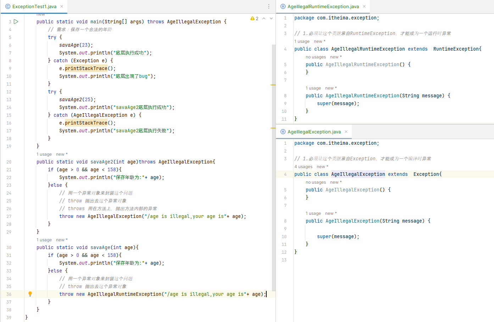  
对于异常常见处理方式：  
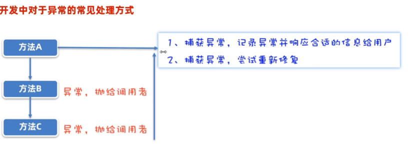  
```java
package com.itheima.exception;

import java.io.FileInputStream;
import java.io.FileNotFoundException;
import java.io.InputStream;
import java.text.ParseException;
import java.text.SimpleDateFormat;
import java.util.Date;

// TODO 异常的处理
public class ExceptionTest2 {
    public static void main(String[] args) {
        try {
            test1();
        } catch (FileNotFoundException e) {
            System.out.println("文件不存在");
            e.printStackTrace();// 打印异常对象的信息，记录下来
        } catch (ParseException e) {
            System.out.println("解析的时间有问题");
            e.printStackTrace();// 打印异常对象的信息，记录下来
        }
    }

    public static void test1() throws FileNotFoundException, ParseException {
        SimpleDateFormat sdf = new SimpleDateFormat("yyyy-MM-dd HH:mm:ss");
        Date d = sdf.parse("2028-11-11  10:24");
        System.out.println(d);
        test2();
    }
    public static void test2() throws FileNotFoundException {
        // 读取文件的
        InputStream s = new FileInputStream("D:/meinv.png");
    }
}

```
```java
package com.itheima.exception;

import java.util.Scanner;

// TODO 异常的处理方式：捕获异常 尝试修复
public class ExceptionTest3 {
    public static void main(String[] args) {
     // 需求：调用一个方法，让用户输入一个合适的价格返回为止
        // 尝试修复
        while (true) {
            try {
                System.out.println(getMoney());
            } catch (Exception e) {
                System.out.println("请输入合法的数字");
            }
        }
    }
    public static double getMoney(){
        Scanner sc = new Scanner(System.in);
        while (true) {
            System.out.println("请输入价格");
            double money = sc.nextDouble();
            if (money >= 0){
                return money;
            }else {
                System.out.println("输入的价格不合适");
            }
        }
    }
}

```
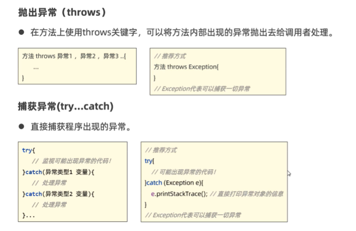  