#  网络通信  
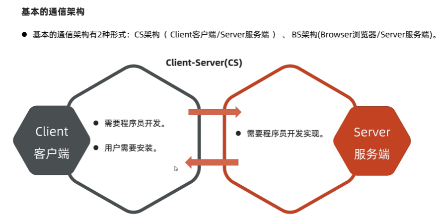  
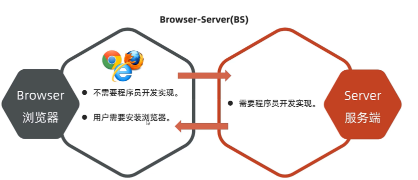  
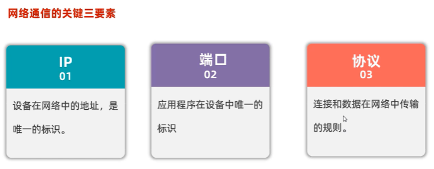  


##  网络通信三要素  
1.  IP地址  
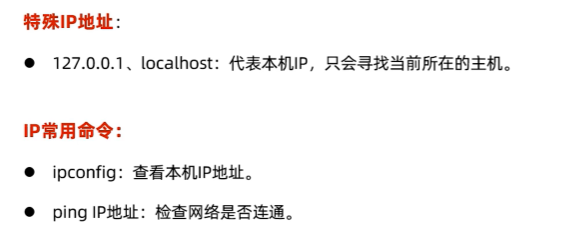  
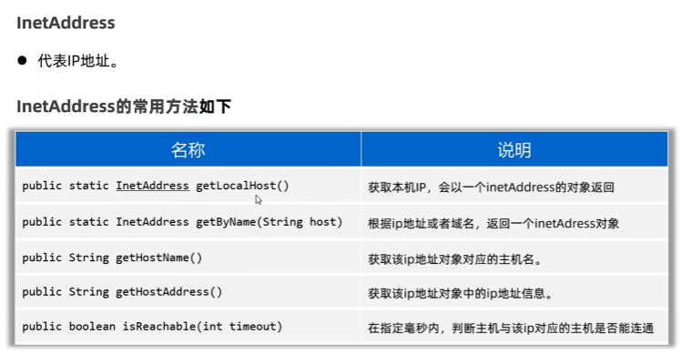  
```java
package com.itheima.ip;

import java.net.InetAddress;
import java.net.UnknownHostException;

// TODO InetAddress类的使用
public class InetAddressTest {
    public static void main(String[] args) throws UnknownHostException {
        // 1.获取本机ip地址对象
        InetAddress ip1 = InetAddress.getLocalHost();
        System.out.println(ip1.getHostName());// DESKTOP-LO6FUVT
        System.out.println(ip1.getHostAddress());// 192.168.0.7

        // 2.获取指定ip或者域名的ip地址对象
        InetAddress ip2 = InetAddress.getByName("www.baidu.com");
        System.out.println(ip2.getHostName());// www.baidu.com
        System.out.println(ip2.getHostAddress());// 119.63.197.151
    }
}

```  
2.  端口号  
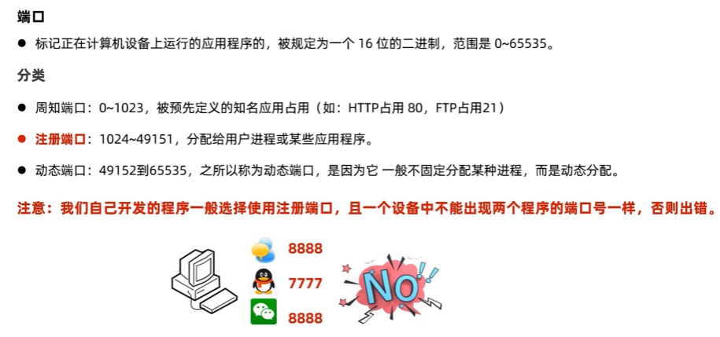  
3.  协议  
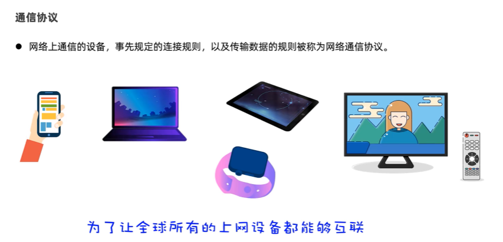  
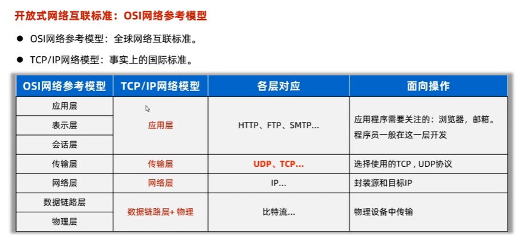  
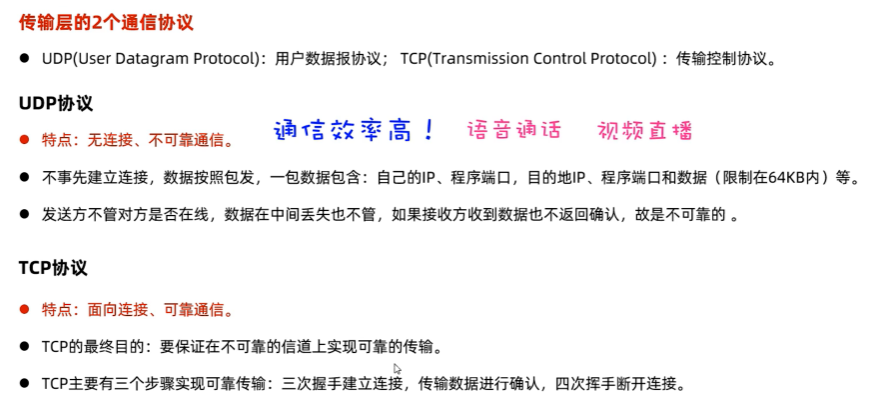  
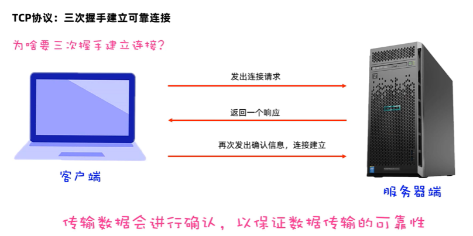  
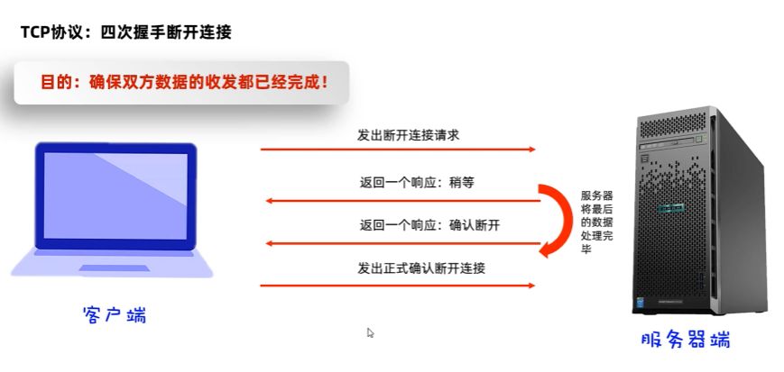  

##  UDP通信-快速入门   
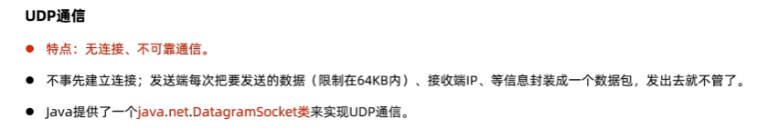  
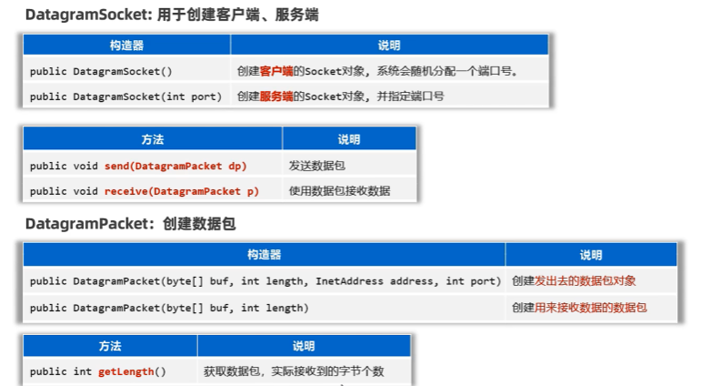  
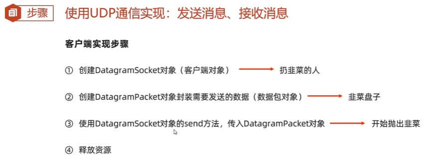  
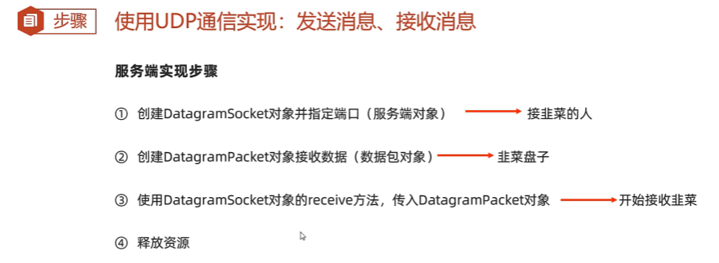  
```java
package com.itheima.upd1;

import java.net.DatagramPacket;
import java.net.DatagramSocket;
import java.net.InetAddress;

// TODO UDP通信快速入门，实现1发1收
public class Client {
    public static void main(String[] args) throws Exception {
        // 1.创建客户端对象
        DatagramSocket socket = new DatagramSocket(777);

        // 2.创建数据包对象封装要发出去的数据
        /* public  DatagramPacket(byte buf[],int length,
        InetAddress address,int port)
        参数一：封装要发出去的数据
        参数二：发送出去的数据大小（字节个数）
        参数三：服务端的ip地址 （找到服务端主机）
        参数四：服务端程序的端口
         */
        byte[] bytes = "我是快乐的客户端，我爱你abc".getBytes();
        DatagramPacket packet = new DatagramPacket(bytes,bytes.length
                ,InetAddress.getLocalHost(),6666);

        // 3.开始正式发送这个数据包的数据出去了
        socket.send(packet);
        System.out.println("客户端数据发送完毕");
        socket.close();// 释放资源
    }
}

```
```java
package com.itheima.upd1;

import java.net.DatagramPacket;
import java.net.DatagramSocket;
import java.net.SocketException;

// TODO UDP通信快速入门-服务端开发
public class Server {
    public static void main(String[] args) throws Exception {
        System.out.println("服务端启动");
        // 1.创建一个服务端对象  注册端口
        DatagramSocket socket = new DatagramSocket(6666);

        // 2.创建一个数据包对象，用于接收数据的
        byte[] buffer = new byte[1024*64];// 64kb
        DatagramPacket packet = new DatagramPacket(buffer,buffer.length);

        // 3.开始正式使用数据包来接收客户端发来的数据
        socket.receive(packet);

        // 4.从字节数组中把接收到的数据打印出来
        // 接收多少就倒出多少
        // 获取本次数据包接收了多少数据
        int len = packet.getLength();

        String rs = new String(buffer,0,len);
        System.out.println(rs);

        System.out.println(packet.getAddress().getHostAddress());
        System.out.println(packet.getPort());

        socket.close();// 释放资源
    }
}

```
##  UDP通信-多发多收  
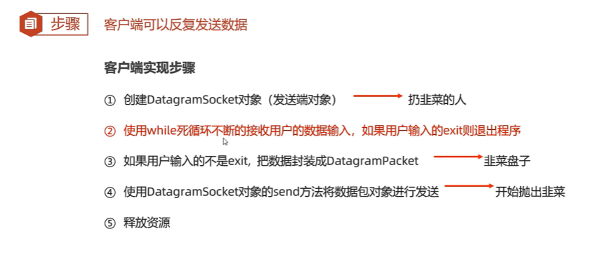  
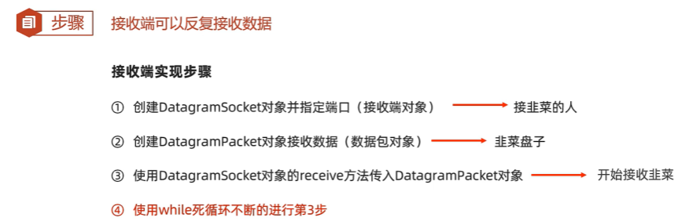  
```java
package com.itheima.upd1;

import java.net.DatagramPacket;
import java.net.DatagramSocket;
import java.net.InetAddress;
import java.util.Scanner;

// TODO UDP通信快速入门，实现1发1收
public class Client {
    public static void main(String[] args) throws Exception {
        // 1.创建客户端对象
        DatagramSocket socket = new DatagramSocket(777);

        // 2.创建数据包对象封装要发出去的数据
        /* public  DatagramPacket(byte buf[],int length,
        InetAddress address,int port)
        参数一：封装要发出去的数据
        参数二：发送出去的数据大小（字节个数）
        参数三：服务端的ip地址 （找到服务端主机）
        参数四：服务端程序的端口
         */
        Scanner sc = new Scanner(System.in);
        while (true) {
            System.out.println("请说:");
            String msg =sc.nextLine();

            // 一旦发现用户输入的exit命令，就退出客户端
            if ("exit".equals(msg)){
                System.out.println("欢迎下次光临，退出成功");
                socket.close();// 释放资源
                break;// 跳出死循环
            }

            byte[] bytes = msg.getBytes();
            DatagramPacket packet = new DatagramPacket(bytes,bytes.length
                    ,InetAddress.getLocalHost(),6666);

            // 3.开始正式发送这个数据包的数据出去了
            socket.send(packet);
        }
    }
}

```
```java
package com.itheima.upd1;

import java.net.DatagramPacket;
import java.net.DatagramSocket;
import java.net.SocketException;

// TODO UDP通信快速入门-服务端开发
public class Server {
    public static void main(String[] args) throws Exception {
        System.out.println("服务端启动");
        // 1.创建一个服务端对象  注册端口
        DatagramSocket socket = new DatagramSocket(6666);

        // 2.创建一个数据包对象，用于接收数据的
        byte[] buffer = new byte[1024*64];// 64kb
        DatagramPacket packet = new DatagramPacket(buffer,buffer.length);

        while (true) {
            // 3.开始正式使用数据包来接收客户端发来的数据
            socket.receive(packet);

            // 4.从字节数组中把接收到的数据打印出来
            // 接收多少就倒出多少
            // 获取本次数据包接收了多少数据
            int len = packet.getLength();

            String rs = new String(buffer,0,len);
            System.out.println(rs);

            System.out.println(packet.getAddress().getHostAddress());
            System.out.println(packet.getPort());
            System.out.println("-----------------------");

        }
    }
}

```

##  TCP-快速入门  
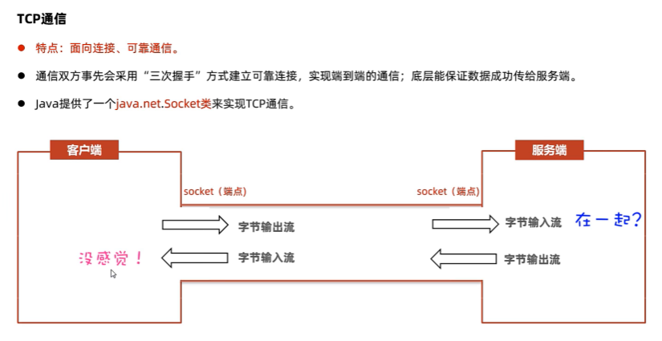  
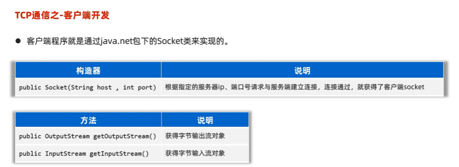  
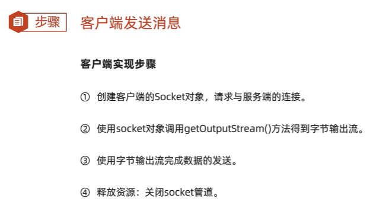  
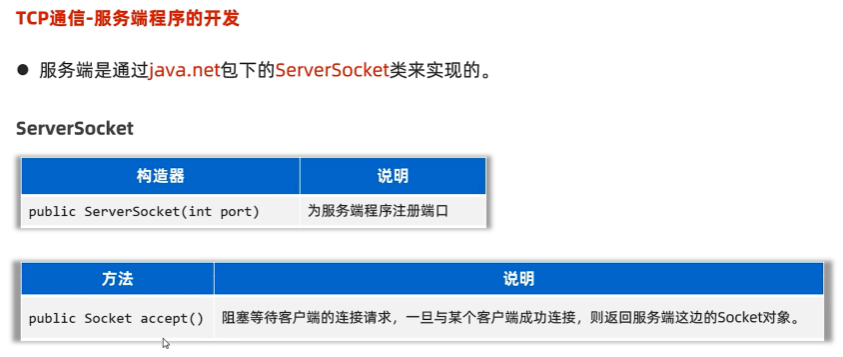  
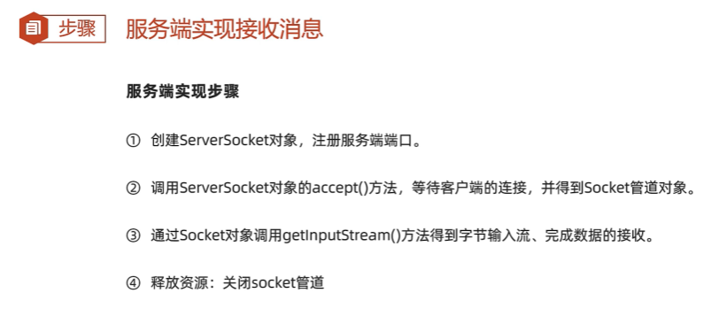  
```java
package com.itheima.tcp1;

import java.io.DataOutputStream;
import java.io.OutputStream;
import java.net.Socket;

// TODO TCP通信快速入门-客户端开发，实现1发1收
public class Client {
    public static void main(String[] args) throws Exception {
        // 1.创建对象Socket并同时请求与服务端程序的连接
        Socket socket = new Socket("127.0.0.1",8888);

        // 2.从Socket通信管道中得到一个字节输出流，用来发数据给服务端程序
        OutputStream os = socket.getOutputStream();

        // 3.把低级的字节输出流包装成数据输出流
        DataOutputStream dos = new DataOutputStream(os);

        // 4.开始写数据出去
        dos.writeUTF("汪苏泷");
        dos.close();

        socket.close();// 释放连接资源
    }
}

```
```java
package com.itheima.tcp1;

import java.io.DataInputStream;
import java.io.InputStream;
import java.net.ServerSocket;
import java.net.Socket;

// TODO TCP通信快速入门-服务端开发，实现1发1收
public class Server {
    public static void main(String[] args)throws Exception {
        // 1.创建ServerSocket对象同时为服务端注册端口
        ServerSocket serverSocket = new ServerSocket(8888);

        // 2.使用ServerSocket对象调用一个accept方法等待客户端的连接请求
        Socket socket = serverSocket.accept();

        // 3.从socket通信管道中得到一个字节输入流
        InputStream is = socket.getInputStream();

        // 4.把原始的字节输入流包装成数据输入流
        DataInputStream dis = new DataInputStream(is);

        // 5.使用数据输入流读取客户端发送过来的消息
        String rs = dis.readUTF();
        System.out.println(rs);
        // 也可以获取客户端的ip地址
        System.out.println(socket.getRemoteSocketAddress());

        dis.close();
        socket.close();
    }
}

```

##  TCP-多发多收    
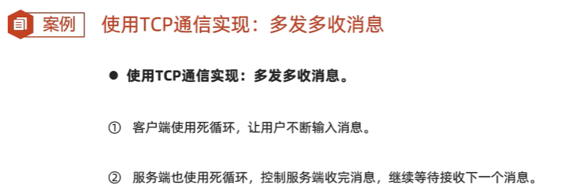  


```java
package com.itheima.tcp1;

import java.io.DataOutputStream;
import java.io.OutputStream;
import java.net.SecureCacheResponse;
import java.net.Socket;
import java.util.Scanner;

// TODO TCP通信快速入门-客户端开发，实现1发1收
public class Client {
    public static void main(String[] args) throws Exception {
        // 1.创建对象Socket并同时请求与服务端程序的连接
        Socket socket = new Socket("127.0.0.1",8888);

        // 2.从Socket通信管道中得到一个字节输出流，用来发数据给服务端程序
        OutputStream os = socket.getOutputStream();

        // 3.把低级的字节输出流包装成数据输出流
        DataOutputStream dos = new DataOutputStream(os);

        Scanner sc = new Scanner(System.in);
        // 4.开始写数据出去
        while (true) {
            System.out.println("请说：");
            String msg = sc.nextLine();

            // 一旦用户输入exit,就退出客户端程序
            if ("exit".equals(msg)){
                System.out.println("欢迎您下次光临，退出成功");
                dos.close();
                socket.close();
                break;
            }
            
            dos.writeUTF(msg);
            dos.flush();
        }
    }
}

```
```java
package com.itheima.tcp1;

import java.io.DataInputStream;
import java.io.IOException;
import java.io.InputStream;
import java.net.ServerSocket;
import java.net.Socket;

// TODO TCP通信快速入门-服务端开发，实现1发1收
public class Server {
    public static void main(String[] args)throws Exception {
        // 1.创建ServerSocket对象同时为服务端注册端口
        ServerSocket serverSocket = new ServerSocket(8888);

        // 2.使用ServerSocket对象调用一个accept方法等待客户端的连接请求
        Socket socket = serverSocket.accept();

        // 3.从socket通信管道中得到一个字节输入流
        InputStream is = socket.getInputStream();

        // 4.把原始的字节输入流包装成数据输入流
        DataInputStream dis = new DataInputStream(is);

        while (true) {
            // 5.使用数据输入流读取客户端发送过来的消息
            try {
                String rs = dis.readUTF();
                System.out.println(rs);
            } catch (Exception e) {
                System.out.println(socket.getRemoteSocketAddress() + "离线了");
                dis.close();
                socket.close();
                break;
            }
        }
    }
}

```

##  TCP-同时接收多个客户端  
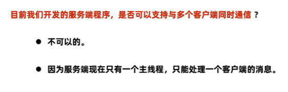  
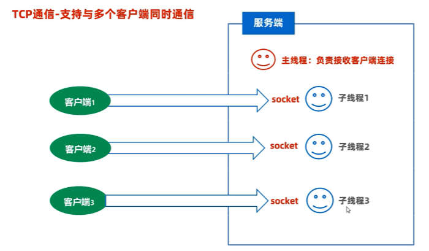  
```java
package com.itheima.tcp1;

import java.io.DataOutputStream;
import java.io.OutputStream;
import java.net.SecureCacheResponse;
import java.net.Socket;
import java.util.Scanner;

// TODO TCP通信快速入门-客户端开发，实现1发1收
public class Client {
    public static void main(String[] args) throws Exception {
        // 1.创建对象Socket并同时请求与服务端程序的连接
        Socket socket = new Socket("127.0.0.1",8888);

        // 2.从Socket通信管道中得到一个字节输出流，用来发数据给服务端程序
        OutputStream os = socket.getOutputStream();

        // 3.把低级的字节输出流包装成数据输出流
        DataOutputStream dos = new DataOutputStream(os);

        Scanner sc = new Scanner(System.in);
        // 4.开始写数据出去
        while (true) {
            System.out.println("请说：");
            String msg = sc.nextLine();

            // 一旦用户输入exit,就退出客户端程序
            if ("exit".equals(msg)){
                System.out.println("欢迎您下次光临，退出成功");
                dos.close();
                socket.close();
                break;
            }

            dos.writeUTF(msg);
            dos.flush();
        }
    }
}

```
```java
package com.itheima.tcp1;

import java.io.DataInputStream;
import java.io.IOException;
import java.io.InputStream;
import java.net.ServerSocket;
import java.net.Socket;

// TODO TCP通信快速入门-服务端开发，实现1发1收
public class Server {
    public static void main(String[] args)throws Exception {
        System.out.println("服务端启动成功");
        // 1.创建ServerSocket对象同时为服务端注册端口
        ServerSocket serverSocket = new ServerSocket(8888);

        while (true){
        // 2.使用ServerSocket对象调用一个accept方法等待客户端的连接请求
        Socket socket = serverSocket.accept();

        System.out.println("有人上线了："+ socket.getRemoteSocketAddress());

        // 3.把这个客户端对应的socket通信管道，交给一个独立的线程负责处理
        new ServerReaderThread(socket).start();
        }
    }
}

```
```java
package com.itheima.tcp1;

import java.io.DataInputStream;
import java.io.IOException;
import java.io.InputStream;
import java.net.Socket;

public class ServerReaderThread extends Thread{
    private Socket socket;
    public ServerReaderThread(Socket socket){
          this.socket = socket;
    }
    @Override
    public void run() {
        try {
            InputStream is = socket.getInputStream();
            DataInputStream dis = new DataInputStream(is);
            while (true){
                try {
                    String msg = dis.readUTF();
                    System.out.println(msg);
                } catch (Exception e) {
                    System.out.println("有人下线了："+ socket.getRemoteSocketAddress());
                    dis.close();
                    socket.close();
                    break;
                }
            }
        } catch (Exception e) {
            e.printStackTrace();
        }
    }
}

``` 
