## 集合框架一    
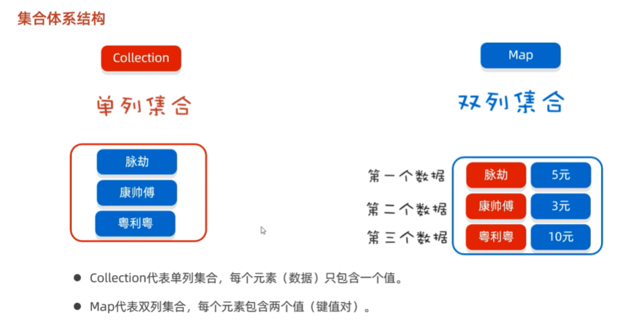  

###  collection  
1.  特点  
  
```java
package com.itheima.collection;

import java.util.ArrayList;
import java.util.Arrays;
import java.util.HashSet;

// TODO Collection体系的特点
public class CollectionTest1 {
    public static void main(String[] args) {
        // Collection集合的特点
        ArrayList<String> list = new ArrayList<>();// 有序可重复 有索引
        list.add("java1");
        list.add("java2");
        list.add("java1");
        list.add("java2");
        System.out.println(list);// [java1, java2, java1, java2]

        HashSet<String> set = new HashSet<>();//  无序 不重复 无索引
        set.add("java1");
        set.add("java2");
        set.add("java1");
        set.add("java2");
        set.add("java3");
        System.out.println(set);// [java3, java2, java1]
    }
}

```
2.  常用方法  
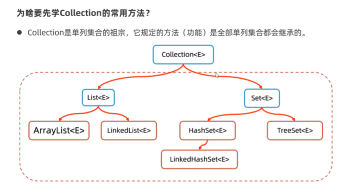  
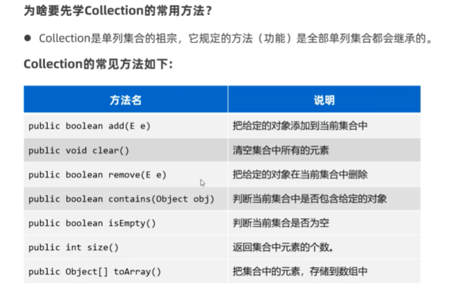  
```java
package com.itheima.collection;

import java.util.ArrayList;
import java.util.Arrays;
import java.util.Collection;
import java.util.Objects;

public class CollectionTest2API {
    public static void main(String[] args) {
        Collection<String> c = new ArrayList<>();// 多态写法
        // 1.添加元素，添加成功返回true
        c.add("java1");
        c.add("java1");
        c.add("java2");
        c.add("java2");
        c.add("java3");
        System.out.println(c);// [java1, java1, java2, java2, java3]

        // 2.清空集合元素
        // c.clear();
        // System.out.println(c);// []

        // 3.判断集合是否为空，是空返回true，反之
        System.out.println(c.isEmpty());// false

        // 4.获取集合的大小
        System.out.println(c.size());// 5

        // 5.判断集合中是否包含某个元素
        System.out.println(c.contains("java1"));// true

        // 6.删除某个元素，如果有多个重复元素默认删除前面的第一个
        System.out.println(c.remove("java1"));// true
        System.out.println(c);// [java1, java2, java2, java3]

        // 7.把集合转换成数组
        Object[] arr =  c.toArray();
        System.out.println(Arrays.toString(arr));// [java1, java2, java2, java3]

        String[] arr2  =  c.toArray(new String[c.size()]);
        System.out.println(Arrays.toString(arr2));// [java1, java2, java2, java3]

        System.out.println("-------------------------------");

        // 把一个集合的全部数据倒入到另一个集合中去
        Collection<String> c1 = new ArrayList<>();
        c1.add("java1");
        c1.add("java2");
        Collection<String> c2 = new ArrayList<>();
        c2.add("java3");
        c2.add("java4");
        c1.addAll(c2);// 就是把c2集合的全部数据倒入到c1集合中去
        System.out.println(c1);// [java1, java2, java3, java4]
        System.out.println(c2);// [java3, java4]
    }
}

```
3.  遍历方式  
①迭代器  
  
```java
package com.itheima.collection_traverse;

import java.util.ArrayList;
import java.util.Collection;
import java.util.Iterator;

// TODO Collection集合的遍历方式一：使用迭代器Iterator遍历
public class CollectionDemo01 {
    public static void main(String[] args) {
        Collection<String> c = new ArrayList<>();
        c.add("赵敏");
        c.add("小昭");
        c.add("素素");
        c.add("灭绝");
        System.out.println(c);
        // c =  [赵敏, 小昭, 素素, 灭绝]
        //         it

        // 使用迭代器遍历集合
        // 1.从集合对象中获取迭代器对象
        Iterator<String> it =  c.iterator();
        // System.out.println(it.next());// 赵敏
        // System.out.println(it.next());// 小昭
        // System.out.println(it.next());// 素素
        // System.out.println(it.next());// 灭绝
        // System.out.println(it.next());// 出现异常

        // 2.使用循环结合迭代器遍历集合
        while (it.hasNext()){
            String ele = it.next();
            System.out.println(ele);
            // 赵敏
            // 小昭
            // 素素
            // 灭绝
            // System.out.println(it.next());  × 别用 
        }
    }
}

```
②增强for
  
```java
package com.itheima.collection_traverse;

import java.util.ArrayList;
import java.util.Collection;

// TODO Collection集合的遍历方式二：增强for
public class CollectionDemo02 {
    public static void main(String[] args) {
        Collection<String> c = new ArrayList<>();
        c.add("赵敏");
        c.add("小昭");
        c.add("素素");
        c.add("灭绝");
        System.out.println(c);
        // c =  [赵敏, 小昭, 素素, 灭绝]
        //        ele

        // 使用增强for遍历集合或者数组
        for (String ele : c) {
            System.out.println(ele);
        }
            // 赵敏
            // 小昭
            // 素素
            // 灭绝

        String[] names = {"迪丽热巴","古力娜扎","七七八八"};
        for (String name:names){
            System.out.println(name);
            // 迪丽热巴
            // 古力娜扎
            // 七七八八
        }
    }
}

```
③lambda表达式  
  
```java
package com.itheima.collection_traverse;

import java.util.ArrayList;
import java.util.Collection;
import java.util.function.Consumer;

// TODO Collection集合的遍历方式一：jdk8开始新增的Lambda表达式
public class CollectionDemo03 {
    public static void main(String[] args) {
        Collection<String> c = new ArrayList<>();
        c.add("赵敏");
        c.add("小昭");
        c.add("素素");
        c.add("灭绝");
        System.out.println(c);
        //  [赵敏, 小昭, 素素, 灭绝]
        //   s

        // 集合Lambda表达式遍历集合
        c.forEach(new Consumer<String>() {
            @Override
            public void accept(String s) {
                System.out.println(s);
                // 赵敏
                // 小昭
                // 素素
                // 灭绝
            }
        });
        c.forEach((String s) -> {
                System.out.println(s);
        });
        c.forEach(s -> {
            System.out.println(s);
        });
        c.forEach(s ->  System.out.println(s));

        c.forEach(System.out::println);
    }
}

```
###  List集合  
  
1.  特点，特有方法  
  
```java
package com.itheima.collection_list;

import java.util.ArrayList;
import java.util.List;

// TODO List系列集合的特点，及其提供的特有方法
public class ListTest1 {
    public static void main(String[] args) {
        // 1.有序 可重复 有索引
        List<String> list = new ArrayList<>();// 经典代码
        list.add("蜘蛛精");
        list.add("至尊宝");
        list.add("至尊宝");
        list.add("牛夫人");
        System.out.println(list);// [蜘蛛精, 至尊宝, 至尊宝, 牛夫人]

        // 2.在某个索引位置插入元素
        list.add(2,"紫霞仙子");
        System.out.println(list);// [蜘蛛精, 至尊宝, 紫霞仙子, 至尊宝, 牛夫人]

        // 3.根据索引删除元素，返回被删除元素
        System.out.println(list.remove(2));// 紫霞仙子
        System.out.println(list);// [蜘蛛精, 至尊宝, 至尊宝, 牛夫人]

        // 4.返回集合中指定位置的元素
        System.out.println(list.get(3));// 牛夫人

        // 5.修改索引位置处的元素，修改成功后，会返回原来的数据
        System.out.println(list.set(3, "牛魔王"));// 牛夫人
        System.out.println(list);// [蜘蛛精, 至尊宝, 至尊宝, 牛魔王]
    }
}

```
2.  遍历方式  
①for循环（因为List集合有索引）  
②迭代器  
③增强for循环  
④Lambda表达式  
```java 
package com.itheima.collection_list;

import java.util.ArrayList;
import java.util.Iterator;
import java.util.List;

public class ListTest {
    public static void main(String[] args) {
        List<String> list = new ArrayList<>();
        list.add("糖宝宝");
        list.add("蜘蛛精");
        list.add("至尊宝");

        // 1.  for循环
        for (int i = 0; i < list.size(); i++) {
            // i = 0  1  2
            String s = list.get(i);
            System.out.println(s);
            // 糖宝宝
            // 蜘蛛精
            // 至尊宝
        }

        // 2.  迭代器
        Iterator<String> it = list.iterator();
        while (it.hasNext()){
            System.out.println(it.next());
        }

        //3. 增强for循环 ：foreach遍历
        for (String s : list) {
            System.out.println(s);
        }

        // 4. Jdk1.8开始之后的Lambda表达式
        list.forEach(s-> {
            System.out.println(s);
        });
    }
}

```
3.  ArrayList集合的底层原理  
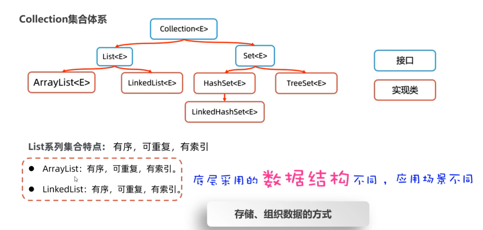  
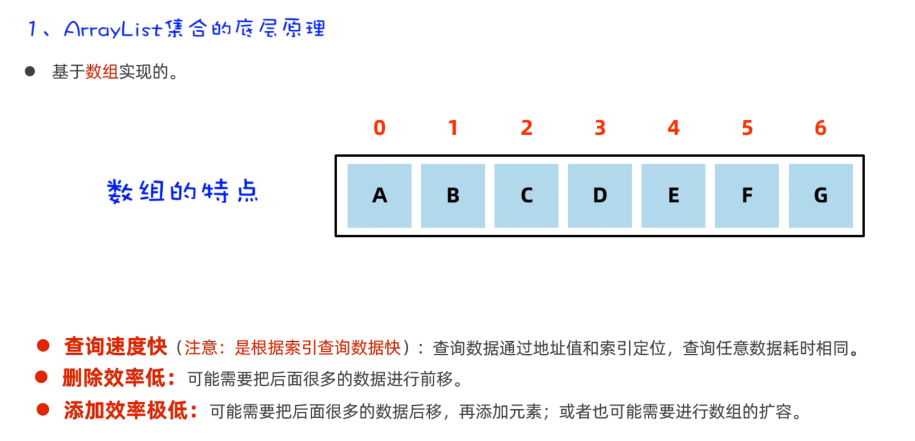  
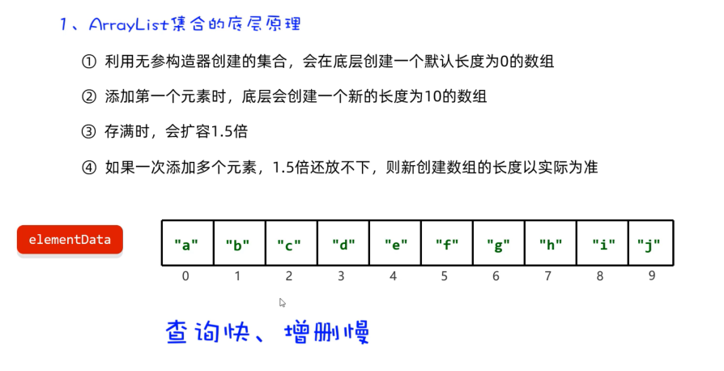  
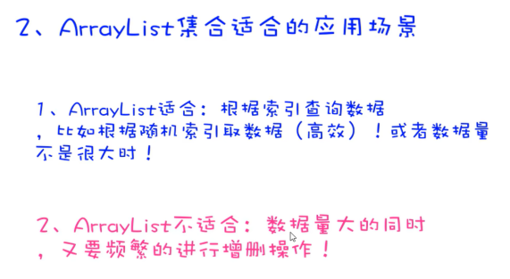  
4. LinkedList集合的底层原理  
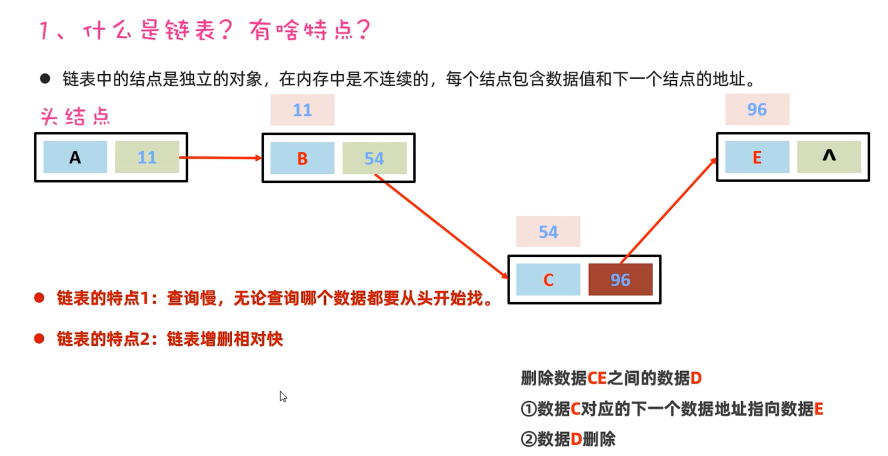  
  
  
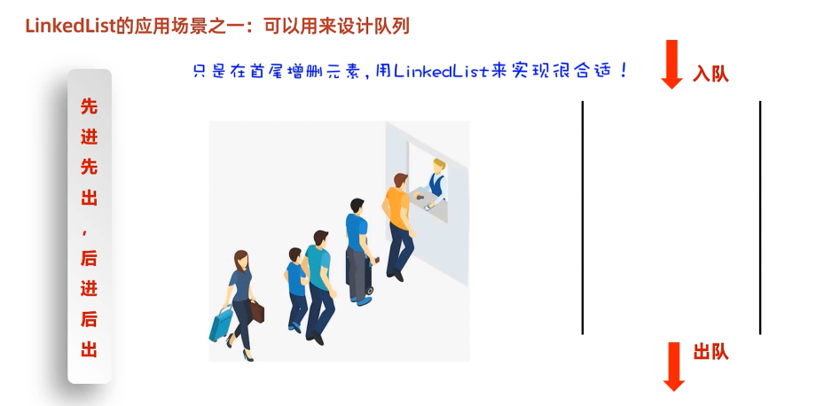  
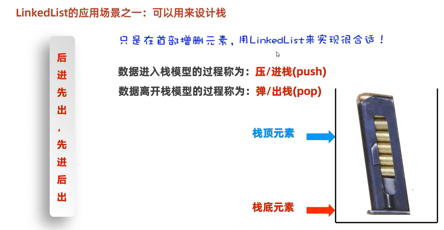  
```java
package com.itheima.collection_list;

// TODO linkedList集合的使用

import java.util.LinkedList;

public class ListTest2 {
    public static void main(String[] args) {
        // 1.创建一个队列
        LinkedList<String> queue = new LinkedList<>();
        queue.addLast("第一号人");
        queue.addLast("第二号人");
        queue.addLast("第三号人");
        queue.addLast("第四号人");
        System.out.println(queue);// [第一号人, 第二号人, 第三号人, 第四号人]

        // 出队
        System.out.println(queue.removeFirst());// 第一号人
        System.out.println(queue.removeFirst());// 第二号人
        System.out.println(queue.removeFirst());// 第三号人
        System.out.println(queue);// [第四号人]

        System.out.println("------------------------------");

        // 1.创建一个栈对象
        LinkedList<String> stack = new LinkedList<>();
        // 压栈  push
        stack.push("第一颗子弹");
        stack.push("第二颗子弹");
        stack.push("第三颗子弹");
        stack.push("第四颗子弹");
        System.out.println(stack);// [第四颗子弹, 第三颗子弹, 第二颗子弹, 第一颗子弹]
        // 出栈 pop
        System.out.println(stack.pop());// 第四颗子弹
        System.out.println(stack.pop());// 第三颗子弹
        System.out.println(stack.pop());// 第二颗子弹
        System.out.println(stack);// [第一颗子弹]
    }
}

```

###  Set集合  
1.  特点  
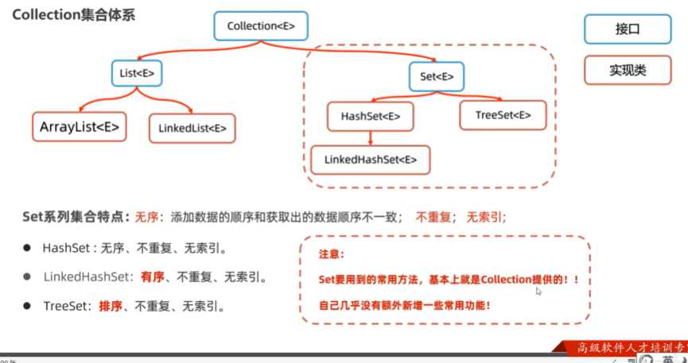  
```java
package com.itheima.collection_set;

import java.util.HashSet;
import java.util.LinkedHashSet;
import java.util.Set;
import java.util.TreeSet;

// TODO Set系列集合的特点
public class SetTest1 {
    public static void main(String[] args) {
        // 1.创建一个Set集合的对象
        // Set<Integer> set = new HashSet<>();// 创建了一个HashSet的集合对象  经典代码 无序不重复无索引
        // Set<Integer> set = new LinkedHashSet<>();// 有序 不重复 无索引  [666, 555, 888, 777]
        Set<Integer> set = new TreeSet<>();// 可排序 不重复 无索引  [555, 666, 777, 888]
        set.add(666);
        set.add(555);
        set.add(555);
        set.add(888);
        set.add(888);
        set.add(777);
        set.add(777);
        System.out.println(set);//
    }
}

```
2.  HashSet集合的底层原理  
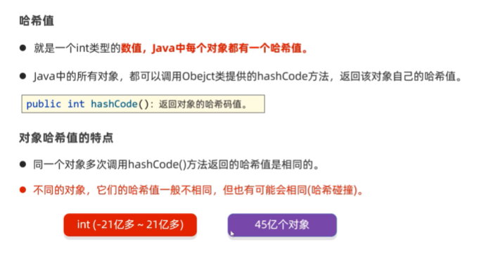  
```java
package com.itheima.collection_set;

public class SetTest2 {
    public static void main(String[] args) {
        Student s1 = new Student("蜘蛛精",25,169.5);
        Student s2 = new Student("紫霞",22,166.5);
        System.out.println(s1.hashCode());// 990368553
        System.out.println(s1.hashCode());// 990368553
        System.out.println(s2.hashCode());// 1096979270

        String str1 = new String("abc");
        String str2 = new String("acD");
        System.out.println(str1.hashCode());// 96354
        System.out.println(str2.hashCode());// 96354
    }
}

```
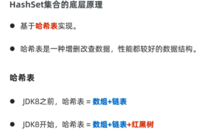  
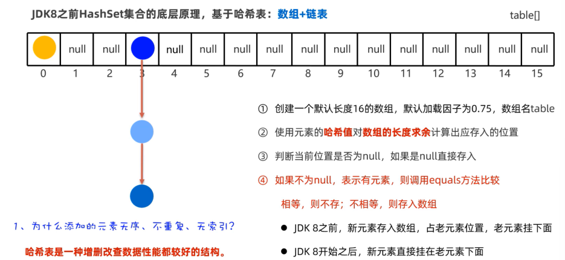   
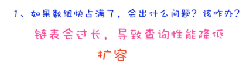  
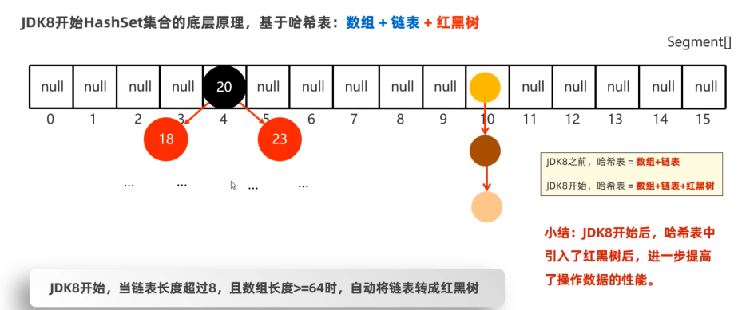  
  
  

3.  LinkedHashSet集合的底层原理  
  
4.  TreeSet集合  
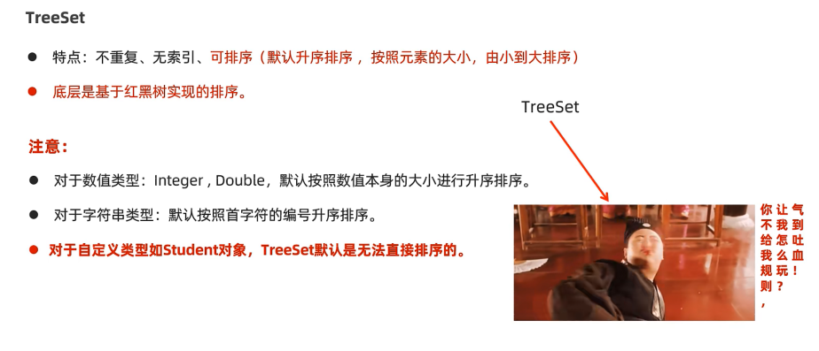  
```java
package com.itheima.collection_set;

import java.util.Set;
import java.util.TreeSet;

// TODO TreeSet集合的使用
public class SetTest4 {
    public static void main(String[] args) {
        Set<Integer> set1 = new TreeSet<>();
        set1.add(6);
        set1.add(5);
        set1.add(5);
        set1.add(7);
        System.out.println(set1);// [5, 6, 7]
    }
}

```
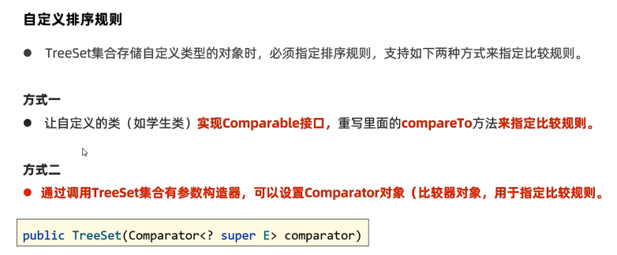  
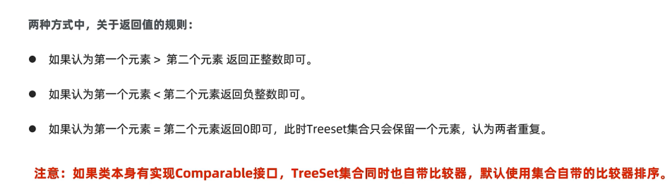  
  
  

###  Collection集合的并发修改异常问题  
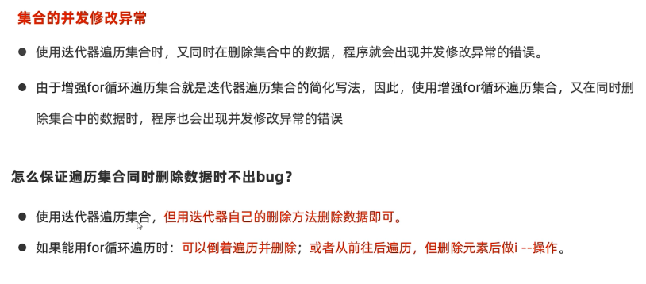  
```java
package com.itheima.collection_exception;

import java.util.ArrayList;
import java.util.Iterator;
import java.util.List;

// TODO 集合的并发修改异常问题并解决
public class CollectionTest1 {
    public static void main(String[] args) {
        List<String> list = new ArrayList<>();
        list.add("王麻子");
        list.add("小李子");
        list.add("李爱花");
        list.add("张全蛋");
        list.add("晓李");
        list.add("李玉刚");
        System.out.println(list);
        // [王麻子, 小李子, 李爱花, 张全蛋, 晓李, 李玉刚]

        // 需求：找出集合中全部带李的名字并从集合中删除
       /* Iterator<String> it =  list.iterator();
        while (it.hasNext()){
            String name = it.next();
            if (name.contains("李")){
                list.remove(name);
            }
        }
        System.out.println(list);*/

        // 使用for循环遍历集合并删除集合中带李的名字
        /*for (int i = 0; i < list.size(); i++) {
            String name = list.get(i);
            if (name.contains("李")){
                list.remove(name);
            }
        }
        System.out.println(list);*/

        System.out.println("====================================");
        // 1. 怎么解决呢
        /*for (int i = 0; i < list.size(); i++) {
            String name = list.get(i);
            if (name.contains("李")){
                list.remove(name);
                i--;
            }
        }
        System.out.println(list);*/// [王麻子, 张全蛋]

        // 2. 怎么解决呢
       /* Iterator<String> it =  list.iterator();
        while (it.hasNext()){
            String name = it.next();
            if (name.contains("李")){
                // list.remove(name);//并发修改异常的错误
                it.remove();//删除迭代器当前遍历到的数据，每删除一个数据后，相当于也在底层做了i--
            }
        }
        System.out.println(list);*/// [王麻子, 张全蛋]

        // 使用增强for循环遍历集合并删除数据，没有办法解决bug
        /*for (String name : list) {
            if (name.contains("李")){
                list.remove(name);
            }
        }
        System.out.println(list);*/

        // 并发修改异常
        list.forEach(name ->{
            if (name.contains("李")){
                list.remove(name);
            }
        } );
        System.out.println(list);
    }
}

```


  
 
