## 面向对象高级一  

###  static  
1.  static修饰成员变量  
  
  
  
2. static修饰成员变量的应用场景   
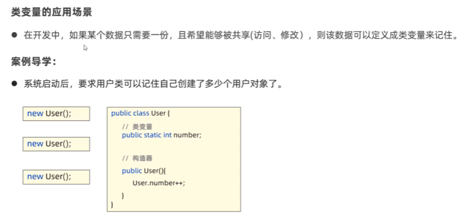  
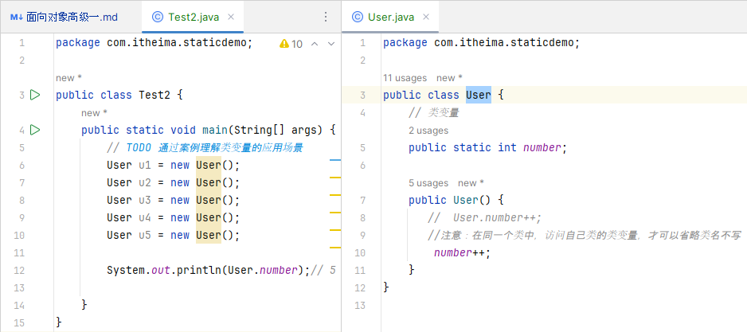  
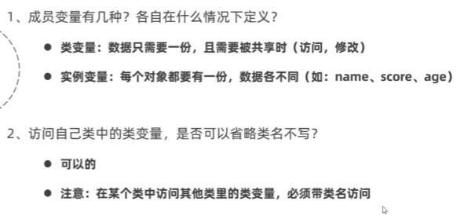  
3. static修饰成员方法  
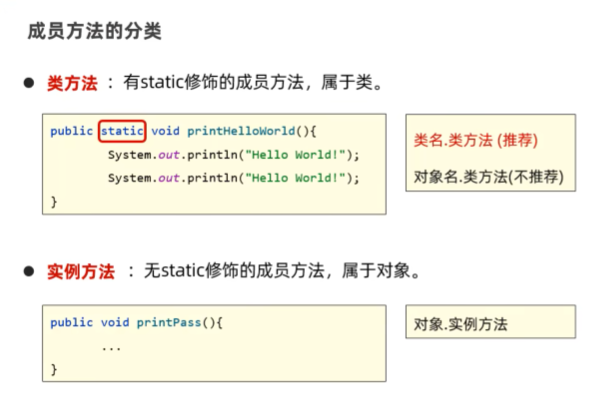  
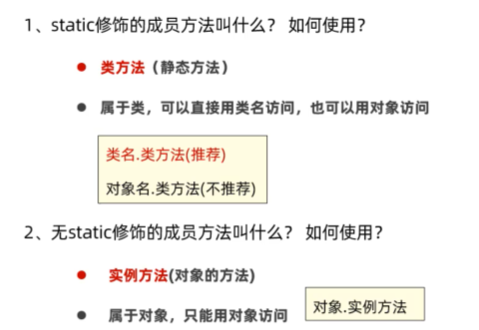  
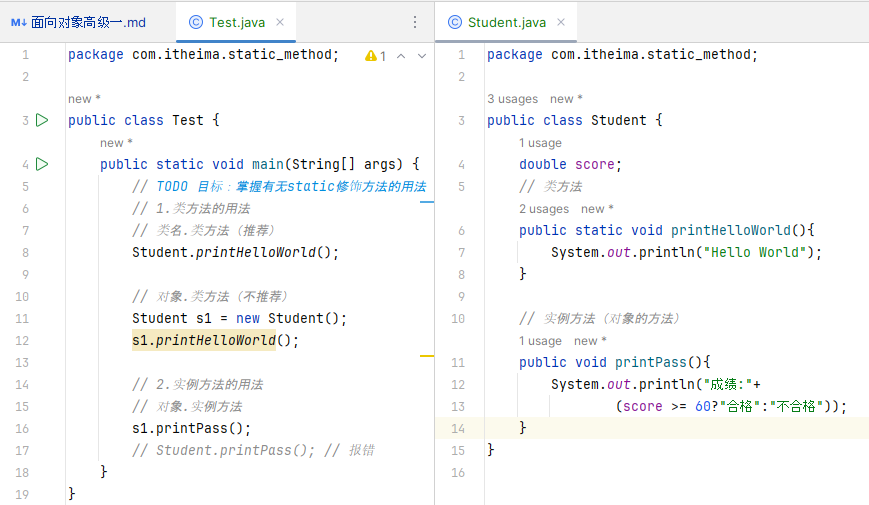   
4. static修饰成员方法的应用场景  
   
  
  
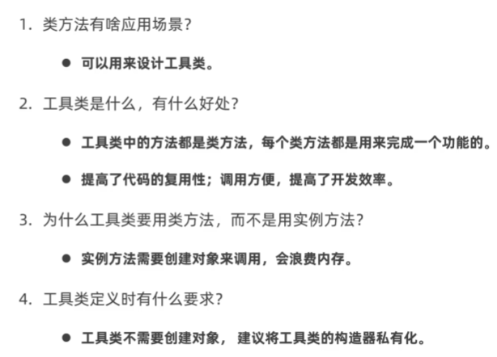  
5. static的注意事项  
  
```JAVA
package com.itheima.static_attention;

public class Student {
    static String schoolName;// 类变量
    double score;// 实例变量
    // 1.
    public static void printHelloWorld(){
        // 注意：同一个类中访问类成员，可以省略类名不写
        Student.schoolName = "黑马";
        Student.printHelloWorld2();

        // System.out.println(score);//报错
        // printPass();//报错

        // System.out.println(this);//报错
    }
    public static void printHelloWorld2(){

        // 类方法
    }
    // 2.
    // 实例方法
    // 3.
    public  void printPass(){
        schoolName = "黑马2";
        printHelloWorld2();

        System.out.println(score);
        printPass2();
        System.out.println(this);
    }
    // 实例方法
    public void printPass2(){

    }
}

```
6. static的应用知识：代码块 
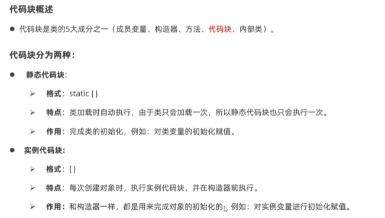  
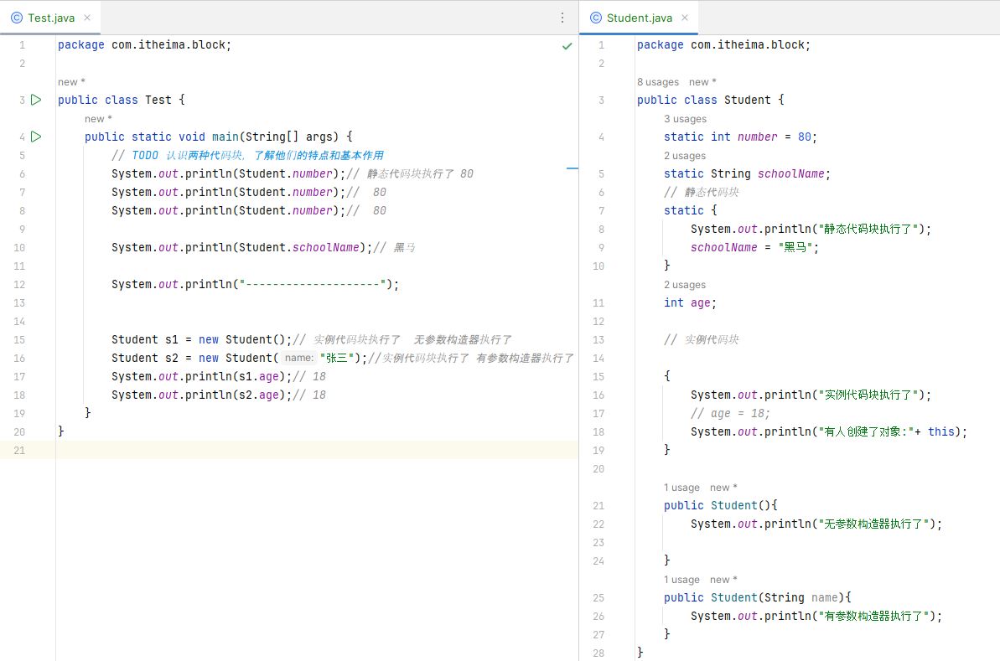  
7. static的应用知识：单例设计模式
  
  
  
  
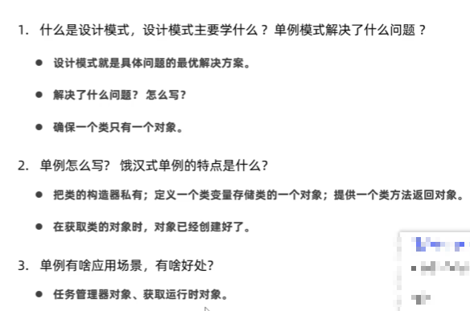  
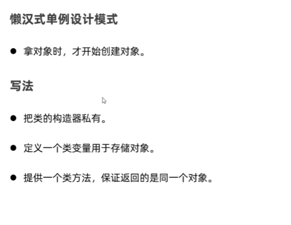  
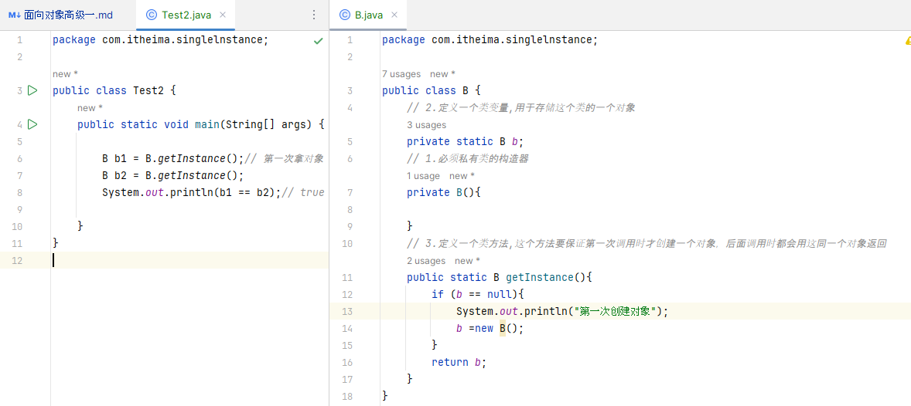  


## 总结    
1. static可以修饰成员变量和成员方法    
   根据有无static修饰成员变量：  
   ①有static修饰：  
                类变量   属于类，在计算机里只有一份，会被类的全部对象共享  static String name;  
                用法：类名.类变量  
   ②无static修饰：  
                实例变量（对象的变量） 属于每个对象的变量，每个对象中都有一份 int age;  
                用法：对象.实例变量  

   根据有无static修饰成员方法：  
   ①有static修饰：  
                类方法：  
                用法：类名.类方法    
   ②无static修饰：  
                实例方法：  
                用法：对象.实例方法   
2. 注意事项：  
   ①类方法访问：类的成员 √   实例成员 ×  
    实例方法访问：类的成员 √   实例成员 √  
   ②可否有this:类方法×    实例方法√  

###  继承  
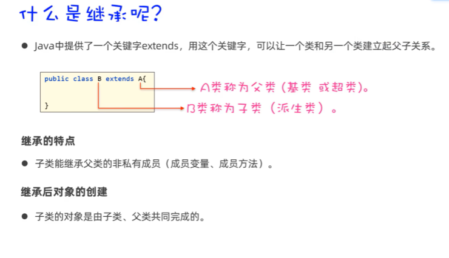  
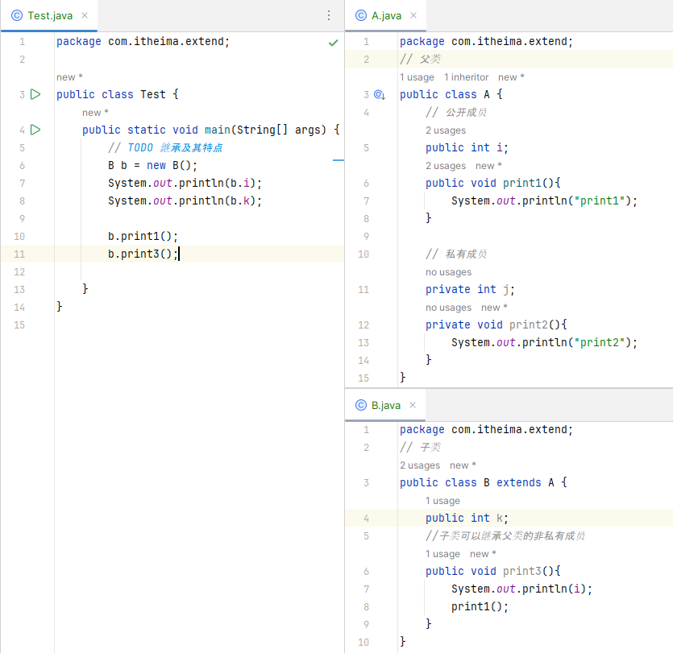  
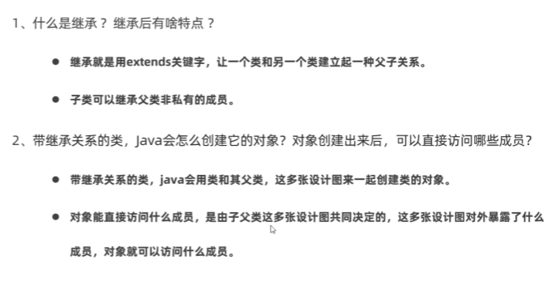  
  
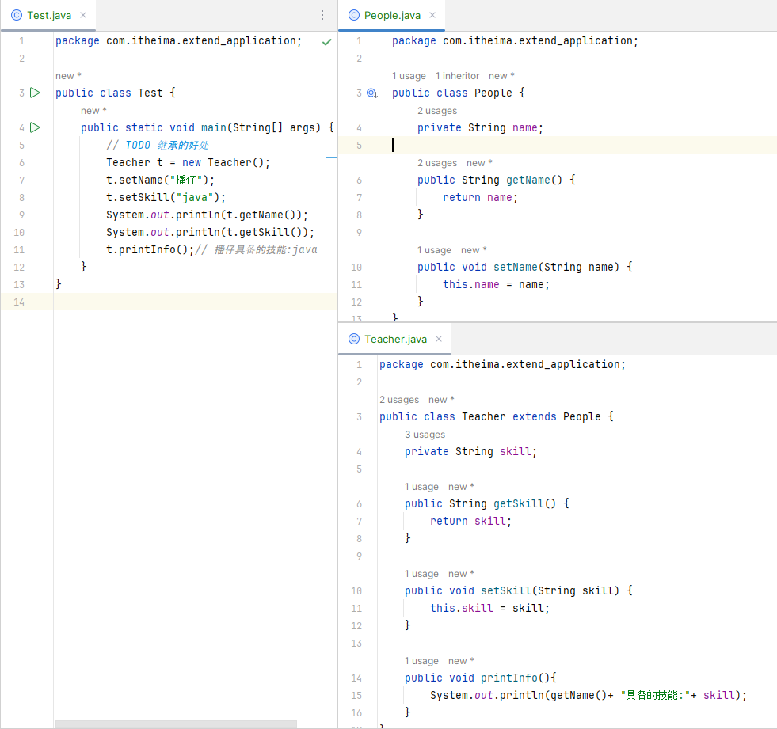  
1.  权限修饰符  
  
  
2.  单继承，Object类  
  
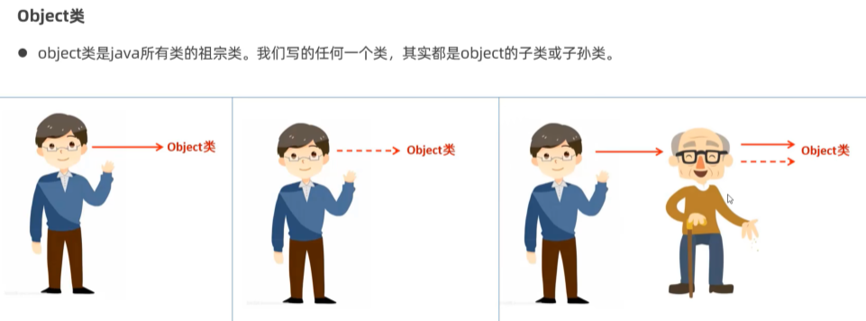  
  
```JAVA
package com.itheima.extend_feature;

public class Test {
    public static void main(String[] args) {
        // TODO 继承的两个注意事项
        A a = new A();

        B b = new B();
    }
}

class A{} // extends Object {}
class B extends A{}
//  class C extends B,A{}  // 报错
class D extends B{}
```
3.  方法重写  
声明不变，重新实现  
  
   
  
  
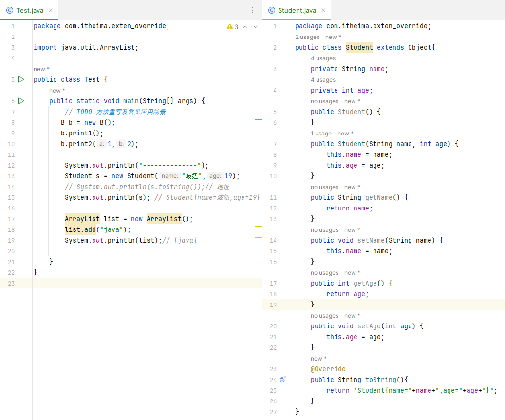  
  
4.  子类中访问其他成员的特点  
  
  
5.  子类构造器的特点  
  
```java
package com.itheima.exten_constructor;

import java.sql.SQLOutput;

class F{
    public F() {
        System.out.println("父类F的 无参数构造器 执行了");
    }
}
class Z extends F{
    public Z() {
        // super();// 默认存在
        System.out.println("子类Z的 无参数构造器 执行了");
    }

    public Z(String name) {
        // super();// 默认存在
        System.out.println("子类Z的 有参数构造器 执行了");
    }
}
public class Test {
    public static void main(String[] args) {
        // TODO 子类构造器的特点及其常见应用场景
        Z z = new Z();
        // 父类F的 无参数构造器 执行了   子类Z的 无参数构造器 执行了
        Z z2 = new Z("张三");
        // 父类F的 无参数构造器 执行了   子类Z的 有参数构造器 执行了
    }
}

```
   
```java
package com.itheima.exten_constructor;

public class Test2 {
    public static void main(String[] args) {
        // TODO 子类构造器调用父类构造器，应用场景
        Teacher t = new Teacher("李四",36,"java");
        System.out.println(t.getName());// 李四
        System.out.println(t.getAge());// 36
        System.out.println(t.getSkill());// java
    }
}

class Teacher extends People{
    private String skill;

    public Teacher(String name, int age, String skill) {
       super(name,age);
       this.skill=skill;
    }

    public String getSkill() {
        return skill;
    }

    public void setSkill(String skill) {
        this.skill = skill;
    }
}

class People{
    private String name;
    private int age;

    public People() {
    }

    public People(String name, int age) {
        this.name = name;
        this.age = age;
    }

    public String getName() {
        return name;
    }

    public void setName(String name) {
        this.name = name;
    }

    public int getAge() {
        return age;
    }

    public void setAge(int age) {
        this.age = age;
    }
}
```
6.  补充知识  
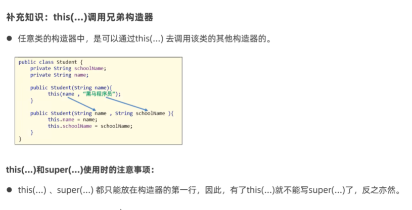  
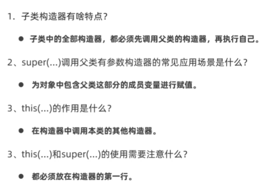  
```java
package com.itheima.exten_constructor;

public class Test3 {
    public static void main(String[] args) {
        // TODO 在构造器中，通过this(...)调用兄弟构造器的作用
        Student s1 = new Student("李四",36,"东京大学");

        // 需求：如果学生没有填写学校，那么学校默认就是黑马程序员
        Student s2 = new Student("张三",28);
        System.out.println(s2.getName()); //张三
        System.out.println(s2.getAge()); // 28
        System.out.println(s2.getSchoolName());// 黑马程序员
    }
}

class Student{
    private String name;
    private int age;
    private String schoolName;

    public Student() {
    }

    public Student(String name, int age){
        this(name,age,"黑马程序员");
    }

    public Student(String name, int age, String schoolName) {
        this.name = name;
        this.age = age;
        this.schoolName = schoolName;
    }

    public String getName() {
        return name;
    }

    public void setName(String name) {
        this.name = name;
    }

    public int getAge() {
        return age;
    }

    public void setAge(int age) {
        this.age = age;
    }

    public String getSchoolName() {
        return schoolName;
    }

    public void setSchoolName(String schoolName) {
        this.schoolName = schoolName;
    }
}

```


        
        
 
