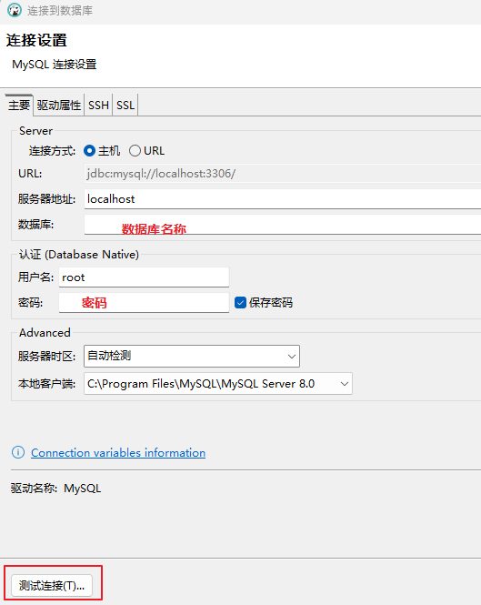

## 字面量
  


```java
package com.itheima.literal;

public class LiteralDemo {
    public static void main(String[] args) {
        // 常见数据在程序中的书写格式
        // 1.整数
        System.out.println(666);

        // 2.小数
        System.out.println(99.5);

        // 3.字符：必须要用单引号围起来，有且只能有一个字符
        System.out.println('a');
        System.out.println('0');
        System.out.println('中');
        System.out.println(' ');// 空字符
        // System.out.println('');必须有一个字符
        // 特殊的字符：\n 代表的是换行的意思 \t代表的是一个tab
        System.out.println('中');
        System.out.println('\n');
        System.out.println('国');
        System.out.println('\t');

        // 4.字符串：必须用双引号围起来，里面的内容其实可以随意
        System.out.println("我爱你中国abc");
        System.out.println("");
        System.out.println("  ");
        System.out.println("我");
        
        // 5.布尔值：只有两个值 true false
        System.out.println(true);
        System.out.println(false);
    }
}

```
## 变量  
  
  
  
  
```java
package com.itheima.variable;

public class VariableDemo1  {
    public static void main(String[] args) {
        // TODO 目标：认识变量，掌握使用变量的好处，变量的特点，应用场景
        // TODO 1.定义一个整型变量，记住一个整数
        // TODO 数据类型 变量名 = 数据;
        int age = 23;
        System.out.println(age);

        // TODO 2.记住一个人的成绩
        double score = 99.5;
        System.out.println(score);

        // TODO 3.使用变量的好处，便于扩展和维护
        int number = 888;
        System.out.println(number);
        System.out.println(number);
        System.out.println(number);
        System.out.println(number);
        System.out.println(number);
        System.out.println(number);

        // TODO 4.变量的特点：里面装的数据可以被替换
        int age2 = 18;
        System.out.println(age2);

        age2 = 19;
        System.out.println(age2);

        age2 = age2 + 1;
        System.out.println(age2);

        // TODO 5.需求：钱包有9.5元 收到了10元红包 又发出去了5元红包 请输出各阶段钱包的情况
        double money = 9.5;
        System.out.println(money);
        money = money + 10;
        System.out.println(money);
        money = money - 5;
        System.out.println(money);

    }
}

```
  
  
```java
package com.itheima.variable;

public class VariableDemo2 {
    public static void main(String[] args) {
        // TODO 使用变量的注意事项
        // TODO 1.变量要先声明才能使用
        int age = 18;
        System.out.println(age);

        // TODO 2.变量是什么类型，就应该用来装什么类型的数据，否则报错
        //age = 9.8;

        // TODO 3.变量是从定义开始到“}”截止的范围内有效，且同一个范围内，定义的多个变量，他们的名称不能一样
        {
            int a = 19;
            //int a = 23;
            System.out.println(a);
        }
        //System.out.println(a);大括号外不可以访问
        System.out.println(age);
        int a = 23;
        //int age = 25;
        // TODO 4.变量定义的时候可以不赋初始值，但在使用时，变量里必须有值，否则报错
        int number;
        number = 100;
        System.out.println(number);
    }
}

```

## 关键字 标志符  
  
  
  


