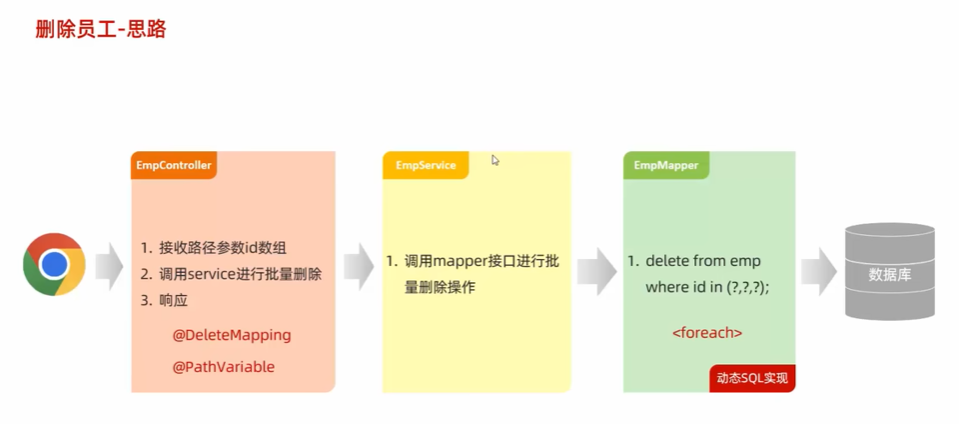
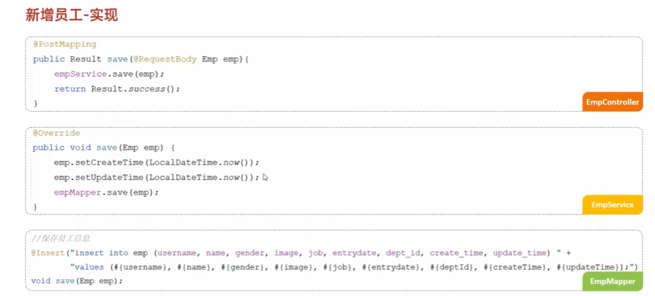
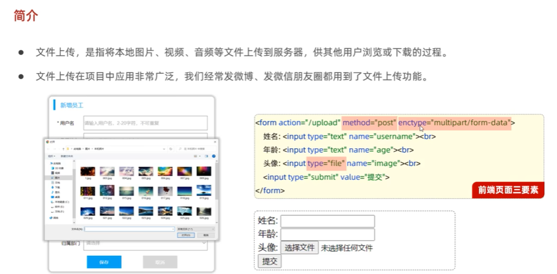
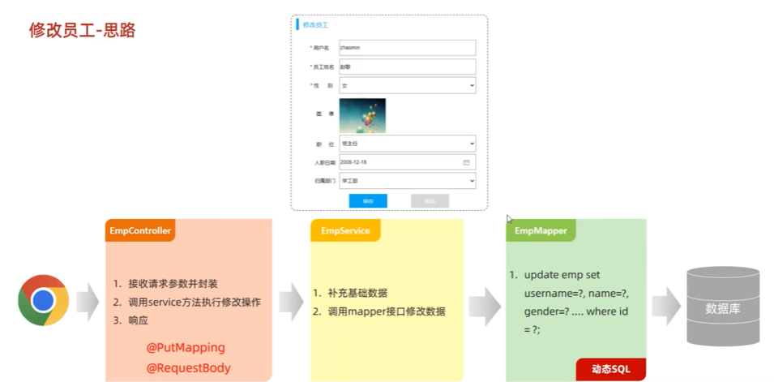
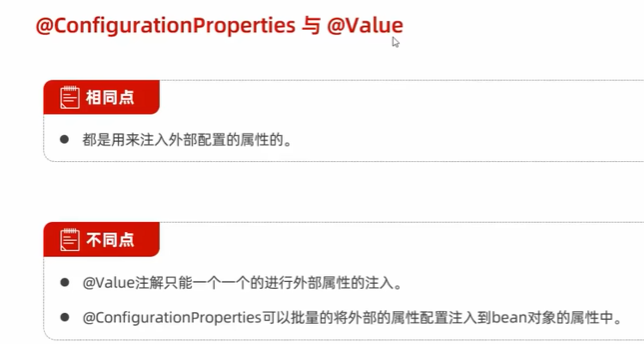
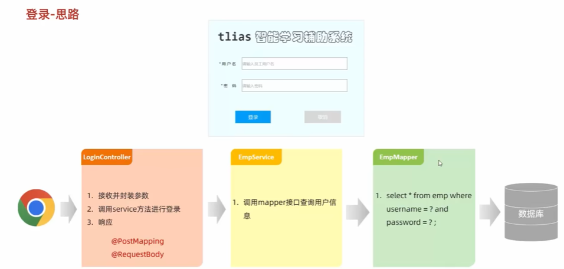

# 程序流程控制  
## 分支结构   
### if
  
  
  
  
  
  
```JAVA
package com.itheima.branch;

public class IfDemo1 {
    public static void main(String[] args) {
        // TODO 掌握if分支三种形式的用法和执行流程
        // 需求：测量用户体温，高于37度就报警
        double t = 38.9;
        if ( t>37 ){
            System.out.println("体温异常");
        }

        // 需求；发红包：余额99元，发出90元。余额够，发红包；余额不足则需提示
        double money = 82;
        if (money >= 90){
            System.out.println("发红包！");
        }else {
            System.out.println("余额不足");
        }

        // 需求：绩效系统根据员工打分输出对应的绩效级别
        //0-60；D    60-80：C      80-90：B     90-100：A
        int score = 78;
        if (score >= 0 && score < 60){
            System.out.println("D");
        } else if (score >= 60 && score < 80) {
            System.out.println("C");
        }else if (score >= 80 && score < 90) {
            System.out.println("B");
        }else if (score >= 90 && score <= 100) {
            System.out.println("A");
        }else {
            System.out.println("输入错误");
        }
    }
}

```
### switch
  
  
  
  
  
```java
package com.itheima.branch;

public class SwitchDemo2 {
    public static void main(String[] args) {
        // TODO 掌握switch的写法，理解其执行流程
        // 周一：111   周二：222   周三：333
        // 周四：444  周五：555  周六：666   周日：777
        String week = "周日";
        switch(week){
            case "周一":
                System.out.println("111");
                break;
            case "周二":
                System.out.println("222");
                break;
            case "周三":
                System.out.println("333");
                break;
            case "周四":
                System.out.println("444");
                break;
            case "周五":
                System.out.println("555");
                break;
            case "周六":
                System.out.println("666");
                break;
            case "周日":
                System.out.println("777");
                break;
            default:
                System.out.println("其他");
        }
    }
}

```

## 循环结构   
### for
  
  
  
  
  
  
  

```JAVA
package com.itheima.loop;

import java.sql.SQLOutput;

public class ForDemo1 {
    public static void main(String[] args) {
        // TODO 掌握for循环的书写格式并理解其执行流程
        // 需求：打印5行Hello World
        for (int i = 0; i < 5;i++){
            // i = 0 1 2 3 4  五遍
        System.out.println("Hello World");
        }
    }
}

```
```java
package com.itheima.loop;

public class ForDemo2 {
    public static void main(String[] args) {
        // TODO 掌握使用for循环批量产生数据
        for (int i = 1; i <= 100 ; i++) {
            System.out.println(i);
        }

        // 需求：求1-5的数据和
        // 2.定义一个变量用于求和
        int sum = 0;
        // 1.定义一个循环，先产生1-5，这五个数
        for (int i = 1; i <= 5; i++) {
            sum += i;
        }
        System.out.println(sum);
        
        // 需求：1-100的奇数和(方法1)
        // 2.定义一个变量用于求和
        int sum1 = 0;
        // 1.定义一个循环，产生1-100之间的奇数
        for (int i = 1; i < 100; i+=2) {
            sum1 += i;
        }
        System.out.println(sum1);

        // 需求：1-100的奇数和(方法2)
        // 3.定义一个变量用于累加奇数求和
        int sum2 = 0;
        // 1.定义一个循环，产生1-100之间的每个数据
        for (int i = 1; i <= 100 ; i++) {
            // 2.使用一个if分支，判断i此时记住的数据是否是奇数，是奇数我们才累加给一个变量
            if (i % 2 == 1){
                sum2 += i;
            }
            System.out.println(sum2);
        }
    }
}

```
### while
  
  
```java
package com.itheima.loop;

public class WhileDemo3 {
    public static void main(String[] args) {
        // TODO 掌握While循环的书写格式，理解其执行流程
        // 打印五行Hello World
        int i = 0;
        while (i<5){
            System.out.println("Hello World");
            i++;
        }
    }
}

```
  
  
```java
package com.itheima.loop;

public class WhileTest4 {
    public static void main(String[] args) {
        // TODO 使用While循环解决问题，并理解什么情况下使用While，for
        // 1.定义变量，记住珠穆朗玛峰的高度和纸张的高度
        double peakHeight = 8848860;
        double paperThickness = 0.1;

        // 3.定义一个变量count 用于记住纸张折叠了多少次
        int count = 0;

        // 2.定义While循环，控制纸张开始折叠
        while (paperThickness < peakHeight){
            // 把纸张进行折叠 把纸张的厚度变成原来的两倍
            paperThickness = paperThickness * 2;
            count++;
        }
        System.out.println(count);
        System.out.println(paperThickness);
    }
}

```
### do-while  
  
```java
package com.itheima.loop;

public class DoWhileDemo5 {
    public static void main(String[] args) {
        // TODO 掌握DoWhile循环的书写格式，执行流程，特点和应用场景
        // 需求 打印三行Hello World
        int i = 0;
        do {
            System.out.println("Hello World");
            i++;
        }while (i<3);

        //特点：先执行后判断
    }
}

```
  

### 死循环  
  
```java
package com.itheima.loop;

public class EndLessLoopDemo6 {
    public static void main(String[] args) {
        // TODO 掌握死循环的写法
        /* for (; ;){
           // System.out.println("Hello World");
        } */

        /* while(true){
            System.out.println("Hello World1");
        } */

        do {
            System.out.println("Hello World2");
        }while (true);
    }
}

```
### 循环嵌套   
  
```JAVA
package com.itheima.loop;

public class LoopNestedDemo7 {
    public static void main(String[] args) {
        // TODO 掌握循环嵌套的执行流程
        // 3天 每天5句我爱你
        for (int i = 1;i <= 3;i++){
            for (int j = 1;j <= 5;j++){
            System.out.println("我爱你:"+ i);
            }
            System.out.println("========================");
        }

        //打印三行四列星星
        for (int i = 1; i <= 3; i++) {
            // 定义一个循环控制每行打印多少列星星
            for (int j = 1; j <= 4 ; j++) {
                System.out.print("*");
            }
            System.out.println();//换行
        }
    }
}

```
### 跳转关键字  
  

```java
package com.itheima.loop;

public class BreakAndContinueDemo8 {
    public static void main(String[] args) {
        // TODO 掌握Break和Continue的作用
        // Break：跳出并结束当前所在循环的执行
        // 说5句我爱你，说完第三句，别说了
        for (int i = 1; i <= 5 ; i++) {
            System.out.println("我爱你:"+ i);
            if (i==3){
                //已经说完了第三句了
                break;//跳出并结束当前所在循环的执行
            }
        }

        //Continue:跳出当前循环的当次执行，直接进入循环的下一次执行
        //洗碗5天，第三天不用洗，但之后还是要洗
        for (int i = 1; i <= 5 ; i++) {
            if (i == 3){
               // 第三天不用洗
                continue;
            }
            System.out.println("洗碗:"+ i);
        }
    }
}

```
