## 字面量  
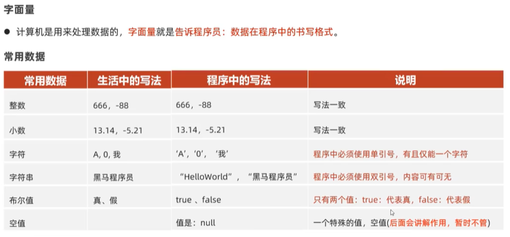     
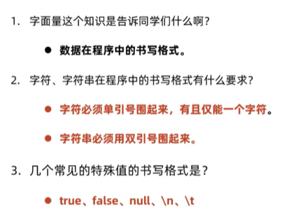    
```java    
package com.itheima.literal;

public class LiteralDemo {
    public static void main(String[] args) {
        // 常见数据在程序中的书写格式
        // 1.整数
        System.out.println(666);

        // 2.小数
        System.out.println(99.5);

        // 3.字符：必须要用单引号围起来，有且只能有一个字符
        System.out.println('a');
        System.out.println('0');
        System.out.println('中');
        System.out.println(' ');// 空字符
        // System.out.println('');必须有一个字符
        // 特殊的字符：\n 代表的是换行的意思 \t代表的是一个tab
        System.out.println('中');
        System.out.println('\n');
        System.out.println('国');
        System.out.println('\t');

        // 4.字符串：必须用双引号围起来，里面的内容其实可以随意
        System.out.println("我爱你中国abc");
        System.out.println("");
        System.out.println("  ");
        System.out.println("我");
        
        // 5.布尔值：只有两个值 true false
        System.out.println(true);
        System.out.println(false);
    }
}
```
## 变量  
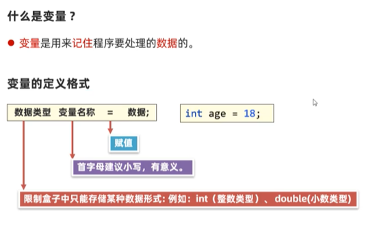    
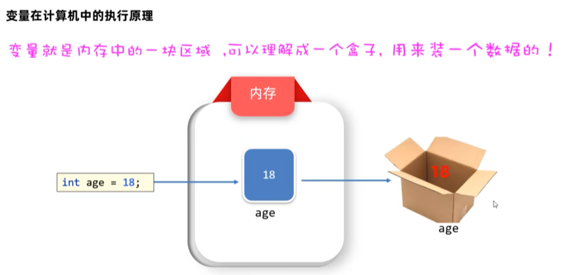    
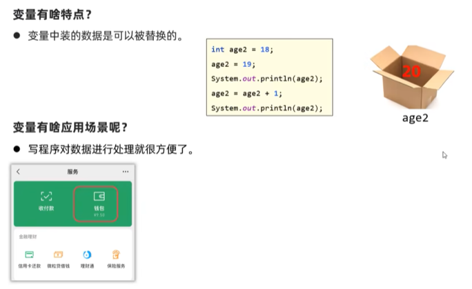    
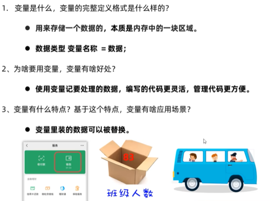    
```java
package com.itheima.variable;

public class VariableDemo1  {
    public static void main(String[] args) {
        // TODO 目标：认识变量，掌握使用变量的好处，变量的特点，应用场景
        // TODO 1.定义一个整型变量，记住一个整数
        // TODO 数据类型 变量名 = 数据;
        int age = 23;
        System.out.println(age);

        // TODO 2.记住一个人的成绩
        double score = 99.5;
        System.out.println(score);

        // TODO 3.使用变量的好处，便于扩展和维护
        int number = 888;
        System.out.println(number);
        System.out.println(number);
        System.out.println(number);
        System.out.println(number);
        System.out.println(number);
        System.out.println(number);

        // TODO 4.变量的特点：里面装的数据可以被替换
        int age2 = 18;
        System.out.println(age2);

        age2 = 19;
        System.out.println(age2);

        age2 = age2 + 1;
        System.out.println(age2);

        // TODO 5.需求：钱包有9.5元 收到了10元红包 又发出去了5元红包 请输出各阶段钱包的情况
        double money = 9.5;
        System.out.println(money);
        money = money + 10;
        System.out.println(money);
        money = money - 5;
        System.out.println(money);

    }
}

```
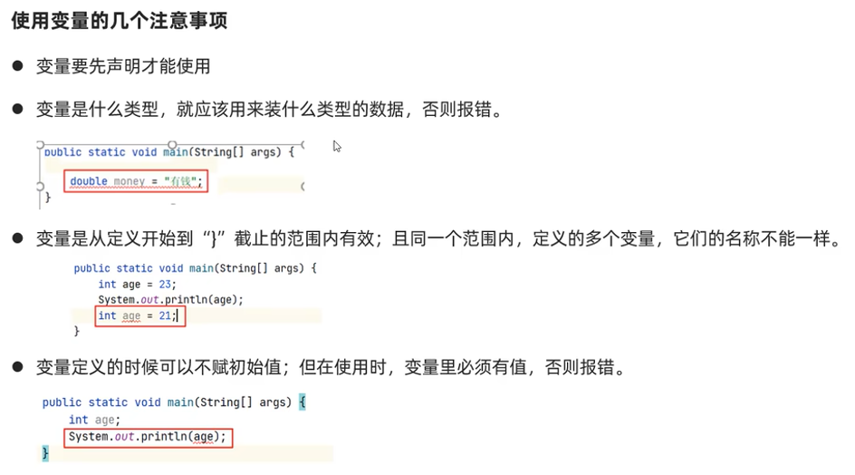  
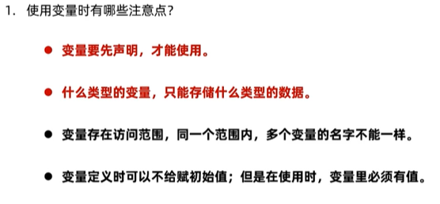  
```java
package com.itheima.variable;

public class VariableDemo2 {
    public static void main(String[] args) {
        // TODO 使用变量的注意事项
        // TODO 1.变量要先声明才能使用
        int age = 18;
        System.out.println(age);

        // TODO 2.变量是什么类型，就应该用来装什么类型的数据，否则报错
        //age = 9.8;

        // TODO 3.变量是从定义开始到“}”截止的范围内有效，且同一个范围内，定义的多个变量，他们的名称不能一样
        {
            int a = 19;
            //int a = 23;
            System.out.println(a);
        }
        //System.out.println(a);大括号外不可以访问
        System.out.println(age);
        int a = 23;
        //int age = 25;
        // TODO 4.变量定义的时候可以不赋初始值，但在使用时，变量里必须有值，否则报错
        int number;
        number = 100;
        System.out.println(number);
    }
}

```
## 关键字 标志符  
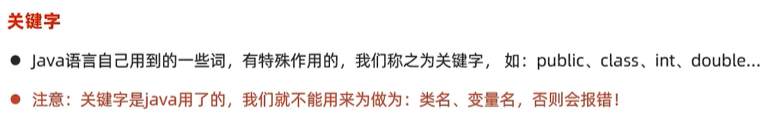  
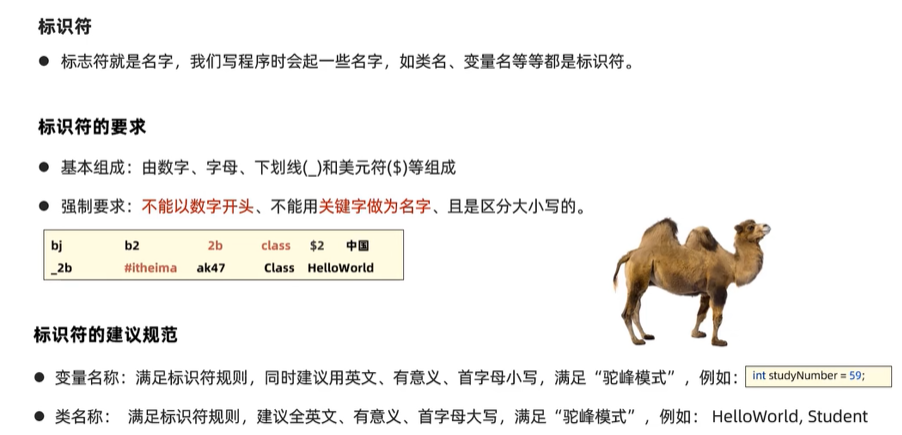  
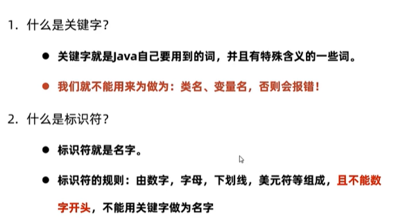  

## 数据类型  
1.  基本数据类型：4大类8种   
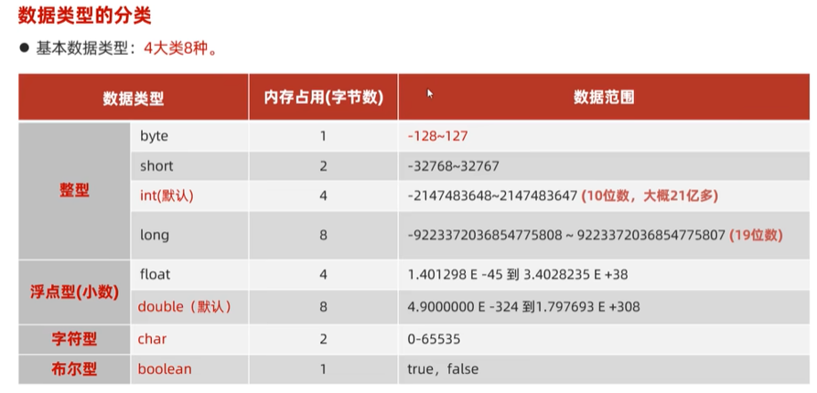  
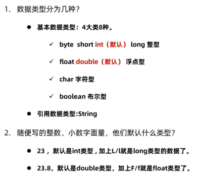  
```dtd
java
        package com.itheima.variable;

        public class VariableDemo3 {
        public static void main(String[] args) {
        // TODO 基本数据类型的使用
        // TODO 1.byte short int long
        byte a = 127;//-128-127
        // byte a2 = 128;//越界了

        short s = 13244;
        // short s1 = 93244;//越界了

        int i = 422424;//默认

        // 注意：随便写一个整型字面量默认是int类型的，424242244444虽然没有超过long的范围，但是超过了本身int类型的范围
        // 如果希望随便写一个整型字面量默认是long类型的，需要在后面加上L/l
        long lg = 424242244444L;


        // TODO 2.float double
        // 注意：随便写小数字面量，默认是double，如果希望小数是float，后面加上F/f
        float f = 3.14F;

        double d = 56.45;

        // TODO 3.char 字符型
        char ch = '中';
        char ch2 = 'a';

        // TODO 4.boolean
        boolean flag = true;
        boolean flag2 = false;

        // TODO 5.扩展一种引用数据类型
        // String称之为字符串类型，定义的变量可以用于记住一个字符串数据
        String name = "张三";
        }
        }

```
## 类型转换  
1.  自动类型转换  
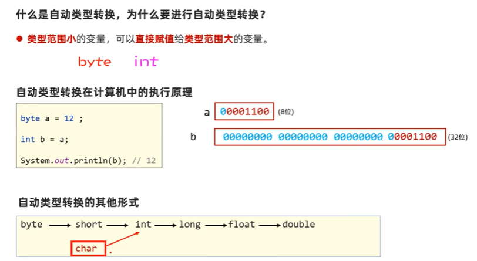  
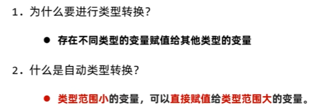  
```java
package com.itheima.type;

public class TypeConversionDemo1 {
    public static void main(String[] args) {
        // TODO 理解自动类型转换机制

        byte a = 12;
        int b = a;// 发生了自动类型转换
        System.out.println(a);
        System.out.println(b);

        int c = 100;// 4
        double d = c;// 8  发生了自动类型转换
        System.out.println(d);

        char ch = 'a';// 2
        int i = ch;// 发生了自动类型转换
        System.out.println(i);
    }
}

```
2.  表达式的自动类型转换 
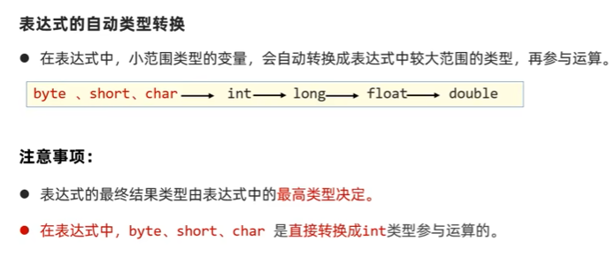  
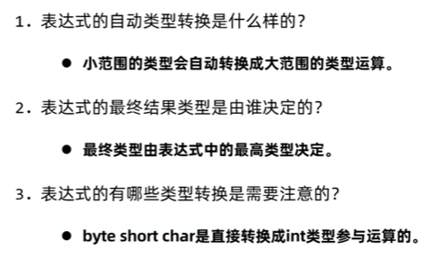  
```java
package com.itheima.type;

public class TypeConversionDemo2 {
    public static void main(String[] args) {
        // TODO 掌握表达式的自动类型转换机制
        byte a = 10;
        int b = 20;
        long c = 30;
        long rs = a + b + c;
        System.out.println(rs);

        double rs2 = a + b + 1.0;
        System.out.println(rs2);

        byte i = 10;
        short j = 30;
        int rs3 =i + j;
        System.out.println(rs3);

        // TODO 面试笔试题
        byte b1 = 10;
        byte b2 = 80;
        int b3 =b1+b2;
        System.out.println(b3);

    }
}

```
3.  强制类型转换  
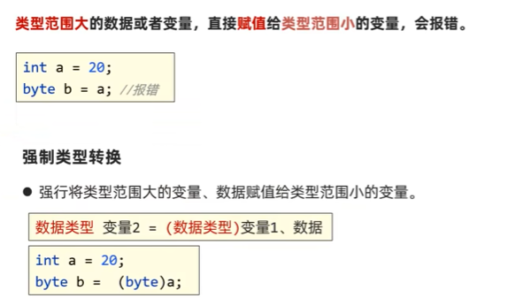  
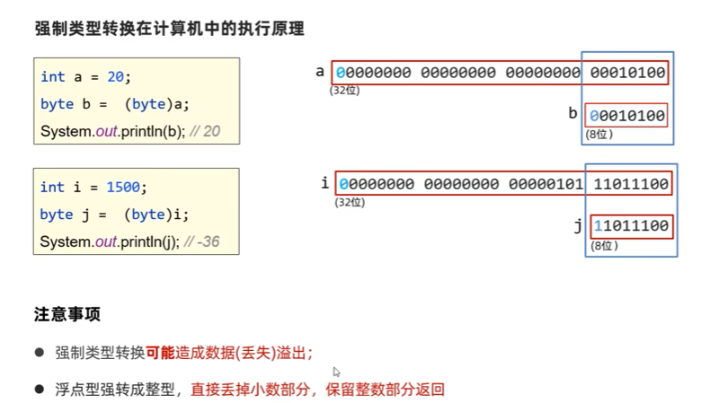  
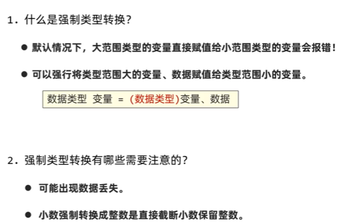  
```java
package com.itheima.type;

public class TypeConversionDemo3 {
    public static void main(String[] args) {
        // TODO 掌握强制类型转换
        int a = 20;
        byte b = (byte) a;// alt+回车 再回车 强制类型转换
        System.out.println(a);
        System.out.println(b);

        int i = 1500;
        byte j = (byte) i;// alt+回车 再回车 强制类型转换
        System.out.println(j);// -36

        double d = 99.5;
        int m = (int) d;// 强制类型转换
        System.out.println(m);// 99 丢掉小数部分 保留整数部分

    }
}

```
## 运算符  
1.  基本的算术运算符，+符号做连接符  
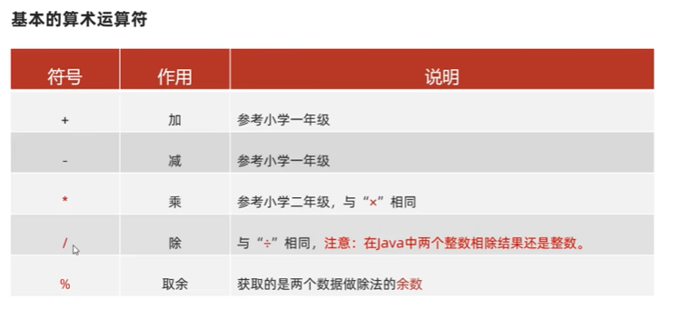  
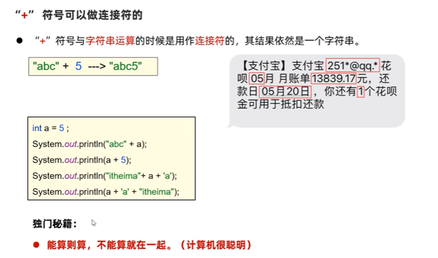  
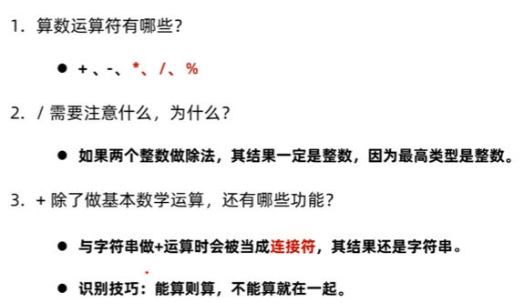
```java
   package com.itheima.operator;

public class OperatorDemo1 {
public static void main(String[] args) {
// TODO 掌握基本的算术运算符的使用
int a = 10;
int b =2;
System.out.println(a + b);
System.out.println(a - b);
System.out.println(a * b);// 20
System.out.println(a / b);// 5
System.out.println(5 / 2);// 2
System.out.println(5.0 / 2);// 2.5
int i = 5;
int j =2;
System.out.println(i*1.0 / j);// 2.5

        System.out.println(a % b);// 0
        System.out.println(3 % 2);// 1

        // TODO 掌握使用+符号做连接符的情况
        int a2 = 5;
        System.out.println("abc" + a2);// abc5
        System.out.println(a2 + 5);// 10
        System.out.println("itheima"+a2+'a');//itheima5a
        System.out.println(a2+'a'+"itheima");// 5+97+itheima  102itheima


    }
}

```
2.  自增自减运算符  
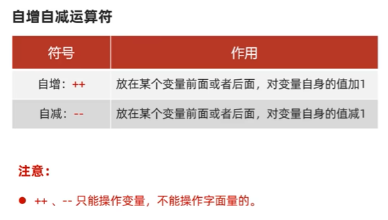  
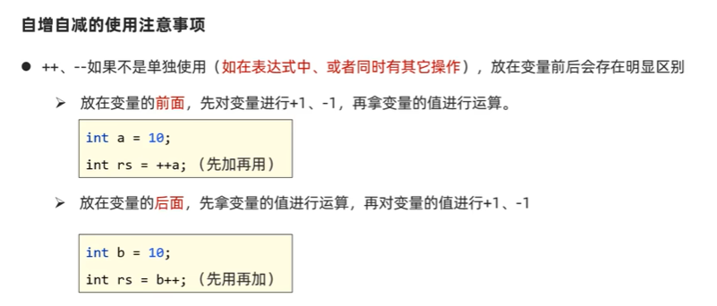  
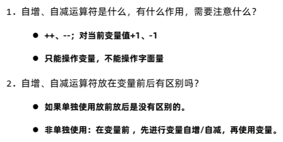  
```java
package com.itheima.operator;

public class OperatorDemo2 {
    public static void main(String[] args) {
        // TODO 掌握自增自减运算符的使用
        int a = 10;
        //a++;// a = a + 1
        ++a;
        System.out.println(a);

        // a--;// a = a - 1
        --a;
        System.out.println(a);

       // System.out.println(2++);// 自增自减只能操作变量，不能操作字面量的，会报错

        int i = 10;
        int rs = ++i;// 先加后用
        System.out.println(rs);
        System.out.println(i);

        int j = 10;
        int rs2 = j++;// 先用后加
        System.out.println(rs2);
        System.out.println(j);

    }
}

```
3.  赋值运算符  
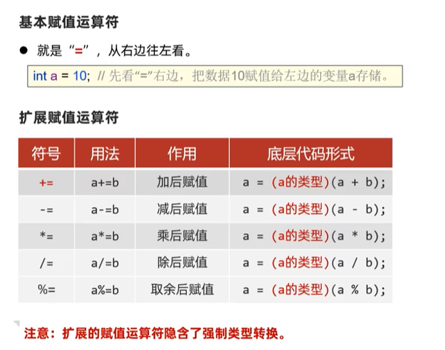  
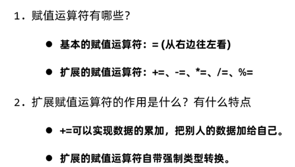  
```JAVA
package com.itheima.operator;

public class OperatorDemo3 {
    public static void main(String[] args) {
        // TODO 掌握扩展赋值运算符的使用
        // +＝ 需求 收红包
        double a = 9.5;
        double b = 520;
        a += b;// a =(double)(a + b);
        System.out.println(a);

        // -＝ 需求 发红包
        double i = 600;
        double j = 520;
        i -= j;// i =(double)(i - j);
        System.out.println(i);

        int m = 10;
        int n = 5;
        // m*=n;// 等价形式 m =(int)(m*n);
        // m/=n;// 等价形式 m =(int)(m/n);
        m%=n;// 等价形式 m =(int)(m%n);
        System.out.println(m);

        byte x = 10;
        byte y = 30;
        // x = x + y;// 编译报错
        // x = (byte)(x + y);
        x+=y;// 等价形式 x = (byte)(x + y);
        System.out.println(x);
    }
}

```
4.  关系运算符   
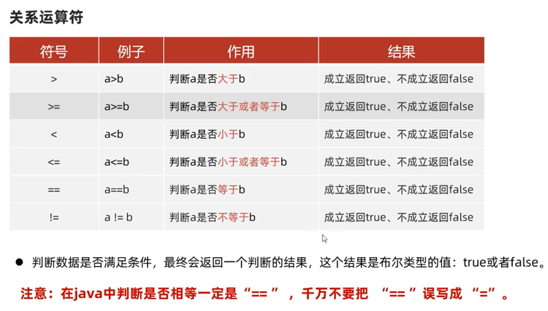    
```java
package com.itheima.operator;

public class OperatorDemo4 {
    public static void main(String[] args) {
        // TODO 掌握关系运算符的基本使用
        int a = 10;
        int b = 5;
        boolean rs = a>b;
        System.out.println(rs);

        System.out.println(a >= b);// 大于或者等于
        System.out.println(2 >= 2);// true
        System.out.println(a < b);
        System.out.println(a <= b);// false
        System.out.println(2 <= 2);// true
        System.out.println(a == b);// false
        System.out.println(5 == 5);// true
        // System.out.println(a=b);// 5  ==:等于   =:赋值
        System.out.println(a!=b);// true
        System.out.println(10 != 10);// false
    }
}

```
5.  逻辑运算符  
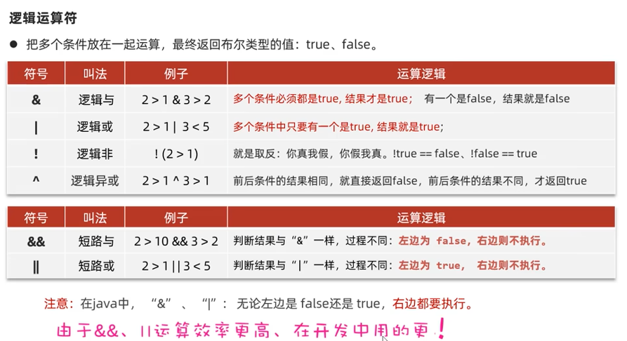  
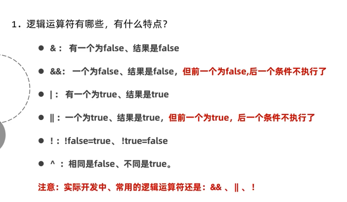  
```java
package com.itheima.operator;

public class OperatorDemo5 {
    public static void main(String[] args) {
        // TODO 掌握逻辑运算符的使用
        // 需求：要求手机必须满足尺寸大于等于6.95，且内存必须大于等于8
        double size = 6.8;
        int storage = 16;
        // 1.& 前后的条件的结果必须都是true，结果才是true
        boolean rs = size >= 6.95 & storage >= 8;
        System.out.println(rs);

        // 需求2：要求手机要么满足尺寸大于等于6.95，要么内存必须大于等于8
        // 2.只要多个条件中有一个是true，结果就是true
        boolean rs2 = size >= 6.95 | storage >= 8;
        System.out.println(rs2);

        // 3.！取反的意思
        System.out.println(!true);// false
        System.out.println(!false);// true
        System.out.println(!(2 > 1));// false

        // 4.^前后条件的结果相同时返回false，不同时返回true
        System.out.println(true ^ true);// false
        System.out.println(false ^ false);// false
        System.out.println(true ^ false);// true
        System.out.println(false ^ true);// true

        // 5.&& 左边为false，右边不执行
        int i = 10;
        int j = 20;
        //System.out.println(i > 100 && ++j > 99);// 20
        System.out.println(i > 100 & ++j > 99);// 21
        System.out.println(j);

        // 6.|| 左边为true，右边不执行
        int m = 10;
        int n = 30;
        System.out.println(m > 3 | ++n > 40);//31
        //System.out.println(m > 3 || ++n > 40);//30
        System.out.println(n);
    }
}

```
6.  三元运算符 运算符的优先级  
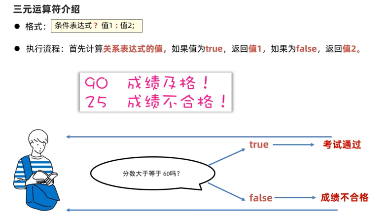  
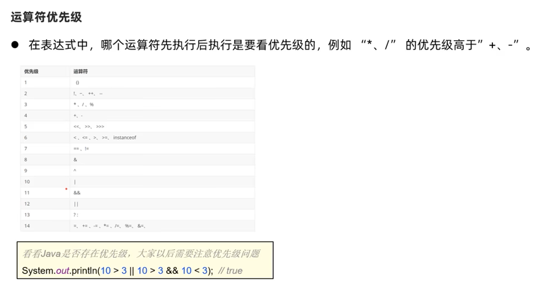  
```java
package com.itheima.operator;

public class OperatorDemo6 {
    public static void main(String[] args) {
        // TODO 掌握三元运算符的基本使用
        double score = 58.5;
        String rs = score >=60?"合格":"不合格";
        System.out.println(rs);

        // 需求2：找出两个整数中的较大值，并输出
        int a = 99;
        int b = 167;
        int max = a>b?a:b;
        System.out.println(max);

        // 需求3：找出三个整数中的较大值，并输出
        int i = 10;
        int j = 45;
        int k = 34;
        // 找出两个整数中的较大值
        int temp = i > j ? i : j;
        // 找出temp与k中的较大值
        int max2 = temp > k ? temp : k;
        System.out.println(max2);

        // &&的优先级高   先执行&&
        System.out.println(10 > 3 || 10 > 3 && 10 < 3);// true
        //加了小括号，先执行||
        System.out.println((10 > 3 || 10 > 3) && 10 < 3);// false


    }
}

 ```

