#  多线程    
  

##  多线程的创建  
1.  方式一：继承Thread类  
  
  
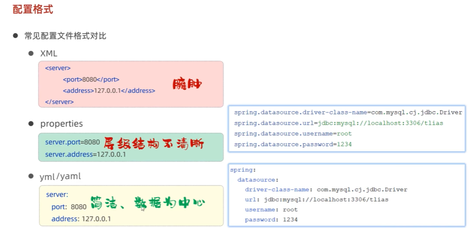  
2.  方式二：实现Runnable接口  
  
  
  
```java
package com.itheima.create_thread;

// TODO 线程的创建方式二:匿名内部类写法

public class ThreadTest2_2 {
    public static void main(String[] args) {
        // 1.直接创建Runnable接口的匿名内部类形式（任务对象）
        Runnable target = new Runnable(){
            @Override
            public void run() {
                for (int i = 1; i <= 5 ; i++) {
                    System.out.println("子线程1输出:" + i);
                }
            }
        };
        new Thread(target).start();

        // 简化形式1：
        new Thread(new Runnable(){
            @Override
            public void run() {
                for (int i = 1; i <= 5 ; i++) {
                    System.out.println("子线程2输出:" + i);
                }
            }
        }).start();

        //  简化形式2：
        new Thread(() ->{
            for (int i = 1; i <= 5 ; i++) {
                System.out.println("子线程3输出:" + i);
            }
        }).start();


        for (int i = 1; i <= 5 ; i++) {
            System.out.println("主线程main输出:" + i);
        }
    }
}

```  
3.  方式三：实现Callable接口  
  
  
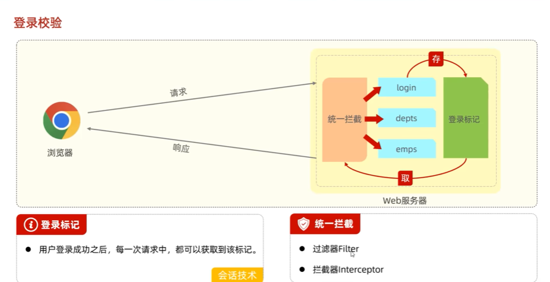  
  

##  Thread的常用方法  
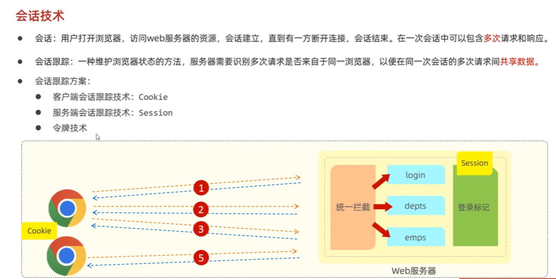  
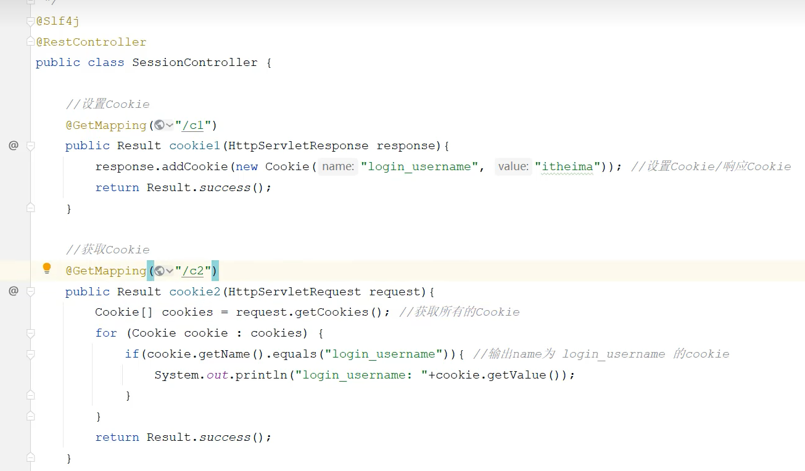  
```java
package com.itheima.create_thread;

// TODO sleep方法,join方法的作用
public class ThreadTest4 {
    public static void main(String[] args)throws Exception {
        for (int i = 1; i <= 5 ; i++) {
            System.out.println(i);
            // 休眠5秒
            if (i==3){
                // 会让当前执行的线程暂停5秒再继续执行
                //
                Thread.sleep(5000);
            }
        }

        // join方法作用：让当前调用这个方法的线程先执行完
        Thread t1 = new MyThread("1号线程");
        t1.start();
        t1.join();

        Thread t2 = new MyThread("2号线程");
        t2.start();
        t2.join();

        Thread t3 = new MyThread("3号线程");
        t3.start();
        t3.join();
    }
}

```

##  线程安全  
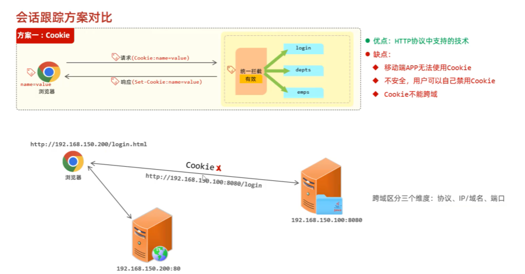  
  
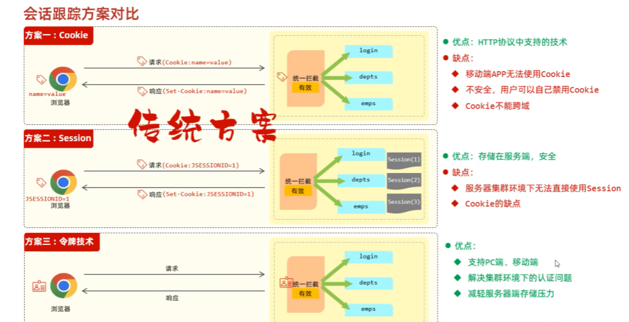  
  

##  线程同步  
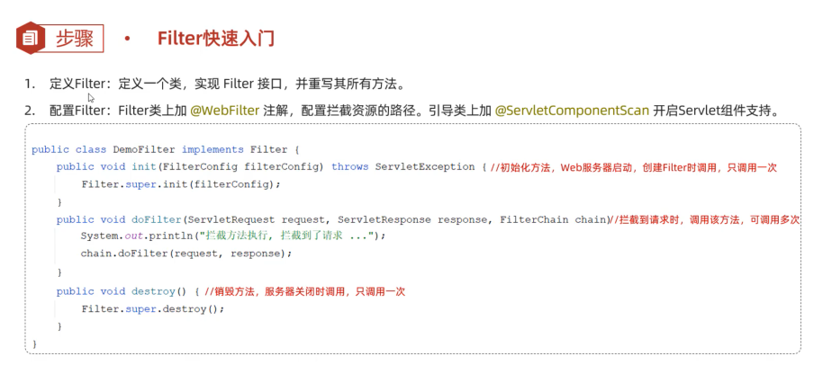  
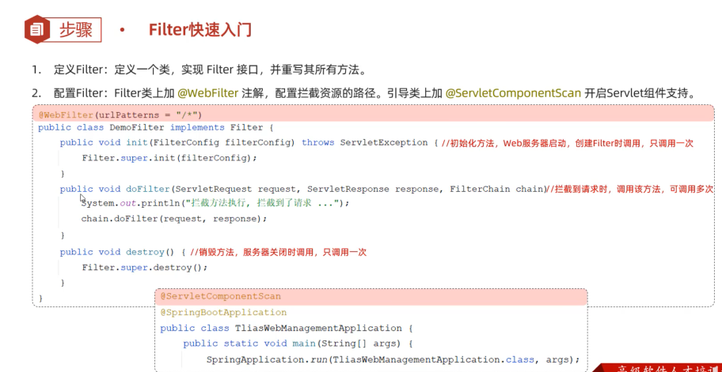  
1.  方式一：  同步代码块  
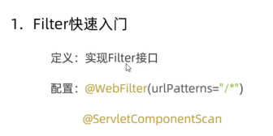  
  
  
2.  方式二：  同步方法  
  
  
  
3.  方式三：  Lock锁  
  
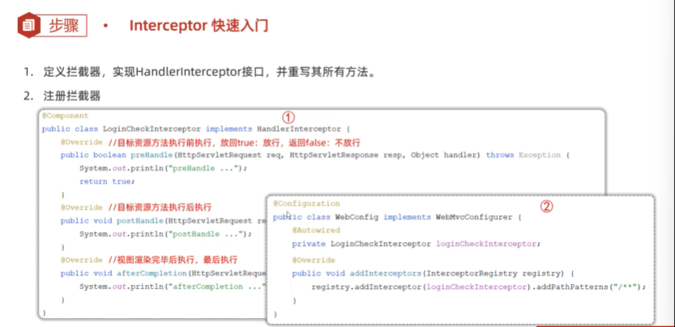  

##  线程通信(了解)  
  
  
  
```java
package com.itheima.thread_communication;

// TODO 线程通信
public class ThreadTest {
    public static void main(String[] args) {
        // 需求：3个生产者线程，负责生产包子 每个线程每次只能生产1个包子放在桌子上
        //      2个消费者线程负责吃包子，每人每次只能从桌子上拿1个包子吃
        Desk desk = new Desk();

        // 创建3个生产者线程-3个厨师
        new Thread(()-> {
            while (true) {
                desk.put();
            }
        },"厨师1").start();

        new Thread(()-> {
            while (true) {
                desk.put();
            }
        },"厨师2").start();

        new Thread(()-> {
            while (true) {
                desk.put();
            }
        },"厨师3").start();

        // 创建2个消费者线程-2个吃货
        new Thread(()-> {
            while (true) {
                desk.get();
            }
        },"吃货1").start();

        new Thread(()-> {
            while (true) {
                desk.get();
            }
        },"吃货2").start();
    }
}

```
```java
package com.itheima.thread_communication;

import java.util.ArrayList;
import java.util.List;

public class Desk {
    private List<String> list = new ArrayList<>();

    // 负责放1个包子的方法
    // 厨师1  厨师2  厨师3
    public  synchronized void put(){
        try {
            String name = Thread.currentThread().getName();
            // 判断是否有包子
            if (list.size() == 0){
                list.add(name + "做的肉包子");
                System.out.println(name + "做了一个肉包子");
                Thread.sleep(2000);

                // 唤醒别人.等待自己
                this.notifyAll();
                this.wait();
            }else{
                // 有包子就不做了
                // 唤醒别人.等待自己
                this.notifyAll();
                this.wait();
            }
        } catch (Exception e ) {
            e.printStackTrace();
        }
    }

    // 吃货1  吃货2
    public synchronized void get(){
        try {
            String name = Thread.currentThread().getName();
            if (list.size() == 1){
                // 有包子 吃了
                System.out.println(name + "吃了:" + list.get(0));
                list.clear();
                Thread.sleep(1000);
                this.notifyAll();
                this.wait();
            }else{
                //没有包子
                this.notifyAll();
                this.wait();
            }
        } catch (Exception e) {
            e.printStackTrace();
        }
    }
}

```

##  线程池  
  
  
1.  创建线程池  
  
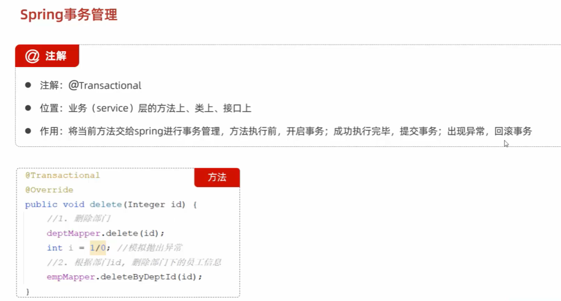  
```java
package com.itheima.thread_pool;

// TODO 线程池的创建

import java.util.concurrent.*;

public class ThreadPoolTest1 {
    public static void main(String[] args) {
        // 1.通过ThreadPoolExecutor创建一个线程池对象
        ExecutorService pool = new ThreadPoolExecutor(3,5,8,
                TimeUnit.SECONDS,new ArrayBlockingQueue<>(4),
                Executors.defaultThreadFactory(),new ThreadPoolExecutor.AbortPolicy());
    }
}

```
  
2.  线程池处理Runnable任务  
  
  
  
3.  线程池处理Callable任务  
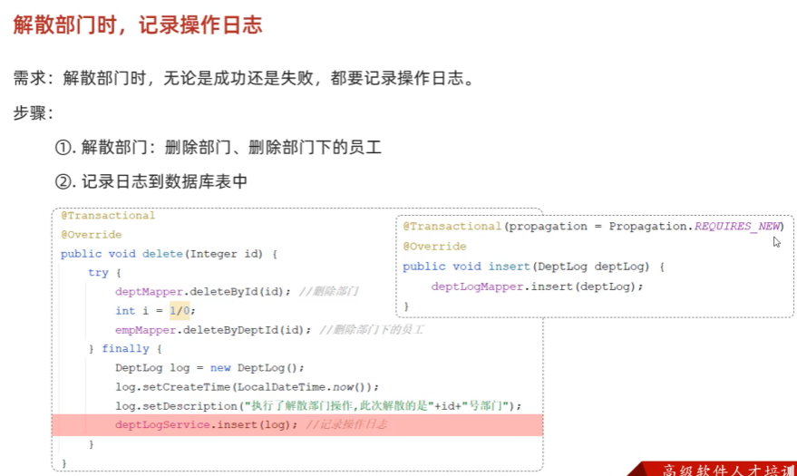  
  
4.  Executors工具类实现线程池  
  
```java
package com.itheima.thread_pool;

import java.util.concurrent.*;
public class ThreadPoolTest1 {
    public static void main(String[] args) throws Exception {
        // 1.通过ThreadPoolExecutor创建一个线程池对象
        /*ExecutorService pool = new ThreadPoolExecutor(3,5,8,
                TimeUnit.SECONDS,new ArrayBlockingQueue<>(4),
                Executors.defaultThreadFactory(),new ThreadPoolExecutor.CallerRunsPolicy());*/

        // 1-2 通过Executors创建一个线程池对象
        ExecutorService pool = Executors.newFixedThreadPool(3);
        // 核心线程数量到底配置多少呢
        // 计算密集型的任务：核心线程数量 = CPU的核数 + 1
        // IO密集型的任务：核心线程数量 = CPU的核数 * 2
        
        // 2.使用线程处理Callable任务
         Future<String> f1 = pool.submit(new MyCallable(100));
         Future<String> f2 = pool.submit(new MyCallable(200));
         Future<String> f3 = pool.submit(new MyCallable(300));
         Future<String> f4 = pool.submit(new MyCallable(400));

        System.out.println(f1.get());
        System.out.println(f2.get());
        System.out.println(f3.get());
        System.out.println(f4.get());
    }
}

```
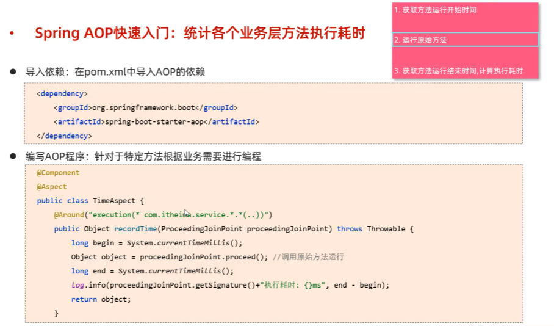  

##  并发并行  
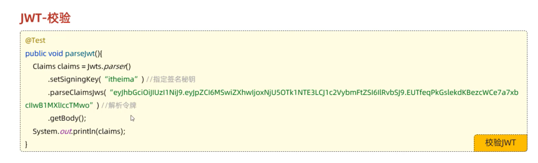  
  
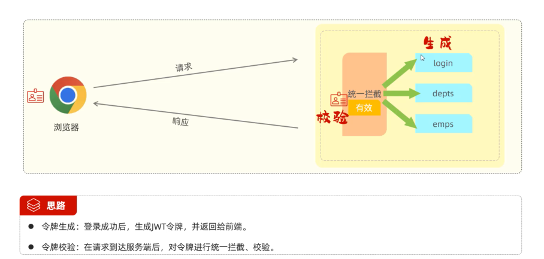  
  

##  线程的生命周期    
  
  
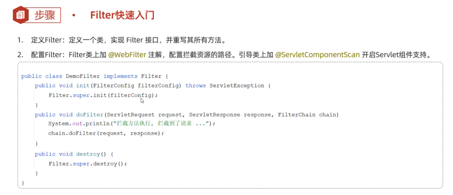  

##  悲观锁  
  

##  乐观锁  
  


