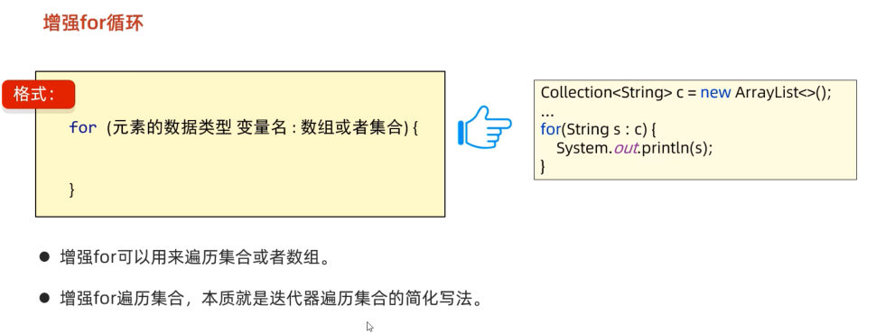
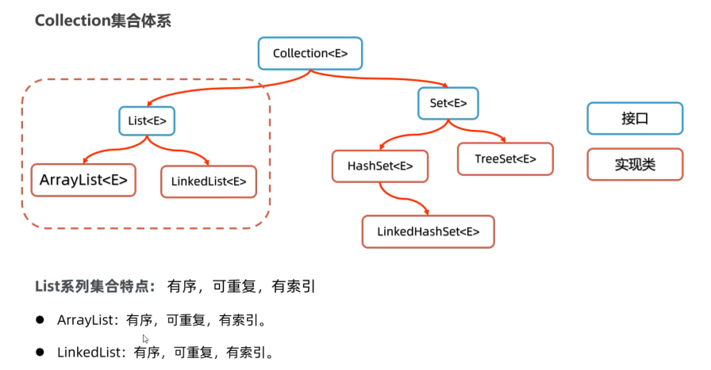
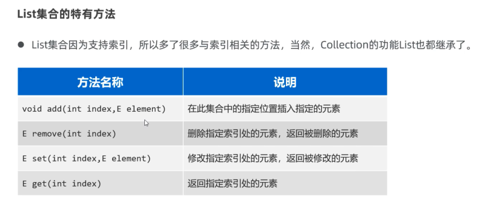
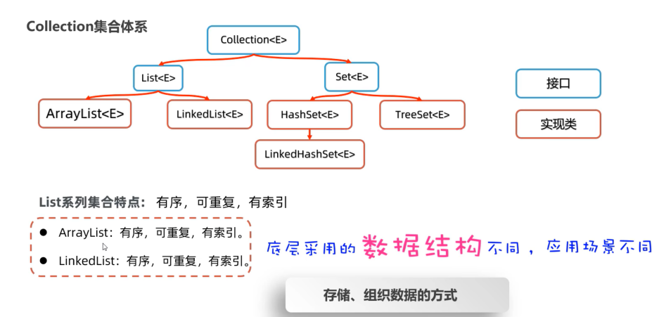
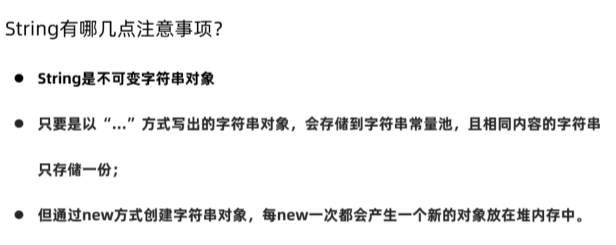
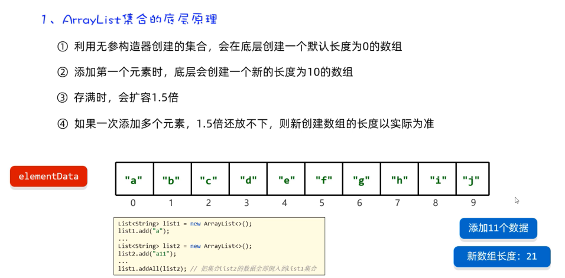
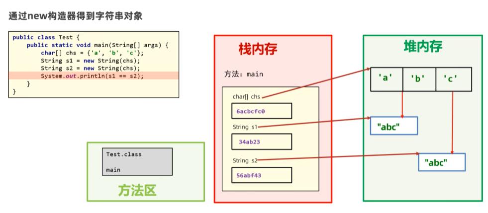
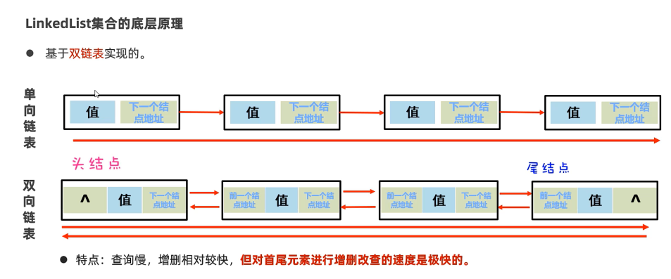
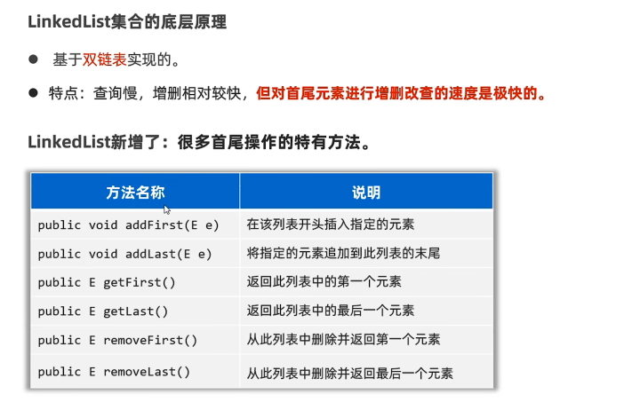
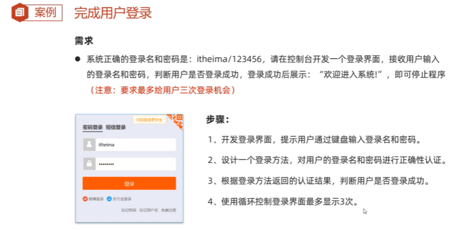

## 常用API      

### 包    
  

### String    
1.  String概述  
  
  
  
```java
package string;

public class StringDemo1 {
    public static void main(String[] args) {
        // TODO 创建string对象，并封装要处理的字符串的方式
        // 通过 new String 创建字符串对象，并调用构造器来初始化字符串
        String rs1 = new String();
        System.out.println(rs1);// ""

        String rs2 = new String("itheima");
        System.out.println(rs2);// itheima

        char[] chars = {'a','黑','马'};
        String rs3 = new String(chars);
        System.out.println(rs3); // a黑马

        byte[] bytes = {97,98,99};
        String rs4 = new String(bytes);
        System.out.println(rs4); // abc
    }
}

```
2.  String的常用方法  
  
```java
package string;

public class StringDemo2 {
    public static void main(String[] args) {
        // TODO 掌握string提供的处理字符串的常用方法
        String s = "黑马Java";
        // 1.获取字符串的长度
        System.out.println(s.length());// 6

        // 2.提取字符串中某个索引位置处的字符
        char c = s.charAt(1);
        System.out.println(c);// 马

        // 字符串的遍历
        for (int i = 0; i < s.length(); i++) {
            // i = 0 1 2 3 4 5
            char ch = s.charAt(i);
            System.out.println(ch);// 黑马Java
        }

        // 3.把字符串转换成字符数组，再进行遍历
        char[] chars = s.toCharArray();
        for (int i = 0; i < chars.length; i++) {
            System.out.println(chars[i]);// 黑马Java
        }

        // 4.判断字符串内容，内容一样就返回true
        String s1 = new String("黑马");
        String s2 = new String("黑马");
        System.out.println(s1 == s2);//false
        System.out.println(s1.equals(s2));//true

        // 5.忽略大小写，比较字符串内容
        String c1 = "34AeFG";
        String c2 = "34aEfg";
        System.out.println(c1.equals(c2));//false
        System.out.println(c1.equalsIgnoreCase(c2));//true

        // 6.截取字符串内容
        String s3 = "Java是最好的编程语言之一";
        String rs = s3.substring(0,8);
        System.out.println(rs);// Java是最好的

        // 7.从当前索引位置一直截取到字符串的末尾
        String rs2 = s3.substring(5);
        System.out.println(rs2);// 最好的编程语言之一

        // 8.把字符串中的某个内容替换成新内容，并返回新的字符串对象给我们
        String info = "这个电影简直是个垃圾，垃圾电影";
        String rs3 =info.replace("垃圾","**");
        System.out.println(rs3);// 这个电影简直是个**，**电影

        // 9.判断字符串中是否包含某个关键字
        String info2 = "Java是最好的编程语言之一，我爱Java，Java不爱我";
        System.out.println(info2.contains("Java"));//true

        // 10.判断字符串是否以某个字符串开头，
        String rs4 = "张三";
        System.out.println(rs4.startsWith("张"));// true

        // 11.把字符串按照某个指定内容分割成多个字符串，放到一个字符串数组中，返回给我们
        String rs5 = "汪苏泷,魏大勋,李宇春";
        String[] names = rs5.split(",");
        for (int i = 0; i < names.length; i++) {
            System.out.println(names[i]);// 汪苏泷
                                        //魏大勋
                                       // 李宇春
        }
    }
}

 ```
3.  String使用时的注意事项  
  
  
   
  
  
```java
package string;

public class StringDemo3 {
    public static void main(String[] args) {
        // TODO string使用时的注意事项
        // 1.string的对象是不可变的
        String name = "黑马";
        name += "程序员";// name = name + 程序员
        name += "波妞";
        System.out.println(name);// 黑马程序员波妞

        // 2.只要是以双引号给出的字符串对象，存储在常量池中，而且内容相同时，只会存储一份
        String s1 = "abc";
        String s2 = "abc";
        System.out.println(s1 == s2);// true

        // 3.new string 创建字符串对象，每次new出来的都是一个新对象，会放在堆内存中
        char[] chars = {'a','b','c'};
        String a1 = new String(chars);
        String a2 = new String(chars);
        System.out.println(a1 == a2);// false
    }
}

```
  
  

4.  String的应用案例  
  


### ArrayList     

