## 常用API      
就是java自带的一些程序    

### 包    
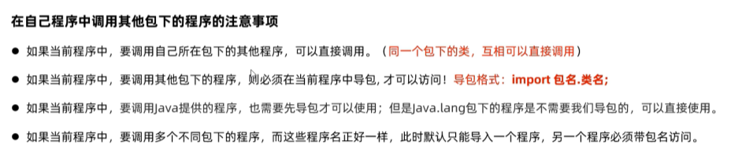  

### String    
1.  String概述  
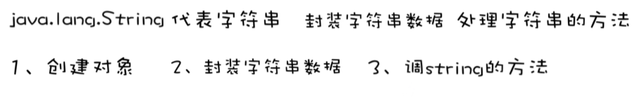  
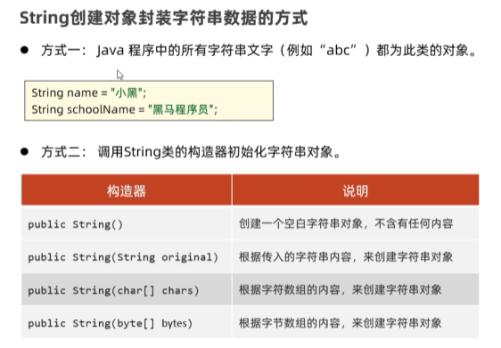  
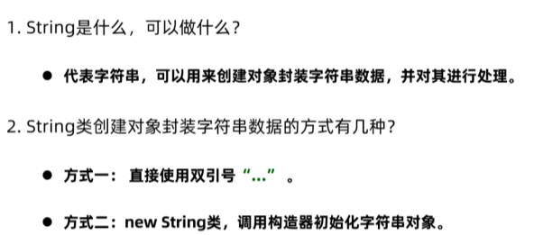  
```java
package string;

public class StringDemo1 {
    public static void main(String[] args) {
        // TODO 创建string对象，并封装要处理的字符串的方式
        // 通过 new String 创建字符串对象，并调用构造器来初始化字符串
        String rs1 = new String();
        System.out.println(rs1);// ""

        String rs2 = new String("itheima");
        System.out.println(rs2);// itheima

        char[] chars = {'a','黑','马'};
        String rs3 = new String(chars);
        System.out.println(rs3); // a黑马

        byte[] bytes = {97,98,99};
        String rs4 = new String(bytes);
        System.out.println(rs4); // abc
    }
}

```
2.  String的常用方法  
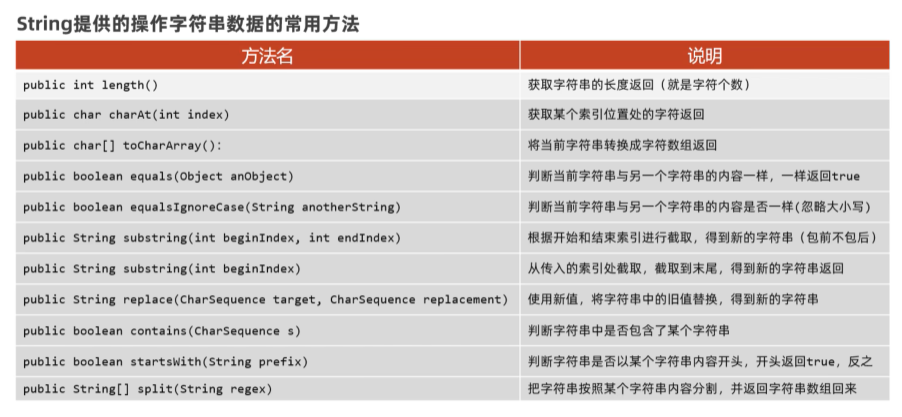  
```java
package string;

public class StringDemo2 {
    public static void main(String[] args) {
        // TODO 掌握string提供的处理字符串的常用方法
        String s = "黑马Java";
        // 1.获取字符串的长度
        System.out.println(s.length());// 6

        // 2.提取字符串中某个索引位置处的字符
        char c = s.charAt(1);
        System.out.println(c);// 马

        // 字符串的遍历
        for (int i = 0; i < s.length(); i++) {
            // i = 0 1 2 3 4 5
            char ch = s.charAt(i);
            System.out.println(ch);// 黑马Java
        }

        // 3.把字符串转换成字符数组，再进行遍历
        char[] chars = s.toCharArray();
        for (int i = 0; i < chars.length; i++) {
            System.out.println(chars[i]);// 黑马Java
        }

        // 4.判断字符串内容，内容一样就返回true
        String s1 = new String("黑马");
        String s2 = new String("黑马");
        System.out.println(s1 == s2);//false
        System.out.println(s1.equals(s2));//true

        // 5.忽略大小写，比较字符串内容
        String c1 = "34AeFG";
        String c2 = "34aEfg";
        System.out.println(c1.equals(c2));//false
        System.out.println(c1.equalsIgnoreCase(c2));//true

        // 6.截取字符串内容
        String s3 = "Java是最好的编程语言之一";
        String rs = s3.substring(0,8);
        System.out.println(rs);// Java是最好的

        // 7.从当前索引位置一直截取到字符串的末尾
        String rs2 = s3.substring(5);
        System.out.println(rs2);// 最好的编程语言之一

        // 8.把字符串中的某个内容替换成新内容，并返回新的字符串对象给我们
        String info = "这个电影简直是个垃圾，垃圾电影";
        String rs3 =info.replace("垃圾","**");
        System.out.println(rs3);// 这个电影简直是个**，**电影

        // 9.判断字符串中是否包含某个关键字
        String info2 = "Java是最好的编程语言之一，我爱Java，Java不爱我";
        System.out.println(info2.contains("Java"));//true

        // 10.判断字符串是否以某个字符串开头，
        String rs4 = "张三";
        System.out.println(rs4.startsWith("张"));// true

        // 11.把字符串按照某个指定内容分割成多个字符串，放到一个字符串数组中，返回给我们
        String rs5 = "汪苏泷,魏大勋,李宇春";
        String[] names = rs5.split(",");
        for (int i = 0; i < names.length; i++) {
            System.out.println(names[i]);// 汪苏泷
                                        //魏大勋
                                       // 李宇春
        }
    }
}

 ```
3.  String使用时的注意事项  
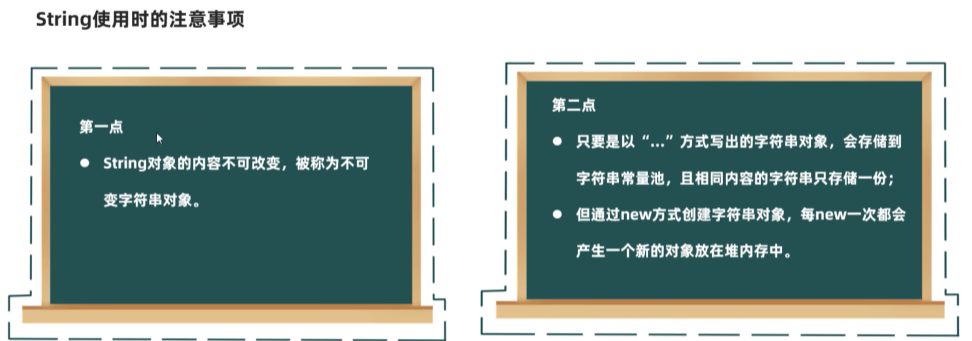  
  
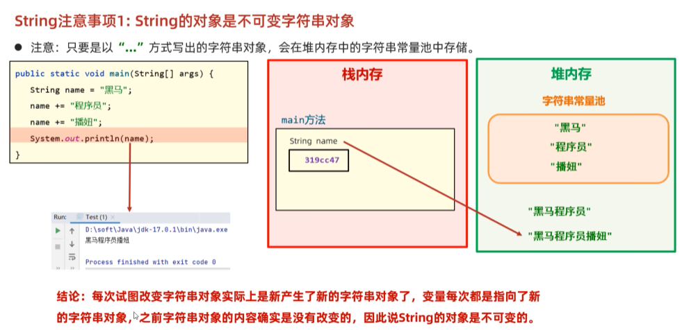   
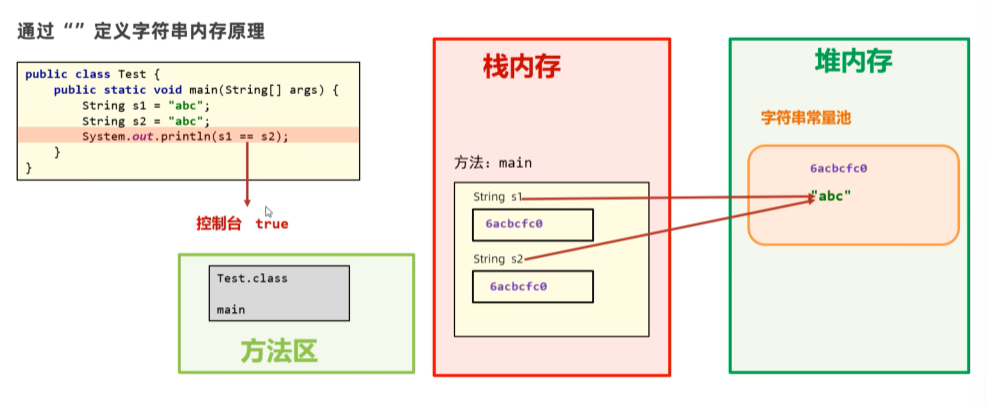  
  
```java
package string;

public class StringDemo3 {
    public static void main(String[] args) {
        // TODO string使用时的注意事项
        // 1.string的对象是不可变的
        String name = "黑马";
        name += "程序员";// name = name + 程序员
        name += "波妞";
        System.out.println(name);// 黑马程序员波妞

        // 2.只要是以双引号给出的字符串对象，存储在常量池中，而且内容相同时，只会存储一份
        String s1 = "abc";
        String s2 = "abc";
        System.out.println(s1 == s2);// true

        // 3.new string 创建字符串对象，每次new出来的都是一个新对象，会放在堆内存中
        char[] chars = {'a','b','c'};
        String a1 = new String(chars);
        String a2 = new String(chars);
        System.out.println(a1 == a2);// false
    }
}

```
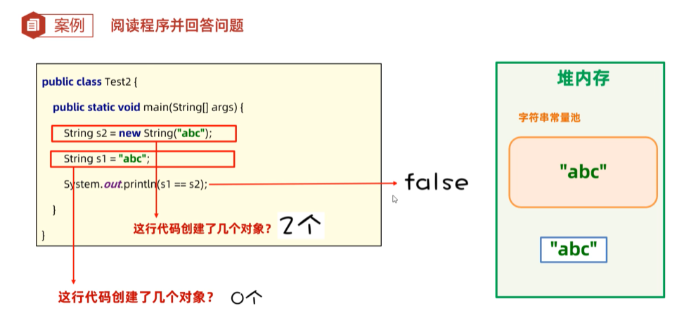  
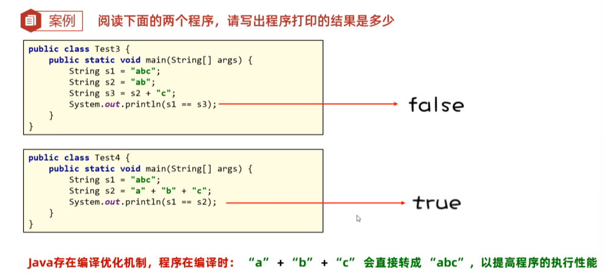  

4.  String的应用案例  
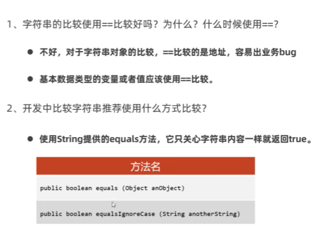  
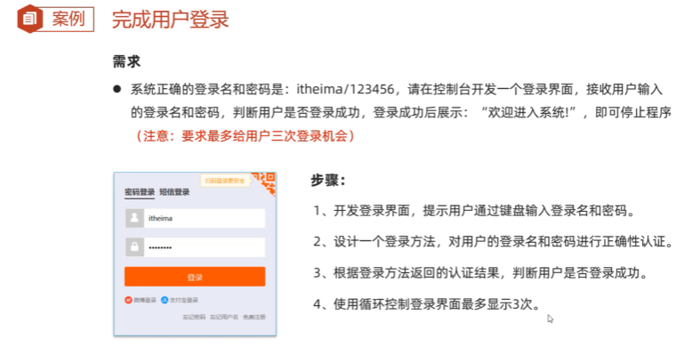  
```java
package string;

import java.util.Scanner;

public class StringTest4 {
    public static void main(String[] args) {
        // 1.开发一个登录界面
        for(int i = 0; i < 3;i++) {
            Scanner sc = new Scanner(System.in);
            System.out.println("请输入登录名称");
            String loginName = sc.next();
            System.out.println("请输入登录密码");
            String passWord = sc.next();

            // 5.开始调用登录方法，判断是否登录成功
            boolean rs =login(loginName,passWord);
            if (rs){
                System.out.println("登录成功");
                break;// 跳出循环，登录完成
            }else{
                System.out.println("登录失败");
            }
        }
    }

    // 2.开发一个登录方法，接收用户的登录名和密码，返回认证的结果
    public static boolean login(String loginName,String passWord){
      // 3.准备一份系统正确的登录名和密码
        String okloginName = "itheima";
        String okpassWord = "123456";

        // 4.开始正式判断用户是否登录成功
        /*if (okloginName.equals(loginName) && okpassWord.equals(passWord)){
            // 登录成功
            return true;
        }else{
            return false;
        }*/
        return okloginName.equals(loginName) && okpassWord.equals(passWord);
    }
}

```
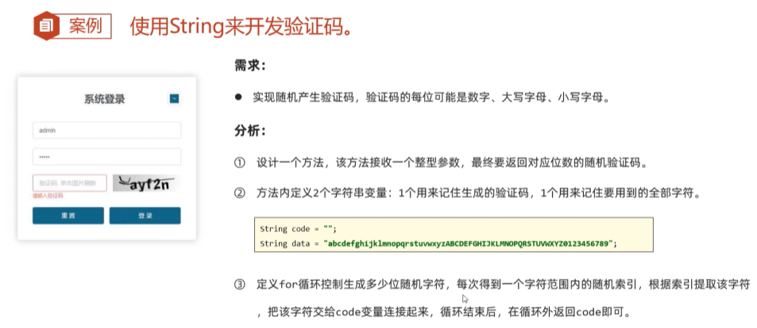  
```java
package string;

import java.util.Random;
import java.util.Scanner;

public class StringTest5 {
    public static void main(String[] args) {
        System.out.println(createCode(4));
        System.out.println(createCode(6));
    }

    // 1.设计一个方法，返回指定位数的验证码
    public static String createCode(int n){
        // 2.定义两个变量，一个是记录最终产生的随机验证码，一个是记住可能用到的全部字符
        String code = "";
        String date = "abcdefghijklmnopqrstuvwxyzABCDEFGHIJKLMNOPQRSTUVWXYZ0123456789";

        Random r = new Random();
        // 3.开始定义一个循环产生每位随机字符
        for (int i = 0; i < n; i++) {
            // 4.随机一个字符范围内的索引
            int index = r.nextInt(date.length());
            // 5.根据索引去全部字符中，提取该字符
            code += date.charAt(index);
        }
        // 6.返回code即可
        return code;
    }
}

```

### ArrayList     
  
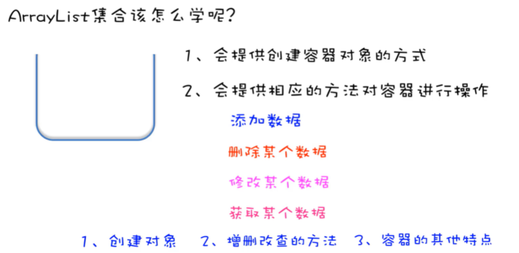  
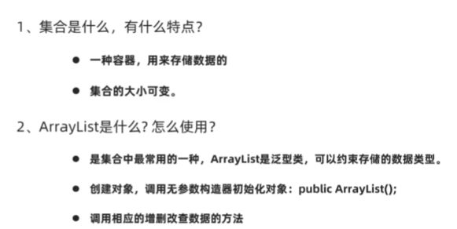  
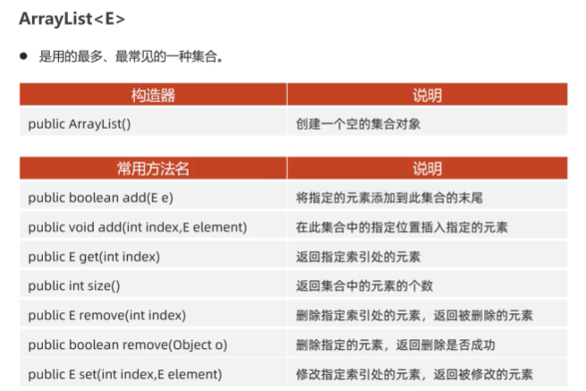  
```java
package com.itheima.arraylist;

import java.util.ArrayList;

public class ArrayListDemo1 {
    public static void main(String[] args) {
        // 1.创建一个ArrayList的集合对象
        ArrayList<String> list = new ArrayList<>();

        list.add("黑马");
        list.add("黑马");
        list.add("Java");
        System.out.println(list);//[黑马, 黑马, Java]

        // 2.往集合中的某个索引位置处添加一个数据
        list.add(1,"MYSQL") ;
        System.out.println(list);// [黑马, MYSQL, 黑马, Java]

        // 3.根据索引获取集合中某个索引位置处的值
        String rs =list.get(1);
        System.out.println(rs);// MYSQL

        // 4.获取集合的大小，返回集合中存储的元素个数
        System.out.println(list.size());// 4

        // 5.根据索引删除集合中的某个元素值，会返回被删除的元素值给我们
        System.out.println(list.remove(1));// MYSQL
        System.out.println(list);// [黑马, 黑马, Java]

        // 6.直接删除某个元素值，删除成功会返回true,反之返回false
        System.out.println(list.remove("Java"));// true
        System.out.println(list);// [黑马, 黑马]

        list.add(1,"html");
        System.out.println(list);//[html, 黑马]

        // 默认删除的是第一次出现的这个黑马的数据的
        System.out.println(list.remove("黑马"));// true
        System.out.println(list);// [黑马]

        // 7.修改某个索引位置处的数据，修改后会返回原来的值给我们
        System.out.println(list.set(1, "黑马程序员"));// 黑马
        System.out.println(list);// [html, 黑马程序员]

    }
}

```
### ArrayList案例  
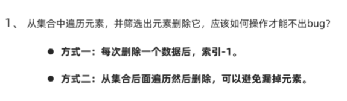  
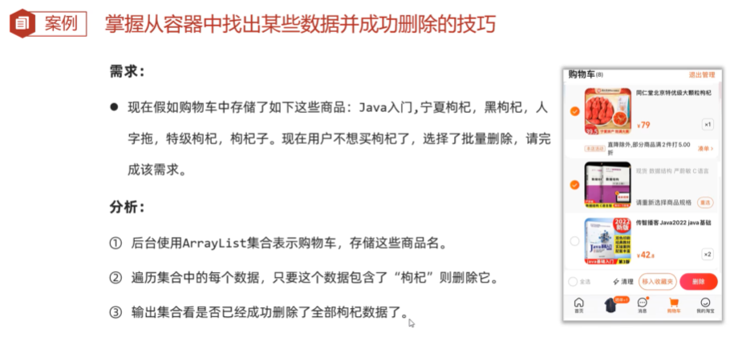  
```java
package com.itheima.arraylist;

import java.util.ArrayList;

public class ArrayListTest2 {
    public static void main(String[] args) { 
        // 1.创建一个ArrayList的集合对象
        ArrayList<String> list = new ArrayList<>();
        list.add("Java入门");
        list.add("宁夏枸杞");
        list.add("黑枸杞");
        list.add("人字拖");
        list.add("特技枸杞");
        list.add("枸杞子");
        System.out.println(list);// [Java入门, 宁夏枸杞, 黑枸杞, 人字拖, 特技枸杞, 枸杞子]

        // 2.开始完成需求：从集合中找出包含枸杞的数据并删除他
        /* for (int i = 0; i < list.size(); i++) {
            // i = 0 1 2 3 4 5
            //取出当前遍历到的数据
            String ele = list.get(i);
            // 判断这个数据中是否包含枸杞
            if (ele.contains("枸杞")){
                // 直接从集合中删除该数据
                list.remove(ele);
            }
        }
        System.out.println(list);*/  // [Java入门, 黑枸杞, 人字拖, 枸杞子]


        // TODO 方式1：每次删除一个数据后，就让i往左边退一步
        /*for (int i = 0; i < list.size(); i++) {
            // i = 0 1 2 3 4 5
            //取出当前遍历到的数据
            String ele = list.get(i);
            // 判断这个数据中是否包含枸杞
            if (ele.contains("枸杞")){
                // 直接从集合中删除该数据
                list.remove(ele);
                i--;
            }
        }
        System.out.println(list);*/   // [Java入门, 人字拖]

        // TODO 方式2：从集合的后面倒着遍历并删除
        for (int i = list.size()-1; i >= 0 ; i--) {
            //取出当前遍历到的数据
            String ele = list.get(i);
            // 判断这个数据中是否包含枸杞
            if (ele.contains("枸杞")) {
                // 直接从集合中删除该数据
                list.remove(ele);
            }
        }
        System.out.println(list); // [Java入门, 人字拖]
    }
}

```

