##  常用API一    
###  Object类   
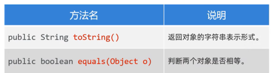  
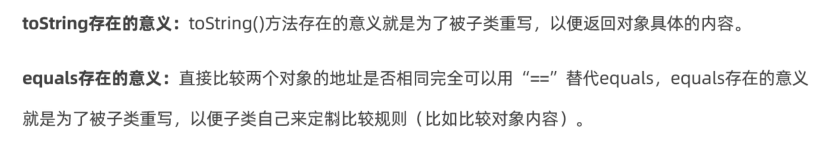  
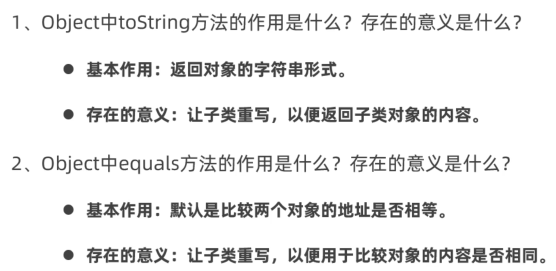  
```java 
package com.itheima.api_object;

public class Test {
    public static void main(String[] args) {
        // TODO Object类提供的常用方法
        Student s1 = new Student("赵敏",23);
        System.out.println(s1.toString());// Student{name='赵敏', age=23}
        System.out.println(s1);// Student{name='赵敏', age=23}


        Student s2 = new Student("赵敏",23);
        System.out.println(s2.equals(s1));// true
        System.out.println(s2 == s1);// false
    }
}

```
```java
package com.itheima.api_object;
import java.util.Objects;
public class Student  {
    private String name;
    private int age;
    public Student() {
    }
    public Student(String name, int age) {
        this.name = name;
        this.age = age;
    }
    // 重写equals方法，比较两个对象的内容一样，返回true
    @Override
    public boolean equals(Object o) {
        if (this == o) return true;
        if (o == null || getClass() != o.getClass()) return false;
        Student student = (Student) o;
        return age == student.age && Objects.equals(name, student.name);
    }
    @Override
    public String toString() {
        return "Student{" +
                "name='" + name + '\'' +
                ", age=" + age +
                '}';
    }
    public String getName() {
        return name;
    }
    public void setName(String name) {
        this.name = name;
    }

    public int getAge() {
        return age;
    }

    public void setAge(int age) {
        this.age = age;
    }
}

```
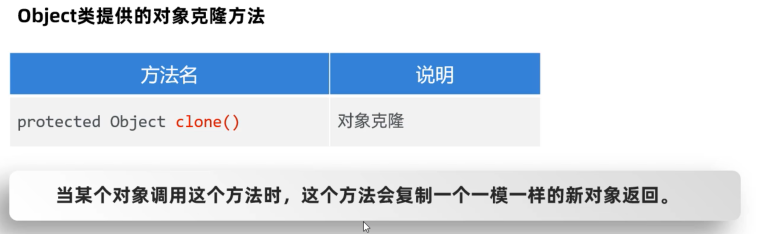  
```java
package com.itheima.api_object;

public class Test2 {
    public static void main(String[] args) throws CloneNotSupportedException {
        // TODO Object类提供的对象克隆的方法
        // 对象克隆 protected Object clone()
        User u1 = new User(1,"张三","wo666",new double[]{99.0,99.5});

        User u2 = (User) u1.clone();

        System.out.println(u1.getId());
        System.out.println(u1.getPassword());
        System.out.println(u1.getUsername());
        System.out.println(u1.getScores());

        System.out.println("--------------------");

        System.out.println(u2.getId());
        System.out.println(u2.getPassword());
        System.out.println(u2.getUsername());
        System.out.println(u2.getScores());
    }
}

```
```java
package com.itheima.api_object;
// Cloneable是一个标记接口
// 规则
public class User implements Cloneable {
    private int id;// 编号
    private String username;// 用户名
    private String password;// 密码
    private double[] scores;// 分数

    public User() {
    }

    public User(int id, String username, String password, double[] scores) {
        this.id = id;
        this.username = username;
        this.password = password;
        this.scores = scores;
    }

    @Override
    protected Object clone() throws CloneNotSupportedException {
        return super.clone();
    }

    public int getId() {
        return id;
    }

    public void setId(int id) {
        this.id = id;
    }

    public String getUsername() {
        return username;
    }

    public void setUsername(String username) {
        this.username = username;
    }

    public String getPassword() {
        return password;
    }

    public void setPassword(String password) {
        this.password = password;
    }

    public double[] getScores() {
        return scores;
    }

    public void setScores(double[] scores) {
        this.scores = scores;
    }
}
```
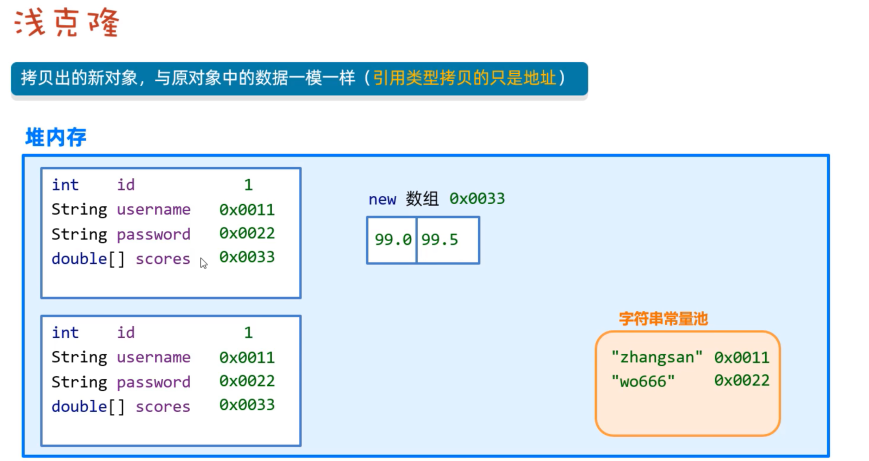  
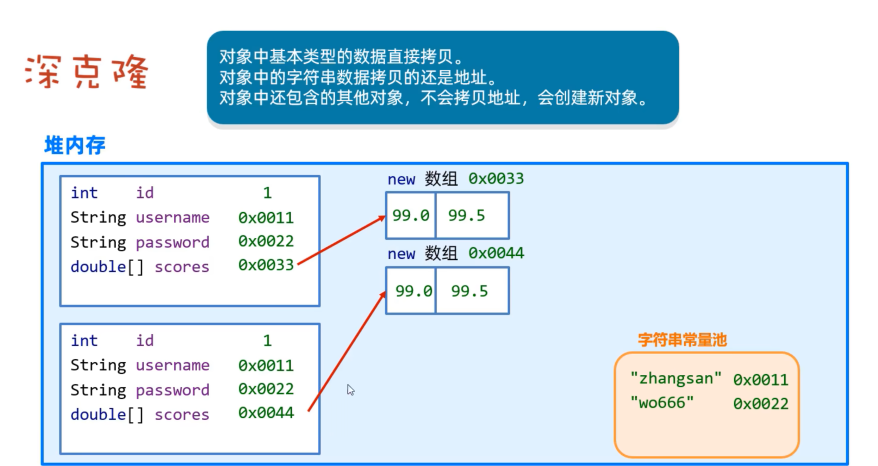  

###  Objecs   
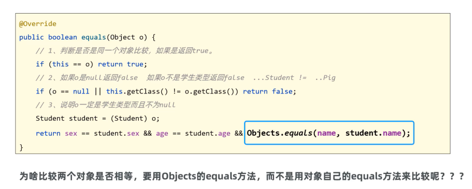  
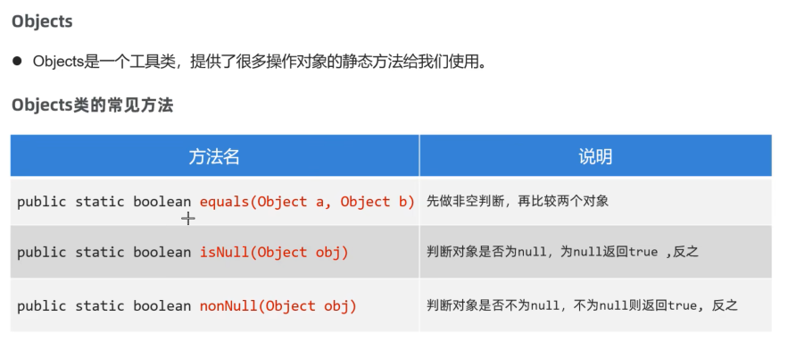  
```java
package com.itheima.api_objects;

import java.util.Objects;

public class Test {
    public static void main(String[] args) {
        // TODO objects类提供的常用方法
        String s1 = "itheima";
        String s2 = "itheima";

        System.out.println(s1.equals(s2));// true
        System.out.println(Objects.equals(s1, s2));// true 推荐

        System.out.println(Objects.isNull(s1));// false
        System.out.println(s1 == null);// false

        System.out.println(Objects.nonNull(s2));// true


    }
}

```
###  包装类    
  
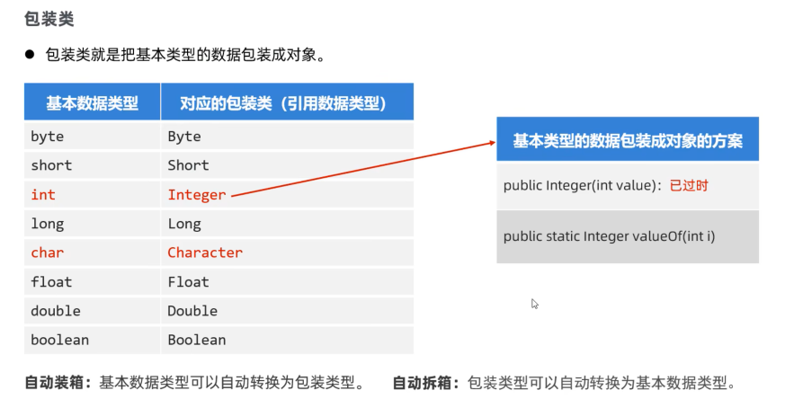  
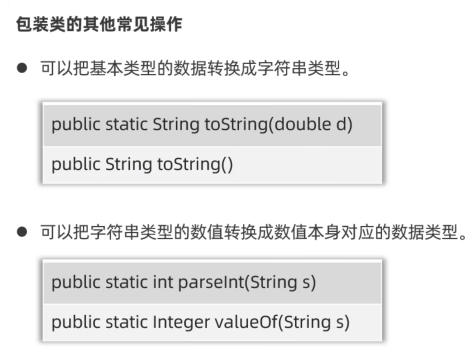  
```java
package com.itheima.integer;

import java.util.ArrayList;

public class Test {
    public static void main(String[] args) {
        // TODO 包装类的使用
        Integer a2 = Integer.valueOf(12);
        System.out.println(a2);

        // 自动装箱：可以自动把基本类型的数据转换成对象
        Integer a3 = 12;
        // 自动拆箱：可以自动把包装类型的对象转换成对应的基本数据类型
        int a4 = a3;

        // 泛型和集合不支持基本数据类型，只能支持引用数据类型
        // ArrayList<int> list = new ArrayList<int>();
        ArrayList<Integer> list = new ArrayList<>();
        list.add(12);// 自动装箱
        list.add(13);// 自动装箱
        int rs = list.get(1);// 自动拆箱

        System.out.println("------------------");

        // 1.把基本类型的数据转换为字符串
        Integer a = 23;
        String rs1 = Integer.toString(a);
        System.out.println(rs1+1);// 231

        String rs2 = a.toString();
        System.out.println(rs2 + 1);// 231

        String rs3 = a+"";
        System.out.println(rs3 + 1);// 231

        // 2.把字符串类型的数值转换成对应的基本类型
        String ageStr ="29";
        //int ageI = Integer.parseInt(ageStr);// 不推荐
        int ageI = Integer.valueOf(ageStr);
        System.out.println(ageI + 1);// 30

        String scoreStr ="99.5";
        //double score = Double.parseDouble(scoreStr);// 99.5 不推荐
        double score = Double.valueOf(scoreStr);
        System.out.println(score + 0.5);// 100
    }
}

```
###  StringBuilder   
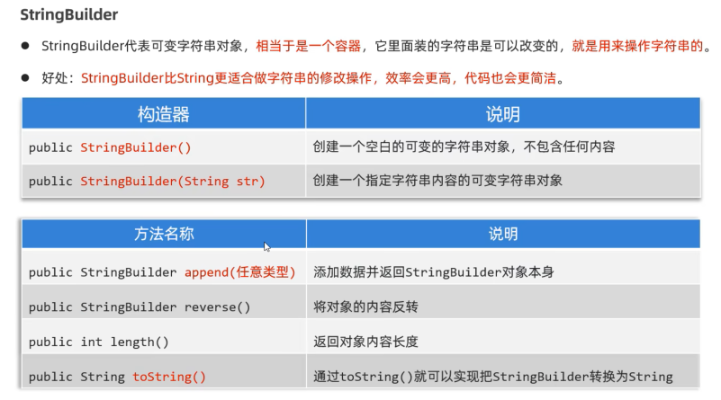  
```java
package com.itheima.stringBuilder;

public class Test {
    public static void main(String[] args) {
        // TODO stringBuilder的用法和作用
        //StringBuilder s = new  StringBuilder();// s ""
        StringBuilder s = new  StringBuilder("itheima");// s "itheima"

        // 1.拼接内容
        s.append(12);
        s.append("黑马");
        s.append(true);

        // 支持链式编程
        s.append(666).append("黑马2").append(666);
        System.out.println(s);// itheima12黑马true666黑马2666

        // 2.翻转操作
        s.reverse();
        System.out.println(s);// 6662马黑666eurt马黑21amiehti

        // 3.返回字符串的长度
        System.out.println(s.length());

        // 4.把StringBuilder对象又转换成String类型
        String rs = s.toString();
        System.out.println(rs);// 6662马黑666eurt马黑21amiehti
    }
}

```
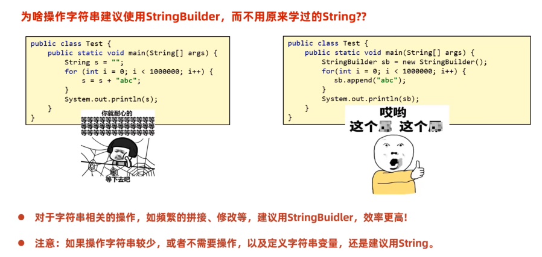  
```java
package com.itheima.stringBuilder;

public class Test2 {
    public static void main(String[] args) {
        // TODO StringBuilder的好处
        // 需求：要拼接100万次ABC
        // 先用String测试看看性能
//        String rs = "";
//        for (int i = 1; i <= 1000000 ; i++) {
//           rs = rs + "abc";
//        }
//        System.out.println(rs);

        // 使用StringBuilder演示
        StringBuilder sb = new StringBuilder();
        for (int i = 1; i <= 1000000 ; i++) {
            sb.append("abc");
        }
        System.out.println(sb);
    }
}

```
###  StringBuffer  
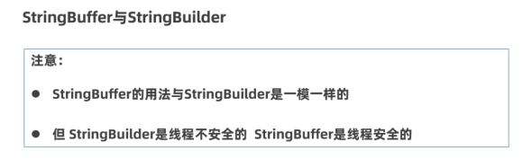  

###  案例  
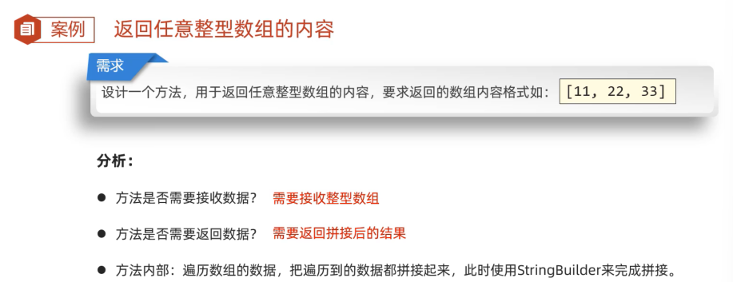  
```java
package com.itheima.stringBuilder;

public class Test3 {
    public static void main(String[] args) {
        // TODO 完成遍历数组内容，并拼接成指定格式的案例
        System.out.println(getArrayData(new int[]{11, 22, 33}));// [11, 22, 33]
    }

    public static String getArrayData(int[] arr){
        // 1.判断arr是否为null
        if (arr == null){
            return null;
        }

        // 2.arr数组对象存在  arr = [11，22，33]
        StringBuilder sb = new StringBuilder();
        sb.append("[");
        for (int i = 0; i < arr.length; i++) {
            if (i == arr.length - 1) {
                sb.append(arr[i]);
            } else {
                sb.append(arr[i]).append(", ");
            }
        }
        sb.append("]");

        return sb.toString();
    }
}

```
###  StringJoiner  
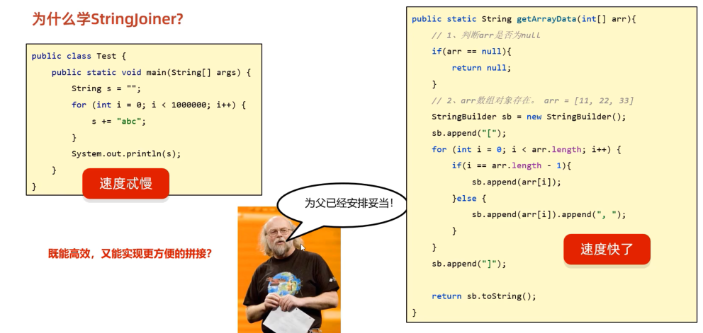  
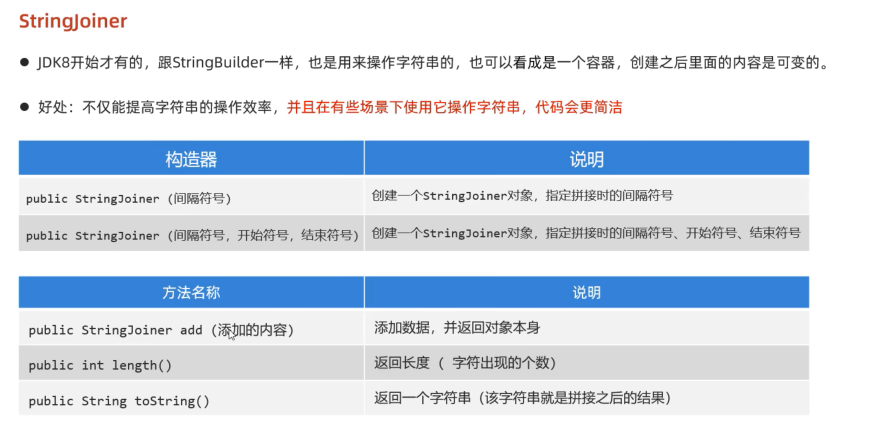  
```java
package com.itheima.stringBuilder;

public class Test3 {
    public static void main(String[] args) {
        // TODO 完成遍历数组内容，并拼接成指定格式的案例
        System.out.println(getArrayData(new int[]{11, 22, 33}));// [11, 22, 33]
    }

    public static String getArrayData(int[] arr){
        // 1.判断arr是否为null
        if (arr == null){
            return null;
        }

        // 2.arr数组对象存在  arr = [11，22，33]
        StringBuilder sb = new StringBuilder();
        sb.append("[");
        for (int i = 0; i < arr.length; i++) {
            if (i == arr.length - 1) {
                sb.append(arr[i]);
            } else {
                sb.append(arr[i]).append(", ");
            }
        }
        sb.append("]");

        return sb.toString();
    }
}

```
```java
package com.itheima.stringjoiner;

import java.util.StringJoiner;

public class Test {
    public static void main(String[] args) {
        // TODO stringjoiner的使用
        //StringJoiner s = new StringJoiner(", ");// 间隔符
        StringJoiner s = new StringJoiner(", ","[","]");// 间隔符
        s.add("java1");
        s.add("java2");
        s.add("java3");
        //System.out.println(s);// java1, java2, java3
        System.out.println(s);// [java1, java2, java3]
    }


        public static String getArrayData(int[] arr){
            // 1.判断arr是否为null
            if (arr == null){
                return null;
            }

            // 2.arr数组对象存在  arr = [11，22，33]
            StringJoiner s = new StringJoiner(", ","[","]");// 间隔符
            for (int i = 0; i < arr.length; i++) {
                s.add(arr[i] + "");
            }
           return s.toString();
        }
    }


```


   


