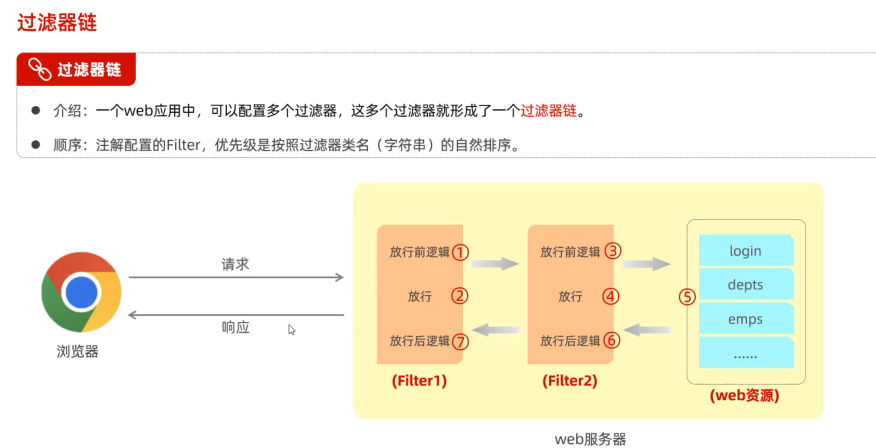
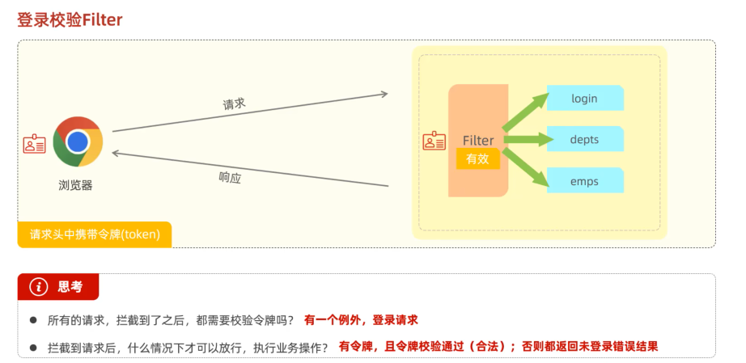
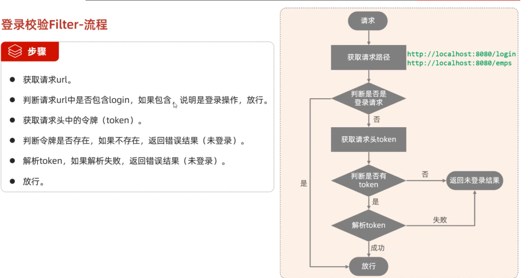
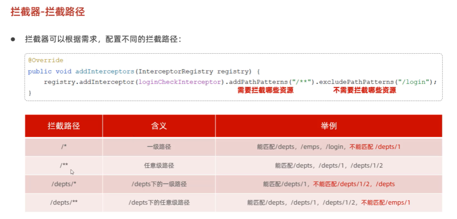
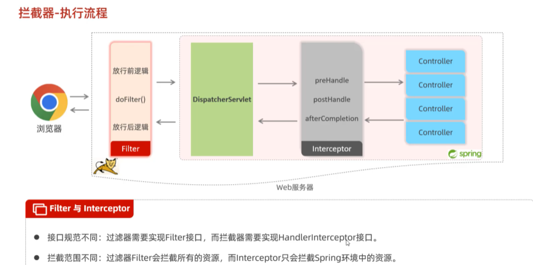

##  常用API二    
###  Math System Runtime  
  
```java
package com.itheima.math;

public class MathTest {
    public static void main(String[] args) {
        // TODO Math类提供的常见方法
        // 1.
        System.out.println(Math.abs(-12));// 12
        System.out.println(Math.abs(123));// 123
        System.out.println(Math.abs(-3.14));// 3.14

        // 2.
        System.out.println(Math.ceil(4.000001));// 5.0
        System.out.println(Math.ceil(4.0));// 4.0

        // 3.
        System.out.println(Math.floor(4.9999999));// 4.0
        System.out.println(Math.floor(4.0));// 4.0

        // 4.
        System.out.println(Math.round(3.49999));// 3
        System.out.println(Math.round(3.500001));// 4

        // 5.
        System.out.println(Math.max(10, 20));// 20
        System.out.println(Math.min(10, 20));// 10

        // 6.
        System.out.println(Math.pow(2, 3));// 8.0   2的3次方
        System.out.println(Math.pow(3, 2));// 9.0   3的2次方

        // 7.
        System.out.println(Math.random());// 随机的 0.4248507561876931
    }
}

```
  
```java
package com.itheima.math;

public class SystemTest {
    public static void main(String[] args) {
        // TODO System类的常见方法
        // 1.
        //System.exit(0);// 人为的终止虚拟机  不要使用

        // 2.
        long time = System.currentTimeMillis();
        System.out.println(time);// 1722214876826
    }
}

```
  
```java 
package com.itheima.math;

// Runtime的几个常见方法
public class RuntimeTest {
    public static void main(String[] args) {

        // 1.
        Runtime r = Runtime.getRuntime();

        //2.
        // r.exit(0);

        //3.
        System.out.println(r.availableProcessors());// 12

        //4.
        System.out.println(r.totalMemory());// 268435456

        //5.
        System.out.println(r.freeMemory());// 265413464

        //6.
        // r.exec(""); //输入程序的路径
        // Process p = r.exec("QQ");
        // Thread.sleep(5000);// 让程序在这里暂停五秒后继续往下走
        // p.destroy();// 销毁关闭程序
    }
}

```
###  BigDecimal  
  
```java 
package com.itheima.bigDecimal;

import java.math.BigDecimal;
import java.math.RoundingMode;

public class BigDecimalDemo1 {
    public static void main(String[] args) {
        // TODO BigDecimal的使用，解决小数运算失真的问题
        double a = 0.1;
        double b = 0.2;
        double c = a + b ;
        System.out.println(c);// 0.30000000000000004
        System.out.println("-------------------------");

        // 1.把他们变成字符串再封装成BigDecimal对象来运算
        // BigDecimal a1 = new BigDecimal(Double.toString(a));
        // BigDecimal b1 = new BigDecimal(Double.toString(b));
        // 推荐用以下方式，把小数转换成字符串再得到BigDecimal对象来运算
        BigDecimal a1 = BigDecimal.valueOf(a);
        BigDecimal b1 = BigDecimal.valueOf(b);

        // BigDecimal c1 = a1.add(b1);// 加
        // BigDecimal c1 = a1.subtract(b1);// 减
        // BigDecimal c1 = a1.multiply(b1);// 乘
         BigDecimal c1 = a1.divide(b1);// 除
         System.out.println(c1);

        BigDecimal i = BigDecimal.valueOf(0.1);
        BigDecimal j = BigDecimal.valueOf(0.3);
        BigDecimal k = i.divide(j,2, RoundingMode.HALF_UP);// 除法
        System.out.println(k);

        // 把BigDecimal对象转换成double类型的数值
        double rs = k.doubleValue();
        System.out.println(rs);
    }
}

```
###  JDK8之前传统的日期，时间  
1.  Date  
  
```java
package com.itheima.time;

import java.util.Date;

public class Test1Date {
    public static void main(String[] args) {
        // TODO Date日期类的使用
        // 1.创建一个Date的对象，代表系统当前的时间信息的
        Date d = new Date();
        System.out.println(d);// Mon Jul 29 20:30:55 JST 2024

        // 2.拿到时间毫秒值
        long time = d.getTime();
        System.out.println(time);// 1722252718896

        // 3.把时间毫秒值又转换为日期对象 2秒之后的时间是多少
        time += 2*1000;
        Date d2 = new Date(time);
        System.out.println(d2);// Mon Jul 29 20:33:50 JST 2024

        // 4.直接把日期对象的时间通过setTime方法进行修改
        Date d3 = new Date();
        d3.setTime(time);
        System.out.println(d3);// Mon Jul 29 20:35:34 JST 2024
    }
}

```
2.  SimpleDateFormat  
  
  
  
  
```java 
package com.itheima.time;
import java.text.ParseException;
import java.text.SimpleDateFormat;
import java.util.Date;
public class Test2simpleDateFormat {
    public static void main(String[] args) throws ParseException {
        // TODO SimpleDateFormat的使用
        // 1.准备一些时间
        Date d = new Date();
        System.out.println(d);

        long time = d.getTime();
        System.out.println(time);

        // 2.格式化日期对象和时间毫秒值
        SimpleDateFormat sdf = new SimpleDateFormat("yyyy-MM-dd HH:mm:ss EEE a");

        String rs = sdf.format(d);
        System.out.println(rs);// 2024-07-29 20:50:55 周一 下午

        String rs2 = sdf.format(time);
        System.out.println(rs2);// 2024-07-29 20:50:55 周一 下午

        System.out.println("----------------------");

        // TODO SimpleDateFormat解析字符串时间成为日期对象
        String dateStr = "2022-12-12 12:12:11";
        // 1.需要创建简单日期格式化对象 指定的时间格式必须与被解析的时间格式一模一样，否则出bug
        SimpleDateFormat sdf2 = new SimpleDateFormat("yyyy-MM-dd HH:mm:ss");
        Date d2 = sdf2.parse(dateStr);
        System.out.println(d2);// Mon Dec 12 12:12:11 JST 2022
    }
}

```
3.  Calendar  
  
  
```JAVA
package com.itheima.time;

import java.util.Calendar;
import java.util.Date;

public class Test4Calendar {
    public static void main(String[] args) {
        // TODO Calendar的使用和特点
        // 1.得到系统此刻时间对应的日历对象
        Calendar now = Calendar.getInstance();
        System.out.println(now);

        // 2.获取日历中的某个信息
        int year = now.get(Calendar.YEAR);
        System.out.println(year);// 2024

        int days = now.get(Calendar.DAY_OF_YEAR);
        System.out.println(days);// 211

        // 3.拿到日历中记录的日期对象
        Date d = now.getTime();
        System.out.println(d);// Mon Jul 29 21:28:42 JST 2024

        // 4.获取时间毫秒值
        long time = now.getTimeInMillis();
        System.out.println(time);

        // 5.修改日历中的某个信息
        now.set(Calendar.MONTH,9);// 修改为10月
        now.set(Calendar.DAY_OF_YEAR,125);// 修改成一年中的第125天
        System.out.println(now);

        // 6.为某个信息增加或者减少多少
        now.add(Calendar.DAY_OF_YEAR,100);
        now.add(Calendar.DAY_OF_YEAR,-10);
        now.add(Calendar.DAY_OF_MONTH,6);
        now.add(Calendar.HOUR,12);
        System.out.println(now);
    }
}

```
###  JDK8开始新增的日期，时间  
  
```java
package com.itheima.jdk8_time;
import java.util.Calendar;
import java.util.Date;
// TODO 为什么要用JDK8开始新增的时间类
public class Test {
    public static void main(String[] args) {
        // TODO 传统的时间类存在如下问题
        // 1.
        Date d = new Date();
        // System.out.println(d.getYear() + 1900);

        Calendar c = Calendar.getInstance();
        int year = c.get(Calendar.YEAR);
        System.out.println(year);
    
    }
}

```  
  
1.  localDate  LocalTime localDateTime  

2.  Zoneld   ZoneDateTime  

3.  Instant  

4.  DateTimeFormatter  

5.  Duration  Period  

###  Arrays  

###  JDK8新特性：Lambda表达式 

###  JDK8新特性：方法引用  

