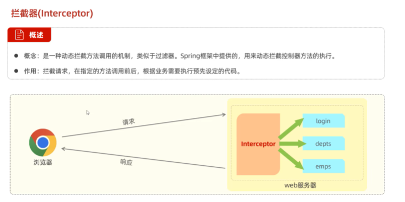
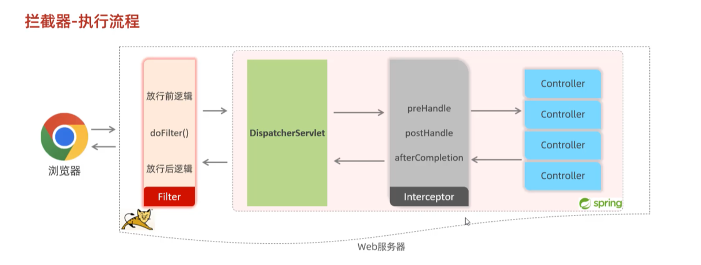
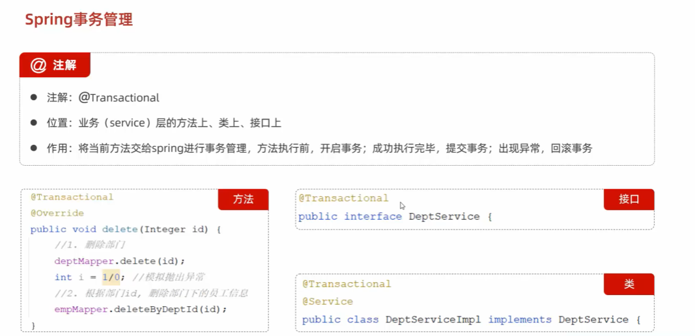
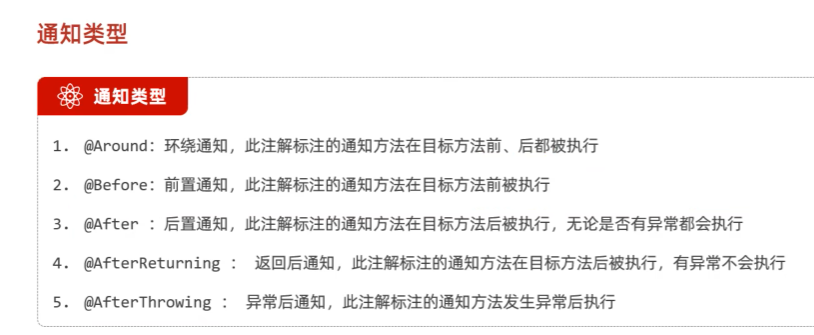
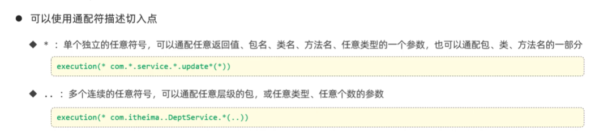

##  常用API二    
###  Math System Runtime  
  
```java
package com.itheima.math;

public class MathTest {
    public static void main(String[] args) {
        // TODO Math类提供的常见方法
        // 1.
        System.out.println(Math.abs(-12));// 12
        System.out.println(Math.abs(123));// 123
        System.out.println(Math.abs(-3.14));// 3.14

        // 2.
        System.out.println(Math.ceil(4.000001));// 5.0
        System.out.println(Math.ceil(4.0));// 4.0

        // 3.
        System.out.println(Math.floor(4.9999999));// 4.0
        System.out.println(Math.floor(4.0));// 4.0

        // 4.
        System.out.println(Math.round(3.49999));// 3
        System.out.println(Math.round(3.500001));// 4

        // 5.
        System.out.println(Math.max(10, 20));// 20
        System.out.println(Math.min(10, 20));// 10

        // 6.
        System.out.println(Math.pow(2, 3));// 8.0   2的3次方
        System.out.println(Math.pow(3, 2));// 9.0   3的2次方

        // 7.
        System.out.println(Math.random());// 随机的 0.4248507561876931
    }
}

```
  
```java
package com.itheima.math;

public class SystemTest {
    public static void main(String[] args) {
        // TODO System类的常见方法
        // 1.
        //System.exit(0);// 人为的终止虚拟机  不要使用

        // 2.
        long time = System.currentTimeMillis();
        System.out.println(time);// 1722214876826
    }
}

```
  
```java 
package com.itheima.math;

// Runtime的几个常见方法
public class RuntimeTest {
    public static void main(String[] args) {

        // 1.
        Runtime r = Runtime.getRuntime();

        //2.
        // r.exit(0);

        //3.
        System.out.println(r.availableProcessors());// 12

        //4.
        System.out.println(r.totalMemory());// 268435456

        //5.
        System.out.println(r.freeMemory());// 265413464

        //6.
        // r.exec(""); //输入程序的路径
        // Process p = r.exec("QQ");
        // Thread.sleep(5000);// 让程序在这里暂停五秒后继续往下走
        // p.destroy();// 销毁关闭程序
    }
}

```
###  BigDecimal  
  
```java 
package com.itheima.bigDecimal;

import java.math.BigDecimal;
import java.math.RoundingMode;

public class BigDecimalDemo1 {
    public static void main(String[] args) {
        // TODO BigDecimal的使用，解决小数运算失真的问题
        double a = 0.1;
        double b = 0.2;
        double c = a + b ;
        System.out.println(c);// 0.30000000000000004
        System.out.println("-------------------------");

        // 1.把他们变成字符串再封装成BigDecimal对象来运算
        // BigDecimal a1 = new BigDecimal(Double.toString(a));
        // BigDecimal b1 = new BigDecimal(Double.toString(b));
        // 推荐用以下方式，把小数转换成字符串再得到BigDecimal对象来运算
        BigDecimal a1 = BigDecimal.valueOf(a);
        BigDecimal b1 = BigDecimal.valueOf(b);

        // BigDecimal c1 = a1.add(b1);// 加
        // BigDecimal c1 = a1.subtract(b1);// 减
        // BigDecimal c1 = a1.multiply(b1);// 乘
         BigDecimal c1 = a1.divide(b1);// 除
         System.out.println(c1);

        BigDecimal i = BigDecimal.valueOf(0.1);
        BigDecimal j = BigDecimal.valueOf(0.3);
        BigDecimal k = i.divide(j,2, RoundingMode.HALF_UP);// 除法
        System.out.println(k);

        // 把BigDecimal对象转换成double类型的数值
        double rs = k.doubleValue();
        System.out.println(rs);
    }
}

```
###  JDK8之前传统的日期，时间  
1.  Date  
  
```java
package com.itheima.time;

import java.util.Date;

public class Test1Date {
    public static void main(String[] args) {
        // TODO Date日期类的使用
        // 1.创建一个Date的对象，代表系统当前的时间信息的
        Date d = new Date();
        System.out.println(d);// Mon Jul 29 20:30:55 JST 2024

        // 2.拿到时间毫秒值
        long time = d.getTime();
        System.out.println(time);// 1722252718896

        // 3.把时间毫秒值又转换为日期对象 2秒之后的时间是多少
        time += 2*1000;
        Date d2 = new Date(time);
        System.out.println(d2);// Mon Jul 29 20:33:50 JST 2024

        // 4.直接把日期对象的时间通过setTime方法进行修改
        Date d3 = new Date();
        d3.setTime(time);
        System.out.println(d3);// Mon Jul 29 20:35:34 JST 2024
    }
}

```
2.  SimpleDateFormat  
  
  
  
  
```java 
package com.itheima.time;
import java.text.ParseException;
import java.text.SimpleDateFormat;
import java.util.Date;
public class Test2simpleDateFormat {
    public static void main(String[] args) throws ParseException {
        // TODO SimpleDateFormat的使用
        // 1.准备一些时间
        Date d = new Date();
        System.out.println(d);

        long time = d.getTime();
        System.out.println(time);

        // 2.格式化日期对象和时间毫秒值
        SimpleDateFormat sdf = new SimpleDateFormat("yyyy-MM-dd HH:mm:ss EEE a");

        String rs = sdf.format(d);
        System.out.println(rs);// 2024-07-29 20:50:55 周一 下午

        String rs2 = sdf.format(time);
        System.out.println(rs2);// 2024-07-29 20:50:55 周一 下午

        System.out.println("----------------------");

        // TODO SimpleDateFormat解析字符串时间成为日期对象
        String dateStr = "2022-12-12 12:12:11";
        // 1.需要创建简单日期格式化对象 指定的时间格式必须与被解析的时间格式一模一样，否则出bug
        SimpleDateFormat sdf2 = new SimpleDateFormat("yyyy-MM-dd HH:mm:ss");
        Date d2 = sdf2.parse(dateStr);
        System.out.println(d2);// Mon Dec 12 12:12:11 JST 2022
    }
}

```
3.  Calendar  
  
  
```JAVA
package com.itheima.time;

import java.util.Calendar;
import java.util.Date;

public class Test4Calendar {
    public static void main(String[] args) {
        // TODO Calendar的使用和特点
        // 1.得到系统此刻时间对应的日历对象
        Calendar now = Calendar.getInstance();
        System.out.println(now);

        // 2.获取日历中的某个信息
        int year = now.get(Calendar.YEAR);
        System.out.println(year);// 2024

        int days = now.get(Calendar.DAY_OF_YEAR);
        System.out.println(days);// 211

        // 3.拿到日历中记录的日期对象
        Date d = now.getTime();
        System.out.println(d);// Mon Jul 29 21:28:42 JST 2024

        // 4.获取时间毫秒值
        long time = now.getTimeInMillis();
        System.out.println(time);

        // 5.修改日历中的某个信息
        now.set(Calendar.MONTH,9);// 修改为10月
        now.set(Calendar.DAY_OF_YEAR,125);// 修改成一年中的第125天
        System.out.println(now);

        // 6.为某个信息增加或者减少多少
        now.add(Calendar.DAY_OF_YEAR,100);
        now.add(Calendar.DAY_OF_YEAR,-10);
        now.add(Calendar.DAY_OF_MONTH,6);
        now.add(Calendar.HOUR,12);
        System.out.println(now);
    }
}

```
###  JDK8开始新增的日期，时间  
  
```java
package com.itheima.jdk8_time;
import java.util.Calendar;
import java.util.Date;
// TODO 为什么要用JDK8开始新增的时间类
public class Test {
    public static void main(String[] args) {
        // TODO 传统的时间类存在如下问题
        // 1.
        Date d = new Date();
        // System.out.println(d.getYear() + 1900);

        Calendar c = Calendar.getInstance();
        int year = c.get(Calendar.YEAR);
        System.out.println(year);
    
    }
}

```  
  
1.  localDate  LocalTime localDateTime  
  
```java
package com.itheima.jdk8_time;

import java.time.LocalDate;

public class Test1_localDate {
    public static void main(String[] args) {
        // 0 获取本地日期对象(不可变对象)
        LocalDate ld = LocalDate.now();// 年 月 日
        System.out.println(ld);// 2024-07-30

        // 1. 获取日期对象中的信息
        int year = ld.getYear();// 年
        int month = ld.getMonthValue(); // 月 1-12
        int day = ld.getDayOfMonth();// 日
        int day0fYear = ld.getDayOfYear();// 一年中的第几天
        int day0fWeek = ld.getDayOfWeek().getValue();// 星期几
        System.out.println(year);
        System.out.println(day);
        System.out.println(day0fWeek);

        // 2.直接修改某个信息
        LocalDate ld2 = ld.withYear(2099);
        LocalDate ld3 = ld.withMonth(12);
        System.out.println(ld2);
        System.out.println(ld3);
        System.out.println(ld);

        // 3.把某个信息加多少
        LocalDate ld4 = ld.plusYears(2);
        LocalDate ld5 = ld.plusMonths(2);

        // 4.把某个信息减多少
        LocalDate ld6 = ld.minusYears(2);
        LocalDate ld7 = ld.minusMonths(2);

        // 5.获取指定日期的LocalDate对象
        LocalDate ld8 = LocalDate.of(2099,12,12);
        LocalDate ld9 = LocalDate.of(2099,12,12);

        // 6.判断2个日期对象，是否相等，在前还是在后
        System.out.println(ld8.equals(ld9));// true
        System.out.println(ld8.isAfter(ld));// true
        System.out.println(ld8.isBefore(ld));// false
    }
}

```
```java
package com.itheima.jdk8_time;

import java.time.LocalDate;
import java.time.LocalTime;

public class Test2_LocalTime {
    public static void main(String[] args) {
        // 0 获取本地时间对象
        LocalTime lt = LocalTime.now();// 时 分 秒 纳秒 不可变的
        System.out.println(lt);// 17:53:46.119306900

        // 1. 获取时间中的信息
        int hour = lt.getHour();
        int minute = lt.getMinute();
        int second = lt.getSecond();
        int nano = lt.getNano();

        // 2.修改时间
        LocalTime lt3 = lt.withHour(10);
        LocalTime lt4 = lt.withMinute(10);
        LocalTime lt5 = lt.withSecond(10);
        LocalTime lt6 = lt.withNano(10);

        // 3.加多少
        LocalTime lt7 = lt.plusHours(10);
        LocalTime lt8 = lt.plusMinutes(10);
        LocalTime lt9 = lt.plusSeconds(10);
        LocalTime lt10 = lt.plusNanos(10);


        // 4.减多少
        LocalTime lt11 = lt.minusHours(10);
        LocalTime lt12 = lt.minusMinutes(10);
        LocalTime lt13 = lt.minusSeconds(10);
        LocalTime lt14 = lt.minusNanos(10);

        // 5.获取指定时间的LocalTime对象
        LocalTime lt15 = LocalTime.of(12,12,12);
        LocalTime lt16 = LocalTime.of(12,12,12);


        // 6.判断2个时间对象，是否相等，在前还是在后
        System.out.println(lt15.equals(lt16));
        System.out.println(lt15.isAfter(lt));
        System.out.println(lt15.isBefore(lt));
    }
}

```
```java
package com.itheima.jdk8_time;

import java.time.LocalDate;
import java.time.LocalDateTime;
import java.time.LocalTime;

public class Test3_localDateTime {
    public static void main(String[] args) {
        // 0 获取本地日期和时间对象
        LocalDateTime ldt = LocalDateTime.now();// 年 月 日 时 分 秒 纳秒
        System.out.println(ldt);

        // 1. 可以获取日期和时间的全部信息
        int year = ldt.getYear();// 年
        int month = ldt.getMonthValue(); // 月
        int day = ldt.getDayOfMonth();// 日
        int day0fYear = ldt.getDayOfYear();// 一年中的第几天
        int day0fWeek = ldt.getDayOfWeek().getValue();// 星期几
        int hour = ldt.getHour();// 时
        int minute = ldt.getMinute();// 分
        int second = ldt.getSecond();// 秒
        int nano = ldt.getNano();// 纳秒

        // 2.修改时间信息
        LocalDateTime ldt2 = ldt.withYear(2029);
        LocalDateTime ldt3 = ldt.withMinute(59);

        // 3.加多少
        LocalDateTime ldt4 = ldt.plusYears(2);
        LocalDateTime ldt5 = ldt.plusMinutes(3);

        // 4.减多少
        LocalDateTime ldt6 = ldt.minusYears(2);
        LocalDateTime ldt7 = ldt.minusMinutes(3);

        // 5.获取指定日期和时间的LocalDateTime对象
        LocalDateTime ldt8 = LocalDateTime.of(2029,12,12,12,12,12,12);
        LocalDateTime ldt9 = LocalDateTime.of(2029,12,12,12,12,12,12);

        // 6.判断2个日期，时间对象，是否相等，在前还是在后
        System.out.println(ldt9.equals(ldt8));
        System.out.println(ldt9.isAfter(ldt));
        System.out.println(ldt9.isBefore(ldt));

        // 7.可以把LocalDateTime转换成LocalDate和LocalTime
        LocalDate ld =  ldt.toLocalDate();
        LocalTime lt =  ldt.toLocalTime();
        LocalDateTime ldt10 = LocalDateTime.of(ld,lt);
    }
}

```
  
  
  
2.  Zoneld   ZoneDateTime  
  
  
```java
package com.itheima.jdk8_time;

import java.time.Clock;
import java.time.ZoneId;
import java.time.ZonedDateTime;
import java.util.Calendar;
import java.util.TimeZone;

public class Test4_Zoneld_ZonedDateTime {
    public static void main(String[] args) {
        // TODO 时区和带时区的时间
        // 1.常见方法
        // 获取系统默认的时区
        ZoneId zoneId = ZoneId.systemDefault();
        System.out.println(zoneId.getId());
        System.out.println(zoneId);

        // 获取java支持的全部时区ID
        System.out.println(ZoneId.getAvailableZoneIds());

        // 把某个时区ID封装成ZoneId对象
        ZoneId zoneId1 = ZoneId.of("Asia/Aden");

        // 2.带时区的时间
        // 获取某个时区的ZonedDateTime对象
        ZonedDateTime now = ZonedDateTime.now(zoneId1);
        System.out.println(now);

        ZonedDateTime now1 = ZonedDateTime.now(Clock.systemUTC());
        System.out.println(now1);

        // 获取系统默认时区的ZonedDateTime对象
        ZonedDateTime now2 = ZonedDateTime.now();
        System.out.println(now2);

        // Calendar instance = Calendar.getInstance(TimeZone.getTimeZone(zoneId));
    }
}

```
3.  Instant  
   
```java
package com.itheima.jdk8_time;

import java.time.Instant;

public class Test5_Instant {
    public static void main(String[] args) {
        // 1.创建Instant的对象，获取此刻时间信息
        Instant now =  Instant.now();

        // 2.获取总秒数
        long second = now.getEpochSecond();
        System.out.println(second);

        // 3.不够一秒的纳秒数
        int nano =  now.getNano();
        System.out.println(nano);

        System.out.println(now);

        Instant instant = now.plusNanos(111);

        // Instant对象的作用：做代码的性能分析，或者记录用户的操作时间点
        Instant now1 = Instant.now();
        // 代码执行
        Instant now2 = Instant.now();
    }
}

```
4.  DateTimeFormatter  
  
```java
package com.itheima.jdk8_time;

import java.time.LocalDateTime;
import java.time.format.DateTimeFormatter;

public class Test6_DateTimeFormatter {
    public static void main(String[] args) {
        // 1.创建一个日期时间格式化器对象出来
        DateTimeFormatter formatter = DateTimeFormatter.ofPattern("yyyy年MM月dd日 HH:mm:ss");

        // 2.对时间进行格式化
        LocalDateTime now = LocalDateTime.now();
        System.out.println(now);// 2024-07-30T21:32:01.606800900

        String rs = formatter.format(now);
        System.out.println(rs);// 2024年07月30日 21:32:01   正向格式化

        // 3.格式化时间，其实还有一种方案
        String rs2 = now.format(formatter);
        System.out.println(rs2);// 2024年07月30日 21:33:25  反向格式化

        // 4.解析时间:一般使用LocalDateTime提供的解析方法来解析
        String dateStr = "2029年12月12日 12:12:11";
        LocalDateTime ldt = LocalDateTime.parse(dateStr,formatter);
        System.out.println(ldt);// 2029-12-12T12:12:11
    }
}

```  
5.  Duration  Period  
  
```java
package com.itheima.jdk8_time;

import java.time.LocalDate;
import java.time.Period;

public class Test7_Period {
    public static void main(String[] args) {
        LocalDate start = LocalDate.of(2029,8,10);
        LocalDate end = LocalDate.of(2029,8,15);
        // 1.创建Period对象，封装两个日期对象
        Period period= Period.between(start,end);

        // 2.通过period对象获取两个日期对象相差的信息
        System.out.println(period.getYears());// 0
        System.out.println(period.getMonths());// 0
        System.out.println(period.getDays());// 5
    }
}

```
  
```java
package com.itheima.jdk8_time;

import java.time.Duration;
import java.time.LocalDateTime;

public class Test8_Duration {
    public static void main(String[] args) {
        LocalDateTime start = LocalDateTime.of(2025,11,11,11,10,10);
        LocalDateTime end = LocalDateTime.of(2025,11,11,11,11,11);
        // 1.得到Duration对象
        Duration duration = Duration.between(start,end);

        // 2.获取两个时间对象间隔的信息
        System.out.println(duration.toDays());// 天  0
        System.out.println(duration.toHours());// 小时  0
        System.out.println(duration.toMinutes());// 分  1
        System.out.println(duration.toSeconds());// 秒  61
        System.out.println(duration.toMillis());// 毫秒  61000
        System.out.println(duration.toNanos());// 纳秒  61000000000
    }
}

```  
  
###  Arrays  
  
```java 
package com.itheima.arrays;

import java.util.Arrays;
import java.util.function.IntToDoubleFunction;

public class ArraysTest1 {
    public static void main(String[] args) {
        // 1.返回数组的内容
        int[] arr = {10,20,30,40,50,60};
        System.out.println(Arrays.toString(arr));// [10, 20, 30, 40, 50, 60]

        // 2.拷贝数组：指定范围，包前不包后
        int[] arr2 = Arrays.copyOfRange(arr,1,4);
        System.out.println(Arrays.toString(arr2));// [20, 30, 40]

        // 3.拷贝数组，可以指定新数组的长度
        int[] arr3 = Arrays.copyOf(arr,10);
        System.out.println(Arrays.toString(arr3));// [10, 20, 30, 40, 50, 60, 0, 0, 0, 0]

        // 4.把数组中的原数据改为新数据又存进去
        double[] prices = {99.8,128,100};
        // 把所有的价格都打八折，然后又存进去
        Arrays.setAll(prices, new IntToDoubleFunction() {
            @Override
            public double applyAsDouble(int value) {
                // value 取索引
                return prices[value] * 0.8;
            }
        });
        System.out.println(Arrays.toString(prices));//  [79.84, 102.4, 80.0]

        // 5.对数组进行排序，默认升序排序
        Arrays.sort(prices);
        System.out.println(Arrays.toString(prices));// [79.84, 80.0, 102.4]
    }
}

```
  
```java
package com.itheima.arrays;

public class Student implements Comparable<Student> {
    private String name;
    private double height;
    private int age;

    // 制定比较规则
    // this o
    @Override
    public int compareTo(Student o) {
        // 约定1：左边对象 大于 右边对象 请您返回正整数
        // 约定2：左边对象 小于 右边对象 请您返回负整数
        // 约定3：左边对象 等于 右边对象 请您返回0
        // 按照年龄升序排序
  /*      if (this.age > o.age){
            return 1;
        } else if (this.age < o.age) {
            return -1;
        }
        return 0;*/
         return this.age - o.age;// 升序
         // return o.age - this.age ;// 降序
    }

    public Student() {
    }

    public Student(String name, double height, int age) {
        this.name = name;
        this.height = height;
        this.age = age;
    }

    public String getName() {
        return name;
    }

    public void setName(String name) {
        this.name = name;
    }

    public double getHeight() {
        return height;
    }

    public void setHeight(double height) {
        this.height = height;
    }

    public int getAge() {
        return age;
    }

    public void setAge(int age) {
        this.age = age;
    }

    @Override
    public String toString() {
        return "Student{" +
                "name='" + name + '\'' +
                ", height=" + height +
                ", age=" + age +
                '}';
    }
}

```
```java
package com.itheima.arrays;

import java.util.Arrays;
import java.util.Comparator;

public class ArraysTest2 {
    public static void main(String[] args) {
    // TODO 对数组中的对象进行排序
        Student[]  students = new Student[4];
        students[0] = new  Student("蜘蛛精",169.5,23);
        students[1] = new  Student("紫霞",163.8,26);
        students[2] = new  Student("紫霞",163.8,26);
        students[3] = new  Student("至尊宝",167.5,24);

        // 1.对数组进行排序
        /*Arrays.sort(students);
        System.out.println(Arrays.toString(students));*/
        // [Student{name='蜘蛛精', height=169.5, age=23},
        // Student{name='至尊宝', height=167.5, age=24},
        // Student{name='紫霞', height=163.8, age=26},
        //  Student{name='紫霞', height=163.8, age=26}]

        // 2.参数一；需要排序的数组
        //   参数二：比较器对象（用来制定对象的比较规则）
        Arrays.sort(students, new Comparator<Student>() {
            @Override
            public int compare(Student o1, Student o2) {
                // 制定比较规则  左边对象o1  右边对象02
                // 约定1：左边对象 大于 右边对象 请您返回正整数
                // 约定2：左边对象 小于 右边对象 请您返回负整数
                // 约定3：左边对象 等于 右边对象 请您返回0
               /* if (o1.getHeight() > o2.getHeight()){
                    return 1 ; 
                } else if (o1.getHeight() < o2.getHeight) {
                    return -1 ;
                }
                return 0;// 升序*/
                return Double.compare(o1.getHeight(),o2.getHeight());// 升序
                // return Double.compare(o2.getHeight(),o1.getHeight());// 降序
            }
        });
        System.out.println(Arrays.toString(students));
        //[Student{name='紫霞', height=163.8, age=26}, 
        // Student{name='紫霞', height=163.8, age=26}, 
        // Student{name='至尊宝', height=167.5, age=24}, 
        // Student{name='蜘蛛精', height=169.5, age=23}]
    }
}

```
###  JDK8新特性：Lambda表达式 

###  JDK8新特性：方法引用  

