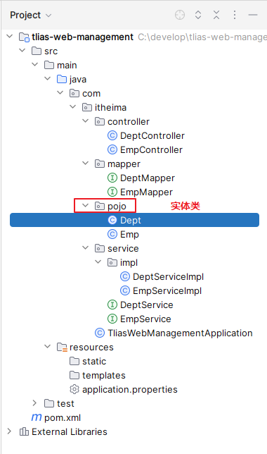
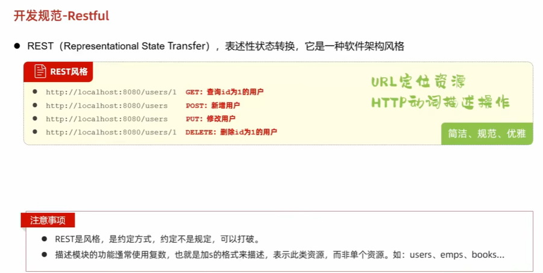
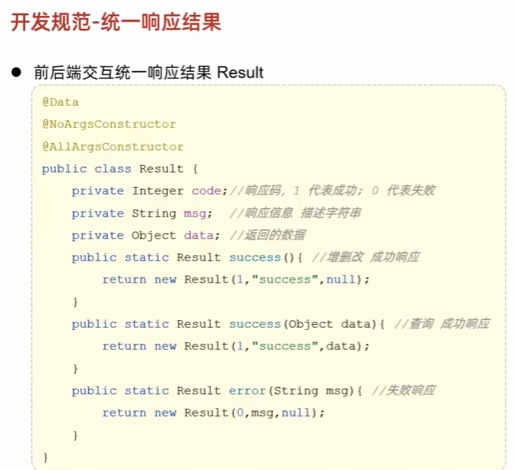

# 特殊文件  

##   Properties属性文件  
  
  
  
```java
package com.itheima.properties;

import java.io.FileNotFoundException;
import java.io.FileReader;
import java.util.Properties;
import java.util.Set;

// TODO Properties类读取属性文件中的键值对信息
public class PropertiesTest1 {
    public static void main(String[] args) throws Exception {
      // 1.创建一个Properties的对象出来（键值对集合 空容器）
        Properties properties = new Properties();
        System.out.println(properties);// {}

        // 2.开始加载属性文件中的键值对数据到Properties对象中去
        properties.load(new FileReader("properties\\src\\users.properties"));
        System.out.println(properties);

        // 3.根据键取值
        System.out.println(properties.getProperty("ccc"));// wuji

        // 4.遍历全部的键和值
        Set<String> keys = properties.stringPropertyNames();
        for (String key : keys) {
            String value = properties.getProperty(key);
            System.out.println(key + "--->" + value);
            // aaa--->minmin
            //ccc--->wuji
            //bbb--->wuji
            //admin--->123456
        }
            properties.forEach((k,v)->{
                System.out.println(k + "--->" + v);
            });
        }
    }


```
  
```java
package com.itheima.properties;

import java.io.FileReader;
import java.io.FileWriter;
import java.util.Properties;
import java.util.Set;

// TODO 把键值对数据存入到属性文件中去
public class PropertiesTest2 {
    public static void main(String[] args) throws Exception {
      // 1.创建Properties对象出来，先用它存储一些键值对数据
        Properties properties = new Properties();
        properties.setProperty("aaa","minmin");
        properties.setProperty("bbb","cuishan");
        properties.setProperty("ccc","susu");

        // 2.把Properties对象中的键值对数据存入到属性文件中去了
        properties.store(new FileWriter("properties/src/users2.properties"),
                "i saved many users!");
        }
    }


```
  

##  XML文件    
1.  概述  
   
  
  
  
  
2.  读取XML文件中的数据  
  
  
  
  
```java
package com.itheima.xml;

import org.dom4j.Attribute;
import org.dom4j.Document;
import org.dom4j.DocumentException;
import org.dom4j.Element;
import org.dom4j.io.SAXReader;

import java.util.List;

// TODO Dom4J框架解析XML文件
public class Dom4JTest1 {
    public static void main(String[] args) throws Exception {
       // 1.创建一个Dom4J框架提供的解析器对象
        SAXReader saxReader = new SAXReader();

        // 2.使用saxReader对象把需要解析的XML文件读成一个Document对象
        Document document =
                saxReader.read("properties\\src\\helloworld.xml");

        // 3.从文档对象中解析XML文件的全部数据了
        Element root = document.getRootElement();
        System.out.println(root.getName());// users

        // 4.获取根元素下的全部一级子元素
        /*List<Element> elements = root.elements();
        for (Element element : elements) {
            System.out.println(element.getName());*/
            //user
            //user

            List<Element> elements = root.elements("user");
            for (Element element : elements) {
                System.out.println(element.getName());
                //user
                //user

                 // 5.获取当前元素下的某个子元素
                // 如果下面有很多子元素user，默认获取第一个
                Element user =root.element("user");
                System.out.println(user.elementText("name"));// 张无忌

                // 6.获取元素的属性信息
                System.out.println(user.attributeValue("id"));// 1
                Attribute id = user.attribute("id");
                System.out.println(id.getName());// id
                System.out.println(id.getValue());// 1

                List<Attribute> attributes = user.attributes();
                for (Attribute attribute : attributes) {
                    System.out.println(attribute.getName() + "=" + attribute.getValue());
                }

                // 7.获取全部的文本内容:获取当前元素下的子元素文本值
                System.out.println(user.elementText("name"));// 张无忌
                System.out.println(user.elementText("地址"));// 光明顶
                System.out.println(user.elementText("password"));// minmin

                Element data =user.element("data");
                System.out.println(data.getText());// 3<2&&5>4
                System.out.println(data.getTextTrim());// 3<2&&5>4 取出文本去除前后空格
            }
    }
}

```  
  
  
3.  约束XML文件的编写 (了解)   
  
  
  
  

##  日志技术  
1.  概述  
  
  
2.  日志技术体系，Logback日志框架的概述  
  
  
3.  Logback快速入门  
  
  
  
  
4.  Logback设置日志级别  
  


