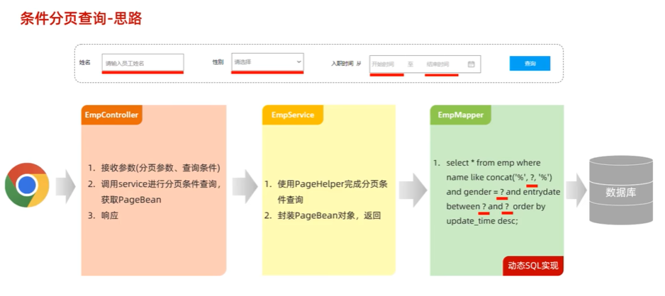

#  网络通信  
  
  
  


##  网络通信三要素  
1.  IP地址  
  
  
```java
package com.itheima.ip;

import java.net.InetAddress;
import java.net.UnknownHostException;

// TODO InetAddress类的使用
public class InetAddressTest {
    public static void main(String[] args) throws UnknownHostException {
        // 1.获取本机ip地址对象
        InetAddress ip1 = InetAddress.getLocalHost();
        System.out.println(ip1.getHostName());// DESKTOP-LO6FUVT
        System.out.println(ip1.getHostAddress());// 192.168.0.7

        // 2.获取指定ip或者域名的ip地址对象
        InetAddress ip2 = InetAddress.getByName("www.baidu.com");
        System.out.println(ip2.getHostName());// www.baidu.com
        System.out.println(ip2.getHostAddress());// 119.63.197.151
    }
}

```  
2.  端口号  
  
3.  协议  
  
  
  
  
  

##  UDP通信-快速入门  


##  TCP-快速入门  

##  TCP-多发多收    

##  TCP-同时接收多个客户端  

   