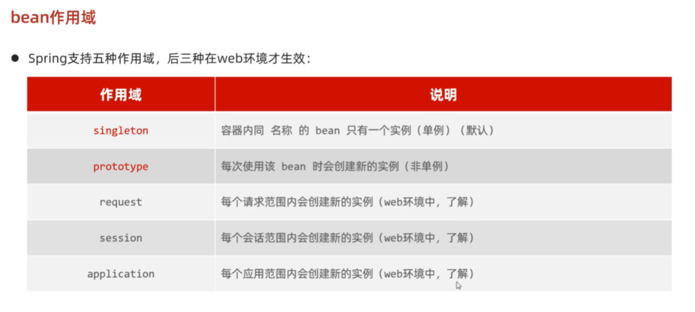
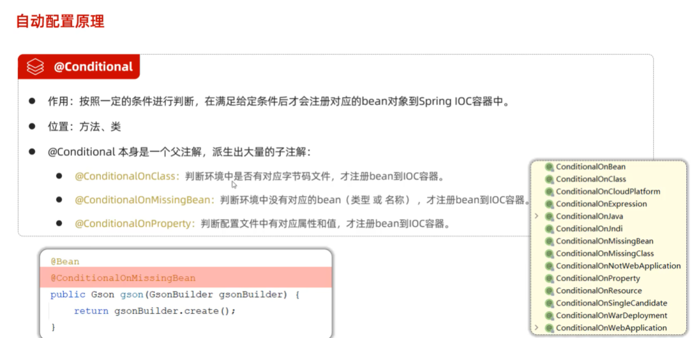
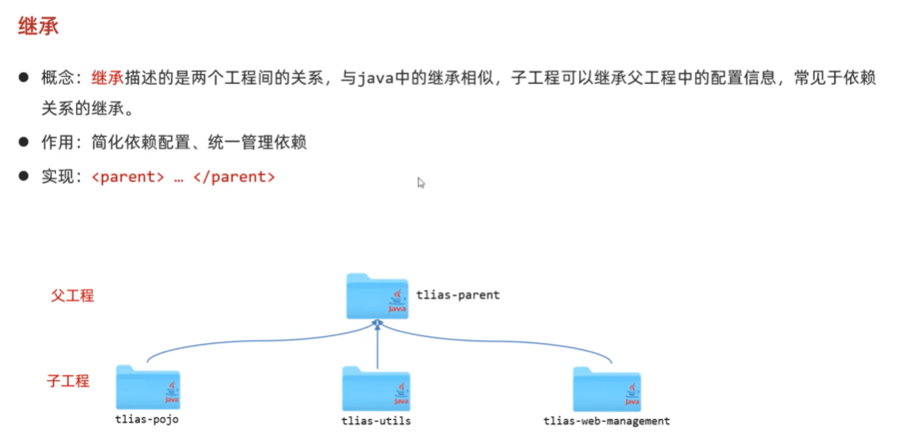
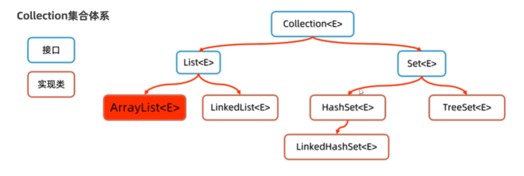
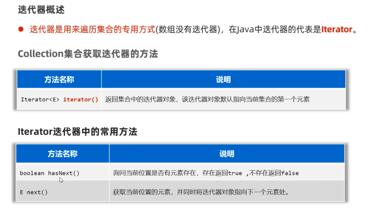

## 面向对象  
  
  
  
  

### 类和对象的一些注意事项  
  

###  this关键字  
  
  

###  构造器  
   
  
  
  

###  封装   
  
  
  
  

###  实体JavaBean  
  
  
  
  

###  案例  
  
```java
package com.itheima.demo;

import java.util.Scanner;

public class Test {
    public static void main(String[] args) {
        // 1.设计一个电影类
        // 2.设计一个电影的操作类
        // 3.准备 全部电影数据
        Movie[] movies = new Movie[4];
        movies[0] = new Movie(1,"水门桥",38.9,9.8,"徐克","吴京","12万人想看");
        movies[1] = new Movie(2,"出拳吧",39,7.8,"唐晓白","田雨","3.5万人想看");
        movies[2] = new Movie(3,"月球陨落",42,7.9,"罗兰","贝瑞","17.9万人想看");
        movies[3] = new Movie(4,"一点就到家",35,8.7,"许宏宇","刘昊然","10.8万人想看");
        // 4.创建一个电影操作类的对象，接收电影数据，并对其进行业务处理
        MovieOperator operator = new MovieOperator(movies);
        //  operator.printAllMovies();
        //  operator.searchMovieById(3);
        Scanner sc = new Scanner(System.in);
        while (true) {
            System.out.println("电影信息系统");
            System.out.println("1.查询全部电影信息");
            System.out.println("2.根据id查询某个电影的详细信息展示");
            System.out.println("请您输入操作命令");
            int command = sc.nextInt();
            switch (command){
                case 1:
                    //  展示全部电影信息
                    operator.printAllMovies();
                    break;
                case 2:
                    //  根据id查询某个电影的详细信息展示
                    System.out.println("请您输入查询的电影id");
                    int id = sc.nextInt();
                    operator.searchMovieById(id);
                    break;
                default:
                    System.out.println("您输入的命令有问题");
            }
        }
    }
}

```
```java
package com.itheima.demo;

public class Movie {
    private int id;
    private String name;
    private double price;
    private double score;
    private String director;
    private String actor;
    private String info;

    public Movie() {
    }

    public Movie(int id, String name, double price, double score, String director, String actor, String info) {
        this.id = id;
        this.name = name;
        this.price = price;
        this.score = score;
        this.director = director;
        this.actor = actor;
        this.info = info;
    }

    public int getId() {
        return id;
    }

    public void setId(int id) {
        this.id = id;
    }

    public String getName() {
        return name;
    }

    public void setName(String name) {
        this.name = name;
    }

    public double getPrice() {
        return price;
    }

    public void setPrice(double price) {
        this.price = price;
    }

    public double getScore() {
        return score;
    }

    public void setScore(double score) {
        this.score = score;
    }

    public String getDirector() {
        return director;
    }

    public void setDirector(String director) {
        this.director = director;
    }

    public String getActor() {
        return actor;
    }

    public void setActor(String actor) {
        this.actor = actor;
    }

    public String getInfo() {
        return info;
    }

    public void setInfo(String info) {
        this.info = info;
    }
}

```
```java
package com.itheima.demo;

public class MovieOperator {
    private Movie[] movies;
    public MovieOperator(Movie[] movies){
        this.movies = movies;
    }

    // 1.展示系统全部电影信息
    public void printAllMovies(){
        System.out.println("系统全部电影信息如下");
        for (int i = 0; i < movies.length; i++) {
            Movie m = movies[i];
            System.out.println("编号：" + m.getId() );
            System.out.println("名称：" + m.getName() );
            System.out.println("价格：" + m.getPrice() );
            System.out.println("--------------------");
        }
    }

    // 2.根据编号查询详细信息并展示
    public void searchMovieById(int id){
        for (int i = 0; i < movies.length; i++) {
            Movie m = movies[i];
            if (m.getId() == id){
                System.out.println("该电影详情如下");
                System.out.println("编号：" + m.getId() );
                System.out.println("名称：" + m.getName() );
                System.out.println("价格：" + m.getPrice() );
                System.out.println("得分：" + m.getScore() );
                System.out.println("导演：" + m.getDirector() );
                System.out.println("主演：" + m.getActor() );
                System.out.println("其他：" + m.getInfo() );
                return;// 已经找到了电影信息，没有必要再执行了
            }
        }
        System.out.println("没有该电影");
    }
}

```
###  成员变量 局部变量的区别  
  
  

###  总结  
  
  
  
  
  
  
  
