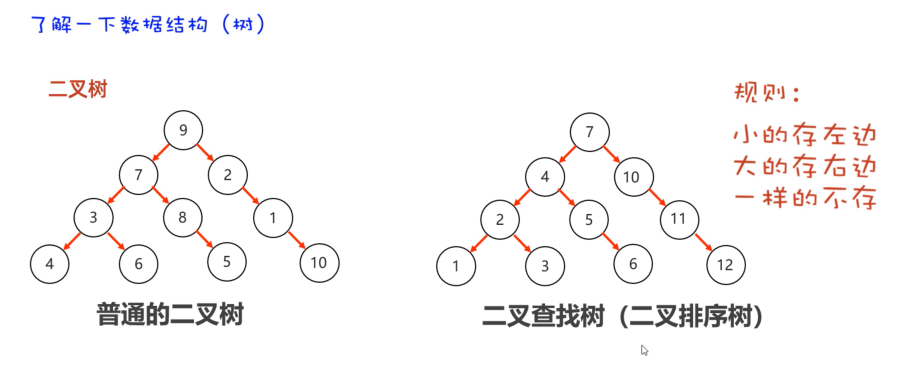
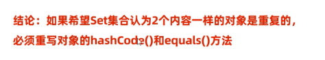
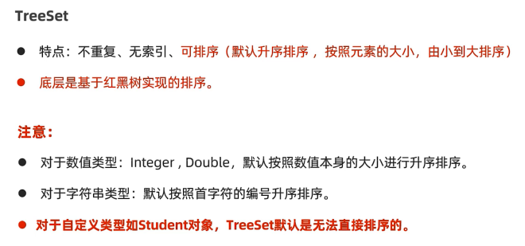
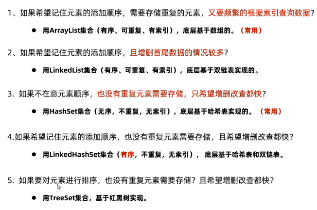
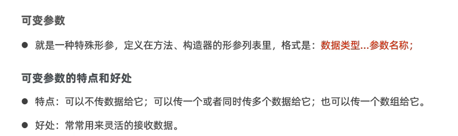
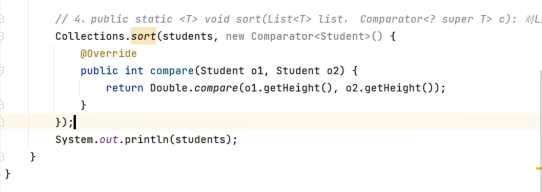
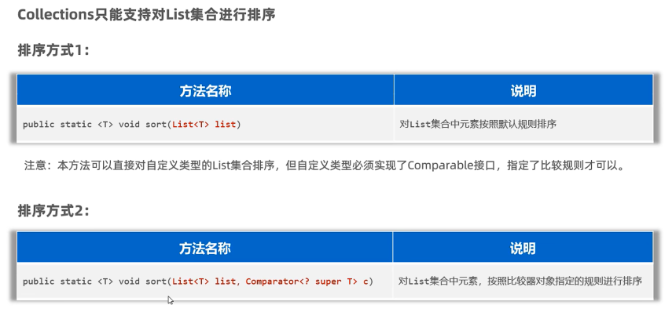
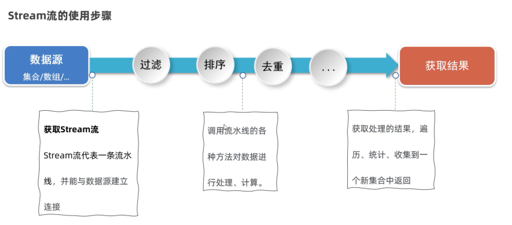

## 面向对象高级一  

###  static  
1.  static修饰成员变量  
  
  
  
2. static修饰成员变量的应用场景   
  
  
  
3. static修饰成员方法  
  
  
   
4. static修饰成员方法的应用场景  
   
  
  
  
5. static的注意事项  
  
```JAVA
package com.itheima.static_attention;

public class Student {
    static String schoolName;// 类变量
    double score;// 实例变量
    // 1.
    public static void printHelloWorld(){
        // 注意：同一个类中访问类成员，可以省略类名不写
        Student.schoolName = "黑马";
        Student.printHelloWorld2();

        // System.out.println(score);//报错
        // printPass();//报错

        // System.out.println(this);//报错
    }
    public static void printHelloWorld2(){

        // 类方法
    }
    // 2.
    // 实例方法
    // 3.
    public  void printPass(){
        schoolName = "黑马2";
        printHelloWorld2();

        System.out.println(score);
        printPass2();
        System.out.println(this);
    }
    // 实例方法
    public void printPass2(){

    }
}

```
6. static的应用知识：代码块 
  
  
7. static的应用知识：单例设计模式
  
  
  
  
  
  
  


## 总结    
1. static可以修饰成员变量和成员方法    
   根据有无static修饰成员变量：  
   ①有static修饰：  
                类变量   属于类，在计算机里只有一份，会被类的全部对象共享  static String name;  
                用法：类名.类变量  
   ②无static修饰：  
                实例变量（对象的变量） 属于每个对象的变量，每个对象中都有一份 int age;  
                用法：对象.实例变量  

   根据有无static修饰成员方法：  
   ①有static修饰：  
                类方法：  
                用法：类名.类方法    
   ②无static修饰：  
                实例方法：  
                用法：对象.实例方法   
2. 注意事项：  
   ①类方法访问：类的成员 √   实例成员 ×  
    实例方法访问：类的成员 √   实例成员 √  
   ②可否有this:类方法×    实例方法√  


        
        
 
