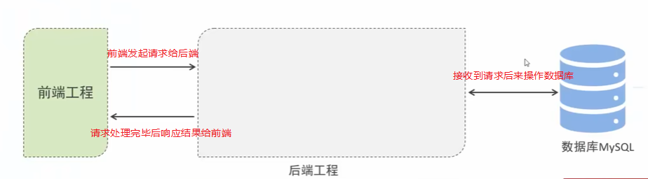
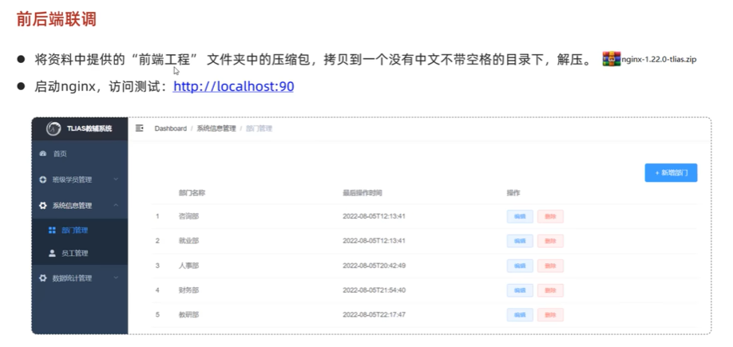

## 面向对象高级二  

###  多态  
  
  
对于变量：编译看左边，运行看左边  
1.  使用多态的好处  
  
  
2.  多态下的类型转换问题  
  
```java 
package com.itheima.polymorphism2;

public class Test {
    public static void main(String[] args) {
        // TODO 多态的好处
        // 好处1：可以实现解耦合，右边对象可以随时切换，后续业务随之改变
        People p1 = new Student();
        p1.run();
        // p1.test();// 多态下存在的问题，无法直接调用子类的独有功能
        // p1.teach();//多态下存在的问题，无法直接调用子类的独有功能

        // 强制类型转换
        Student s1 = (Student)p1;
        s1.test();// 独有功能

        //强制类型转换可能存在的问题：编译阶段有继承或者实现关系就可以强制转换，
        //但是，运行时可以出现类型转换异常
        //  Teacher t1 =(Teacher)p1;// 运行异常：学生对象不能被转成老师对象
        if (p1 instanceof Student){
            Student s2 = (Student)p1;
            s2.test();
        }else {
            Teacher t2 = (Teacher)p1;
            t2.teach();
        }

        System.out.println("---------------");
        // 好处2：可以使用父类类型的变量作为形参，可以接收一切子类对象
        Student s = new Student();
        go(s);

        Teacher t = new Teacher();
        go(t);
    }

    public static void go(People p){
        p.run();
        if (p instanceof Student){
            Student s = (Student)p;
            s.test();
        }else if(p instanceof Teacher){
            Teacher t = (Teacher)p;
            t.teach();

        }
    }
}

```
  
###  final  
  
```java 
package com.itheima.fina;

public class Test {
    // 常量：public static final修饰的成员变量，建议名称全部大写，多个单词下划线连接
    public static final String  SCHOOL_NAME = "黑马";
    private final String name = "猪八戒";// 这种用法没有意义

    public static void main(String[] args) {
        // TODO final的作用
        // 3.final可以修饰变量，有且仅能赋值一次
        // 变量
        //   局部变量
        //   成员变量：静态成员变量   实例成员变量
        final int a ;
        a = 12;
        // a = 13;// 第二次赋值出错了
        final double r = 3.14;
       //  r = 0.1;// 第二次赋值出错了
        final int[] arr = {11,22,33};
        // arr = null;// 第二次赋值出错了
        arr[1] = 222;


       //  schoolname = "白马";// 第二次赋值出错了
        Test t = new Test();
        // t.name = "孙悟空";// 第二次赋值出错了
    }

    public static void buy(final double z){
        // z = 0.1;// 第二次赋值出错了
    }
}
// 1. final修饰类，类不能被继承了
final class A{}
// class B extends A{}

// 2.final修饰方法，方法就不能被重写了
class C{
    public final void test(){

    }
}
class D extends C{
 //   @Override
  //  public void test(){

   // }
}
```
###  常量详解  
  
```JAVA 
package com.itheima.fina;

public class Test2 {
    public static final String SCHOOL_NAME = "黑马程序员";
    public static void main(String[] args) {
        // TODO 认识常量
        System.out.println(SCHOOL_NAME);
    }
}

```
###  抽象类  
  
  
  
  
1.  使用抽象类的好处  
  
  
  
2.  抽象类的常见应用场景：模板方法设计模式  
  
  
  
  
  
###  接口  


        
        
 
